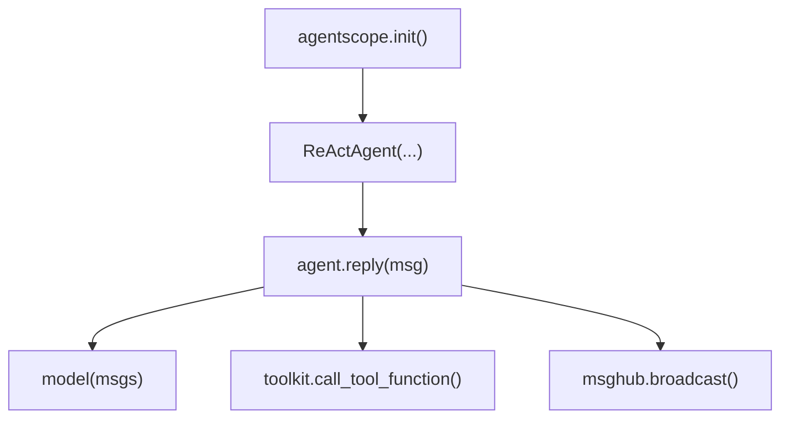
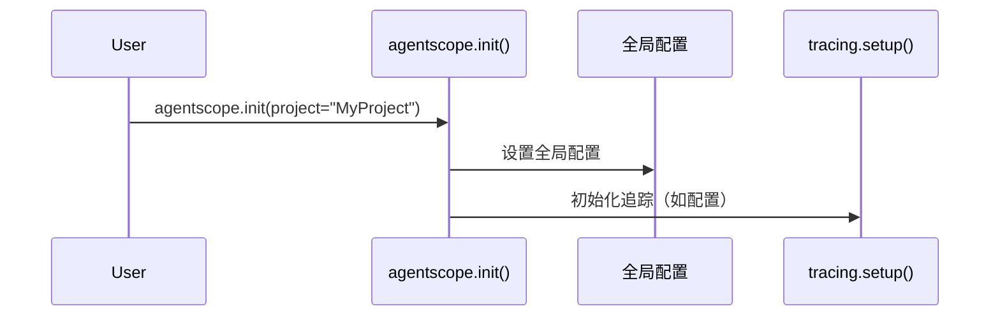
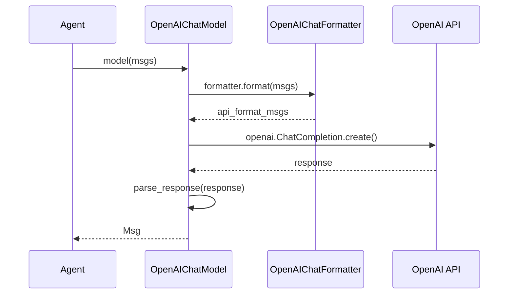
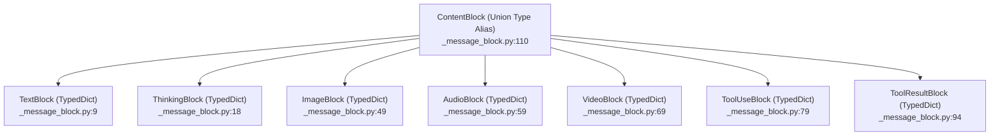

# AgentScope 架构入口点分析

> **Level**: 0 (前置基础)
> **目标**: 识别理解 AgentScope 架构的关键入口点

---

## 1. 核心入口点概览



---

## 2. 初始化入口

### 2.1 agentscope.init()

**文件**: `src/agentscope/__init__.py`

```python
def init(
    project: str,
    name: str | None = None,
    description: str | None = None,
    runtime_log_level: str = "INFO",
    db_type: str = "sqlite",
    # ... 更多配置
) -> None:
    """初始化 AgentScope 全局配置"""
```

**调用链**:



---

## 3. Agent 入口

### 3.1 AgentBase.reply()

**文件**: `src/agentscope/agent/_agent_base.py:197`

```python
async def reply(
    self,
    msg: Msg | list[Msg] | None = None,
    structured_model: Type[BaseModel] | None = None,
) -> Msg:
    """Agent 处理消息并返回回复"""
```

**子类扩展点**:

| 类 | 文件:行号 | 扩展内容 |
|---|----------|----------|
| `ReActAgentBase` | `_react_agent_base.py:12` | `_reasoning()`, `_acting()` 抽象 |
| `ReActAgent` | `_react_agent.py:376` | 完整 ReAct 循环实现 |

### 3.2 ReActAgent 核心循环

**文件**: `src/agentscope/agent/_react_agent.py:376-700`

```mermaid
flowchart TD
    START[reply(msg)] --> CHECK{是否首次调用}
    CHECK -->|是| LOAD[加载记忆到 msgs]
    CHECK -->|否| REASON[_reasoning()]
    LOAD --> REASON
    REASON --> ACT[_acting()]
    ACT --> |工具调用| TOOL[执行工具]
    TOOL --> RESULT[包装 ToolResponse]
    RESULT --> CHECK
    ACT --> |最终回复| FORMAT[格式化回复]
    FORMAT --> SAVE[保存到记忆]
    SAVE --> RETURN[返回 Msg]
```

---

## 4. Model 入口

### 4.1 ChatModelBase.__call__()

**文件**: `src/agentscope/model/_model_base.py`

```python
async def __call__(
    self,
    msgs: list[Msg],
    stream: bool = False,
    **kwargs,
) -> Msg | AsyncIterator[Msg]:
    """调用 LLM 并返回回复"""
```

### 4.2 OpenAIChatModel 调用链

**文件**: `src/agentscope/model/_openai_model.py:71-795`



---

## 5. Tool 入口

### 5.1 Toolkit.call_tool_function()

**文件**: `src/agentscope/tool/_toolkit.py:853`

```python
async def call_tool_function(
    self,
    tool_call: ToolUseBlock,
) -> ToolResponse:
    """执行工具调用"""
```

### 5.2 工具执行流程

```mermaid
flowchart TD
    INPUT[ToolUseBlock] --> PARSE[解析 name/id/input]
    PARSE --> LOOKUP[查找工具函数]
    LOOKUP --> MERGE[合并 preset_kwargs]
    MERGE --> CHECK{is_async?}
    CHECK -->|是| ASYNC[await func()]
    CHECK -->|否| SYNC[run_in_executor]
    ASYNC --> WRAP[包装 ToolResponse]
    SYNC --> WRAP
```

### 5.3 工具注册入口

**文件**: `src/agentscope/tool/_toolkit.py:274`

```python
def register_tool_function(
    self,
    func: Callable,
    group_name: str | None = None,
    description: str | None = None,
    **kwargs,
) -> None:
    """注册工具函数"""
```

---

## 6. Pipeline 入口

### 6.1 SequentialPipeline

**文件**: `src/agentscope/pipeline/_class.py:10`

```python
class SequentialPipeline(PipelineBase):
    async def forward(self, msg: Msg) -> Msg:
        for agent in self.agents:
            msg = await agent(msg)
        return msg
```

### 6.2 FanoutPipeline

**文件**: `src/agentscope/pipeline/_class.py:43`

```python
class FanoutPipeline(PipelineBase):
    async def forward(self, msg: Msg) -> list[Msg]:
        tasks = [agent(msg) for agent in self.agents]
        return await asyncio.gather(*tasks)
```

### 6.3 MsgHub 广播

**文件**: `src/agentscope/pipeline/_msghub.py:130`

```python
async def broadcast(self, msg: Msg) -> None:
    """广播消息给所有订阅者"""
```

---

## 7. Memory 入口

### 7.1 MemoryBase 接口

**文件**: `src/agentscope/memory/_memory_base.py`

```python
class MemoryBase(ABC):
    @abstractmethod
    async def add(self, msg: Msg) -> None: ...

    @abstractmethod
    async def get(self, ...) -> list[Msg]: ...

    @abstractmethod
    async def clear(self) -> None: ...
```

### 7.2 InMemoryMemory

**文件**: `src/agentscope/memory/_working_memory/_in_memory_memory.py:10`

```python
class InMemoryMemory(WorkingMemoryBase):
    """基于 Python list 的内存存储"""
```

---

## 8. 消息类型入口

### 8.1 Msg 类

**文件**: `src/agentscope/message/_message_base.py:21`

```python
class Msg:
    """The message class in agentscope."""

    def __init__(
        self,
        name: str,
        content: str | Sequence[ContentBlock],
        role: Literal["user", "assistant", "system"],
        metadata: dict[str, JSONSerializableObject] | None = None,
        timestamp: str | None = None,
        invocation_id: str | None = None,
    ) -> None: ...
```

**关键设计**: Msg 是一个普通类（不是 NamedTuple），因为它在构造时自动生成 `timestamp` 和唯一的 `id`（通过 shortuuid），这需要 `__init__` 中的可变状态。

### 8.2 ContentBlock 类型层次

所有 Block 类型都是 `TypedDict`（而非类），定义在 `src/agentscope/message/_message_block.py`:



**关键设计**: `ContentBlock` 不是基类，而是 Union 类型别名：
```python
ContentBlock = (
    TextBlock | ThinkingBlock | ToolUseBlock | ToolResultBlock
    | ImageBlock | AudioBlock | VideoBlock
)
```

`ImageBlock` 和 `AudioBlock` 支持两种来源：
- `Base64Source` (TypedDict, line 26): `{"type": "base64", "data": str, "media_type": str}`
- `URLSource` (TypedDict, line 39): `{"type": "url", "url": str}`

---

## 9. 关键调用链索引

### 9.1 Agent 调用链

```
用户代码
  └─> agent(msg)
      └─> AgentBase.reply()
          └─> ReActAgent.reply() [如果是 ReActAgent]
              ├─> _reasoning()
              │   └─> model.format() → Model API
              └─> _acting()
                  ├─> toolkit.call_tool_function()
                  │   └─> 工具执行
                  └─> model()
                      └─> 解析响应 → Msg
```

### 9.2 工具注册调用链

```
用户代码
  └─> Toolkit()
      └─> register_tool_function(func)
          ├─> inspect.signature()
          ├─> _generate_schema()
          │   ├─> _parse_type_annotation()
          │   └─> _parse_docstring()
          └─> 存入 self.tools[name]
```

### 9.3 Pipeline 调用链

```
用户代码
  └─> SequentialPipeline([a, b, c])
      └─> pipeline.forward(msg)
          ├─> await a(msg) → msg1
          ├─> await b(msg1) → msg2
          └─> await c(msg2) → msg3
```

---

## 10. 入口点速查表

| 场景 | 入口文件:行号 |
|------|--------------|
| 初始化 | `__init__.py:init()` |
| 创建 Agent | `agent/_agent_base.py:AgentBase` |
| Agent 回复 | `agent/_agent_base.py:197` |
| ReAct 循环 | `agent/_react_agent.py:376` |
| Model 调用 | `model/_model_base.py:__call__` |
| 工具注册 | `tool/_toolkit.py:274` |
| 工具执行 | `tool/_toolkit.py:853` |
| Pipeline | `pipeline/_class.py:10,43` |
| MsgHub | `pipeline/_msghub.py:130` |
| 消息创建 | `message/_message_base.py:21` |
| 记忆存取 | `memory/_memory_base.py` |

---

