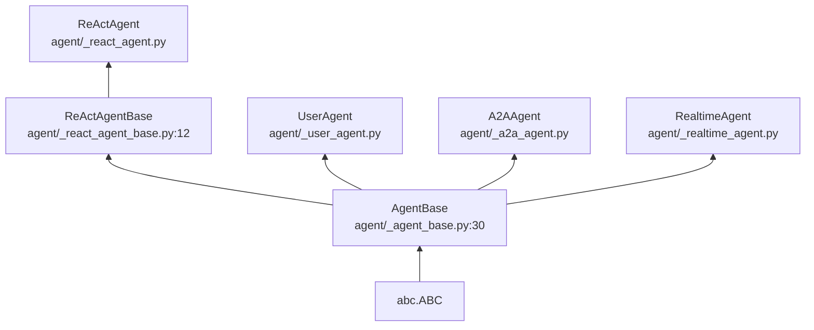
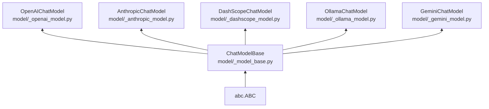
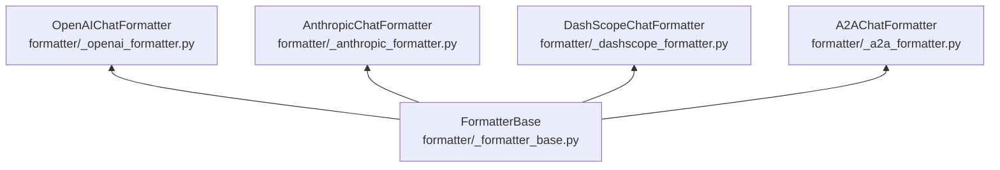

# AgentScope 技术栈分析

> **Level**: 0 (前置基础)
> **目标**: 理解 AgentScope 的技术选型、依赖管理和版本约束

---

## 1. 技术栈概览

### 1.1 核心语言与版本

| 项目 | 值 |
|------|-----|
| **Python** | 3.10+ |
| **最低支持版本** | 3.10 |
| **类型系统** | 原生 Python type hints + TYPE_CHECKING |

### 1.2 主要依赖

| 分类 | 库名 | 版本 | 用途 |
|------|------|------|------|
| **AI 模型** | `openai` | - | OpenAI API 调用 |
| **AI 模型** | `anthropic` | - | Claude API 调用 |
| **AI 模型** | `dashscope` | - | 阿里云通义千问 |
| **AI 模型** | `ollama` | - | 本地 LLM |
| **向量存储** | `chromadb` | - | 向量数据库 |
| **向量存储** | `faiss` | - | Facebook 向量检索 |
| **数据库** | `redis` | - | Redis 记忆存储 |
| **数据库** | `sqlalchemy` | - | ORM 支持 |
| **异步** | `asyncio` | 内置 | 异步编程 |
| **HTTP** | `httpx` | - | 同步/异步 HTTP |
| **WebSocket** | `websockets` | - | 实时代理通信 |
| **追踪** | `opentelemetry-api` | - | 链路追踪接口 |
| **追踪** | `opentelemetry-sdk` | - | 链路追踪实现 |
| **追踪** | `opentelemetry-exporter-otlp` | - | OTLP 导出器 |
| **配置** | `pydantic` | - | 配置验证 |
| **序列化** | `orjson` | - | 快速 JSON |

---

## 2. 项目结构

### 2.1 源码组织

```
src/agentscope/
├── __init__.py              # 包入口，init() 函数
├── _version.py              # 版本信息
├── agent/                   # Agent 模块 (~2800 行)
├── model/                   # 模型模块 (~2500 行)
├── formatter/               # 格式化模块 (~1200 行)
├── tool/                    # 工具模块 (~1700 行)
├── memory/                  # 记忆模块 (~3000 行)
├── pipeline/                # 编排模块 (~1200 行)
├── message/                 # 消息模块 (~800 行)
├── rag/                     # RAG 模块 (~1500 行)
├── a2a/                     # A2A 模块 (~1000 行)
├── mcp/                     # MCP 模块 (~1500 行)
├── tracing/                 # 追踪模块 (~800 行)
├── session/                 # 会话模块 (~1000 行)
├── realtime/                # 实时代理 (~1500 行)
├── tuner/                   # 调优模块 (~1000 行)
├── evaluate/                # 评估模块 (~800 行)
├── embedding/               # 向量化 (~500 行)
├── token/                   # Token 计算 (~300 行)
└── constants.py             # 常量定义
```

### 2.2 测试结构

```
tests/
├── model/                   # 模型测试
├── agent/                   # Agent 测试
├── pipeline/                # Pipeline 测试
├── tool/                   # 工具测试
├── memory/                  # 记忆测试
└── message/                 # 消息测试
```

---

## 3. 核心抽象层次

### 3.1 Agent 继承层次



### 3.2 Model 继承层次



### 3.3 Formatter 继承层次



---

## 4. 消息流转换链

### 4.1 标准 Agent 调用链

```
Msg (Python 对象)
    ↓ format()
Formatter (Msg → API 格式)
    ↓ API 调用
ChatResponse (原始响应)
    ↓ parse()
Msg (Python 对象)
```

### 4.2 Formatter 与 Model 配对

| Formatter | Model | API Format |
|-----------|-------|------------|
| `OpenAIChatFormatter` | `OpenAIChatModel` | OpenAI Chat Completions |
| `AnthropicChatFormatter` | `AnthropicChatModel` | Anthropic Messages |
| `DashScopeChatFormatter` | `DashScopeChatModel` | DashScope API |
| `A2AChatFormatter` | `A2AAgent` | A2A 协议格式 |

---

## 5. 异步编程模式

### 5.1 核心异步模式

```python
# 1. Agent.reply() 是异步的
async def reply(self, msg: Msg | list[Msg] | None) -> Msg:
    ...

# 2. Model 调用是异步的
async def __call__(self, ...) -> Msg:
    response = await self._call_llm(...)
    ...

# 3. 工具执行支持异步
async def call_tool_function(self, tool_call: ToolUseBlock) -> ToolResponse:
    if is_async:
        result = await func(**kwargs)
    else:
        result = await asyncio.get_event_loop().run_in_executor(...)
```

### 5.2 事件循环管理

```python
# 用户代码
import asyncio

async def main():
    agent = ReActAgent(...)
    result = await agent(msg)

asyncio.run(main())

# Studio/Server 环境
# 使用现有事件循环，不创建新的
```

---

## 6. 配置管理

### 6.1 init() 配置项

```python
agentscope.init(
    project="string",           # 项目名称
    name="string",             # Agent 名称
    description="string",       # 项目描述
    runtime_log_level="INFO",  # 日志级别
    db_type="sqlite",          # 数据库类型: sqlite, redis, mysql
    # Redis 配置
    redis_host="localhost",
    redis_port=6379,
    # Flask/Quart 配置
    flask_port=5000,
    # MCP 配置
    mcp_config=[],
)
```

### 6.2 Pydantic 配置验证

```python
# 模型配置使用 Pydantic BaseModel
class OpenAIChatModel(ChatModelBase):
    model_name: str = "gpt-4"
    api_key: str
    api_base: str = "https://api.openai.com/v1"
    max_tokens: int = 4096
    temperature: float = 0.7
```

---

## 7. 依赖版本约束

### 7.1 Python 版本要求

```python
# pyproject.toml 或 setup.py
requires_python = ">=3.10"
```

### 7.2 可选依赖组

```python
# 完整安装
pip install agentscope[full]

# 仅核心
pip install agentscope

# 分组
pip install agentscope[openai]      # OpenAI 支持
pip install agentscope[anthropic]   # Claude 支持
pip install agentscope[dashscope]   # 阿里云支持
pip install agentscope[redis]       # Redis 记忆
pip install agentscope[chroma]      # Chroma 向量存储
pip install agentscope[tracing]     # OpenTelemetry 追踪
```

---

## 8. 技术债与约束

### 8.1 已识别技术债

| 位置 | 问题 | 影响 |
|------|------|------|
| `_toolkit.py:4` | 单文件 1684 行 | 难以维护，应拆分 |
| `_react_agent.py:2` | ReActAgent 需简化 | 代码复杂 |
| `_react_agent.py:428` | 多模态 Block 处理不完整 | 功能缺失 |
| `_react_agent.py:750` | Structured Output 不完整 | 工具调用限制 |

### 8.2 设计约束

| 约束 | 说明 |
|------|------|
| **无装饰器注册** | 使用 `register_tool_function()` 而非装饰器 |
| **异步优先** | 所有 Agent/Model 操作都是 async |
| **消息驱动** | Msg 是核心数据单元 |
| **无继承强制** | 推荐组合而非继承 |

---

