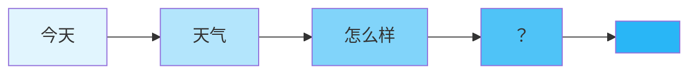
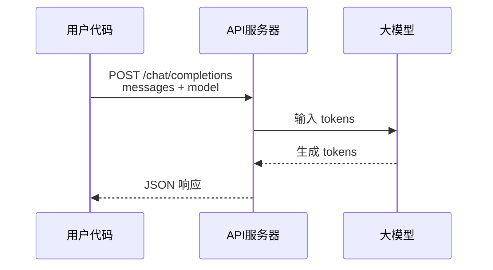
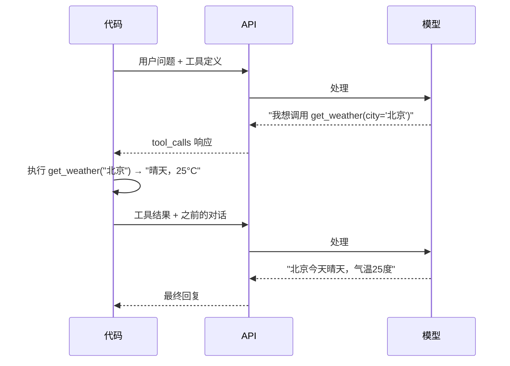

# 第 1 章 什么是大模型（LLM）

> 本章你将理解：大模型是什么、Chat API 怎么工作、Tool Calling 让模型能调用函数。
> 不需要任何前置知识。

---

## 1.1 生活类比：预测下一个字的输入法

你在手机上打字时，输入法会建议下一个词。你输入"今天天气"，它建议"怎么样"或"真好"。这不是魔法——输入法根据大量文本中学到的统计规律，预测最可能出现的下一个词。

大模型（Large Language Model，简称 LLM）做的事情本质上一样，但规模大了亿万倍：

- **输入法**：根据前几个词，建议一个词
- **大模型**：根据整段对话上下文，生成一段连贯的文字

区别在于"理解"的深度。输入法不懂"天气"是什么意思，它只知道"天气"后面经常跟着"怎么样"。大模型也不"理解"含义，但它读过的文本太多（几乎整个互联网），所以给出的续写看起来像是在"思考"。

举几个例子：

```
输入: "今天天气"      → 大模型续写: "真不错，阳光明媚"
输入: "北京今天的"     → 大模型续写: "气温大约25度，适合出行"
输入: "def hello():"  → 大模型续写: "    print('Hello, World!')"
```

第三个例子揭示了大模型的另一个特点：它不仅能处理日常语言，还能处理编程语言、数学公式、结构化数据——因为这些都包含在它的训练数据中。

> **源码验证日期**: 2026-05-11, commit `f17cfd0a`

---

## 1.2 动手试试：和 LLM 对话

大模型公司（如 OpenAI、Anthropic、Google）提供了 HTTP API，让开发者可以通过网络请求调用模型。我们来试试。

### 用 Python 调用 Chat API

先安装 `openai` 库：

```bash
pip install openai
```

然后用几行代码就能和模型对话：

```python
from openai import OpenAI

client = OpenAI(api_key="sk-你的API密钥")

response = client.chat.completions.create(
    model="gpt-4o",
    messages=[
        {"role": "system", "content": "你是一个有帮助的助手。"},
        {"role": "user", "content": "北京今天天气怎么样？"},
    ],
)

print(response.choices[0].message.content)
```

运行后你会看到模型返回一段回答，比如：

```
我无法获取实时天气数据，但我可以告诉你如何查询...
```

### API 调用发生了什么？

用一句大白话说：**你发了一条消息，服务器回了一条消息**。这就是 HTTP 请求-响应模式，和你用浏览器打开网页一样——浏览器发请求，服务器回网页。API 调用也是发请求，只不过服务器回的不是网页，而是 JSON 格式的数据。

JSON 是一种文本格式，长这样：

```json
{
    "model": "gpt-4o",
    "messages": [
        {"role": "user", "content": "北京今天天气怎么样？"}
    ]
}
```

花括号 `{}` 包裹的是"对象"（类似 Python 字典），方括号 `[]` 包裹的是"数组"（类似 Python 列表），键值对用冒号 `:` 分隔。整个 API 通信就是用这种格式传递数据的。

### messages 数组：对话的上下文

注意到 `messages` 是一个数组，里面每条消息都有 `role` 和 `content`：

| role | 含义 |
|------|------|
| `system` | 系统指令，告诉模型"你是什么角色" |
| `user` | 用户说的话 |
| `assistant` | 模型的回复 |

多轮对话时，你会把之前的消息都放进这个数组，模型就能"记住"上下文。这很像聊天记录——你翻看之前的聊天记录，就知道对方在说什么。

### 没有 API key？

如果你暂时没有 API key，可以用下面的模拟代码体验 API 调用的流程：

```python
# 模拟 Chat API 调用（不需要 API key）
def mock_chat_completion(messages):
    """模拟大模型的回复"""
    user_msg = messages[-1]["content"]

    if "天气" in user_msg:
        return {
            "choices": [{
                "message": {
                    "role": "assistant",
                    "content": "我无法获取实时天气数据。建议你使用天气查询工具来获取准确信息。"
                }
            }]
        }
    return {
        "choices": [{
            "message": {
                "role": "assistant",
                "content": f"你说了：{user_msg}。这是一个模拟回复。"
            }
        }]
    }

# 试试看
response = mock_chat_completion([
    {"role": "system", "content": "你是一个有帮助的助手。"},
    {"role": "user", "content": "北京今天天气怎么样？"},
])
print(response["choices"][0]["message"]["content"])
```

这段代码模拟了 API 的请求-响应结构，帮你理解数据是怎样流动的。

---

## 1.3 核心概念

### 大模型（LLM）

大模型是一个巨大的神经网络，通过"预测下一个 token"来生成文本。Token 是文本的最小单位——一个汉字、一个英文单词的一部分、一个标点，都算一个 token。



每一次预测，模型都是根据前面所有的 token，计算出一个概率分布，选择概率最高的下一个 token。这个过程不断重复，就生成了完整的文字。

### Chat API

Chat API 是调用大模型的标准方式。流程很简单：



请求中你告诉服务器：用哪个模型（`model`）、对话历史（`messages`）。服务器把你的文本转成 tokens，喂给模型，模型生成回复 tokens，服务器再转回文字返回给你。

### Token

Token 是模型处理文本的基本单位。理解 token 有两个实用原因：

1. **费用**：API 按 token 数量收费
2. **长度限制**：每个模型有最大 token 数限制（如 128K tokens）

粗略估算：1 个中文字 ≈ 1-2 个 token，1 个英文单词 ≈ 1-3 个 token。

Token 的更多细节（比如流式返回 token 的过程）我们会在第 8 章和第 9 章深入讨论。

### 流式响应（Streaming）

默认情况下，API 等模型生成完毕后一次性返回全部内容。流式模式（`stream=True`）让模型生成一个 token 就立刻发送一个 token，像打字机一样逐字显示。

```
非流式: 等 3 秒 → "北京今天晴，气温25度"
流式:   "北" → "京" → "今" → "天" → "晴" → "，" → "气" → "温" → "2" → "5" → "度"
```

这在用户体验上差别巨大——想象一下你发消息后等 3 秒才看到回复 vs 每个字实时出现。第 9 章（请求模型）会展示 AgentScope 中流式响应的实现细节。

### Tool Calling（工具调用）

这是让 Agent 成为 Agent 的关键能力。普通的 Chat API 只能生成文字，Tool Calling 让模型能"请求"调用外部函数。

看这个例子：

```python
# 定义一个工具函数
tools = [{
    "type": "function",
    "function": {
        "name": "get_weather",
        "description": "获取指定城市的天气",
        "parameters": {
            "type": "object",
            "properties": {
                "city": {"type": "string", "description": "城市名"}
            },
            "required": ["city"]
        }
    }
}]

# 调用 API 时传入工具定义
response = client.chat.completions.create(
    model="gpt-4o",
    messages=[{"role": "user", "content": "北京今天天气怎么样？"}],
    tools=tools,
)
```

模型看到你定义了 `get_weather` 工具，它会返回一个特殊的响应：

```json
{
    "choices": [{
        "message": {
            "role": "assistant",
            "content": null,
            "tool_calls": [{
                "function": {
                    "name": "get_weather",
                    "arguments": "{\"city\": \"北京\"}"
                }
            }]
        }
    }]
}
```

注意：模型**不是自己执行了这个函数**。它只是告诉你"我想调用这个函数，参数是这些"。你的代码需要：

1. 解析模型返回的工具调用请求
2. 实际执行函数
3. 把结果作为新的消息发回模型
4. 模型根据结果生成最终回答



这个"模型请求 → 代码执行 → 结果返回模型"的循环，就是 Agent 的雏形。下一章我们会看到，当你把这个循环加上记忆和更多工具，一个完整的 Agent 就诞生了。

---

## 1.4 试一试

### 基础级：安装 AgentScope

如果你只想先感受一下，三行代码验证安装：

```bash
pip install agentscope
```

```python
import agentscope
print(agentscope.__version__)
```

看到版本号就说明安装成功了。

### 完整级：为改源码做准备

如果你打算跟着本书的"试一试"环节修改源码，需要 clone 仓库并安装开发模式：

```bash
# 1. 克隆仓库
git clone https://github.com/modelscope/agentscope.git
cd agentscope

# 2. 安装开发模式（-e 表示 editable，修改源码后无需重新安装）
pip install -e .

# 3. 验证安装
python -c "import agentscope; print(f'AgentScope {agentscope.__version__} 安装成功')"
```

开发模式的好处是：你修改了 `src/agentscope/` 下的任何文件，改动立刻生效，不需要重新安装。

---

## 1.5 检查点

你现在已经理解了：

- **什么是 LLM**：一个通过"预测下一个 token"来生成文本的巨大神经网络
- **Chat API**：通过 HTTP 请求调用模型，发送 messages 数组，接收回复
- **Token**：模型处理文本的最小单位，影响费用和长度限制
- **流式响应**：token 逐个返回，像打字机一样（ch08/ch09 详解）
- **Tool Calling**：模型可以"请求"调用函数，但需要你的代码实际执行（这是 Agent 的关键能力）

下一章我们会看到，当 LLM 加上记忆、工具和一个循环控制，一个能自主思考和使用工具的 Agent 就诞生了。
