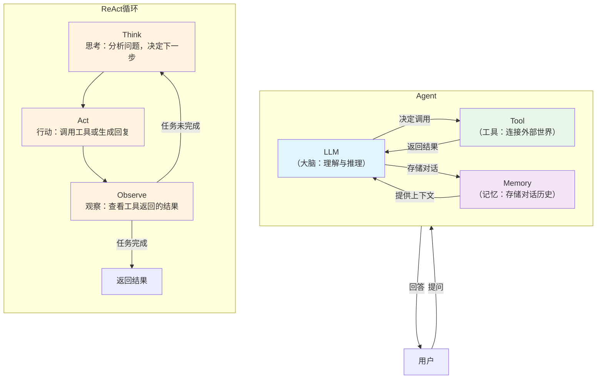
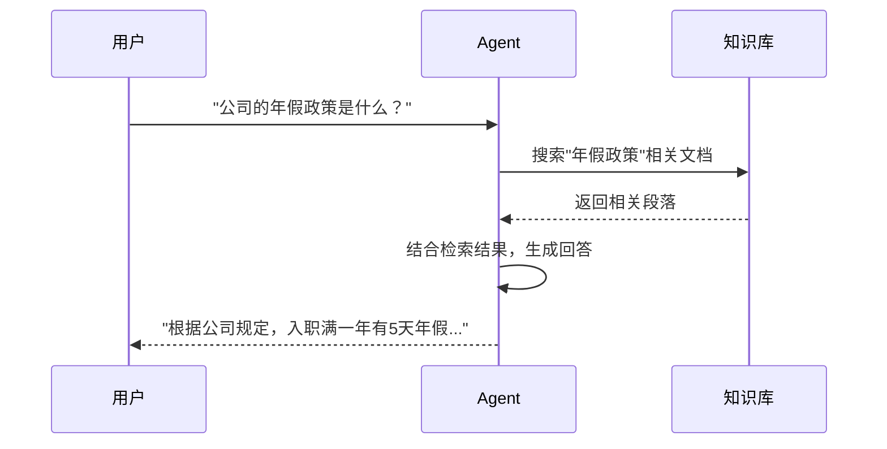
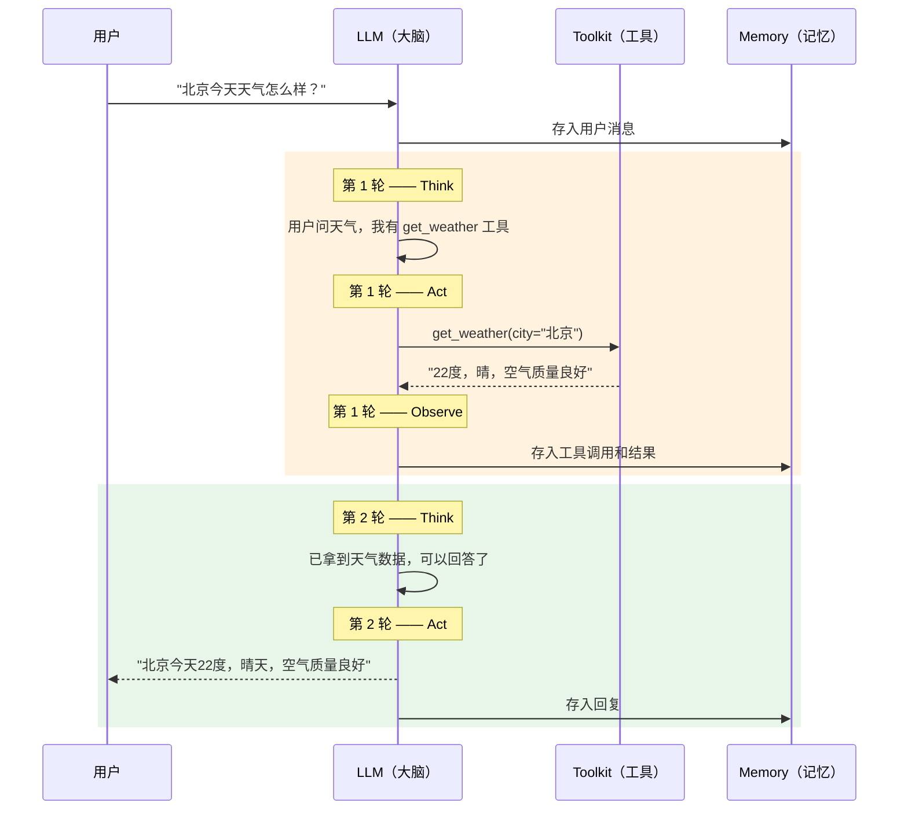

# 第 2 章 什么是 Agent

> 卷零每章的结构：生活类比 → 动手试试 → 核心概念 → 试一试 → 检查点

上一章我们认识了 LLM：你给它一段文字，它预测接下来的文字。它很聪明，但有一个致命的局限——它只能"说"，不能"做"。它不能帮你查天气，不能帮你订票，也不能记住你昨天说过什么。

Agent 就是补上这些能力的关键。

---

## 2.1 生活类比：从"只会说的顾问"到"全能助手"

想象你雇佣了一个顾问，他知识渊博但只能说话。你问他"北京天气怎么样"，他能根据常识回答"北京现在应该是春天，大概十几度"——但这不是真实数据，只是猜测。

现在，你给这个顾问配了三样东西：

1. **一个笔记本**——每次对话你都记下来，下次见面他就记得你之前问过什么
2. **一把工具箱**——里面有一部电话，可以打给气象局查实时天气
3. **一个工作流程**——"先想想要做什么，再动手做，做完看看结果够不够，不够就继续"

有了这三样东西，他就从"只会说的顾问"变成了"全能助手"：

- 你问"北京天气怎么样"
- 他想："我需要查一下实时天气数据"
- 他拿起电话打给气象局（调用工具）
- 他把结果告诉你："北京今天 22 度，晴"
- 他把这次对话记在笔记本上（存入记忆）

这个"全能助手"，就是 Agent。

更准确地说：

```
Agent = LLM + 记忆(Memory) + 工具(Tool) + 循环(Loop)
```

- **LLM**：大脑，负责理解和推理
- **Memory**：笔记本，记住对话历史
- **Tool**：工具箱，连接外部世界
- **Loop**：工作流程，反复"想→做→看"直到完成任务

---

## 2.2 动手试试：跑一次天气 Agent

还记得第 1 章里的天气查询 Agent 吗？我们把它完整地跑一次，看看 Agent 到底做了什么。

### 2.2.1 完整代码

首先，准备工具函数：

```python
def get_weather(city: str) -> str:
    """查询指定城市的天气信息。

    Args:
        city (str):
            要查询的城市名称
    """
    # 真实项目中，这里会调用天气 API
    # 为了演示，我们返回模拟数据
    weather_data = {
        "北京": "22度，晴，空气质量良好",
        "上海": "18度，多云，有轻微雾霾",
        "深圳": "28度，阵雨，湿度较高",
    }
    return weather_data.get(city, f"{city}：暂无天气数据")
```

然后，构建并运行 Agent：

```python
import agentscope
from agentscope.agent import ReActAgent
from agentscope.model import OpenAIChatModel
from agentscope.formatter import OpenAIChatFormatter
from agentscope.tool import Toolkit
from agentscope.memory import InMemoryMemory
from agentscope.message import Msg

agentscope.init(project="weather-demo")

model = OpenAIChatModel(model_name="gpt-4o", stream=True)

toolkit = Toolkit()
toolkit.register_tool_function(get_weather)

agent = ReActAgent(
    name="assistant",
    sys_prompt="你是天气助手。",
    model=model,
    formatter=OpenAIChatFormatter(),
    toolkit=toolkit,
    memory=InMemoryMemory(),
)

result = await agent(Msg("user", "北京今天天气怎么样？", "user"))
```

### 2.2.2 Agent 内部发生了什么

当你运行 `await agent(...)` 这一行时，Agent 内部经历了这样的过程：

```
用户："北京今天天气怎么样？"

第 1 轮 —— 思考（Reasoning）
Agent 想：用户想知道北京的天气，我有一个 get_weather 工具可以查询。

第 1 轮 —— 行动（Acting）
Agent 调用工具：get_weather(city="北京")
工具返回："22度，晴，空气质量良好"

第 2 轮 —— 思考（Reasoning）
Agent 想：我已经拿到了北京的天气数据，可以回答用户了。

第 2 轮 —— 行动（Acting）
Agent 回复："北京今天 22 度，天气晴朗，空气质量良好。"
```

注意这个模式：**先想，再做，反复循环，直到完成**。这就是 ReAct 模式。

### 2.2.3 没有 API key 也能看懂

如果你暂时没有 OpenAI API key，不用运行代码也没关系。上面"Agent 内部发生了什么"的过程展示的就是核心逻辑——LLM 的作用是在"思考"环节决定下一步做什么。理解了这个循环，你就理解了 Agent 的工作方式。

后面的"试一试"环节，我们会用一个不需要 LLM 的纯 Python 脚本来模拟这个过程。

---

## 2.3 核心概念：Agent 的四个组件

让我们用天气 Agent 的例子，把 Agent 的四个组件拆开看。

### 2.3.1 整体架构



### 2.3.2 Memory（记忆）

Memory 的作用是记住对话历史。为什么需要它？

想象你在和一个完全没有记忆的人对话：

```
你："北京天气怎么样？"
Agent："北京今天 22 度，晴天。"
你："上海呢？"
Agent："上海什么？你之前没说过什么话题。"
```

没有记忆的 Agent 每次都像第一次见面。有了 Memory，Agent 才能维持连贯的对话：

```
你："北京天气怎么样？"
Agent："北京今天 22 度，晴天。"
你："上海呢？"
Agent："上海今天 18 度，多云。"    <-- Agent 理解"呢"指的是天气
```

在 AgentScope 中，我们用 `InMemoryMemory()` 作为记忆：

```python
memory = InMemoryMemory()
```

`InMemoryMemory` 把消息存在一个 Python 列表里。每次 Agent 收到新消息，它会：

1. 把新消息加到列表末尾（`memory.add(msg)`）
2. 向 LLM 发送请求时，把整个列表作为上下文传过去（`memory.get_memory()`）

这样 LLM 就能看到完整的对话历史，做出连贯的回答。

除了 `InMemoryMemory`，AgentScope 还提供了其他记忆实现——比如用 Redis 存储的 `RedisMemory`，用数据库存储的 `SQLAlchemyMemory`。它们的接口一样，只是存储位置不同。我们在卷一第 6 章会深入源码看 Memory 的实现。

### 2.3.3 Tool（工具）

Tool 让 Agent 能"动手做事"。LLM 本身只能生成文字，但通过 Tool，它可以：

- 查询天气 API
- 搜索网页
- 执行数据库查询
- 调用任何 Python 函数

在 AgentScope 中，注册一个工具非常简单：

```python
toolkit = Toolkit()
toolkit.register_tool_function(get_weather)
```

`register_tool_function` 做了两件事：

1. 读取 `get_weather` 函数的参数信息（参数名、类型、文档字符串），自动生成一个描述给 LLM 看
2. 把函数存起来，等 LLM 决定调用时，替 LLM 执行这个函数

LLM 并不直接执行代码。它只是输出一段 JSON，说"我想调用 `get_weather`，参数是 `city='北京'`"。然后 Toolkit 解析这段 JSON，帮你执行函数，把结果再返回给 LLM。

这个过程可以类比为：LLM 是经理，Tool 是下属。经理说"帮我查一下北京的天气"，下属去查，把结果汇报给经理。经理自己不会查天气。

### 2.3.4 RAG（检索增强生成，Retrieval-Augmented Generation）

还有一种重要的知识来源：RAG。它解决的问题是——LLM 的知识有截止日期，而且不包含你的私有数据。

RAG 的工作方式像一个图书管理员：



在天气 Agent 的例子中，我们没有使用 RAG。但如果你想让 Agent 回答"公司内部制度"这类问题，就需要把公司文档建成知识库，让 Agent 先检索再回答。

AgentScope 中，RAG 通过 `KnowledgeBase` 实现。我们在卷一第 7 章会详细看它的源码。

### 2.3.5 ReAct 循环：先想再做

把以上组件串起来的，是 ReAct 循环。ReAct 是 **Re**asoning + **Act**ing 的缩写，意思是"推理 + 行动"。

它的核心思想很简单：

```
循环开始：
  1. Think  —— LLM 思考当前情况，决定下一步做什么
  2. Act    —— 执行动作（调用工具，或生成最终回复）
  3. Observe —— 观察动作的结果
  4. 如果任务完成，返回结果；否则回到第 1 步
```

用天气 Agent 的例子来走一遍：



注意一个关键细节：循环不是无限转的。AgentScope 中有一个 `max_iters` 参数（默认值 10），防止 Agent 陷入死循环。对于简单问题，通常 2-3 轮就够了。

> **设计一瞥**：为什么叫 ReAct 而不直接叫"循环"？
> 因为 ReAct 的核心不仅是"循环"，而是"先推理再行动"。另一种常见的设计是让 LLM 直接输出工具调用指令，不做显式的推理步骤。ReAct 的优势是中间的"思考"过程让 LLM 有机会纠错和规划，提高了任务完成的准确率。我们在卷一第 11 章会看 ReAct 循环的源码实现。

### 2.3.6 四个组件如何对应到代码

回到我们的天气 Agent 代码，每个组件对应一行：

```python
agent = ReActAgent(
    name="assistant",
    sys_prompt="你是天气助手。",          # 告诉 LLM 它的角色
    model=model,                        # LLM（大脑）
    formatter=OpenAIChatFormatter(),     # 消息格式转换器
    toolkit=toolkit,                     # Tool（工具箱）
    memory=InMemoryMemory(),             # Memory（记忆）
)
```

`ReActAgent` 这个名字本身就说明了它是一个使用 ReAct 模式的 Agent。`formatter` 是一个辅助组件——不同 LLM 提供商（OpenAI、Anthropic、Google 等）对消息格式的要求不同，formatter 负责把统一的 `Msg` 格式转换成对应的 API 格式。我们在卷一第 8 章会深入看 formatter。

---

## 2.4 试一试

### 2.4.1 修改 sys_prompt，观察行为变化

`sys_prompt` 是 Agent 的"人设描述"。它告诉 LLM "你是谁、应该怎么回答"。

试着修改 `sys_prompt`，看看 Agent 的行为如何变化：

```python
# 版本 A：简洁助手
agent_v1 = ReActAgent(
    name="assistant",
    sys_prompt="你是天气助手。",
    ...
)

# 版本 B：热情助手
agent_v2 = ReActAgent(
    name="assistant",
    sys_prompt="你是一个非常热情的天气助手！回答时要带感叹号，并且给出穿衣建议。",
    ...
)

# 版本 C：严格助手（不回答天气以外的问题）
agent_v3 = ReActAgent(
    name="assistant",
    sys_prompt="你只能回答天气相关问题。如果用户问了其他问题，礼貌地拒绝。",
    ...
)
```

同样的输入"北京今天天气怎么样？"，三个版本的回复风格会截然不同。这就是 `sys_prompt` 的力量——你不需要改代码逻辑，只改一行文字，就能改变 Agent 的行为。

如果你没有 API key，可以在 `get_weather` 函数里打印日志，观察 Agent 是否调用了工具：

```python
def get_weather(city: str) -> str:
    """查询指定城市的天气信息。"""
    print(f"[工具被调用] get_weather(city='{city}')")
    ...
```

### 2.4.2 无 API key 变体：用纯 Python 模拟 Agent 循环

这个练习不需要 LLM、不需要 API key、不需要安装 AgentScope。只用 Python 的 `input()` 和 `if/else`，模拟 Agent 的核心逻辑。

这个练习的目的是让你亲手体验 Agent 循环的本质：**接收输入 → 思考 → 行动 → 观察 → 判断是否继续**。

```python
def get_weather(city: str) -> str:
    """模拟天气查询工具。"""
    weather_data = {
        "北京": "22度，晴",
        "上海": "18度，多云",
        "深圳": "28度，阵雨",
    }
    return weather_data.get(city, f"{city}：暂无数据")


def run_simple_agent():
    """一个最简 Agent 循环——用 input 和 if/else 模拟。"""
    print("=== 最简天气 Agent ===")
    print("输入城市名查询天气，输入'退出'结束。\n")

    memory = []  # 对话记忆

    while True:
        # 1. 接收用户输入
        user_input = input("你: ")

        if user_input.strip() == "退出":
            print("Agent: 再见！")
            break

        # 2. 存入记忆
        memory.append({"role": "user", "content": user_input})

        # 3. "推理"：决定是否需要调用工具
        # 真正的 Agent 由 LLM 做这个判断
        # 这里我们用简单的关键词匹配来模拟
        city = None
        for c in ["北京", "上海", "深圳"]:
            if c in user_input:
                city = c
                break

        # 4. "行动"：调用工具
        if city:
            tool_result = get_weather(city)
            memory.append({"role": "tool", "content": tool_result})
            reply = f"{city}今天{tool_result}。"
        else:
            reply = "抱歉，我暂时只能查询北京、上海、深圳的天气。"

        # 5. 存入记忆并返回
        memory.append({"role": "assistant", "content": reply})
        print(f"Agent: {reply}\n")


if __name__ == "__main__":
    run_simple_agent()
```

运行效果：

```
=== 最简天气 Agent ===
输入城市名查询天气，输入'退出'结束。

你: 北京天气怎么样
Agent: 北京今天22度，晴。

你: 上海呢
Agent: 上海今天18度，多云。

你: 广州呢
Agent: 抱歉，我暂时只能查询北京、上海、深圳的天气。

你: 退出
Agent: 再见！
```

**仔细看这段代码**，它包含了 Agent 的所有核心要素：

| Agent 组件 | 代码中的对应 | 作用 |
|-----------|-------------|------|
| Memory | `memory = []` | 存储对话历史 |
| Tool | `get_weather()` | 连接外部数据源 |
| Loop | `while True` | 反复循环直到任务完成 |
| 推理（Think） | `for c in ["北京", ...]: if c in user_input` | 决定下一步做什么 |

这里用关键词匹配代替了 LLM 的推理能力。真正的 Agent 把这段 `if/else` 换成 LLM，由 LLM 来决定"用户在问什么"、"需要调用哪个工具"、"参数是什么"。但骨架是一样的。

**试一试**：

1. 运行上面的代码，体验 Agent 循环
2. 在 `get_weather` 函数中增加一个城市（比如"广州"），再运行一次
3. 观察当用户连续问两个城市时，`memory` 列表里存了什么（加一行 `print(memory)` 看看）

---

## 2.5 检查点

读到这里，你应该能用一句话回答以下问题：

**什么是 Agent？**

> Agent = LLM + Memory + Tool + Loop。它是一个能记住上下文、使用工具、通过 ReAct 循环反复推理直到完成任务的系统。

**什么是 ReAct？**

> ReAct（Reasoning + Acting）是一种工作模式，由 Shunyu Yao 等人在 2022 年的论文《ReAct: Synergizing Reasoning and Acting in Language Models》中提出：先推理当前情况并决定下一步，再执行动作，然后观察结果。如果任务没完成，就继续循环。

**什么是 Memory？**

> 记忆，用来存储对话历史，让 Agent 能理解上下文。

**什么是 Tool？**

> 工具，让 Agent 能调用外部函数（查天气、搜索网页、操作数据库等），突破 LLM 只能生成文字的局限。

**什么是 RAG？**

> 检索增强生成（Retrieval-Augmented Generation），让 Agent 先从知识库中检索相关文档，再基于检索结果生成回答。解决 LLM 知识不足或过期的问题。

如果以上每个问题你都能用自己的话解释，恭喜你——你已经理解了 Agent 的核心概念。

从下一章开始，我们将进入卷一，逐行追踪天气 Agent 的一次完整调用，看看源码中这些概念是如何实现的。

---

> **下一章预告**：第 3 章"准备工具箱"——我们会搭建开发环境，理解 `await agent(...)` 中那个 `await` 是什么意思，然后正式开始源码之旅。
