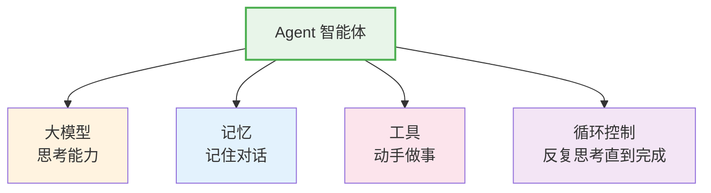
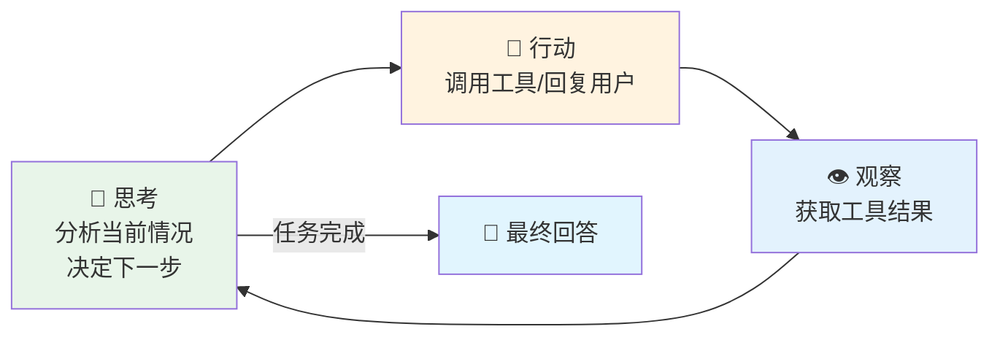

# 第 2 章 什么是 Agent

> 本章你将理解：Agent 是什么、ReAct 模式怎么工作、Memory / Tool / RAG 分别是什么。
> 建筑在上一章的 LLM 和 Tool Calling 概念之上。

---

## 2.1 生活类比：一个有记忆、会查资料、能用工具的助手

想象你雇了一个助手。你跟他说："帮我查一下北京明天的天气，如果会下雨就帮我取消户外会议。"

一个好的助手会怎么做？

1. **思考**："用户想知道天气，我需要查一下"
2. **行动**：打开天气 App 查询北京明天的天气
3. **观察**："明天有雨，气温 18°C"
4. **再思考**："有雨，需要取消户外会议。我得查一下日程表"
5. **再行动**：打开日程表，找到户外会议
6. **再观察**："周三下午 2 点有团队户外会议"
7. **最终回答**："明天北京有雨，我已经帮您取消了周三下午 2 点的户外会议"

这个过程有三个关键特征：

- **循环**：不是一步到位，而是"思考→行动→观察→再思考"反复进行
- **工具使用**：天气 App、日程表都是外部工具
- **记忆**：助手记住了你说的话，也记住了之前查到的信息

**Agent（智能体）就是这样一个数字助手**——它由大模型驱动，能记忆对话、使用工具、自主循环，直到完成你的任务。

> **源码验证日期**: 2026-05-11, commit `f17cfd0a`

---

## 2.2 动手试试：一个完整的 Agent

在上一章我们看到了 LLM 的 Chat API 和 Tool Calling。现在把所有零件组装起来，看一个真正的 Agent 是怎么工作的。

### 天气查询 Agent

这是我们全书追踪的示例。后面所有章节都会围绕这段代码展开：

```python
import agentscope
from agentscope.agent import ReActAgent
from agentscope.model import OpenAIChatModel
from agentscope.formatter import OpenAIChatFormatter
from agentscope.tool import Toolkit
from agentscope.memory import InMemoryMemory
from agentscope.message import Msg


def get_weather(city: str) -> str:
    """查询城市天气（模拟）"""
    weather_data = {"北京": "晴天，25°C", "上海": "多云，22°C", "广州": "小雨，28°C"}
    return weather_data.get(city, "暂无该城市天气数据")


agentscope.init(project="weather-demo")

model = OpenAIChatModel(model_name="gpt-4o", stream=True)

toolkit = Toolkit()
toolkit.register_tool_function(get_weather)

agent = ReActAgent(
    name="assistant",
    sys_prompt="你是天气助手。",
    model=model,
    formatter=OpenAIChatFormatter(),
    toolkit=toolkit,
    memory=InMemoryMemory(),
)

result = await agent(Msg("user", "北京今天天气怎么样？", "user"))
print(result.content)
```

逐行看这些代码在做什么：

| 代码 | 作用 |
|------|------|
| `agentscope.init()` | 初始化框架，设置日志、配置等 |
| `OpenAIChatModel(...)` | 创建模型客户端，告诉框架用哪个 LLM |
| `Toolkit()` + `register_tool_function` | 注册工具函数，Agent 可以调用它 |
| `InMemoryMemory()` | 创建内存存储，Agent 用来记住对话 |
| `ReActAgent(...)` | 创建 Agent，把模型、工具、记忆组装在一起 |
| `await agent(Msg(...))` | 发送消息给 Agent，等待它处理完毕 |

最后一行是全书的起点。从第 3 章开始，我们将追踪 `await agent(...)` 从执行到返回的完整旅程，深入每一步的源码实现。

### 执行过程：Agent 内部发生了什么？

当你发送"北京今天天气怎么样？"后，Agent 内部经历了这样一个循环：

```
第 1 轮 — 思考：
  Agent: "用户想知道北京天气，我应该调用 get_weather 工具"
  → 决定调用 get_weather(city="北京")

行动：
  → 执行 get_weather("北京")

观察：
  ← 返回 "晴天，25°C"

第 2 轮 — 思考：
  Agent: "我已经获取到了天气数据，可以回答用户了"
  → 决定直接回复

最终回答：
  "北京今天天气晴朗，气温25°C。"
```

这就是 ReAct 模式——**Re**asoning（推理）+ **Act**ing（行动）。Agent 先想后做，做完观察，再想下一步，直到得出最终答案。

---

## 2.3 核心概念

### Agent = LLM + Memory + Tool + Loop

用一个公式总结 Agent 的组成：



- **大模型（LLM）**：提供"思考"能力——分析问题、决定下一步做什么、理解工具返回的结果
- **记忆（Memory）**：记住之前的对话和操作结果，就像聊天记录
- **工具（Tool）**：Agent 能调用的函数，比如查天气、搜网页、执行代码
- **循环（Loop）**：控制 Agent 反复"思考→行动→观察"，直到任务完成

### ReAct 模式

ReAct 是 Agent 最常用的执行模式，由两个阶段交替组成：



每一轮循环中：
1. **思考**（Thought）：模型分析当前对话和可用的工具，决定下一步做什么
2. **行动**（Action）：如果需要调用工具，就执行工具函数；如果已经知道答案，就生成最终回复
3. **观察**（Observation）：把工具执行的结果加入对话，进入下一轮思考

这个循环会持续进行，直到模型认为任务已经完成，生成最终回答。

### Memory（记忆）

Memory 让 Agent 能记住之前的对话。想象你在聊天——如果你忘了对方上一句话说了什么，对话就没法继续。

AgentScope 中最简单的记忆实现是 `InMemoryMemory`，它把所有对话历史保存在内存中。更复杂的实现可以把记忆存到数据库里，甚至跨会话保留。

本书第 6 章（工作记忆）会深入源码看 Memory 是怎么实现的。

### Tool（工具）

Tool 是 Agent 的"手"。大模型只能生成文字，但通过 Tool Calling（上一章讲过），它可以"请求"执行函数。

AgentScope 的 `Toolkit` 让你用一行代码注册工具函数：

```python
toolkit = Toolkit()
toolkit.register_tool_function(get_weather)  # 就这么简单
```

框架会自动把函数的名称、参数、文档字符串提取出来，告诉模型有哪些工具可以用。第 10 章（执行工具）会看到这个过程的源码实现。

### RAG（检索增强生成）

RAG（Retrieval-Augmented Generation）让 Agent 能查阅外部资料再回答。就像你考试时翻课本一样——Agent 先从知识库中检索相关内容，再基于检索结果生成回答。

```
用户提问 → Agent 从知识库检索相关文档 → 把文档作为上下文送给模型 → 模型生成回答
```

RAG 解决了一个核心问题：大模型的知识是训练时固定的，无法获取最新信息。通过 RAG，Agent 可以访问实时的、私有的、专业的知识。

第 7 章（检索知识）会深入 RAG 在 AgentScope 中的实现。

---

## 2.4 试一试

### 纯本地级：模拟最简 Agent 循环（不需要 API key）

这个练习帮你亲手体验 ReAct 模式的思考→行动→观察循环：

```python
# 最简 Agent 循环模拟 —— 用纯 Python 模拟 ReAct 模式
def get_weather_mock(city: str) -> str:
    """模拟天气查询"""
    return {"北京": "晴天，25°C", "上海": "多云，22°C"}.get(city, "未知")

# Agent 的"工具箱"
tools = {"get_weather": get_weather_mock}

# Agent 的"记忆"（对话历史）
memory = []

# Agent 的"大脑"（用 if/else 模拟大模型的推理过程）
def agent_think(user_input: str) -> str:
    """模拟 Agent 的思考和行动"""
    memory.append({"role": "user", "content": user_input})

    # 第 1 轮：思考 → 决定调用工具
    thought = "用户问天气，我需要调用 get_weather 工具"
    print(f"  [思考] {thought}")

    # 行动：调用工具
    action = "get_weather"
    city = "北京"  # 简化：直接从用户输入提取
    print(f"  [行动] 调用 {action}('{city}')")
    observation = tools[action](city)

    # 观察：记录结果
    print(f"  [观察] {observation}")
    memory.append({"role": "tool", "content": observation})

    # 第 2 轮：思考 → 决定回答
    thought = "我已经获取了天气数据，可以回答用户了"
    print(f"  [思考] {thought}")

    answer = f"根据查询结果：{observation}"
    memory.append({"role": "assistant", "content": answer})
    return answer

# 交互循环
print("最简 Agent 模拟器（输入'退出'结束）")
print("-" * 40)
while True:
    user_input = input("你: ")
    if user_input == "退出":
        break
    if user_input.strip():
        response = agent_think(user_input)
        print(f"Agent: {response}")
        print(f"  [记忆] 共 {len(memory)} 条记录")
    print()

print("\n最终记忆:")
for msg in memory:
    print(f"  [{msg['role']}] {msg['content']}")
```

运行这段代码，你会看到 Agent 的思考过程被清晰地打印出来。这就是 ReAct 模式在最小规模上的体现。

试试修改：
- 把 `get_weather_mock` 改成返回不同的数据
- 增加一个新的工具函数（比如 `get_time`）
- 观察 Agent 的"思考"和"行动"怎么变化

### 完整级：修改天气 Agent（需要 API key）

如果你有 OpenAI API key，试试修改天气 Agent 的 `sys_prompt`，观察行为变化：

```python
# 修改前
agent = ReActAgent(
    name="assistant",
    sys_prompt="你是天气助手。",
    ...
)

# 修改后 —— 试试不同的角色
agent = ReActAgent(
    name="assistant",
    sys_prompt="你是一个旅行顾问，帮用户规划出行。回答天气时顺便推荐穿搭。",
    ...
)
```

你会发现同样的问题"北京今天天气怎么样？"，Agent 的回答风格完全不同。这就是 `sys_prompt` 的力量——它像职位描述，告诉 Agent "你是什么角色、怎么回答问题"。

---

## 2.5 检查点

你现在已经理解了：

- **什么是 Agent**：大模型 + 记忆 + 工具 + 循环控制的组合体
- **ReAct 模式**：思考（Thought）→ 行动（Action）→ 观察（Observation）的循环
- **Memory**：Agent 的记忆，记住对话历史
- **Tool**：Agent 能调用的函数，通过 Tool Calling 实现
- **RAG**：检索增强生成，让 Agent 能查阅外部资料

从下一章开始，我们将打开 AgentScope 的源码，追踪 `await agent(Msg("user", "北京今天天气怎么样？", "user"))` 这行代码从执行到返回的完整旅程。你准备好了吗？
