# 第一章：出发前——准备你的工具箱

> 在追随一次 `await agent(msg)` 调用穿越整个框架之前，我们先把工具箱整理好：安装框架、理解初始化流程、跑通第一个 Agent。
> 本章结束时，你会知道 `agentscope.init()` 在幕后到底做了什么。

---

## 1. 路线图

下面是本书的完整旅程。当前处于 **"出发前"** 阶段——对应第一步 `agentscope.init()`。

```mermaid
flowchart LR
    A["agentscope.init()"] --> B["Msg 创建"]
    B --> C["Agent 接收"]
    C --> D["Memory 存储"]
    D --> E["Formatter 格式化"]
    E --> F["Model 调用"]
    F --> G["Toolkit 执行"]
    G --> H["ReAct 循环"]
    H --> I["返回结果"]

    style A fill:#f9f,stroke:#333,stroke-width:2px
    style B fill:#ddd,stroke:#333
    style C fill:#ddd,stroke:#333
    style D fill:#ddd,stroke:#333
    style E fill:#ddd,stroke:#333
    style F fill:#ddd,stroke:#333
    style G fill:#ddd,stroke:#333
    style H fill:#ddd,stroke:#333
    style I fill:#ddd,stroke:#333
```



| 章号 | 主题 | 核心对象 |
|------|------|----------|
| **ch01** | **出发前：准备你的工具箱** | **`agentscope.init()`、`_ConfigCls`** |
| ch02 | 消息的诞生 | `Msg` |
| ch03 | Agent 接收消息 | `AgentBase`、`ReActAgent` |
| ch04 | 记忆的存储 | `InMemoryMemory` |
| ch05 | 格式化 | `OpenAIChatFormatter` |
| ch06 | 模型调用 | `OpenAIChatModel` |
| ch07 | 工具执行 | `Toolkit` |
| ch08 | ReAct 循环 | `_react_agent.py` |
| ch09 | 旅程终点 | 返回值解析 |

---

## 2. 源码入口

本章涉及的核心源文件：

| 文件 | 关键内容 | 行号参考 |
|------|----------|----------|
| `src/agentscope/__init__.py` | `init()` 函数定义 | :72 |
| `src/agentscope/__init__.py` | `_config` 全局配置实例 | :22 |
| `src/agentscope/_run_config.py` | `_ConfigCls` 类定义 | :6 |
| `src/agentscope/_run_config.py` | ContextVar 属性封装 | :25-73 |
| `src/agentscope/_logging.py` | `setup_logger()` 函数 | :15 |
| `src/agentscope/_version.py` | `__version__` 版本号 | :4 |

---

## 3. 逐行阅读

### 3.1 AgentScope 是什么

AgentScope 是一个多 Agent（智能体）框架。它的核心设计理念是：**让 LLM（大语言模型）驱动的 Agent 具备推理（Reasoning）、工具使用（Tool Use）和记忆（Memory）能力**，并通过管道（Pipeline）将多个 Agent 编排在一起协同工作。

当前版本号定义在 `src/agentscope/_version.py:4`：

```python
__version__ = "1.0.19.post1"
```

### 3.2 安装

```bash
pip install -e "agentscope[full]"
```

`-e` 表示以开发模式（editable mode）安装，代码改动立即生效。`[full]` 会安装所有可选依赖（如 Redis、SQLAlchemy、各种模型 SDK 等）。如果你只想做最小安装，用 `pip install agentscope` 即可。

### 3.3 第一个 Agent：天气助手

本书全程追踪下面这段代码中 `await agent(msg)` 的完整旅程：

```python
import agentscope
from agentscope.agent import ReActAgent
from agentscope.model import OpenAIChatModel
from agentscope.formatter import OpenAIChatFormatter
from agentscope.tool import Toolkit
from agentscope.memory import InMemoryMemory
from agentscope.message import Msg

def get_weather(city: str) -> str:
    """查询城市天气"""
    # 实际项目中，这里会调用真实的天气 API
    return f"{city}今天晴，气温 22°C"

agentscope.init(project="weather-demo")

model = OpenAIChatModel(model_name="gpt-4o", stream=True)

toolkit = Toolkit()
toolkit.register_tool_function(get_weather)

agent = ReActAgent(
    name="assistant",
    sys_prompt="你是天气助手。",
    model=model,
    formatter=OpenAIChatFormatter(),
    toolkit=toolkit,
    memory=InMemoryMemory(),
)

result = await agent(Msg("user", "北京今天天气怎么样？", "user"))
```

这段代码涉及的核心类及其源码位置：

| 类 | 文件 | 行号 |
|----|------|------|
| `ReActAgent` | `src/agentscope/agent/_react_agent.py` | :98 |
| `OpenAIChatModel` | `src/agentscope/model/_openai_model.py` | :71 |
| `OpenAIChatFormatter` | `src/agentscope/formatter/_openai_formatter.py` | :168 |
| `Toolkit` | `src/agentscope/tool/_toolkit.py` | :117 |
| `InMemoryMemory` | `src/agentscope/memory/_working_memory/_in_memory_memory.py` | :10 |
| `Msg` | `src/agentscope/message/_message_base.py` | :21 |

别急着理解每个类，本书后续章节会逐一拆解。本章只关注第一行：`agentscope.init(project="weather-demo")`。

### 3.4 `agentscope.init()` 内部流程

#### 步骤一：模块加载时创建全局配置

在 `src/agentscope/__init__.py` 的 **模块级别**（函数之外），框架已经创建了全局配置实例。这段代码在 `import agentscope` 时就会执行：

```python
# src/agentscope/__init__.py:22-41
_config = _ConfigCls(
    run_id=ContextVar("run_id", default=shortuuid.uuid()),
    project=ContextVar(
        "project",
        default="UnnamedProject_At" + datetime.now().strftime("%Y%m%d"),
    ),
    name=ContextVar(
        "name",
        default=datetime.now().strftime("%H%M%S_")
        + _generate_random_suffix(4),
    ),
    created_at=ContextVar(
        "created_at",
        default=datetime.now().strftime("%Y-%m-%d %H:%M:%S.%f")[:-3],
    ),
    trace_enabled=ContextVar(
        "trace_enabled",
        default=False,
    ),
)
```

注意几个关键点：

1. `_config` 在 `init()` 被调用 **之前** 就已经存在了——它在模块加载时创建
2. 每个字段都是一个 `ContextVar`，带有默认值（default）
3. `run_id` 使用 `shortuuid.uuid()` 生成随机 ID，`project` 的默认值是 `"UnnamedProject_At"` 加日期

#### 步骤二：`init()` 函数覆盖配置

当你调用 `agentscope.init(project="weather-demo")` 时，进入 `src/agentscope/__init__.py:72` 定义的 `init()` 函数：

```python
# src/agentscope/__init__.py:72-80
def init(
    project: str | None = None,
    name: str | None = None,
    run_id: str | None = None,
    logging_path: str | None = None,
    logging_level: str = "INFO",
    studio_url: str | None = None,
    tracing_url: str | None = None,
) -> None:
```

函数签名告诉我们，`init()` 接受 7 个可选参数。最常用的只有 `project`。

#### 步骤三：配置赋值

```python
# src/agentscope/__init__.py:106-113
if project:
    _config.project = project

if name:
    _config.name = name

if run_id:
    _config.run_id = run_id
```

看起来是普通的属性赋值，但背后的机制不普通——`_config.project = project` 实际上调用了 `_ConfigCls` 的属性设置器（setter），最终执行了 `ContextVar.set()`。这一点在下一节展开。

#### 步骤四：设置日志

```python
# src/agentscope/__init__.py:115
setup_logger(logging_level, logging_path)
```

跳到 `src/agentscope/_logging.py:15`：

```python
# src/agentscope/_logging.py:15-44
def setup_logger(
    level: str,
    filepath: str | None = None,
) -> None:
    ...
    logger.handlers.clear()
    logger.setLevel(level)
    handler = logging.StreamHandler()
    handler.setFormatter(logging.Formatter(_DEFAULT_FORMAT))
    logger.addHandler(handler)

    if filepath:
        handler = logging.FileHandler(filepath)
        handler.setFormatter(logging.Formatter(_DEFAULT_FORMAT))
        logger.addHandler(handler)

    logger.propagate = False
```

日志使用 Python 标准 `logging` 模块，日志器（logger）名称为 `"as"`（`_logging.py:12`）。默认格式：

```
%(asctime)s | %(levelname)-7s | %(module)s:%(funcName)s:%(lineno)s - %(message)s
```

输出示例：`2026-05-10 14:30:00 | INFO    | _openai_model:chat:120 - Sending request to OpenAI`

#### 步骤五：Studio 和 Tracing（可选）

如果传入了 `studio_url`，`init()` 会向 AgentScope Studio 注册当前运行实例（`__init__.py:117-145`）。如果传入了 `tracing_url` 或设置了 `studio_url`，会初始化 OpenTelemetry 追踪（`__init__.py:147-156`）。

这两个功能在入门阶段不需要关心，跳过即可。

### 3.5 `_ConfigCls`：ContextVar 的优雅封装

全局配置的核心是 `src/agentscope/_run_config.py:6` 定义的 `_ConfigCls`：

```python
# src/agentscope/_run_config.py:6-23
class _ConfigCls:
    """The run instance configuration in agentscope."""

    def __init__(
        self,
        run_id: ContextVar[str],
        project: ContextVar[str],
        name: ContextVar[str],
        created_at: ContextVar[str],
        trace_enabled: ContextVar[bool],
    ) -> None:
        """The constructor for _Config class."""
        # Copy the default context variables
        self._run_id = run_id
        self._created_at = created_at
        self._project = project
        self._name = name
        self._trace_enabled = trace_enabled
```

然后通过 Python 属性描述符（`@property`）把每个 `ContextVar` 包装成普通的属性读写接口。以 `project` 为例：

```python
# src/agentscope/_run_config.py:45-53
@property
def project(self) -> str:
    """Get the project name."""
    return self._project.get()

@project.setter
def project(self, value: str) -> None:
    """Set the project name."""
    self._project.set(value)
```

每个属性的实现完全对称：
- 读取：调用 `ContextVar.get()`
- 写入：调用 `ContextVar.set(value)`

所有五个属性（`run_id`、`project`、`name`、`created_at`、`trace_enabled`）都遵循相同模式，定义在 `src/agentscope/_run_config.py:25-73`。

---

## 4. 设计一瞥

### 为什么用 ContextVar 而非全局变量？

Python 的全局变量在多线程环境下是不安全的。如果两个线程同时修改同一个全局变量，就会产生竞态条件（race condition）。

`contextvars.ContextVar` 是 Python 3.7 引入的标准库特性。每个线程（和每个 asyncio 任务）都有自己独立的上下文（context），`ContextVar` 的值在上下文之间互不干扰。

对 AgentScope 来说，这个设计至关重要：

```python
# 线程 A
agentscope.init(project="weather-demo")

# 线程 B（几乎同时）
agentscope.init(project="translation-demo")

# 线程 A 中读取 —— 得到 "weather-demo"，不会读到 "translation-demo"
print(_config.project)
```

如果没有 `ContextVar`，两个线程的 `project` 配置就会互相覆盖。这对多 Agent 并发场景来说是不可接受的。

`_ConfigCls` 的精巧之处在于：**对外暴露普通属性接口，对内使用 ContextVar 实现线程隔离**。使用者无需知道 ContextVar 的存在，写 `_config.project = "xxx"` 就行。

---

## 5. 补充知识

### Python ContextVar 快速入门

如果你没接触过 `contextvars` 模块，这里是一个最小示例：

```python
from contextvars import ContextVar

# 创建一个 ContextVar，带默认值
project_name: ContextVar[str] = ContextVar("project_name", default="unknown")

# 读取当前上下文的值
print(project_name.get())  # 输出: unknown

# 设置当前上下文的值
project_name.set("weather-demo")
print(project_name.get())  # 输出: weather-demo

# 在另一个线程中，值互不干扰
import threading

def worker():
    print(f"子线程看到: {project_name.get()}")  # 输出: unknown
    project_name.set("other-project")
    print(f"子线程修改后: {project_name.get()}")  # 输出: other-project

t = threading.Thread(target=worker)
t.start()
t.join()

print(f"主线程不受影响: {project_name.get()}")  # 输出: weather-demo
```

核心规则：
- `ContextVar(name, default=value)` —— 创建，`name` 仅用于调试
- `var.get()` —— 读取当前上下文的值
- `var.set(value)` —— 写入当前上下文的值
- 每个线程、每个 asyncio Task 都有独立上下文

AgentScope 在 `src/agentscope/__init__.py:22-41` 为五个配置项各创建了一个 `ContextVar`，并在 `src/agentscope/_run_config.py:6` 的 `_ConfigCls` 中统一管理。

---

## 6. 调试实践

### 6.1 设置日志级别

在 `agentscope.init()` 中传入 `logging_level` 参数：

```python
agentscope.init(
    project="weather-demo",
    logging_level="DEBUG",   # 显示最详细的日志
)
```

可选值：`"DEBUG"`、`"INFO"`、`"WARNING"`、`"ERROR"`、`"CRITICAL"`。框架内部所有日志都使用 `logging.getLogger("as")` 输出。

如果想把日志保存到文件：

```python
agentscope.init(
    project="weather-demo",
    logging_level="DEBUG",
    logging_path="/tmp/agentscope.log",
)
```

### 6.2 断点位置推荐

调试 `init()` 流程时，以下位置适合设置断点：

| 位置 | 文件 | 行号 | 目的 |
|------|------|------|------|
| 模块级 `_config` 创建 | `src/agentscope/__init__.py` | :22 | 观察 ContextVar 初始值 |
| `init()` 函数入口 | `src/agentscope/__init__.py` | :72 | 查看传入参数 |
| 属性设置器 | `src/agentscope/_run_config.py` | :51 | 观察 `ContextVar.set()` 调用 |
| 日志初始化 | `src/agentscope/_logging.py` | :15 | 确认日志配置 |

### 6.3 验证配置

在 `init()` 之后，可以打印配置值来验证：

```python
import agentscope
agentscope.init(project="weather-demo")

# 通过内部 _config 读取（仅调试用）
from agentscope import _config
print(f"project: {_config.project}")
print(f"run_id: {_config.run_id}")
print(f"trace_enabled: {_config.trace_enabled}")
```

---

## 7. 检查点

读完本章，你应该理解了以下内容：

- **`agentscope.init()` 的作用**：覆盖全局配置、设置日志、可选地连接 Studio 和 Tracing
- **`_ConfigCls` 的设计**：用 `@property` 封装 `ContextVar`，实现线程安全的配置管理
- **模块加载 vs `init()` 调用**：`import agentscope` 就会创建带默认值的 `_config`，`init()` 只是覆盖其中某些字段
- **日志系统**：使用标准 `logging` 模块，日志器名称为 `"as"`

### 练习

1. **验证 ContextVar 隔离性**：创建两个线程，各自调用 `agentscope.init(project="不同的名字")`，然后在每个线程中打印 `_config.project`，确认值互不干扰。

2. **追踪日志流程**：在 `agentscope.init(logging_level="DEBUG")` 之后，用 `agentscope.logger.debug("test message")` 输出一条日志，观察控制台输出格式是否与 `_DEFAULT_FORMAT`（`src/agentscope/_logging.py:7-10`）一致。

---

## 8. 下一站预告

工具箱已备好。下一章我们将打开 `Msg("user", "北京今天天气怎么样？", "user")` 的构造函数，看看一条消息从无到有经历了什么。
