# 第 1 站：消息诞生

> 我们的主角登场了：`Msg("user", "北京今天天气怎么样？", "user")`。
> 这一行看似简单的构造函数调用，创建的是整个 AgentScope 系统中唯一的数据流通单位——消息（Message）。
> 本章结束后，你会知道 `Msg` 内部长什么样，以及为什么一条消息能同时承载纯文本、图片、工具调用等完全不同类型的内容。

---

## 1. 路线图

我们正在追随 `await agent(msg)` 穿越 AgentScope 框架。当前到达 **"消息诞生"** 站——对应 `Msg` 构造函数。

```mermaid
flowchart LR
    A["agentscope.init()"] --> B["Msg 创建"]
    B --> C["Agent 接收"]
    C --> D["Memory 存储"]
    D --> E["Formatter 格式化"]
    E --> F["Model 调用"]
    F --> G["Toolkit 执行"]
    G --> H["ReAct 循环"]
    H --> I["返回结果"]

    style A fill:#ddd,stroke:#333
    style B fill:#f9f,stroke:#333,stroke-width:2px
    style C fill:#ddd,stroke:#333
    style D fill:#ddd,stroke:#333
    style E fill:#ddd,stroke:#333
    style F fill:#ddd,stroke:#333
    style G fill:#ddd,stroke:#333
    style H fill:#ddd,stroke:#333
    style I fill:#ddd,stroke:#333
```



**本章聚焦**：上图中高亮的 `Msg 创建` 节点。我们将进入 `Msg.__init__()` 的内部，看看参数如何变成对象的属性，以及 `content` 如何在 `str` 和 `list[ContentBlock]` 两种形态间切换。

---

## 2. 源码入口

本章涉及的核心源文件：

| 文件 | 关键内容 | 行号参考 |
|------|----------|----------|
| `src/agentscope/message/_message_base.py` | `class Msg` 类定义 | :21 |
| `src/agentscope/message/_message_base.py` | `Msg.__init__()` 构造函数 | :24-73 |
| `src/agentscope/message/_message_base.py` | `Msg.to_dict()` 序列化 | :75-84 |
| `src/agentscope/message/_message_base.py` | `Msg.from_dict()` 反序列化 | :87-99 |
| `src/agentscope/message/_message_base.py` | `Msg.get_content_blocks()` 块提取 | :198-229 |
| `src/agentscope/message/_message_block.py` | 7 种 ContentBlock 类型定义 | :9-107 |
| `src/agentscope/message/_message_block.py` | `ContentBlock` 联合类型 | :110-118 |
| `src/agentscope/message/_message_block.py` | `Base64Source`、`URLSource` | :26-47 |

---

## 3. 逐行阅读

### 3.1 消息的创建

一切始于这一行：

```python
msg = Msg(name="user", content="北京今天天气怎么样？", role="user")
```

这行代码调用的是 `src/agentscope/message/_message_base.py:24` 定义的构造函数：

```python
# src/agentscope/message/_message_base.py:24-32
def __init__(
    self,
    name: str,
    content: str | Sequence[ContentBlock],
    role: Literal["user", "assistant", "system"],
    metadata: dict[str, JSONSerializableObject] | None = None,
    timestamp: str | None = None,
    invocation_id: str | None = None,
) -> None:
```

6 个参数，分为 3 个必填 + 3 个可选：

| 参数 | 类型 | 必填 | 含义 |
|------|------|------|------|
| `name` | `str` | 是 | 消息发送者的名字，如 `"user"`、`"assistant"` |
| `content` | `str \| Sequence[ContentBlock]` | 是 | 消息内容，可以是字符串或内容块列表 |
| `role` | `Literal["user", "assistant", "system"]` | 是 | 角色，必须是三者之一 |
| `metadata` | `dict \| None` | 否 | 附加元数据，如结构化输出 |
| `timestamp` | `str \| None` | 否 | 创建时间戳，不传则自动生成 |
| `invocation_id` | `str \| None` | 否 | 关联的 API 调用 ID，用于追踪 |

### 3.2 构造函数内部：逐行分析

```python
# src/agentscope/message/_message_base.py:52-73
self.name = name

assert isinstance(
    content,
    (list, str),
), "The content must be a string or a list of content blocks."

self.content = content

assert role in ["user", "assistant", "system"]
self.role = role

self.metadata = metadata or {}

self.id = shortuuid.uuid()
self.timestamp = (
    timestamp
    or datetime.now().strftime(
        "%Y-%m-%d %H:%M:%S.%f",
    )[:-3]
)
self.invocation_id = invocation_id
```

这段代码的逻辑很直接，逐步拆解：

**第 52 行** — `self.name = name`：直接赋值，无转换。

**第 54-57 行** — 类型断言：确认 `content` 是 `str` 或 `list`。如果传了其他类型（如 `int`），立即抛出 `AssertionError`。注意这里用的是 `assert` 而非 `TypeError`，说明这是内部约定而非面向外部 API 的校验。

**第 59 行** — `self.content = content`：原样存储。字符串就存字符串，列表就存列表。

**第 61-62 行** — 角色断言：确认 `role` 是 `"user"`、`"assistant"` 或 `"system"` 三者之一。

**第 64 行** — `self.metadata = metadata or {}`：如果没传 `metadata`，默认空字典。

**第 66 行** — `self.id = shortuuid.uuid()`：用 `shortuuid` 库生成一个短随机 ID。`shortuuid` 基于 UUID v4，但编码更紧凑（22 个字符 vs UUID 的 36 个）。这个 ID 在消息的整个生命周期中不变，是消息的唯一标识。

**第 67-72 行** — 时间戳：如果调用者没传 `timestamp`，自动用当前时间生成，格式为 `"YYYY-MM-DD HH:MM:SS.fff"`（毫秒精度，[:-3] 截断了微秒的后三位）。

**第 73 行** — `self.invocation_id = invocation_id`：直接赋值，可以是 `None`。

### 3.3 Msg 的 6 个属性

构造完成后，`Msg` 对象拥有以下 6 个核心属性：

| 属性 | 类型 | 示例值 | 说明 |
|------|------|--------|------|
| `name` | `str` | `"user"` | 发送者名字 |
| `content` | `str \| Sequence[ContentBlock]` | `"北京今天天气怎么样？"` | 消息正文 |
| `role` | `Literal["user", "assistant", "system"]` | `"user"` | 角色 |
| `metadata` | `dict` | `{}` | 元数据 |
| `id` | `str` | `"v8AzKxR..."` | 唯一标识（自动生成） |
| `timestamp` | `str` | `"2026-05-10 14:30:00.123"` | 创建时间（自动生成） |

加上可选的 `invocation_id`（追踪 API 调用时使用），一共 7 个实例属性。

### 3.4 content 的两种形态

`content` 参数的类型签名是 `str | Sequence[ContentBlock]`。这意味着它有两种形态：

**形态一：纯字符串**

```python
msg = Msg(name="user", content="北京今天天气怎么样？", role="user")
# msg.content = "北京今天天气怎么样？"   <- str
```

这是我们示例代码中使用的形式，也是最常见的用户消息形式。

**形态二：内容块列表（ContentBlock List）**

```python
msg = Msg(
    name="assistant",
    content=[
        TextBlock(type="text", text="北京今天是晴天"),
        ToolUseBlock(type="tool_use", id="call_001", name="get_weather", input={"city": "北京"}),
    ],
    role="assistant",
)
# msg.content = [TextBlock(...), ToolUseBlock(...)]   <- list
```

模型返回的消息通常采用这种形式，因为一条回复可能同时包含文本和工具调用。

这两种形态贯穿整个系统。Formatter 在将 `Msg` 转换为模型 API 请求时，需要处理两种形态；`get_content_blocks()` 方法在内部也会将 `str` 自动转换为 `TextBlock`（详见 3.7 节）。

### 3.5 七种内容块（ContentBlock）

内容块定义在 `src/agentscope/message/_message_block.py`。每种块都有一个 `type` 字段作为区分标识。

#### TextBlock — 文本块

```python
# src/agentscope/message/_message_block.py:9-15
class TextBlock(TypedDict, total=False):
    """The text block."""
    type: Required[Literal["text"]]
    text: str
```

最基础的块类型。纯文本内容，如 `"北京今天天气怎么样？"`。

#### ThinkingBlock — 思维块

```python
# src/agentscope/message/_message_block.py:18-23
class ThinkingBlock(TypedDict, total=False):
    """The thinking block."""
    type: Required[Literal["thinking"]]
    thinking: str
```

模型的内部推理过程。某些模型（如 Claude 的扩展思维模式）会在生成正式回复前先输出一段"思考"。这段思考不会展示给用户，但会包含在消息流中。

#### ImageBlock — 图像块

```python
# src/agentscope/message/_message_block.py:49-56
class ImageBlock(TypedDict, total=False):
    """The image block"""
    type: Required[Literal["image"]]
    source: Required[Base64Source | URLSource]
```

图像数据。图像本身不直接嵌入，而是通过 `source` 字段引用——可以是 Base64 编码或 URL。详见 3.6 节。

#### AudioBlock — 音频块

```python
# src/agentscope/message/_message_block.py:59-66
class AudioBlock(TypedDict, total=False):
    """The audio block"""
    type: Required[Literal["audio"]]
    source: Required[Base64Source | URLSource]
```

音频数据，结构与 `ImageBlock` 相同，通过 `source` 引用。

#### VideoBlock — 视频块

```python
# src/agentscope/message/_message_block.py:69-76
class VideoBlock(TypedDict, total=False):
    """The video block"""
    type: Required[Literal["video"]]
    source: Required[Base64Source | URLSource]
```

视频数据，结构与 `ImageBlock`、`AudioBlock` 相同。

#### ToolUseBlock — 工具调用块

```python
# src/agentscope/message/_message_block.py:79-91
class ToolUseBlock(TypedDict, total=False):
    """The tool use block."""
    type: Required[Literal["tool_use"]]
    id: Required[str]
    name: Required[str]
    input: Required[dict[str, object]]
    raw_input: str
```

模型请求执行工具时产生。四个必填字段：`id`（调用标识）、`name`（工具名）、`input`（工具输入参数）。`raw_input` 是可选的，保存模型 API 返回的原始字符串。

当模型认为需要调用 `get_weather` 时，Formatter 会将 API 返回的 `tool_calls` 转换为 `ToolUseBlock`。

#### ToolResultBlock — 工具结果块

```python
# src/agentscope/message/_message_block.py:94-106
class ToolResultBlock(TypedDict, total=False):
    """The tool result block."""
    type: Required[Literal["tool_result"]]
    id: Required[str]
    output: Required[
        str | List[TextBlock | ImageBlock | AudioBlock | VideoBlock]
    ]
    name: Required[str]
```

工具执行完成后产生。`id` 对应 `ToolUseBlock` 的 `id`，`output` 可以是字符串或多媒体块列表（工具可能返回图片等），`name` 是工具函数名。

#### 七种块速查表

| 类型 | `type` 值 | 用途 | 出现场景 |
|------|-----------|------|----------|
| `TextBlock` | `"text"` | 纯文本内容 | 用户消息、模型回复 |
| `ThinkingBlock` | `"thinking"` | 模型内部推理 | 模型回复（扩展思维模式） |
| `ImageBlock` | `"image"` | 图像数据 | 用户上传图片、工具返回图片 |
| `AudioBlock` | `"audio"` | 音频数据 | 用户上传音频、工具返回音频 |
| `VideoBlock` | `"video"` | 视频数据 | 用户上传视频、工具返回视频 |
| `ToolUseBlock` | `"tool_use"` | 请求工具调用 | 模型回复 |
| `ToolResultBlock` | `"tool_result"` | 工具执行结果 | 工具执行后 |

### 3.6 二进制数据引用：Base64Source 与 URLSource

`ImageBlock`、`AudioBlock`、`VideoBlock` 都不直接存储二进制数据，而是通过 `source` 字段间接引用。`source` 有两种形式：

**Base64Source — 内联数据**

```python
# src/agentscope/message/_message_block.py:26-36
class Base64Source(TypedDict, total=False):
    """The base64 source"""
    type: Required[Literal["base64"]]
    media_type: Required[str]
    data: Required[str]
```

将二进制数据编码为 Base64 字符串直接嵌入消息。`media_type` 是 MIME 类型（如 `"image/jpeg"`、`"audio/mpeg"`），`data` 是 Base64 编码后的字符串。

使用场景：本地图片、录音等需要直接携带的数据。

**URLSource — 外部链接**

```python
# src/agentscope/message/_message_block.py:39-46
class URLSource(TypedDict, total=False):
    """The URL source"""
    type: Required[Literal["url"]]
    url: Required[str]
```

通过 URL 引用外部资源。模型 API 会根据 URL 自行下载。

使用场景：网络图片、公开音频文件等。

**示例对比**：

```python
# Base64 方式
ImageBlock(
    type="image",
    source=Base64Source(
        type="base64",
        media_type="image/png",
        data="iVBORw0KGgoAAAANSUhEUgAA...",
    ),
)

# URL 方式
ImageBlock(
    type="image",
    source=URLSource(
        type="url",
        url="https://example.com/weather-map.png",
    ),
)
```

### 3.7 ContentBlock 是联合类型，不是类继承

`ContentBlock` 不是一个基类，而是一个类型别名（Union Type）：

```python
# src/agentscope/message/_message_block.py:110-118
ContentBlock = (
    ToolUseBlock
    | ToolResultBlock
    | TextBlock
    | ThinkingBlock
    | ImageBlock
    | AudioBlock
    | VideoBlock
)
```

这意味着：
- 7 种块类型之间**没有继承关系**
- 每种块都是独立的 `TypedDict`
- 它们通过 `type` 字段（如 `"text"`、`"tool_use"`）区分彼此
- 运行时通过 `block["type"] == "text"` 这样的字典键查找来判断类型

`ContentBlockTypes` 则是所有合法 `type` 值的字面量类型：

```python
# src/agentscope/message/_message_block.py:120-128
ContentBlockTypes = Literal[
    "text",
    "thinking",
    "tool_use",
    "tool_result",
    "image",
    "audio",
    "video",
]
```

### 3.8 `to_dict()` 与 `from_dict()`：序列化与反序列化

`Msg` 提供了序列化方法，用于持久化或网络传输。

**`to_dict()` — 对象转字典**

```python
# src/agentscope/message/_message_base.py:75-84
def to_dict(self) -> dict:
    """Convert the message into JSON dict data."""
    return {
        "id": self.id,
        "name": self.name,
        "role": self.role,
        "content": self.content,
        "metadata": self.metadata,
        "timestamp": self.timestamp,
    }
```

将 `Msg` 的所有核心属性转为字典。注意 `content` 是原样放入的——如果 `content` 是字符串，字典中的 `content` 就是字符串；如果是 `ContentBlock` 列表，字典中的 `content` 就是字典列表（因为 `TypedDict` 本质就是 `dict`）。

**`from_dict()` — 字典转对象**

```python
# src/agentscope/message/_message_base.py:87-99
@classmethod
def from_dict(cls, json_data: dict) -> "Msg":
    """Load a message object from the given JSON data."""
    new_obj = cls(
        name=json_data["name"],
        content=json_data["content"],
        role=json_data["role"],
        metadata=json_data.get("metadata", None),
        timestamp=json_data.get("timestamp", None),
        invocation_id=json_data.get("invocation_id", None),
    )

    new_obj.id = json_data.get("id", new_obj.id)
    return new_obj
```

`from_dict` 先用必填字段调用构造函数，然后用 `json_data.get("id", new_obj.id)` 恢复原始 `id`。如果字典中没有 `id`，则保留构造函数新生成的 `id`。这保证了反序列化后 ID 不变。

### 3.9 `get_content_blocks()`：提取特定类型的块

```python
# src/agentscope/message/_message_base.py:198-229
def get_content_blocks(
    self,
    block_type: ContentBlockTypes | List[ContentBlockTypes] | None = None,
) -> Sequence[ContentBlock]:
```

这个方法的核心逻辑：

```python
# src/agentscope/message/_message_base.py:215-229
blocks = []
if isinstance(self.content, str):
    blocks.append(
        TextBlock(type="text", text=self.content),
    )
else:
    blocks = self.content or []

if isinstance(block_type, str):
    blocks = [_ for _ in blocks if _["type"] == block_type]

elif isinstance(block_type, list):
    blocks = [_ for _ in blocks if _["type"] in block_type]

return blocks
```

三步走：

1. **统一为列表**：如果 `content` 是字符串，包装成 `[TextBlock(type="text", text=...)]`
2. **过滤**：如果传了 `block_type`，按 `type` 字段过滤
3. **返回**：过滤后的块列表

方法签名上有 7 个 `@overload` 重载（`_message_base.py:149-196`），每个对应一种块类型，为类型检查器提供精确的返回类型提示。例如：

```python
# 传 "text" 返回 Sequence[TextBlock]
text_blocks = msg.get_content_blocks("text")

# 传 "tool_use" 返回 Sequence[ToolUseBlock]
tool_blocks = msg.get_content_blocks("tool_use")

# 不传参返回所有块
all_blocks = msg.get_content_blocks()
```

---

## 4. 设计一瞥

### 为什么 ContentBlock 是 TypedDict 而非 dataclass？

AgentScope 中 7 种内容块全部用 `TypedDict` 定义，而非 Python 更常见的 `dataclass`。这个选择有三个原因：

**1. 与模型 API 天然对齐**

OpenAI、Anthropic 等模型的 API 返回的 JSON 消息本质上就是字典。`TypedDict` 直接描述字典结构，不需要额外的序列化/反序列化步骤。Formatter 从 API 响应中提取数据后，可以直接作为 `TypedDict` 使用，无需转换。

**2. 联合类型的兼容性**

Python 的 `dataclass` 不能直接用 `|` 组合成联合类型别名。而 `TypedDict` 本质是 `dict` 的子类型，7 种块可以自然地组成 `ContentBlock = TextBlock | ToolUseBlock | ...` 联合类型。

**3. 运行时零开销**

`TypedDict` 只在类型检查时存在，运行时就是普通 `dict`。没有额外的实例化开销，也不占用额外内存。这对频繁创建消息的高吞吐场景至关重要。

> 这个话题在第 4 卷第 31 章会更深入讨论：当框架需要支持新的模型 API（如 Gemini）时，`TypedDict` 方案如何避免了为每种 API 定义独立的数据类。

---

## 5. 补充知识

### Python TypedDict 快速入门

`TypedDict` 是 Python 3.8 引入（从 `typing_extensions` 可用）的类型提示工具，用于描述具有固定键类型的字典：

```python
from typing_extensions import TypedDict, Required

# 基本用法
class UserInfo(TypedDict):
    name: str
    age: int

user: UserInfo = {"name": "Alice", "age": 30}
# 类型检查器知道 user["name"] 是 str，user["age"] 是 int
```

**`total=False` 的含义**

```python
class TextBlock(TypedDict, total=False):
    type: Required[Literal["text"]]
    text: str
```

`total=False` 表示所有字段默认可选。但 `type: Required[...]` 又把 `type` 标记为必填。所以最终效果是：`type` 必填，`text` 可选。这与 AgentScope 中的实际使用一致——`TextBlock` 至少要有 `type`，`text` 有时可以为空。

**TypedDict vs dataclass**

```python
# TypedDict —— 就是字典
class TextBlock(TypedDict, total=False):
    type: Required[Literal["text"]]
    text: str

block = TextBlock(type="text", text="hello")
print(type(block))  # <class 'dict'>
print(block["text"])  # "hello"

# dataclass —— 是一个类
from dataclasses import dataclass

@dataclass
class TextBlockDC:
    type: str
    text: str

block_dc = TextBlockDC(type="text", text="hello")
print(type(block_dc))  # <class 'TextBlockDC'>
print(block_dc.text)   # "hello"
```

核心区别：`TypedDict` 实例是 `dict`，用 `block["key"]` 访问；`dataclass` 实例是对象，用 `block.key` 访问。前者与 JSON/API 交互更自然，后者与 Python 生态更一致。

---

## 6. 调试实践

### 6.1 检查 Msg 内容

```python
from agentscope.message import Msg

# 创建消息
msg = Msg(name="user", content="北京今天天气怎么样？", role="user")

# 打印 __repr__
print(msg)
# Msg(id='v8AzKxR...', name='user', content='北京今天天气怎么样？',
#     role='user', metadata={}, timestamp='2026-05-10 14:30:00.123',
#     invocation_id='None')

# 查看所有属性
print(f"id:         {msg.id}")
print(f"name:       {msg.name}")
print(f"content:    {msg.content}")
print(f"role:       {msg.role}")
print(f"metadata:   {msg.metadata}")
print(f"timestamp:  {msg.timestamp}")
```

### 6.2 处理 ContentBlock 列表的消息

```python
from agentscope.message import Msg, TextBlock, ToolUseBlock

msg = Msg(
    name="assistant",
    content=[
        TextBlock(type="text", text="让我查一下北京的天气。"),
        ToolUseBlock(
            type="tool_use",
            id="call_abc123",
            name="get_weather",
            input={"city": "北京"},
        ),
    ],
    role="assistant",
)

# 获取所有内容块
all_blocks = msg.get_content_blocks()
print(f"总块数: {len(all_blocks)}")  # 2

# 只获取文本块
text_blocks = msg.get_content_blocks("text")
for block in text_blocks:
    print(f"文本: {block['text']}")
# 输出: 文本: 让我查一下北京的天气。

# 只获取工具调用块
tool_blocks = msg.get_content_blocks("tool_use")
for block in tool_blocks:
    print(f"工具: {block['name']}, 参数: {block['input']}")
# 输出: 工具: get_weather, 参数: {'city': '北京'}
```

### 6.3 字符串消息的块提取

注意，当 `content` 是字符串时，`get_content_blocks()` 会自动将其包装为 `TextBlock`：

```python
msg = Msg(name="user", content="你好", role="user")

# content 是 str
print(type(msg.content))  # <class 'str'>

# 但 get_content_blocks 会自动转为 TextBlock
blocks = msg.get_content_blocks()
print(blocks)  # [{'type': 'text', 'text': '你好'}]
print(type(blocks[0]))  # <class 'dict'>
```

`has_content_blocks()` 方法内部就是调用 `get_content_blocks()` 并检查长度（`_message_base.py:121`）：

```python
msg.has_content_blocks("text")       # True
msg.has_content_blocks("tool_use")   # False
```

### 6.4 序列化与反序列化验证

```python
from agentscope.message import Msg, TextBlock, ToolUseBlock

msg = Msg(
    name="assistant",
    content=[
        TextBlock(type="text", text="结果如下"),
        ToolUseBlock(type="tool_use", id="c1", name="get_weather", input={"city": "北京"}),
    ],
    role="assistant",
)

# 序列化
d = msg.to_dict()
print(d["content"])
# [{'type': 'text', 'text': '结果如下'},
#  {'type': 'tool_use', 'id': 'c1', 'name': 'get_weather', 'input': {'city': '北京'}}]

# 反序列化
msg2 = Msg.from_dict(d)
print(msg2.id == msg.id)      # True —— ID 保留
print(msg2.name == msg.name)  # True
```

### 6.5 断点位置推荐

| 位置 | 文件 | 行号 | 目的 |
|------|------|------|------|
| `Msg.__init__` 入口 | `src/agentscope/message/_message_base.py` | :24 | 查看传入参数 |
| content 断言 | `src/agentscope/message/_message_base.py` | :54 | 验证 content 类型 |
| `id` 生成 | `src/agentscope/message/_message_base.py` | :66 | 观察短 UUID 生成 |
| `get_content_blocks` | `src/agentscope/message/_message_base.py` | :198 | 观察字符串到 TextBlock 的转换 |

---

## 7. 检查点

读完本章，你应该理解了以下内容：

- **Msg 是系统唯一的流通货币**：所有 Agent 之间的通信、Memory 的存储、Formatter 的输入输出，都以 `Msg` 为载体
- **content 有两种形态**：`str`（简单场景）和 `list[ContentBlock]`（复杂场景），框架内部通过 `get_content_blocks()` 统一处理
- **7 种 ContentBlock 覆盖了所有内容类型**：文本、思维、图像、音频、视频、工具调用、工具结果
- **ContentBlock 是 TypedDict 联合类型**：不是类继承，通过 `type` 字段区分，与 JSON/API 天然对齐
- **二进制数据通过 Base64Source / URLSource 间接引用**：多媒体块不直接存储数据

### 练习

1. **创建多类型消息**：构造一个 `content` 中同时包含 `TextBlock` 和 `ToolUseBlock` 的 `Msg`，然后分别用 `get_content_blocks("text")` 和 `get_content_blocks("tool_use")` 提取，验证返回数量和内容是否正确。

2. **观察序列化行为**：将一个包含 `ImageBlock`（使用 `URLSource`）的 `Msg` 调用 `to_dict()` 序列化后打印，观察 `content` 字段中的字典结构。然后调用 `from_dict()` 反序列化，验证 `id` 是否一致。

---

## 8. 下一站预告

消息已诞生，它携带着 `"北京今天天气怎么样？"` 这个问题，准备进入 Agent 的世界。下一章我们将打开 `ReActAgent`，看看 `await agent(msg)` 这一行代码如何让消息被 Agent 接收、理解和处理。
