# 第 2 站：Agent 收信

> `await agent(msg)` —— 这一行代码，是消息从外部世界进入 Agent 内部的唯一入口。
> 本章我们将拆解 `AgentBase.__call__()` 的 20 行代码，看看 Agent 收到消息后做了哪些事、跳过了哪些事、以及那些"暗中"发生的事——Hook 和广播。
> 本章结束后，你会理解为什么 `reply()` 是抽象方法，为什么 `observe()` 不等于 `reply()`，以及元类（Metaclass）如何在类定义时就已经改写了你的代码。

---

## 1. 路线图

我们正在追随 `await agent(msg)` 穿越 AgentScope 框架。当前到达 **"Agent 收信"** 站——对应 `AgentBase.__call__()`。

```mermaid
flowchart LR
    A["agentscope.init()"] --> B["Msg 创建"]
    B --> C["Agent 收信"]
    C --> D["Memory 存储"]
    D --> E["Formatter 格式化"]
    E --> F["Model 调用"]
    F --> G["Toolkit 执行"]
    G --> H["ReAct 循环"]
    H --> I["返回结果"]

    style A fill:#ddd,stroke:#333
    style B fill:#ddd,stroke:#333
    style C fill:#f9f,stroke:#333,stroke-width:2px
    style D fill:#ddd,stroke:#333
    style E fill:#ddd,stroke:#333
    style F fill:#ddd,stroke:#333
    style G fill:#ddd,stroke:#333
    style H fill:#ddd,stroke:#333
    style I fill:#ddd,stroke:#333
```



**本章聚焦**：上图中高亮的 `Agent 收信` 节点。我们将进入 `AgentBase.__call__()` 的内部，跟踪从入口到广播的完整路径，并初识元类驱动的 Hook 系统。

---

## 2. 源码入口

本章涉及的核心源文件：

| 文件 | 关键内容 | 行号参考 |
|------|----------|----------|
| `src/agentscope/agent/_agent_base.py` | `class AgentBase` 类定义 | :30 |
| `src/agentscope/agent/_agent_base.py` | `AgentBase.__init__()` 初始化 | :140-183 |
| `src/agentscope/agent/_agent_base.py` | `AgentBase.__call__()` 入口 | :448-467 |
| `src/agentscope/agent/_agent_base.py` | `AgentBase.reply()` 抽象方法 | :197-203 |
| `src/agentscope/agent/_agent_base.py` | `AgentBase.observe()` 方法 | :185-195 |
| `src/agentscope/agent/_agent_base.py` | `AgentBase.print()` 方法 | :205-274 |
| `src/agentscope/agent/_agent_base.py` | `_broadcast_to_subscribers()` | :469-485 |
| `src/agentscope/agent/_agent_base.py` | `_strip_thinking_blocks()` | :488-514 |
| `src/agentscope/agent/_agent_base.py` | `_subscribers` 订阅者字典 | :168 |
| `src/agentscope/agent/_agent_base.py` | `msg_queue` 消息队列 | :183 |
| `src/agentscope/agent/_agent_meta.py` | `class _AgentMeta` 元类 | :159-174 |
| `src/agentscope/agent/_agent_meta.py` | `_wrap_with_hooks()` 包装函数 | :55-156 |
| `src/agentscope/agent/_react_agent_base.py` | `class ReActAgentBase` | :12 |
| `src/agentscope/agent/_react_agent_base.py` | `supported_hook_types` 扩展 | :21-32 |
| `src/agentscope/agent/_react_agent_base.py` | `_reasoning()` / `_acting()` 抽象方法 | :105-116 |

---

## 3. 逐行阅读

### 3.1 `await agent(msg)` 就是 `AgentBase.__call__()`

我们的旅途从这一行开始：

```python
reply_msg = await agent(Msg("user", "北京今天天气怎么样？", "user"))
```

Python 的 `await agent(...)` 实际调用的是 `AgentBase.__call__()`。这段代码位于 `src/agentscope/agent/_agent_base.py:448`：

```python
# src/agentscope/agent/_agent_base.py:448-467
async def __call__(self, *args: Any, **kwargs: Any) -> Msg:
    """Call the reply function with the given arguments."""
    self._reply_id = shortuuid.uuid()

    reply_msg: Msg | None = None
    try:
        self._reply_task = asyncio.current_task()
        reply_msg = await self.reply(*args, **kwargs)

    # The interruption is triggered by calling the interrupt method
    except asyncio.CancelledError:
        reply_msg = await self.handle_interrupt(*args, **kwargs)

    finally:
        # Broadcast the reply message to all subscribers
        if reply_msg:
            await self._broadcast_to_subscribers(reply_msg)
        self._reply_task = None

    return reply_msg
```

仅 20 行代码，但每行都有职责。让我们逐步拆解。

### 3.2 第一步：生成回复 ID

```python
# src/agentscope/agent/_agent_base.py:450
self._reply_id = shortuuid.uuid()
```

`_reply_id` 在 `__init__()` 中初始化为 `None`（`:148`）。每次 `__call__()` 执行时，它被设置为一个唯一的短 UUID。这个 ID 的用途是标识当前这轮回话（turn），方便外部追踪和中断操作。

### 3.3 第二步：记录当前任务

```python
# src/agentscope/agent/_agent_base.py:454
self._reply_task = asyncio.current_task()
```

`_reply_task` 保存了当前 asyncio Task 的引用。这配合 `interrupt()` 方法使用（`:528-531`）：

```python
# src/agentscope/agent/_agent_base.py:528-531
async def interrupt(self, msg: Msg | list[Msg] | None = None) -> None:
    """Interrupt the current reply process."""
    if self._reply_task and not self._reply_task.done():
        self._reply_task.cancel(msg)
```

当需要中断 Agent 的回复时（例如用户打断），`interrupt()` 通过 `task.cancel()` 取消正在运行的 Task，触发 `CancelledError`，进入 `__call__` 中的 `except` 分支。

### 3.4 第三步：调用 reply()

```python
# src/agentscope/agent/_agent_base.py:455
reply_msg = await self.reply(*args, **kwargs)
```

这是核心——调用 `reply()` 方法。但在 `AgentBase` 中，`reply()` 是一个"桩"（stub）：

```python
# src/agentscope/agent/_agent_base.py:197-203
async def reply(self, *args: Any, **kwargs: Any) -> Msg:
    """The main logic of the agent, which generates a reply based on the
    current state and input arguments."""
    raise NotImplementedError(
        "The reply function is not implemented in "
        f"{self.__class__.__name__} class.",
    )
```

直接调用会抛出 `NotImplementedError`。真正的逻辑在子类中——`ReActAgent`、`UserAgent`、`A2AAgent` 等都覆写了 `reply()`。这正是多态（Polymorphism）的体现：`AgentBase` 定义了接口契约，子类提供具体实现。

**但这里有一个隐藏的关键点**：由于元类 `_AgentMeta` 的存在，你写的 `reply()` 方法在类定义时已经被包装了一层。我们稍后在 3.7 节详细讨论。

### 3.5 第四步：广播到订阅者

```python
# src/agentscope/agent/_agent_base.py:462-464
if reply_msg:
    await self._broadcast_to_subscribers(reply_msg)
```

当 `reply()` 返回了一条消息，`__call__` 的 `finally` 块会把它广播给所有订阅者。这是 MsgHub（消息中心）协同的基础——当一个 Agent 在 MsgHub 中发言时，其他 Agent 通过订阅机制收到通知。

广播的实现位于 `:469-485`：

```python
# src/agentscope/agent/_agent_base.py:469-485
async def _broadcast_to_subscribers(
    self,
    msg: Msg | list[Msg] | None,
) -> None:
    """Broadcast the message to all subscribers."""
    if msg is None:
        return

    broadcast_msg = self._strip_thinking_blocks(msg)

    for subscribers in self._subscribers.values():
        for subscriber in subscribers:
            await subscriber.observe(broadcast_msg)
```

关键流程：

1. **剥离思维块**：调用 `_strip_thinking_blocks()` 移除 `thinking` 类型的内容块
2. **遍历订阅者**：`_subscribers` 是一个字典，key 是 MsgHub 的名称，value 是该 Hub 中的 Agent 列表
3. **调用 observe()**：每个订阅者收到广播后，调用其 `observe()` 方法

`_subscribers` 在 `__init__()` 中初始化（`:168`）：

```python
# src/agentscope/agent/_agent_base.py:168
self._subscribers: dict[str, list[AgentBase]] = {}
```

通过 `reset_subscribers()`（`:701`）和 `remove_subscribers()`（`:717`）管理。注意 `reset_subscribers` 在设置时会排除自身（`:715`）：

```python
self._subscribers[msghub_name] = [_ for _ in subscribers if _ != self]
```

Agent 不会把自己加为订阅者——避免无限递归。

### 3.6 `_strip_thinking_blocks()`：保护 Agent 的内心独白

```python
# src/agentscope/agent/_agent_base.py:488-514
@staticmethod
def _strip_thinking_blocks(msg: Msg | list[Msg]) -> Msg | list[Msg]:
    """Remove thinking blocks from message(s) before sharing with other
    agents."""
    if isinstance(msg, list):
        return [AgentBase._strip_thinking_blocks_single(m) for m in msg]
    return AgentBase._strip_thinking_blocks_single(msg)

@staticmethod
def _strip_thinking_blocks_single(msg: Msg) -> Msg:
    """Remove thinking blocks from a single message."""
    if not isinstance(msg.content, list):
        return msg

    filtered = [b for b in msg.content if b.get("type") != "thinking"]
    if len(filtered) == len(msg.content):
        return msg

    new_msg = Msg(
        name=msg.name,
        content=filtered,
        role=msg.role,
        metadata=msg.metadata,
        timestamp=msg.timestamp,
        invocation_id=msg.invocation_id,
    )
    new_msg.id = msg.id
    return new_msg
```

这段代码的逻辑清晰：

1. 如果 `content` 不是列表（即纯字符串），无需处理，直接返回
2. 过滤掉 `type == "thinking"` 的内容块
3. 如果没有 thinking 块被移除，返回原消息（避免不必要的复制）
4. 如果有 thinking 块被移除，创建新的 `Msg` 对象，但保留原始 `id`

**为什么这样做？** thinking 块包含的是模型内部的推理过程（例如 Claude 的扩展思维）。这些内容对 Agent 自身有价值，但对其他 Agent 来说是"内心独白"——不应该暴露。广播前剥离，是一种隐私保护机制。

### 3.7 Hook 系统：元类在类定义时改写了你的代码

现在我们揭开一个容易被忽略的机制：`reply()` 在被调用时，并不是直接执行你在子类中写的代码。

看 `AgentBase` 的类定义（`:30`）：

```python
class AgentBase(StateModule, metaclass=_AgentMeta):
```

注意 `metaclass=_AgentMeta`。这个元类的定义在 `src/agentscope/agent/_agent_meta.py:159`：

```python
# src/agentscope/agent/_agent_meta.py:159-174
class _AgentMeta(type):
    """The agent metaclass that wraps the agent's reply, observe and print
    functions with pre- and post-hooks."""

    def __new__(mcs, name: Any, bases: Any, attrs: Dict) -> Any:
        """Wrap the agent's functions with hooks."""

        for func_name in [
            "reply",
            "print",
            "observe",
        ]:
            if func_name in attrs:
                attrs[func_name] = _wrap_with_hooks(attrs[func_name])

        return super().__new__(mcs, name, bases, attrs)
```

这段代码的含义：**当 Python 解释器执行 `class AgentBase(...):` 或 `class ReActAgent(...):` 这样的类定义语句时**，`_AgentMeta.__new__()` 会被调用。它检查类的属性字典（`attrs`），如果其中有 `reply`、`print`、`observe` 这三个方法，就用 `_wrap_with_hooks()` 把它们包装一层。

**这意味着你在子类中写的 `async def reply(...)` 方法，在类定义完成时就已经被替换成了一个包装函数。** 调用 `self.reply()` 时，实际执行的是包装后的版本。

### 3.8 `_wrap_with_hooks()`：三层结构

`_wrap_with_hooks()` 是 Hook 系统的核心，位于 `src/agentscope/agent/_agent_meta.py:55-156`。它返回的 `async_wrapper` 函数执行三个阶段：

```python
# src/agentscope/agent/_agent_meta.py:68-154 (简化)
@wraps(original_func)
async def async_wrapper(self: AgentBase, *args, **kwargs) -> Any:

    # 防重入守卫：MRO 中多层包装只执行最外层
    if getattr(self, hook_guard_attr, False):
        return await original_func(self, *args, **kwargs)

    # 统一参数为 kwargs 字典
    normalized_kwargs = _normalize_to_kwargs(...)

    # 阶段 1：执行所有 pre-hooks
    pre_hooks = list(self._instance_pre_xxx_hooks.values()) + \
                list(self.__class__._class_pre_xxx_hooks.values())
    for pre_hook in pre_hooks:
        modified_keywords = await pre_hook(self, deepcopy(normalized_kwargs))
        if modified_keywords is not None:
            normalized_kwargs = modified_keywords

    # 阶段 2：执行原始函数
    current_output = await original_func(self, ...)

    # 阶段 3：执行所有 post-hooks
    post_hooks = list(self._instance_post_xxx_hooks.values()) + \
                 list(self.__class__._class_post_xxx_hooks.values())
    for post_hook in post_hooks:
        modified_output = await post_hook(self, ..., deepcopy(current_output))
        if modified_output is not None:
            current_output = modified_output

    return current_output
```

三层结构：

1. **Pre-hooks**（前置钩子）：可以修改传入参数。每个 hook 接收 `self` 和参数字典的深拷贝，如果返回新字典，则替换参数
2. **Original function**（原始函数）：你在子类中实际编写的方法
3. **Post-hooks**（后置钩子）：可以修改返回值。每个 hook 接收 `self`、参数字典的深拷贝和输出值的深拷贝

**实例级优先于类级**：`instance hooks` 先于 `class hooks` 执行。实例 hook 可以针对单个 Agent 对象定制行为，类 hook 则对该类所有实例生效。

**防重入守卫**（`:80-81`）：当继承链中多层都定义了同名方法时（比如 `ReActAgentBase.reply()` 和 `ReActAgent.reply()`），每个类的 `reply` 都可能被元类独立包装。守卫变量 `_hook_running_reply` 确保只有最外层的包装执行 Hook 逻辑，内层直接调用原始函数。

### 3.9 六个 Hook 点

`AgentBase` 定义了 6 个 Hook 点（`:36-43`）：

```python
# src/agentscope/agent/_agent_base.py:36-43
supported_hook_types: list[str] = [
    "pre_reply",
    "post_reply",
    "pre_print",
    "post_print",
    "pre_observe",
    "post_observe",
]
```

对应三类被包装的方法（`reply`、`print`、`observe`），每类各有一前一后两个 Hook 点。

### 3.10 ReActAgentBase 增加 4 个 Hook 点

`ReActAgentBase` 使用另一个元类 `_ReActAgentMeta`（`src/agentscope/agent/_agent_meta.py:177`），它继承自 `_AgentMeta` 并额外包装 `_reasoning` 和 `_acting`：

```python
# src/agentscope/agent/_agent_meta.py:177-192
class _ReActAgentMeta(_AgentMeta):
    """The ReAct metaclass that adds pre- and post-hooks for the _reasoning
    and _acting functions."""

    def __new__(mcs, name: Any, bases: Any, attrs: Dict) -> Any:
        for func_name in [
            "_reasoning",
            "_acting",
        ]:
            if func_name in attrs:
                attrs[func_name] = _wrap_with_hooks(attrs[func_name])
        return super().__new__(mcs, name, bases, attrs)
```

因此 `ReActAgentBase` 总共支持 10 个 Hook 点（`src/agentscope/agent/_react_agent_base.py:21-32`）：

```python
# src/agentscope/agent/_react_agent_base.py:21-32
supported_hook_types: list[str] = [
    "pre_reply",
    "post_reply",
    "pre_print",
    "post_print",
    "pre_observe",
    "post_observe",
    "pre_reasoning",    # 新增
    "post_reasoning",   # 新增
    "pre_acting",       # 新增
    "post_acting",      # 新增
]
```

这 4 个额外的 Hook 点对应 ReAct 循环中的推理（reasoning）和行动（acting）两个阶段。我们将在后续章节深入 ReAct 循环时再次遇到它们。

### 3.11 `observe()`：只收不回

`observe()` 是 Agent 的另一个接收消息的方法，但它不产生回复：

```python
# src/agentscope/agent/_agent_base.py:185-195
async def observe(self, msg: Msg | list[Msg] | None) -> None:
    """Receive the given message(s) without generating a reply.

    Args:
        msg (`Msg | list[Msg] | None`):
            The message(s) to be observed.
    """
    raise NotImplementedError(
        f"The observe function is not implemented in"
        f" {self.__class__.__name__} class.",
    )
```

与 `reply()` 一样，`observe()` 在 `AgentBase` 中也是一个桩。它的核心区别在于**不返回消息**（返回 `None`）。

**使用场景**：当 Agent 处于 MsgHub 中，其他 Agent 发言时，它通过 `observe()` 接收消息，但不立即回复。这使得 Agent 可以"旁听"对话，将消息存入自己的记忆，在轮到自己时再回复。

注意 `observe()` 也被元类 `_AgentMeta` 包装了 Hook，所以它同样有 `pre_observe` 和 `post_observe` 两个 Hook 点。

### 3.12 `print()`：输出到控制台与消息队列

`print()` 方法负责两个功能：控制台输出和消息队列推送。

```python
# src/agentscope/agent/_agent_base.py:205-274
async def print(
    self,
    msg: Msg,
    last: bool = True,
    speech: AudioBlock | list[AudioBlock] | None = None,
) -> None:
```

**消息队列**（`:223-228`）：

```python
if not self._disable_msg_queue:
    await self.msg_queue.put((deepcopy(msg), last, speech))
    await asyncio.sleep(0)
```

当消息队列启用时（通过 `set_msg_queue_enabled()`，`:750`），`print()` 会将消息的深拷贝放入 `msg_queue`。`asyncio.sleep(0)` 让出事件循环控制权，确保消费者协程能及时处理。`msg_queue` 的最大容量是 100（`:768`）。

**控制台输出**（`:230-274`）：遍历消息中的内容块，分别处理文本块（`_print_text_block`）、思维块（显示为 `{name}(thinking): ...`）、以及工具调用等多媒体块（`_print_last_block`）。

`print()` 同样被元类包装，拥有 `pre_print` 和 `post_print` 两个 Hook 点。

---

## 4. 设计一瞥

### 为什么用元类而不是装饰器实现 Hook？

AgentScope 选择用元类（Metaclass）来注入 Hook，而非更常见的装饰器模式。这个选择有三个原因：

**1. 零侵入性**

如果用装饰器，每个子类的 `reply()` 都需要手动加上 `@with_hooks`：

```python
# 假设使用装饰器方案（AgentScope 没有这样做）
class ReActAgent(AgentBase):
    @with_hooks  # 开发者容易忘记
    async def reply(self, *args, **kwargs):
        ...
```

元类在类定义时自动包装，子类的开发者完全不需要关心 Hook 的存在。

**2. 继承安全**

元类的 `__new__` 方法检查 `if func_name in attrs`（`:171`），只包装当前类中**新定义**的方法，不影响继承链上的其他类。结合防重入守卫（`_hook_running_xxx`），即使继承链中多层都定义了 `reply()`，Hook 也只执行一次。

**3. 扩展性**

`_ReActAgentMeta` 继承 `_AgentMeta`，只需在 `__new__` 中追加新的方法名（`_reasoning`、`_acting`），就能为 ReAct Agent 额外注入 4 个 Hook 点。这种层次化的元类继承，与 Agent 的类继承树完全对应。

> 这个话题在第 4 卷第 30 章会更深入讨论：当框架需要动态注册新的 Hook 点（如为自定义 Agent 添加 `pre_search` hook）时，元类方案如何优雅地支持这种扩展。

---

## 5. 补充知识

### Python 元类（Metaclass）快速入门

Python 中，一切皆对象，类也是对象。元类是"类的类"——它控制类的创建过程。

```python
# 普通类创建
class MyClass:
    x = 1

# 等价于
MyClass = type('MyClass', (), {'x': 1})
```

`type` 是 Python 的默认元类。当你指定 `metaclass=MyMeta` 时，Python 会调用 `MyMeta.__new__()` 来创建类对象，而非直接调用 `type.__new__()`。

```python
class MyMeta(type):
    def __new__(mcs, name, bases, attrs):
        # mcs = 元类自身（MyMeta）
        # name = 类名（如 "AgentBase"）
        # bases = 父类元组
        # attrs = 类属性字典（包含方法定义）

        # 可以在类创建前修改 attrs
        print(f"正在创建类: {name}")

        return super().__new__(mcs, name, bases, attrs)

class MyClass(metaclass=MyMeta):
    pass
# 输出: 正在创建类: MyClass
```

**关键时序**：`__new__()` 在**类定义时**执行（即 Python 解释器读到 `class` 语句时），不是在实例化时，也不是在方法调用时。这正是 AgentScope 能在开发者无感知的情况下包装 `reply()`、`observe()`、`print()` 的原因。

**`_AgentMeta` 做的事情**：

```python
class _AgentMeta(type):
    def __new__(mcs, name, bases, attrs):
        for func_name in ["reply", "print", "observe"]:
            if func_name in attrs:
                # 用包装函数替换原始方法
                attrs[func_name] = _wrap_with_hooks(attrs[func_name])
        return super().__new__(mcs, name, bases, attrs)
```

当 Python 执行 `class ReActAgent(AgentBase):` 时，如果 `ReActAgent` 中定义了 `reply` 方法，`_AgentMeta.__new__` 会把 `attrs["reply"]` 替换为 `_wrap_with_hooks(original_reply)`。类定义完成后，`ReActAgent.reply` 已经是包装后的版本。

---

## 6. 调试实践

### 6.1 在 `__call__` 入口设置断点

`__call__` 是所有消息进入 Agent 的唯一入口，是最佳的起始观察点：

| 位置 | 文件 | 行号 | 观察内容 |
|------|------|------|----------|
| `_reply_id` 生成 | `_agent_base.py` | :450 | 确认每次调用都有新 ID |
| `reply()` 调用 | `_agent_base.py` | :455 | 此时 args/kwargs 是传入的原始消息 |
| 广播入口 | `_agent_base.py` | :464 | 检查 reply_msg 和订阅者列表 |
| `_strip_thinking_blocks` | `_agent_base.py` | :481 | 对比剥离前后的消息内容 |

### 6.2 在 Hook 包装层设置断点

如果你想观察 Hook 的执行过程：

| 位置 | 文件 | 行号 | 观察内容 |
|------|------|------|----------|
| pre-hooks 执行 | `_agent_meta.py` | :100-117 | 每个 hook 接收和返回的参数 |
| 原始函数调用 | `_agent_meta.py` | :130-136 | 进入原始 reply 前的参数状态 |
| post-hooks 执行 | `_agent_meta.py` | :140-153 | 每个 hook 对输出的修改 |

### 6.3 观察广播过程

```python
import agentscope
from agentscope.agents import ReActAgent

# 创建 Agent
agent = ReActAgent(name="assistant", ...)

# 在调用前检查订阅者
print(agent._subscribers)  # {}

# 如果 Agent 在 MsgHub 中，_subscribers 会有内容
# 例如: {"msghub_abc": [other_agent1, other_agent2]}
```

### 6.4 手动测试 Hook

```python
from agentscope.agents import ReActAgent

agent = ReActAgent(name="test", ...)

# 注册一个实例级 pre_reply hook
def my_hook(self, kwargs):
    print(f"[Hook] reply 即将被调用，参数: {kwargs}")
    return kwargs  # 不修改参数，只记录

agent.register_instance_hook("pre_reply", "debug_hook", my_hook)

# 现在调用 agent(msg) 时，你会看到 Hook 的输出
```

### 6.5 断点位置速查

| 断点目的 | 文件 | 行号 | 说明 |
|----------|------|------|------|
| 消息入口 | `_agent_base.py` | :448 | `__call__` 第一行 |
| reply 调用 | `_agent_base.py` | :455 | 进入子类的 reply 实现 |
| Hook 入口 | `_agent_meta.py` | :68 | `async_wrapper` 开始 |
| Pre-hook 循环 | `_agent_meta.py` | :100 | 观察参数修改链 |
| Post-hook 循环 | `_agent_meta.py` | :140 | 观察输出修改链 |
| 广播执行 | `_agent_base.py` | :483 | 遍历订阅者 |
| thinking 剥离 | `_agent_base.py` | :501 | 过滤 thinking 块 |

---

## 7. 检查点

读完本章，你应该理解了以下内容：

- **`__call__()` 是消息入口**：`await agent(msg)` 触发 `AgentBase.__call__()`，它生成回复 ID、调用 `reply()`、广播结果
- **`reply()` 是抽象方法**：`AgentBase` 只定义接口，具体逻辑由子类（`ReActAgent`、`UserAgent` 等）实现
- **`observe()` 只收不回**：用于 MsgHub 中的旁听机制，Agent 接收消息但不产生回复
- **`print()` 双路输出**：同时支持控制台打印和 `msg_queue` 编程消费
- **元类在类定义时包装方法**：`_AgentMeta` 在 Python 解释器执行 `class` 语句时，自动将 `reply`、`observe`、`print` 替换为带 Hook 的版本
- **Hook 三层结构**：pre-hooks 修改参数 → 原始函数执行 → post-hooks 修改输出
- **广播前剥离 thinking**：模型的内部推理不会暴露给其他 Agent
- **ReActAgent 有 10 个 Hook 点**：基础 6 个 + reasoning/acting 各 2 个

### 练习

1. **追踪 `__call__` 流程**：在 `src/agentscope/agent/_agent_base.py:448` 设置断点，运行一个简单的 Agent 调用，观察 `_reply_id` 的生成、`reply()` 的调用、以及 `finally` 块中广播的执行。注意 `_subscribers` 在没有 MsgHub 时为空字典。

2. **手动注册 Hook**：创建一个 `ReActAgent` 实例，注册一个 `pre_reply` hook，在 hook 中打印收到的参数字典。然后调用 `agent(msg)`，验证 hook 是否被执行、参数字典的结构。

3. **验证 thinking 剥离**：构造一个包含 `ThinkingBlock` 和 `TextBlock` 的 `Msg`，调用 `AgentBase._strip_thinking_blocks(msg)`，检查返回的消息中是否只保留了 `TextBlock`，且 `id` 与原消息一致。

---

## 下一站预告

消息已经通过 `__call__()` 进入 Agent 内部。下一站我们将看到：Agent 收到消息后，第一件事是把它存入记忆（Memory）。`reply()` 的具体实现中，消息如何被记忆模块保存、检索，构成了 Agent 的"长期记忆"基础。
