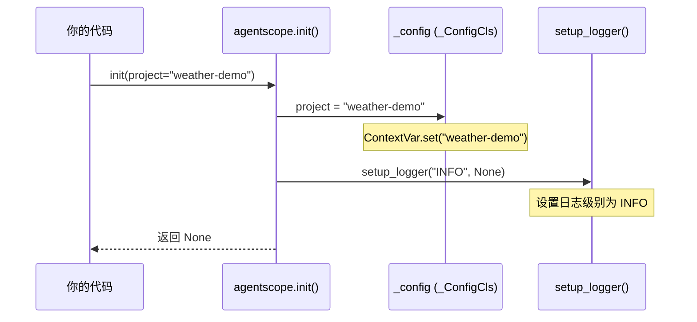

# 第 3 章 准备工具箱

> **卷一每章的结构**：路线图 → 知识补全 → 源码入口 → 逐行阅读 → 调试实践 → 试一试 → 检查点 → 下一站预告

上一章，我们认识了 Agent 的全貌：大模型负责思考，工具负责行动，记忆负责记住上下文，循环把它们串起来。我们也有了贯穿全书的那个天气查询示例：

```python
result = await agent(Msg("user", "北京今天天气怎么样？", "user"))
```

从现在开始，我们要追踪这行代码的完整旅程。但在出发之前，我们需要先把工具箱准备好——理解 `agentscope.init()` 做了什么，以及 `await` 到底是什么意思。

---

## 3.1 路线图

先看一眼我们即将走过的完整路线：

```mermaid
flowchart LR
    A["agentscope.init()"] --> B["Msg 消息诞生"]
    B --> C["Agent 收信"]
    C --> D["工作记忆"]
    D --> E["检索与知识"]
    E --> F["格式转换"]
    F --> G["调用模型"]
    G --> H["执行工具"]
    H --> I["循环与返回"]

    style A fill:#f9f,stroke:#333,stroke-width:3px
    style B fill:#eee,stroke:#999
    style C fill:#eee,stroke:#999
    style D fill:#eee,stroke:#999
    style E fill:#eee,stroke:#999
    style F fill:#eee,stroke:#999
    style G fill:#eee,stroke:#999
    style H fill:#eee,stroke:#999
    style I fill:#eee,stroke:#999
```



高亮的紫色节点就是本章的位置。我们还在"出发前"的阶段，做准备工作的阶段。init() 不在请求的主干路上，但它是所有后续代码运行的前提——没有它，Agent 不会知道自己叫什么、属于哪个项目、日志该写到哪。

---

## 3.2 知识补全：async/await 基础

你在贯穿示例里看到了 `await agent(...)`。这一节就讲清楚 `await` 是什么、为什么要用它。

### 同步代码的问题

假设你要调用一个 LLM API，网络请求需要 2 秒：

```python
# 同步写法
result1 = call_llm("今天天气怎么样？")   # 等 2 秒，什么都不能做
result2 = call_llm("明天天气怎么样？")   # 再等 2 秒
# 总共 4 秒
```

同步代码在等待网络响应时，整个程序"卡住"了，CPU 空闲但什么也不干。

### async/await 的解决方案

```python
# 异步写法
import asyncio

async def main():
    result1 = await call_llm("今天天气怎么样？")
    result2 = await call_llm("明天天气怎么样？")

asyncio.run(main())
```

`await` 的含义很简单：**"我要等这个操作完成，但在等待期间，程序可以去做别的事。"**

打个比方：你在饭店点菜，同步是站在厨房门口等，异步是回到座位上看手机，菜好了服务员叫你。

### 三个关键字

- `async def`：定义一个异步函数（也叫"协程"，coroutine）
- `await`：在异步函数内部，等待一个耗时操作完成
- `asyncio.run()`：启动事件循环（Event Loop），让异步代码真正跑起来

### 你需要记住的

现在你只需要知道：

1. `await agent(...)` 表示"等待 Agent 完成处理"
2. `await` 让程序在等待 IO（网络请求、文件读写）时不闲着
3. 背后的引擎叫"事件循环"——它负责在多个等待中的任务之间来回切换

事件循环的工作原理我们在第 7 章详细讲，那时候你会遇到真正的并发场景（多个 Agent 同时工作）。现在只要记住"await = 等但不闲着"就够了。

---

## 3.3 源码入口

本章要读的核心文件只有两个：

| 文件 | 角色 | 关键位置 |
|------|------|---------|
| `src/agentscope/__init__.py` | 包入口，init() 函数 | 第 72 行 `def init()` |
| `src/agentscope/_run_config.py` | 运行配置类 | 第 6 行 `class _ConfigCls` |

打开你的编辑器，找到这两个文件，我们开始逐行阅读。

---

## 3.4 逐行阅读

### 3.4.1 先看 init() 的调用时机

在贯穿示例中，`agentscope.init()` 是第一个被调用的函数：

```python
import agentscope
# ...
agentscope.init(project="weather-demo")    # <-- 这里
model = OpenAIChatModel(...)
toolkit = Toolkit()
# ...
```

但在 `init()` 被调用之前，`import agentscope` 这一行已经触发了 `__init__.py` 的模块级代码。也就是说，在 `init()` 之前，有些事情已经发生了。

### 3.4.2 模块导入时发生了什么

打开 `src/agentscope/__init__.py`，文件顶部（第 1-41 行）：

```python
# __init__.py 第 5-13 行
import os
import warnings
from contextvars import ContextVar
from datetime import datetime

import requests
import shortuuid

from ._run_config import _ConfigCls
```

导入了几个标准库模块和一个关键类 `_ConfigCls`。注意 `contextvars.ContextVar`——这是本章的重点之一，稍后详解。

接下来（第 22-41 行），在模块级别创建了一个全局配置实例 `_config`：

```python
# __init__.py 第 22-41 行（简化展示）
_config = _ConfigCls(
    run_id=ContextVar("run_id", default=shortuuid.uuid()),
    project=ContextVar("project", default="UnnamedProject_At" + ...),
    name=ContextVar("name", default=...),
    created_at=ContextVar("created_at", default=...),
    trace_enabled=ContextVar("trace_enabled", default=False),
)
```

这段代码在 `import agentscope` 时就执行了。也就是说，即使你还没调用 `init()`，`_config` 已经有了默认值：一个随机的 `run_id`、一个带日期的项目名、一个默认关闭的 `trace_enabled`。

然后（第 43-59 行），导入所有子模块：

```python
# __init__.py 第 43-59 行
from . import exception
from . import module
from . import message
from . import model
from . import tool
from . import formatter
from . import memory
from . import agent
from . import session
from . import embedding
from . import token
from . import evaluate
from . import pipeline
from . import tracing
from . import rag
from . import a2a
from . import realtime
```

这些 `from . import ...` 语句把子模块加载到内存中。你在卷零用过的 `Msg`、`ReActAgent`、`OpenAIChatModel` 等，都在这里被注册。

最后（第 61-69 行），初始化日志和版本号：

```python
# __init__.py 第 61-69 行
from ._logging import logger, setup_logger
from .hooks import _equip_as_studio_hooks
from ._version import __version__

warnings.filterwarnings("once", category=DeprecationWarning)
```

到这里，`import agentscope` 完成。所有模块已加载，`_config` 已创建，日志系统已初始化（`_logging.py` 末尾有一行 `setup_logger("INFO")`，在导入时就会执行）。

### 3.4.3 init() 函数逐行读

现在我们进入主角——`init()` 函数，位于 `__init__.py` 第 72-157 行：

```python
# __init__.py 第 72-80 行
def init(
    project: str | None = None,
    name: str | None = None,
    run_id: str | None = None,
    logging_path: str | None = None,
    logging_level: str = "INFO",
    studio_url: str | None = None,
    tracing_url: str | None = None,
) -> None:
```

7 个参数，全部可选。每个参数的含义：

| 参数 | 默认值 | 用途 |
|------|--------|------|
| `project` | `None` | 项目名称 |
| `name` | `None` | 本次运行的名称 |
| `run_id` | `None` | 运行实例的唯一 ID |
| `logging_path` | `None` | 日志文件保存路径 |
| `logging_level` | `"INFO"` | 日志级别 |
| `studio_url` | `None` | AgentScope Studio 的 URL |
| `tracing_url` | `None` | OpenTelemetry 追踪端点 |

函数体分为三段：

**第一段：更新配置（第 106-113 行）**

```python
# __init__.py 第 106-113 行
if project:
    _config.project = project

if name:
    _config.name = name

if run_id:
    _config.run_id = run_id
```

如果你传了 `project`、`name` 或 `run_id`，就覆盖模块导入时创建的默认值。没有传的保持默认。这就是为什么即使你不调 `init()`，框架也能正常工作——所有配置都有默认值。

**第二段：设置日志（第 115 行）**

```python
# __init__.py 第 115 行
setup_logger(logging_level, logging_path)
```

调用 `_logging.py` 中的 `setup_logger()`。它会清空已有的日志处理器，重新设置日志级别和输出位置（控制台 + 可选的文件）。

**第三段：Studio 和 Tracing（第 117-156 行）**

```python
# __init__.py 第 117-146 行（简化）
if studio_url:
    # 向 Studio 注册本次运行
    response = requests.post(url=f"{studio_url}/trpc/registerRun", json=data)
    response.raise_for_status()
    # 覆盖 UserAgent 的输入方式为 Studio 交互
    # 注册 Studio 相关的 Hook

if tracing_url:
    endpoint = tracing_url
else:
    endpoint = studio_url.strip("/") + "/v1/traces" if studio_url else None

if endpoint:
    setup_tracing(endpoint=endpoint)
    _config.trace_enabled = True
```

这段是可选功能。如果你提供了 `studio_url`，框架会向 Studio 服务器注册本次运行；如果你提供了 `tracing_url`（或者提供了 `studio_url` 但没提供 `tracing_url`），框架会启动 OpenTelemetry 追踪。我们在第一次阅读时可以跳过这段，它不影响核心流程。

### 3.4.4 _ConfigCls：配置的容器

现在打开 `src/agentscope/_run_config.py`，这个文件只有 73 行，全部是一个类：

```python
# _run_config.py 第 6-23 行
class _ConfigCls:
    def __init__(
        self,
        run_id: ContextVar[str],
        project: ContextVar[str],
        name: ContextVar[str],
        created_at: ContextVar[str],
        trace_enabled: ContextVar[bool],
    ) -> None:
        self._run_id = run_id
        self._created_at = created_at
        self._project = project
        self._name = name
        self._trace_enabled = trace_enabled
```

`_ConfigCls` 的构造函数接收 5 个 `ContextVar` 对象，存为实例属性。它不创建 `ContextVar`，而是接收外部传入的 `ContextVar`——这些 `ContextVar` 在 `__init__.py` 第 22-41 行创建，然后传入 `_ConfigCls`。

接下来是 5 组 property（属性），每组都是 get + set。以 `project` 为例：

```python
# _run_config.py 第 45-53 行
@property
def project(self) -> str:
    return self._project.get()

@project.setter
def project(self, value: str) -> None:
    self._project.set(value)
```

读取时调用 `self._project.get()`，设置时调用 `self._project.set(value)`。这不是普通的属性赋值——背后是 `ContextVar` 在工作。

### 3.4.5 ContextVar：上下文隔离的全局变量

`ContextVar` 是 Python 3.7 引入的标准库类，来自 `contextvars` 模块。你可以把它理解为**上下文隔离的全局变量**——每个异步任务（或线程）有自己独立的"视图"。

普通全局变量的问题：

```python
# 假设用普通变量存配置
config_project = "weather-demo"

# 异步任务 A 设置了自己的项目名
config_project = "task-a-project"
# 异步任务 B 读到的也变了！这不对。
```

`ContextVar` 解决了这个问题：

```python
from contextvars import ContextVar

project = ContextVar("project", default="default-project")

# 异步任务 A
project.set("weather-demo")
# 异步任务 B
project.set("other-project")
# 异步任务 A 再读——还是 "weather-demo"，不受任务 B 影响
```

每个异步任务（或线程）有自己独立的一份"视图"。设置和获取互不干扰。在 `asyncio.create_task()` 时，上下文会自动复制。

> **设计一瞥**：为什么用 ContextVar 而非普通全局变量？
>
> AgentScope 支持在同一个进程中运行多个 Agent，甚至可能运行多个不同的应用。如果配置是普通全局变量，一个 Agent 修改 `project` 名会影响所有 Agent。`ContextVar` 让每个异步任务有独立的配置上下文，互不干扰。
>
> 代价：代码稍微复杂一点（`.get()` / `.set()` 而非直接赋值），而且 `ContextVar` 对不熟悉它的开发者来说有学习成本。
>
> 卷四第 34 章会深入讨论这个设计决策的更多细节。

现在你不需要理解 `ContextVar` 的所有细节。只要知道：**`_config` 是全局配置对象，每个属性背后是一个 `ContextVar`，在多线程/异步环境下安全。** 卷四第 34 章会深入讲为什么这样设计。

### 3.4.6 init() 的全流程

用一张图把 `init()` 的流程串起来：



就是这么简单。`init()` 做的事情可以总结为：

1. 如果提供了 `project`/`name`/`run_id`，更新 `_config`
2. 设置日志级别和输出位置
3. 如果提供了 `studio_url`，注册到 Studio
4. 如果提供了 `tracing_url`（或推断出 tracing 端点），启动追踪

如果你只写了 `agentscope.init()` 不传任何参数，它也能正常工作——所有配置都有默认值。

AgentScope 官方文档的 Getting Started > Initialization 页面展示了 `agentscope.init()` 的参数配置方法，包括模型配置、日志级别、追踪设置等。本章解释了 `init()` 内部的四步初始化流程和 `_run_config.py` 的 ContextVar 机制。

AgentScope 1.0 论文对基础模块的设计说明是：

> "we abstract foundational components essential for agentic applications and provide unified interfaces and extensible modules"
>
> — AgentScope 1.0: A Comprehensive Framework for Building Agentic Applications, arXiv:2508.16279, Section 2

四大基础模块（Message、Model、Memory、Tool）的设计目标就是 `agentscope.init()` 所初始化的这些组件。

---

## 3.5 调试实践

在开始动手之前，掌握两个调试技巧。

### 技巧 1：用 print 观察配置

在 `init()` 函数开头加一行 print：

```python
# src/agentscope/__init__.py，第 105 行之后
def init(
    project: str | None = None,
    ...
) -> None:
    # 加这一行
    print(f"[init] project={project}, name={name}, run_id={run_id}")
```

然后运行你的代码，观察输出。这能帮你理解每次调用 `init()` 时传入了什么参数。

### 技巧 2：查看 _config 的当前值

在任何地方，你都可以查看 `_config` 的值：

```python
import agentscope
agentscope.init(project="weather-demo")
print(agentscope._config.project)   # 输出: weather-demo
print(agentscope._config.run_id)    # 输出: 一个随机 ID
print(agentscope._config.name)      # 输出: 时间戳+随机后缀
```

`_config` 以下划线开头，表示它是内部 API，日常使用不需要直接访问。但调试时很有用。

---

## 3.6 试一试

### 实验 1：修改日志级别

打开 `src/agentscope/__init__.py`，找到 `init()` 函数（第 72 行）。`logging_level` 参数的默认值是 `"INFO"`。

写一个简单的测试脚本：

```python
# test_init.py
import agentscope

# 用 DEBUG 级别初始化，你会看到更多日志
agentscope.init(
    project="debug-test",
    logging_level="DEBUG",
)

print(f"项目名: {agentscope._config.project}")
print(f"运行 ID: {agentscope._config.run_id}")
print(f"运行名称: {agentscope._config.name}")
print(f"创建时间: {agentscope._config.created_at}")
print(f"追踪启用: {agentscope._config.trace_enabled}")
```

运行它：

```bash
cd /path/to/agentscope
python test_init.py
```

观察输出。你会看到 `_config` 的各个字段值。如果把 `logging_level` 改成 `"WARNING"`，AgentScope 的内部日志会减少（只显示 WARNING 及以上级别）。

### 实验 2：不调用 init() 会怎样

注释掉 `agentscope.init(...)` 那一行，再运行：

```python
# test_no_init.py
import agentscope

# 不调用 init()，直接访问 _config
print(f"项目名: {agentscope._config.project}")
print(f"运行 ID: {agentscope._config.run_id}")
```

你会发现它依然能正常工作——因为 `_config` 在 `import agentscope` 时就创建了默认值。`init()` 只是让你覆盖这些默认值。

### 实验 3：传入非法日志级别

试试传入一个不合法的 `logging_level`：

```python
import agentscope
agentscope.init(logging_level="VERBOSE")
```

你会看到 `ValueError: Invalid logging level: VERBOSE`。这是 `setup_logger()` 中的校验（`_logging.py` 第 28-32 行）：

```python
# _logging.py 第 28-32 行
if level not in ["INFO", "DEBUG", "WARNING", "ERROR", "CRITICAL"]:
    raise ValueError(
        f"Invalid logging level: {level}. Must be one of "
        f"'INFO', 'DEBUG', 'WARNING', 'ERROR', 'CRITICAL'.",
    )
```

这展示了 AgentScope 的一个设计模式：**在入口处校验参数，尽早暴露错误。**

---

## 3.7 检查点

你现在已经理解了：

- **`agentscope.init()`** 的完整流程：更新配置 → 设置日志 → 可选地连接 Studio/Tracing
- **`_ConfigCls`** 是配置的容器，用 property 封装 `ContextVar` 的读写
- **`ContextVar`** 是上下文隔离的全局变量，让每个异步任务有独立的配置上下文
- **`import agentscope`** 时模块级代码已经执行了：创建 `_config`、导入子模块、初始化日志
- **`init()` 不是必须的**——所有配置都有默认值，`init()` 只是让你覆盖它们

**自检练习：**

1. 如果在 `init()` 之后再次调用 `init(project="another")`，`_config.project` 会变成什么？为什么？
2. `_ConfigCls` 为什么把 `ContextVar` 作为构造函数参数传入，而不是在自己内部创建？

---

## 3.8 下一站预告

工具箱准备好了。现在，我们要追踪的那行代码即将开始执行：

```python
result = await agent(Msg("user", "北京今天天气怎么样？", "user"))
```

第一步是 `Msg("user", "北京今天天气怎么样？", "user")`——一条消息即将诞生。下一章，我们打开 `message/` 目录，看看消息的内部结构。
