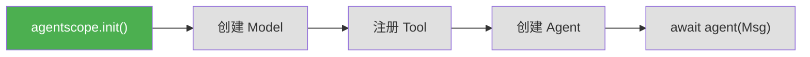

# 第 3 章 准备工具箱

> **追踪线**：我们的请求即将出发。在出发之前，先把"工具箱"准备好。
> 本章你将理解：`agentscope.init()` 做了什么、async/await 是什么、开发环境怎么搭建。

---

## 3.1 路线图

全书追踪的是这行代码的旅程：

```python
result = await agent(Msg("user", "北京今天天气怎么样？", "user"))
```

但在请求出发之前，有很多准备工作要做——初始化框架、配置模型、注册工具。本章先看准备工作：



绿色是我们当前所在的位置——`agentscope.init()`。

> **源码验证日期**: 2026-05-11, commit `f17cfd0a`

---

## 3.2 知识补全：async/await

在天气 Agent 的代码中，最后一行有一个 `await`：

```python
result = await agent(Msg("user", "北京今天天气怎么样？", "user"))
```

`await` 是什么意思？

### 同步 vs 异步

想象你去餐厅点餐：

- **同步**：点完餐后站在柜台前等，直到餐做好才离开。等的过程中什么都干不了
- **异步**：点完餐后拿个号码牌回去坐下，可以做别的事。餐做好了叫号再去取

`await` 的意思是："这个操作需要等待（比如网络请求），在等待期间程序可以去干别的事。当结果回来时，再继续执行。"

### 为什么 AgentScope 用异步？

Agent 内部要做很多等待：调用 LLM API 等响应、执行工具等结果。如果用同步方式，每次等待都阻塞整个程序。用异步方式，一个程序可以同时处理多个 Agent。

### 你需要知道的

读源码时，你会经常看到：

```python
async def reply(self, ...):    # 异步函数定义
    result = await model(...)  # 等待异步操作完成
    return result
```

规则很简单：
- `async def` 定义一个异步函数
- 在异步函数里，用 `await` 等待其他异步操作
- 普通函数不需要 `await`

关于事件循环（async 的底层机制），我们会在第 7 章详细讨论。

---

## 3.3 源码入口

本章涉及两个核心文件：

| 文件 | 内容 |
|------|------|
| `src/agentscope/__init__.py` | `init()` 函数、模块导入、全局配置 |
| `src/agentscope/_run_config.py` | `_ConfigCls` 配置类 |

---

## 3.4 逐行阅读

### `agentscope.init()` —— 框架初始化

当你调用 `agentscope.init(project="weather-demo")` 时，发生了什么？

打开 `src/agentscope/__init__.py`，找到 `init()` 函数：

```python
def init(
    project: str | None = None,
    name: str | None = None,
    run_id: str | None = None,
    logging_path: str | None = None,
    logging_level: str = "INFO",
    studio_url: str | None = None,
    tracing_url: str | None = None,
) -> None:
```

参数说明：

| 参数 | 用途 | 默认值 |
|------|------|--------|
| `project` | 项目名，用于标识和日志 | 自动生成 |
| `name` | 本次运行的名字 | 时间戳 + 随机后缀 |
| `run_id` | 运行实例 ID | 自动生成 UUID |
| `logging_level` | 日志级别 | `"INFO"` |
| `logging_path` | 日志文件路径 | 不写文件 |
| `studio_url` | AgentScope Studio 地址 | 不连接 |
| `tracing_url` | OpenTelemetry 追踪地址 | 不追踪 |

函数体做了三件事：

**1. 设置配置**

```python
if project:
    _config.project = project
if name:
    _config.name = name
if run_id:
    _config.run_id = run_id
```

把参数赋值给全局配置对象 `_config`。

**2. 设置日志**

```python
setup_logger(logging_level, logging_path)
```

配置日志级别和输出位置。日志级别从低到高：`DEBUG` → `INFO` → `WARNING` → `ERROR`。

**3. 连接 Studio 和 Tracing（可选）**

如果提供了 `studio_url` 或 `tracing_url`，会注册运行信息并设置追踪。这是可选功能，基础使用不需要。

### `_config` 全局配置对象

`_config` 在模块加载时就被创建了：

```python
_config = _ConfigCls(
    run_id=ContextVar("run_id", default=shortuuid.uuid()),
    project=ContextVar("project", default="UnnamedProject_At" + ...),
    name=ContextVar("name", default=...),
    created_at=ContextVar("created_at", default=...),
    trace_enabled=ContextVar("trace_enabled", default=False),
)
```

注意每个配置值都包在 `ContextVar` 里。`ContextVar` 是 Python 的上下文变量，它有一个特点：**在多线程和异步环境中，每个线程/协程有自己独立的值**。

这就像你在餐厅的号码牌——每个人拿到不同的号码，互不干扰。

### `_ConfigCls` 的设计

打开 `src/agentscope/_run_config.py`：

```python
class _ConfigCls:
    def __init__(
        self,
        run_id: ContextVar[str],
        project: ContextVar[str],
        name: ContextVar[str],
        created_at: ContextVar[str],
        trace_enabled: ContextVar[bool],
    ) -> None:
        self._run_id = run_id
        self._project = project
        self._name = name
        self._created_at = created_at
        self._trace_enabled = trace_enabled
```

它把 `ContextVar` 包装成属性，外部代码访问 `_config.project` 时，实际调用的是 property：

```python
@property
def project(self) -> str:
    return self._project.get()

@project.setter
def project(self, value: str) -> None:
    self._project.set(value)
```

读取时调用 `.get()`，设置时调用 `.set()`。外部代码不需要知道内部用了 `ContextVar`。

### 模块导入顺序

`__init__.py` 在创建 `_config` 之后，导入了所有子模块：

```python
from . import exception
from . import module
from . import message
from . import model
from . import tool
from . import formatter
from . import memory
from . import agent
from . import session
from . import embedding
from . import token
from . import evaluate
from . import pipeline
from . import tracing
from . import rag
from . import a2a
from . import realtime
```

这就是为什么你可以直接 `from agentscope.agent import ReActAgent` —— `agentscope` 包在初始化时就加载了所有子模块。

---

## 3.5 调试实践

### 开启 DEBUG 日志

最简单的调试方式是把日志级别改成 `DEBUG`：

```python
import agentscope
agentscope.init(logging_level="DEBUG")
```

你会看到框架内部的详细日志，包括模型请求、工具调用、消息流转等。

### 查看配置信息

```python
import agentscope
agentscope.init(project="weather-demo")

# 通过内部配置查看当前状态
from agentscope import _config
print(f"项目: {_config.project}")
print(f"运行ID: {_config.run_id}")
print(f"追踪: {_config.trace_enabled}")
```

---

## 3.6 试一试

### 在 `init()` 中加一行 print

打开 `src/agentscope/__init__.py`，找到 `init()` 函数的开头，加一行：

```python
def init(
    project: str | None = None,
    ...
) -> None:
    print(f"[DEBUG] init() called with project={project}")  # 加这一行
    ...
```

然后运行任何使用 AgentScope 的脚本，你会看到：

```
[DEBUG] init() called with project=weather-demo
```

这证明 `init()` 是整个框架的入口点。

### 观察配置的变化

```python
import agentscope
from agentscope import _config

print(f"初始化前 - 项目: {_config.project}")
agentscope.init(project="weather-demo")
print(f"初始化后 - 项目: {_config.project}")
```

你会看到项目名从默认值变成了你设置的值。

---

## 3.7 检查点

你现在已经理解了：

- **`agentscope.init()`**：框架初始化，设置项目名、日志级别、追踪等
- **`_ConfigCls`**：全局配置类，用 `ContextVar` 保证线程/协程安全
- **模块结构**：`agentscope` 包包含 agent、model、tool、memory 等子模块
- **async/await 基础**：异步函数用 `async def`，等待异步操作用 `await`

**自检练习**：
1. 如果你不调用 `agentscope.init()` 就创建 Agent，会怎样？试试看。
2. `_config` 为什么用 `ContextVar` 而不是普通的全局变量？（提示：想想多线程场景）

---

## 下一站预告

工具箱准备好了。下一章，我们的请求即将出发——一条消息即将诞生。
