# 第 3 站：记忆存入

> `await self.memory.add(msg)` —— 消息进入 Agent 后，第一件事不是思考，而是记住。
> 本章我们拆解工作记忆（Working Memory）的完整生命周期：存入、检索、删除、压缩摘要。
> 你将看到 `InMemoryMemory` 的内部结构 `list[tuple[Msg, list[str]]]`，理解为什么用元组而非字典，以及 mark 标签系统如何让同一段记忆在不同场景下灵活可见或隐藏。

---

## 1. 路线图

我们正在追随 `await agent(msg)` 穿越 AgentScope 框架。上一站 Agent 通过 `__call__()` 收到了消息，现在到达 **"记忆存入"** 站。

```mermaid
flowchart LR
    A["agentscope.init()"] --> B["Msg 创建"]
    B --> C["Agent 收信"]
    C --> D["Memory 存储"]
    D --> E["Formatter 格式化"]
    E --> F["Model 调用"]
    F --> G["Toolkit 执行"]
    G --> H["ReAct 循环"]
    H --> I["返回结果"]

    style A fill:#ddd,stroke:#333
    style B fill:#ddd,stroke:#333
    style C fill:#ddd,stroke:#333
    style D fill:#f9f,stroke:#333,stroke-width:2px
    style E fill:#ddd,stroke:#333
    style F fill:#ddd,stroke:#333
    style G fill:#ddd,stroke:#333
    style H fill:#ddd,stroke:#333
    style I fill:#ddd,stroke:#333
```



**本章聚焦**：上图中高亮的 `Memory 存储` 节点。从 `ReActAgent.reply()` 的第一行 `await self.memory.add(msg)` 开始，深入 `MemoryBase` 抽象类和 `InMemoryMemory` 具体实现。

---

## 2. 源码入口

本章涉及的核心源文件：

| 文件 | 关键内容 | 行号参考 |
|------|----------|----------|
| `src/agentscope/agent/_react_agent.py` | `await self.memory.add(msg)` 存入入口 | :396 |
| `src/agentscope/agent/_react_agent.py` | `_MemoryMark` 枚举定义 | :88-95 |
| `src/agentscope/memory/_working_memory/_base.py` | `class MemoryBase(StateModule)` 基类 | :11 |
| `src/agentscope/memory/_working_memory/_base.py` | `_compressed_summary` 压缩摘要 | :18 |
| `src/agentscope/memory/_working_memory/_base.py` | `add()` 抽象方法 | :32-47 |
| `src/agentscope/memory/_working_memory/_base.py` | `delete()` 抽象方法 | :50-64 |
| `src/agentscope/memory/_working_memory/_base.py` | `get_memory()` 抽象方法 | :105-132 |
| `src/agentscope/memory/_working_memory/_base.py` | `update_messages_mark()` 方法 | :134-168 |
| `src/agentscope/memory/_working_memory/_in_memory_memory.py` | `class InMemoryMemory(MemoryBase)` | :10 |
| `src/agentscope/memory/_working_memory/_in_memory_memory.py` | `self.content` 内部存储 | :17 |
| `src/agentscope/memory/_working_memory/_in_memory_memory.py` | `add()` 实现 | :93-135 |
| `src/agentscope/memory/_working_memory/_in_memory_memory.py` | `get_memory()` 实现 | :22-91 |
| `src/agentscope/memory/_working_memory/_in_memory_memory.py` | `delete()` 实现 | :137-158 |
| `src/agentscope/memory/_working_memory/_in_memory_memory.py` | `state_dict()` / `load_state_dict()` | :273-305 |
| `src/agentscope/module/_state_module.py` | `class StateModule` 序列化基类 | :20 |
| `src/agentscope/module/_state_module.py` | `register_state()` 注册机制 | :108-151 |

---

## 3. 逐行阅读

### 3.1 入口：`reply()` 的第一行

当用户调用 `await agent(msg)` 时，经过 `AgentBase.__call__()` 的包装，最终进入 `ReActAgent.reply()`。这个方法的第一行不是思考，不是调用模型，而是：

```python
# src/agentscope/agent/_react_agent.py:396
await self.memory.add(msg)
```

消息被立即存入记忆。这是 Agent 能"记住"对话历史的根本原因——每条进入 Agent 的消息，都会被保存到 `self.memory` 中。

`self.memory` 在 `__init__()` 中初始化（`:282`）：

```python
# src/agentscope/agent/_react_agent.py:282
self.memory = memory or InMemoryMemory()
```

如果开发者没有传入自定义的 memory 实例，默认使用 `InMemoryMemory`——一个基于 Python 列表的内存存储。

### 3.2 MemoryBase：五个抽象方法 + 两个可选方法

`InMemoryMemory` 的父类是 `MemoryBase`，定义在 `src/agentscope/memory/_working_memory/_base.py:11`：

```python
# src/agentscope/memory/_working_memory/_base.py:11-20
class MemoryBase(StateModule):
    """The base class for memory in agentscope."""

    def __init__(self) -> None:
        super().__init__()
        self._compressed_summary: str = ""
        self.register_state("_compressed_summary")
```

`MemoryBase` 继承自 `StateModule`（我们将在第 5 节讨论），自身只定义了一个属性 `_compressed_summary`，并通过 `register_state()` 注册为可序列化的状态。

它定义了 **5 个抽象方法** 和 **2 个带默认实现的方法**：

**抽象方法（子类必须实现）**：

| 方法 | 行号 | 职责 |
|------|------|------|
| `add(memories, marks)` | :32-47 | 存入消息，附带可选 mark 标签 |
| `delete(msg_ids)` | :50-64 | 按消息 ID 删除 |
| `size()` | :92-98 | 返回记忆中消息数量 |
| `clear()` | :101-102 | 清空所有记忆 |
| `get_memory(mark, exclude_mark, prepend_summary)` | :105-132 | 检索消息，支持 mark 过滤 |

**带默认实现（抛出 `NotImplementedError`）**：

| 方法 | 行号 | 职责 |
|------|------|------|
| `delete_by_mark(mark)` | :66-89 | 按 mark 标签删除消息 |
| `update_messages_mark(new_mark, old_mark, msg_ids)` | :134-168 | 批量更新消息的 mark 标签 |

这两个方法默认抛出 `NotImplementedError`，子类可以选择是否覆写。`InMemoryMemory` 两个都覆写了。

### 3.3 InMemoryMemory 内部结构

`InMemoryMemory` 是最直接的实现，位于 `src/agentscope/memory/_working_memory/_in_memory_memory.py:10`：

```python
# src/agentscope/memory/_working_memory/_in_memory_memory.py:10-20
class InMemoryMemory(MemoryBase):
    """The in-memory implementation of memory storage."""

    def __init__(self) -> None:
        super().__init__()
        # Use a list of tuples to store messages along with their marks
        self.content: list[tuple[Msg, list[str]]] = []
        self.register_state("content")
```

核心数据结构只有一行：

```python
self.content: list[tuple[Msg, list[str]]] = []
```

这是一个**元组列表**。每个元素是 `(Msg, list[str])`——一条消息加上与它关联的 mark 标签列表。

存储示意：

```
content = [
    (Msg(name="user", content="北京今天天气怎么样？", role="user"), []),
    (Msg(name="system", content="检索到以下信息...", role="user"),   ["hint"]),
    (Msg(name="assistant", content="北京今天晴天...", role="assistant"), []),
]
```

消息按存入顺序排列，先入先出。`list` 保证了顺序性。

### 3.4 `add()`：存入消息

```python
# src/agentscope/memory/_working_memory/_in_memory_memory.py:93-135
async def add(
    self,
    memories: Msg | list[Msg] | None,
    marks: str | list[str] | None = None,
    allow_duplicates: bool = False,
    **kwargs: Any,
) -> None:
```

`add()` 的执行逻辑分四步：

**第一步：空值检查**（`:112-113`）

```python
if memories is None:
    return
```

传入 `None` 直接返回，不做任何操作。这是一种防御性编程——调用方不必检查消息是否为空。

**第二步：统一为列表**（`:115-116`）

```python
if isinstance(memories, Msg):
    memories = [memories]
```

无论传入单条 `Msg` 还是列表，统一处理为列表。

**第三步：处理 marks 参数**（`:118-128`）

```python
if marks is None:
    marks = []
elif isinstance(marks, str):
    marks = [marks]
elif not isinstance(marks, list) or not all(
    isinstance(m, str) for m in marks
):
    raise TypeError(...)
```

`marks` 有三种合法输入：`None`（无标签）、单个字符串、字符串列表。全部统一为 `list[str]`。类型不匹配则抛出 `TypeError`。

**第四步：去重 + 追加**（`:130-135`）

```python
if not allow_duplicates:
    existing_ids = {msg.id for msg, _ in self.content}
    memories = [msg for msg in memories if msg.id not in existing_ids]

for msg in memories:
    self.content.append((deepcopy(msg), deepcopy(marks)))
```

默认 `allow_duplicates=False`。`add()` 会根据 `msg.id` 过滤掉已存在的消息。注意 `deepcopy`——存入的是消息的**深拷贝**，后续对原消息的修改不会影响记忆中的版本。

### 3.5 `get_memory()`：检索消息

`get_memory()` 是记忆系统的核心读取接口，位于 `:22-91`：

```python
# src/agentscope/memory/_working_memory/_in_memory_memory.py:22-28
async def get_memory(
    self,
    mark: str | None = None,
    exclude_mark: str | None = None,
    prepend_summary: bool = True,
    **kwargs: Any,
) -> list[Msg]:
```

三个参数控制检索行为：

**参数 1：`mark`**——只返回带有该 mark 的消息。

```python
# :67-71
filtered_content = [
    (msg, marks)
    for msg, marks in self.content
    if mark is None or mark in marks
]
```

`mark is None` 时不过滤，返回全部消息。否则只返回 `marks` 列表中包含该 mark 的消息。

**参数 2：`exclude_mark`**——排除带有该 mark 的消息。

```python
# :74-79
if exclude_mark is not None:
    filtered_content = [
        (msg, marks)
        for msg, marks in filtered_content
        if exclude_mark not in marks
    ]
```

在 `mark` 过滤之后，进一步排除带有 `exclude_mark` 的消息。两个参数可以组合使用。

**参数 3：`prepend_summary`**——在结果前插入压缩摘要。

```python
# :81-89
if prepend_summary and self._compressed_summary:
    return [
        Msg("user", self._compressed_summary, "user"),
        *[msg for msg, _ in filtered_content],
    ]

return [msg for msg, _ in filtered_content]
```

如果存在压缩摘要（`_compressed_summary` 非空），则在检索结果的最前面插入一条包含摘要内容的 `Msg`。这条摘要消息是临时构造的，不会被存回 `content`。

**实际调用场景**：`ReActAgent._reasoning()` 在构造 LLM prompt 时调用 `get_memory()`（`src/agentscope/agent/_react_agent.py:557`）：

```python
# src/agentscope/agent/_react_agent.py:554-562
prompt = await self.formatter.format(
    msgs=[
        Msg("system", self.sys_prompt, "system"),
        *await self.memory.get_memory(
            exclude_mark=_MemoryMark.COMPRESSED
            if self.compression_config
            and self.compression_config.enable
            else None,
        ),
    ],
)
```

当压缩功能启用时，`exclude_mark=_MemoryMark.COMPRESSED` 排除已压缩的消息，因为这些消息的信息已经被摘要概括。

### 3.6 `delete()` 和 `delete_by_mark()`：删除消息

**按 ID 删除**（`:137-158`）：

```python
# src/agentscope/memory/_working_memory/_in_memory_memory.py:137-158
async def delete(self, msg_ids: list[str], **kwargs: Any) -> int:
    initial_size = len(self.content)
    self.content = [
        (msg, marks)
        for msg, marks in self.content
        if msg.id not in msg_ids
    ]
    return initial_size - len(self.content)
```

用列表推导式重建 `content`，过滤掉 ID 匹配的消息。返回实际删除的数量。

**按 mark 删除**（`:160-197`）：

```python
# src/agentscope/memory/_working_memory/_in_memory_memory.py:160-197
async def delete_by_mark(self, mark: str | list[str], **kwargs: Any) -> int:
    if isinstance(mark, str):
        mark = [mark]
    # ...
    initial_size = len(self.content)
    for m in mark:
        self.content = [
            (msg, marks) for msg, marks in self.content if m not in marks
        ]
    return initial_size - len(self.content)
```

遍历每个 mark，逐个过滤。注意：如果传入多个 mark，每轮过滤都会创建新列表——结果是**删除带有任一 mark 的所有消息**。

**使用场景**：`ReActAgent` 在每次推理结束后删除 hint 消息（`src/agentscope/agent/_react_agent.py:566`）：

```python
await self.memory.delete_by_mark(mark=_MemoryMark.HINT)
```

hint 消息是临时性的推理提示（如来自 plan notebook），用完即删。

### 3.7 Mark 系统：`_MemoryMark` 枚举

`ReActAgent` 定义了两个内置 mark（`src/agentscope/agent/_react_agent.py:88-95`）：

```python
# src/agentscope/agent/_react_agent.py:88-95
class _MemoryMark(str, Enum):
    """The memory marks used in the ReAct agent."""

    HINT = "hint"
    """Used to mark the hint messages that will be cleared after use."""

    COMPRESSED = "compressed"
    """Used to mark the compressed messages in the memory."""
```

- **`HINT`**：标记推理提示消息。这些消息仅在当次推理中使用，推理结束后通过 `delete_by_mark()` 删除
- **`COMPRESSED`**：标记已被压缩摘要替代的消息。`get_memory(exclude_mark=COMPRESSED)` 跳过它们

`_MemoryMark` 继承 `str` 和 `Enum`，因此它的值可以直接当字符串使用，同时也支持枚举的比较和遍历。

### 3.8 `update_messages_mark()`：批量修改标签

```python
# src/agentscope/memory/_working_memory/_in_memory_memory.py:212-271
async def update_messages_mark(
    self,
    new_mark: str | None,
    old_mark: str | None = None,
    msg_ids: list[str] | None = None,
) -> int:
```

这是一个通用的 mark 管理方法，支持三种操作：

1. **添加标签**：`new_mark="tag"`，不传 `old_mark` 和 `msg_ids`——给所有消息添加 mark
2. **替换标签**：`new_mark="new"`，`old_mark="old"`——将 "old" 替换为 "new"
3. **移除标签**：`new_mark=None`，`old_mark="tag"`——移除指定 mark

压缩流程使用这个方法标记已压缩的消息（`src/agentscope/agent/_react_agent.py:1121-1123`）：

```python
await self.memory.update_messages_mark(
    msg_ids=[_.id for _ in to_compressed_msgs],
    new_mark=_MemoryMark.COMPRESSED,
)
```

### 3.9 压缩摘要机制

当对话历史过长时，AgentScope 支持自动压缩记忆。压缩流程在 `src/agentscope/agent/_react_agent.py:1015-1138`。

**触发条件**（`:1017-1053`）：

1. `compression_config` 存在且已启用
2. 获取所有未标记 `COMPRESSED` 的消息
3. 保留最近 N 条消息（`keep_recent`）不压缩
4. 计算剩余消息的 token 数，超过 `trigger_threshold` 才触发压缩

**压缩过程**（`:1055-1130`）：

1. 用 Formatter 格式化待压缩消息 + 系统提示 + 压缩指令
2. 调用 LLM 生成结构化摘要
3. 调用 `update_compressed_summary()` 保存摘要到 `_compressed_summary`
4. 调用 `update_messages_mark()` 将已压缩的消息标记为 `COMPRESSED`

**效果**：后续 `get_memory(exclude_mark=COMPRESSED)` 跳过已压缩消息，但在结果前面插入摘要。Agent 看到的是 `[摘要] + [最近的未压缩消息]`，而非全部历史。

---

## 4. 设计一瞥

### 为什么记忆用 `list[tuple[Msg, list[str]]]` 而不是 `dict`？

最直觉的设计可能是用字典：

```python
# 假设方案 A：dict[msg_id] = Msg
self.memory: dict[str, Msg] = {}

# 假设方案 B：每条消息带 marks 字典
self.memory: dict[str, tuple[Msg, list[str]]] = {}
```

但 AgentScope 选择了列表。原因是：

**1. 顺序是第一需求**

对话历史有严格的时序关系——第 1 条用户消息、第 2 条助手回复、第 3 条工具结果……LLM 的 prompt 必须保持这个顺序。`list` 天然保序，`dict`（在 Python 3.7 前）不保序。即使 Python 3.7+ 的 `dict` 保持插入顺序，语义上 `dict` 仍然暗示"通过 key 查找"，而非"按序遍历"。

**2. 一条消息可以有多个 mark**

如果用 `dict[str, Msg]`，mark 信息无处存放。额外的 `dict[str, list[str]]` 又需要维护两套数据的一致性。元组把消息和 mark 绑在一起，天然原子性。

**3. 查找模式是遍历而非随机访问**

记忆的核心操作是 `get_memory()`——遍历所有消息，按 mark 过滤。没有"通过 ID 获取单条消息"的频繁需求。`list` 的遍历性能足够，且比 `dict` 更节省内存。

**4. 允许（可选的）重复**

`add()` 的 `allow_duplicates=False` 只是默认行为。如果设为 `True`，同一 `msg.id` 可以出现多次。这在某些场景下有意义（如 Agent 在不同轮次中重复引用同一条工具结果）。`list` 支持重复，`dict` 不支持。

---

## 5. 补充知识

### StateModule：PyTorch 风格的序列化基类

`MemoryBase` 的父类不是 `object`，而是 `StateModule`（`src/agentscope/module/_state_module.py:20`）。这个类提供了类似 PyTorch `nn.Module` 的 `state_dict()` / `load_state_dict()` 序列化机制。

**核心设计**：

```python
# src/agentscope/module/_state_module.py:20-27
class StateModule:
    def __init__(self) -> None:
        self._module_dict = OrderedDict()      # 嵌套的 StateModule 子模块
        self._attribute_dict = OrderedDict()    # 需要序列化的普通属性
```

两个有序字典分别追踪两类状态：

- `_module_dict`：值为 `StateModule` 实例的属性（嵌套子模块）
- `_attribute_dict`：通过 `register_state()` 注册的普通属性

**自动子模块追踪**（`:29-39`）：

```python
def __setattr__(self, key: str, value: Any) -> None:
    if isinstance(value, StateModule):
        if not hasattr(self, "_module_dict"):
            raise AttributeError(...)
        self._module_dict[key] = value
    super().__setattr__(key, value)
```

当你写 `self.memory = InMemoryMemory()` 时，`__setattr__` 自动将 `memory` 加入 `_module_dict`。这意味着 Agent 的 `state_dict()` 会递归序列化其 memory 模块。

**`register_state()`**（`:108-151`）：手动注册需要序列化的属性。

```python
# MemoryBase 中：
self.register_state("_compressed_summary")

# InMemoryMemory 中：
self.register_state("content")
```

注册时可以提供自定义的 `to_json` / `from_json` 函数，用于处理不可直接 JSON 序列化的类型。如果不提供，`register_state()` 会用 `json.dumps()` 测试属性是否可序列化。

**`state_dict()` 的调用链**：

```python
# Agent.state_dict()
→ 遍历 _module_dict，发现 "memory" 是 StateModule
→ 调用 memory.state_dict()
    → InMemoryMemory.state_dict() (覆写版本)
    → 遍历 self.content，将每条 Msg 调用 msg.to_dict()
    → 加上 super().state_dict()（即 _compressed_summary）
```

**`load_state_dict()` 反向操作**（`:280-305`）：

```python
# src/agentscope/memory/_working_memory/_in_memory_memory.py:280-305
def load_state_dict(self, state_dict: dict, strict: bool = True) -> None:
    if strict and "content" not in state_dict:
        raise KeyError(...)
    self._compressed_summary = state_dict.get("_compressed_summary", "")
    self.content = []
    for item in state_dict.get("content", []):
        if isinstance(item, (tuple, list)) and len(item) == 2:
            msg_dict, marks = item
            msg = Msg.from_dict(msg_dict)
            self.content.append((msg, marks))
        elif isinstance(item, dict):
            # 兼容旧版本格式
            msg = Msg.from_dict(item)
            self.content.append((msg, []))
```

注意 `elif isinstance(item, dict)` 分支——这是向后兼容的代码，处理旧版本没有 marks 的序列化格式。这种兼容性处理在实际框架中很常见。

---

## 6. 调试实践

### 6.1 打印记忆内容

```python
import agentscope
from agentscope.agents import ReActAgent
from agentscope.message import Msg

# 初始化（省略模型配置）
agentscope.init()

agent = ReActAgent(name="assistant", sys_prompt="你是一个助手", model_config_name="default")

# 存入一条消息
msg = Msg("user", "北京今天天气怎么样？", "user")
await agent.memory.add(msg)

# 查看内部存储
for i, (m, marks) in enumerate(agent.memory.content):
    print(f"[{i}] {m.name}: {m.content} | marks: {marks}")

# 输出:
# [0] user: 北京今天天气怎么样？ | marks: []
```

### 6.2 测试 mark 过滤

```python
from agentscope.memory import InMemoryMemory
from agentscope.message import Msg

mem = InMemoryMemory()

# 存入带 mark 的消息
await mem.add(Msg("system", "推理提示", "user"), marks="hint")
await mem.add(Msg("user", "用户问题", "user"))
await mem.add(Msg("assistant", "助手回答", "assistant"), marks="compressed")

# 全部获取
all_msgs = await mem.get_memory()
print(f"全部: {len(all_msgs)} 条")  # 3

# 排除 compressed
uncompressed = await mem.get_memory(exclude_mark="compressed")
print(f"未压缩: {len(uncompressed)} 条")  # 2

# 只获取 hint
hints = await mem.get_memory(mark="hint")
print(f"提示: {len(hints)} 条")  # 1
```

### 6.3 检查压缩摘要

```python
# 手动设置压缩摘要
await mem.update_compressed_summary("之前讨论了天气和交通话题。")

# 检查 prepend_summary 的效果
msgs = await mem.get_memory(exclude_mark="compressed")
print(msgs[0].content)  # "之前讨论了天气和交通话题。" (摘要在前)

# 关闭 prepend_summary
raw_msgs = await mem.get_memory(exclude_mark="compressed", prepend_summary=False)
print(len(raw_msgs))  # 不含摘要消息
```

### 6.4 序列化与反序列化

```python
# 保存状态
state = mem.state_dict()
print(state.keys())  # dict_keys(['_compressed_summary', 'content'])

# 恢复状态
mem2 = InMemoryMemory()
mem2.load_state_dict(state)
print(await mem2.size())  # 与 mem 相同
```

### 6.5 断点位置速查

| 断点目的 | 文件 | 行号 | 说明 |
|----------|------|------|------|
| 消息存入入口 | `_react_agent.py` | :396 | `await self.memory.add(msg)` |
| add 内部 | `_in_memory_memory.py` | :93 | 进入 `add()` 方法 |
| 深拷贝处 | `_in_memory_memory.py` | :135 | `deepcopy(msg)` |
| get_memory 过滤 | `_in_memory_memory.py` | :67 | mark 过滤列表推导 |
| 压缩摘要拼装 | `_in_memory_memory.py` | :81-89 | prepend_summary 逻辑 |
| delete_by_mark | `_in_memory_memory.py` | :192 | 按 mark 删除循环 |
| state_dict 序列化 | `_in_memory_memory.py` | :273 | 查看序列化结构 |
| 压缩触发判断 | `_react_agent.py` | :1066 | token 阈值比较 |
| 压缩摘要写入 | `_react_agent.py` | :1114 | `update_compressed_summary` |

---

## 7. 检查点

读完本章，你应该理解了以下内容：

- **记忆是 Agent 的第一反应**：`reply()` 的第一行就是 `await self.memory.add(msg)`，消息到达后立即存入
- **MemoryBase 定义 5 个抽象方法**：`add`、`delete`、`size`、`clear`、`get_memory`，构成所有记忆后端的统一接口
- **InMemoryMemory 用 `list[tuple[Msg, list[str]]]` 存储**：元组把消息和 mark 标签绑定在一起，列表保证时序
- **mark 系统支持灵活过滤**：`get_memory(mark=...)` 包含、`get_memory(exclude_mark=...)` 排除，支持组合使用
- **压缩摘要机制**：旧消息被 LLM 压缩为摘要，标记为 `COMPRESSED` 后被检索跳过，摘要拼接到结果前面
- **deepcopy 保证隔离**：存入的是消息深拷贝，记忆中的版本不受外部修改影响
- **StateModule 提供序列化**：`state_dict()` / `load_state_dict()` 支持 PyTorch 风格的检查点保存与恢复
- **其他后端遵循相同接口**：Redis、SQLAlchemy、Tablestore 都继承 `MemoryBase`，接口一致

### 练习

1. **追踪消息存入**：在 `src/agentscope/memory/_working_memory/_in_memory_memory.py:135` 设置断点，运行一次 Agent 调用，观察 `deepcopy` 前后 `msg` 对象的 `id` 是否改变。尝试在存入后修改原 `msg` 的 `content`，确认记忆中的版本未变。

2. **实验 mark 过滤**：创建一个 `InMemoryMemory`，存入 5 条消息，分别标记不同的 mark（如 `"hint"`、`"compressed"`、无标记）。调用 `get_memory()` 的不同参数组合，验证过滤结果。然后调用 `delete_by_mark("hint")`，检查剩余消息。

3. **理解压缩流程**：阅读 `src/agentscope/agent/_react_agent.py:1015-1138`，画出压缩流程的决策树：什么时候跳过压缩？什么时候保留最近 N 条？压缩后 `_compressed_summary` 和 `COMPRESSED` 标记各自的作用是什么？

---

## 8. 下一站预告

消息已存入记忆。接下来 ReActAgent 需要把记忆中的消息格式化为模型能理解的格式——这是 Formatter 的工作。从 `list[Msg]` 到模型 API 的 prompt 数组，中间经历了怎样的转换？下一站我们将进入 Formatter 模块，揭开消息格式化的内部逻辑。
