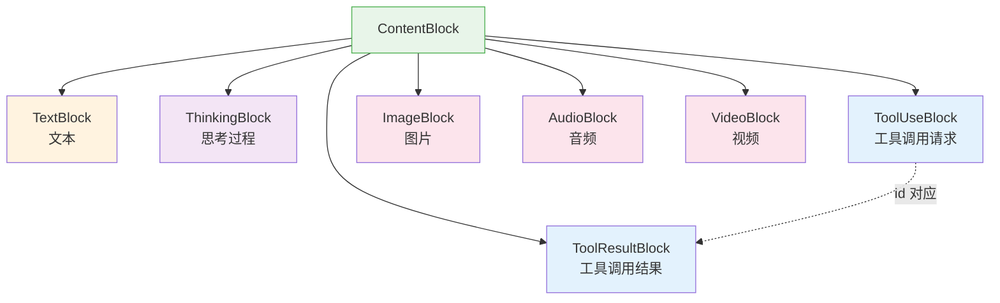

# 第 4 章 第 1 站：消息诞生

> **追踪线**：`await agent(Msg("user", "北京今天天气怎么样？", "user"))` —— 我们的请求从这条消息开始。
> 本章你将理解：`Msg` 的内部结构、7 种 `ContentBlock`、TypedDict 是什么。

---

## 4.1 路线图

```mermaid
graph LR
    Init["agentscope.init()"] --> Msg["Msg 诞生"]
    Msg --> Agent["Agent 收信"]
    Agent --> Memory["工作记忆"]
    Memory --> Retrieve["检索知识"]
    Retrieve --> Format["格式转换"]
    Format --> Model["请求模型"]
    Model --> Tool["执行工具"]
    Tool --> Loop["循环/返回"]

    style Init fill:#e0e0e0
    style Msg fill:#4caf50,color:white
    style Agent fill:#e0e0e0
    style Memory fill:#e0e0e0
    style Retrieve fill:#e0e0e0
    style Format fill:#e0e0e0
    style Model fill:#e0e0e0
    style Tool fill:#e0e0e0
    style Loop fill:#e0e0e0
```



绿色是当前位置——消息（`Msg`）即将诞生。

> **源码验证日期**: 2026-05-11, commit `f17cfd0a`

---

## 4.2 知识补全：TypedDict

在读 `Msg` 的源码之前，你需要了解 `TypedDict`——Python 的一个类型工具。

### 普通字典的问题

Python 的字典很灵活，但太灵活了：

```python
# 这两个都是合法的 dict，但结构完全不同
{"name": "Alice", "age": 30}
{"city": "北京", "weather": "晴天"}
```

当代码需要处理固定结构的字典时，普通 dict 没有约束力——你不知道里面应该有哪些键、值是什么类型。

### TypedDict 的解法

`TypedDict` 给字典加上了类型约束：

```python
from typing_extensions import TypedDict
from typing import Required

class TextBlock(TypedDict, total=False):
    type: Required[Literal["text"]]   # 必须有 type 键，值必须是 "text"
    text: str                          # 可选的 text 键，值必须是 str
```

它的好处：

1. **IDE 自动补全**：编辑器知道有哪些键
2. **类型检查**：mypy 等工具可以检查键名和类型是否正确
3. **文档作用**：看定义就知道字典应该长什么样
4. **运行时仍是 dict**：TypedDict 不创建新类，它只是类型标注

`total=False` 表示"不是所有键都是必需的"，用 `Required` 标记必需的键。这样既灵活又安全。

AgentScope 的 `ContentBlock` 系列都用 TypedDict 定义，而不是 dataclass 或普通类——因为它们需要和 JSON 数据直接互转，TypedDict 天然就是字典，不需要额外的序列化/反序列化。

---

## 4.3 源码入口

| 文件 | 内容 |
|------|------|
| `src/agentscope/message/_message_base.py` | `Msg` 类 |
| `src/agentscope/message/_message_block.py` | 7 种 `ContentBlock` TypedDict |
| `src/agentscope/_utils/_mixin.py` | `DictMixin`（旧版 Msg 曾使用） |

---

## 4.4 逐行阅读

### Msg 的创建

一切从这行代码开始：

```python
Msg("user", "北京今天天气怎么样？", "user")
```

打开 `src/agentscope/message/_message_base.py`，看 `Msg.__init__`：

```python
class Msg:
    def __init__(
        self,
        name: str,
        content: str | Sequence[ContentBlock],
        role: Literal["user", "assistant", "system"],
        metadata: dict[str, JSONSerializableObject] | None = None,
        timestamp: str | None = None,
        invocation_id: str | None = None,
    ) -> None:
```

6 个参数，3 个必需、3 个可选：

| 参数 | 类型 | 含义 |
|------|------|------|
| `name` | `str` | 发送者名字 |
| `content` | `str` 或 `Sequence[ContentBlock]` | 消息内容 |
| `role` | `"user"` / `"assistant"` / `"system"` | 角色 |
| `metadata` | `dict` 或 `None` | 附加元数据 |
| `timestamp` | `str` 或 `None` | 创建时间 |
| `invocation_id` | `str` 或 `None` | API 调用 ID |

构造函数做了几件事：

**1. 保存基本属性**

```python
self.name = name
self.content = content
self.role = role
```

`content` 有两种形态：
- 字符串：纯文本消息，如 `"北京今天天气怎么样？"`
- `ContentBlock` 列表：包含多种类型的内容块（文本、图片、工具调用等）

**2. 初始化元数据**

```python
self.metadata = metadata or {}
```

`metadata` 是一个字典，用于存储额外信息。比如模型返回的结构化输出可以存在这里。

**3. 自动生成 ID 和时间戳**

```python
self.id = shortuuid.uuid()
self.timestamp = timestamp or datetime.now().strftime("%Y-%m-%d %H:%M:%S.%f")[:-3]
```

每条消息都有唯一的 `id` 和时间戳。`shortuuid` 生成短随机 ID，比标准 UUID 更紧凑。

### Msg 的 5 个核心属性

创建完成后，`Msg` 对象有 5 个主要属性：

```python
msg = Msg("user", "北京今天天气怎么样？", "user")

msg.name        # "user" —— 发送者名字
msg.content     # "北京今天天气怎么样？" —— 消息内容
msg.role        # "user" —— 角色
msg.id          # "abc123xyz" —— 自动生成的唯一 ID
msg.timestamp   # "2026-05-11 10:30:45.123" —— 创建时间
```

### content 的两种形态

`content` 是 `Msg` 最有趣的属性——它有两种形态：

**形态 1：字符串（简单文本）**

```python
msg = Msg("user", "你好", "user")
print(msg.content)       # "你好"（字符串）
```

**形态 2：ContentBlock 列表（复杂内容）**

```python
from agentscope.message._message_block import TextBlock, ToolUseBlock

msg = Msg("assistant", [
    TextBlock(type="text", text="让我查一下天气"),
    ToolUseBlock(type="tool_use", id="call_123", name="get_weather", input={"city": "北京"}),
], "assistant")
print(msg.content)  # [TextBlock(...), ToolUseBlock(...)]
```

框架提供了 `get_content_blocks()` 方法统一处理这两种形态：

```python
# 无论 content 是字符串还是列表，都能获取内容块
blocks = msg.get_content_blocks()  # 始终返回列表

# 按类型筛选
text_blocks = msg.get_content_blocks("text")
tool_blocks = msg.get_content_blocks("tool_use")
```

如果 `content` 是字符串，`get_content_blocks()` 会自动把它包装成一个 `TextBlock`：

```python
# 字符串 → 自动转为 TextBlock
blocks = msg.get_content_blocks()
# 等价于 [TextBlock(type="text", text="你好")]
```

这是一个贴心的设计——调用方不需要关心内容是字符串还是列表，统一用 `get_content_blocks()` 就行。

### 7 种 ContentBlock

打开 `src/agentscope/message/_message_block.py`，可以看到 7 种内容块，全部用 `TypedDict` 定义：



每种块都有一个 `type` 字段标识类型：

| 类型 | TypedDict | 关键字段 | 用途 |
|------|-----------|---------|------|
| `"text"` | `TextBlock` | `text` | 普通文本 |
| `"thinking"` | `ThinkingBlock` | `thinking` | 模型的思考过程 |
| `"tool_use"` | `ToolUseBlock` | `id`, `name`, `input` | 请求调用工具 |
| `"tool_result"` | `ToolResultBlock` | `id`, `output`, `name` | 工具执行结果 |
| `"image"` | `ImageBlock` | `source` | 图片内容 |
| `"audio"` | `AudioBlock` | `source` | 音频内容 |
| `"video"` | `VideoBlock` | `source` | 视频内容 |

**ToolUseBlock 和 ToolResultBlock 通过 `id` 配对**：当模型请求调用工具时，产生一个 `ToolUseBlock`（带有 `id`）；工具执行完毕后，产生一个 `ToolResultBlock`（用相同的 `id` 关联）。

### 图片/音频/视频的 source

`ImageBlock`、`AudioBlock`、`VideoBlock` 的 `source` 字段有两种形式：

```python
# 方式 1：URL 引用
ImageBlock(type="image", source=URLSource(type="url", url="https://example.com/img.png"))

# 方式 2：Base64 编码
ImageBlock(type="image", source=Base64Source(type="base64", media_type="image/png", data="iVBORw0KGgo..."))
```

`URLSource` 和 `Base64Source` 也是 TypedDict，分别支持通过 URL 引用和直接嵌入数据。

### Msg 的序列化与反序列化

`Msg` 提供了 `to_dict()` 和 `from_dict()` 用于 JSON 互转：

```python
# 序列化
msg = Msg("user", "你好", "user")
d = msg.to_dict()
# {"id": "abc123", "name": "user", "content": "你好", "role": "user", ...}

# 反序列化
msg2 = Msg.from_dict(d)
```

这在保存对话历史、跨进程传输消息时很有用。

---

## 4.5 调试实践

### 打印 Msg 的完整结构

```python
from agentscope.message import Msg

msg = Msg("user", "北京今天天气怎么样？", "user")
print(repr(msg))
# Msg(id='abc123', name='user', content='北京今天天气怎么样？',
#     role='user', metadata={}, timestamp='2026-05-11 10:30:45.123')
```

`repr()` 方法输出所有属性的值。

### 查看 content 的块结构

```python
from agentscope.message import Msg

# 创建一个包含多种内容的消息
msg = Msg("assistant", "我查到了天气信息", "assistant")

# 查看内容块
blocks = msg.get_content_blocks()
for block in blocks:
    print(f"类型: {block['type']}, 内容: {block}")
```

---

## 4.6 试一试

### 创建一个包含多种 ContentBlock 的 Msg

在项目根目录运行：

```python
from agentscope.message._message_block import (
    TextBlock, ToolUseBlock, ToolResultBlock
)
from agentscope.message import Msg

# 模拟 Agent 调用天气工具的过程
# 1. 用户消息
user_msg = Msg("user", "北京天气怎么样？", "user")
print("用户消息:", user_msg.content)

# 2. Agent 的思考 + 工具调用请求
agent_msg = Msg("assistant", [
    TextBlock(type="text", text="让我查一下"),
    ToolUseBlock(type="tool_use", id="call_001", name="get_weather", input={"city": "北京"}),
], "assistant")
print("\nAgent 消息:")
for block in agent_msg.get_content_blocks():
    print(f"  [{block['type']}] {block}")

# 3. 工具执行结果
tool_msg = Msg("assistant", [
    ToolResultBlock(type="tool_result", id="call_001", output="晴天，25°C", name="get_weather"),
], "assistant")
print("\n工具结果:")
for block in tool_msg.get_content_blocks():
    print(f"  [{block['type']}] {block}")
```

### 在 Msg.__init__ 中加 print

打开 `src/agentscope/message/_message_base.py`，在 `__init__` 方法末尾加一行：

```python
def __init__(self, ...):
    ...
    self.invocation_id = invocation_id
    print(f"[MSG] 创建消息: name={self.name}, role={self.role}, content={repr(self.content)[:50]}")  # 加这一行
```

运行任何创建 `Msg` 的代码，你会看到每条消息被创建时的信息。

---

## 4.7 检查点

你现在已经理解了：

- **`Msg` 的 5 个属性**：`name`, `content`, `role`, `id`, `timestamp`
- **`content` 的两种形态**：字符串或 `ContentBlock` 列表
- **7 种 `ContentBlock`**：Text, Thinking, ToolUse, ToolResult, Image, Audio, Video
- **TypedDict**：给字典加类型约束，保持 dict 的灵活性
- **`get_content_blocks()`**：统一处理两种 content 形态

**自检练习**：
1. `ToolUseBlock` 和 `ToolResultBlock` 怎么关联？（提示：看 `id` 字段）
2. 为什么 `ContentBlock` 用 TypedDict 而不是 dataclass？（提示：想想 JSON 序列化）

---

## 下一站预告

消息已经诞生，它正等待被 Agent 接收。下一章，我们跟随消息走进 Agent 的大门。
