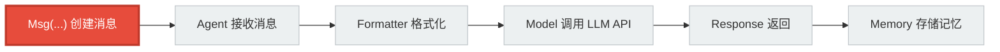
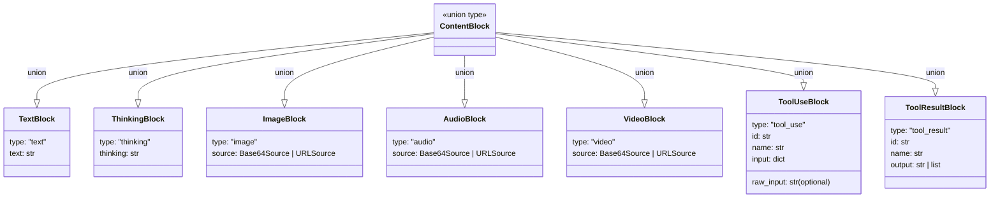

# 第 4 章 第 1 站：消息诞生

> 万物皆有起点。在 AgentScope 的世界里，一切从一条消息开始。

---

## 4.1 路线图

全书的旅程追踪一行代码的执行过程：

```python
result = await agent(Msg("user", "北京今天天气怎么样？", "user"))
```

这行代码做了两件事：先创建一条消息（Msg），再把消息交给 Agent 处理。本章聚焦第一件事——消息是怎么诞生的。



红色高亮处就是我们当前所在的位置。看起来简单的一行 `Msg(...)`，内部做了哪些事？它创建的对象长什么样？为什么是这样设计的？

答案藏在三个源文件里：

| 文件 | 职责 |
|------|------|
| `src/agentscope/message/_message_base.py` | Msg 类定义 |
| `src/agentscope/message/_message_block.py` | 7 种 ContentBlock |
| `src/agentscope/_utils/_mixin.py` | DictMixin，让对象像 dict 一样访问 |

接下来，我们先补充一个前置知识，再逐行阅读源码。

---

## 4.2 知识补全：TypedDict

AgentScope 的 ContentBlock 使用了 Python 的 `TypedDict`。在阅读源码前，先理解它是什么、为什么不选其他方案。

### 4.2.1 什么是 TypedDict

Python 的普通 dict 可以装任何东西，类型检查器无法知道里面有哪些 key、每个 key 的值是什么类型。`TypedDict` 解决这个问题：

```python
from typing_extensions import TypedDict

class UserInfo(TypedDict):
    name: str
    age: int

# 类型检查器知道 user["name"] 是 str，user["age"] 是 int
user: UserInfo = {"name": "Alice", "age": 30}
```

TypedDict 的本质是：**一个有类型标注的 dict**。运行时它就是一个普通的 dict，没有任何额外方法或属性。类型标注只在静态分析和 IDE 提示时生效。

### 4.2.2 为什么不用普通 dict

普通 dict 缺少类型约束。在多 Agent 系统中，消息会被序列化为 JSON、在模型 API 之间传递、存入 Memory 再读出来。如果 content block 的结构不确定，调试时很难定位问题。TypedDict 给 dict 加上了"契约"——每个 block 必须有哪些字段、字段是什么类型，一目了然。

### 4.2.3 为什么不用 dataclass

这是关键问题。Python 的 `dataclass` 也能定义结构化的数据容器：

```python
from dataclasses import dataclass

@dataclass
class TextBlock:
    type: str
    text: str
```

但 dataclass 创建的实例不是 dict。OpenAI、Anthropic 等 LLM API 期望的请求体是 JSON dict。如果用 dataclass，每次与 API 交互都要做一次转换（`dataclasses.asdict()` 或手动 `.to_dict()`）。TypedDict 天然就是 dict，**与 JSON 零距离**：

```python
import json

block = TextBlock(type="text", text="你好")  # 这就是一个 dict
json.dumps(block)  # 直接序列化，无需转换
```

这在 AgentScope 的设计中非常重要：消息需要频繁地在 Model Adapter 和 LLM API 之间传递，少一层转换就少一层出错的可能。

### 4.2.4 total=False 是什么意思

你会看到 ContentBlock 的定义中有 `total=False`：

```python
class TextBlock(TypedDict, total=False):
    type: Required[Literal["text"]]
    text: str
```

`total=False` 表示"不是所有字段都必须存在"。默认 `total=True`，即所有字段都是必填的。设为 `False` 后，只有标记了 `Required[...]` 的字段才是必填的，其余字段可选。这给 ContentBlock 提供了灵活性——比如 `ToolUseBlock` 的 `raw_input` 字段只在特定场景下才有值。

---

## 4.3 源码入口

消息的创建入口就是 `Msg` 类。它定义在 `_message_base.py` 的第 21 行：

```python
# src/agentscope/message/_message_base.py:21

class Msg:
    """The message class in agentscope."""
```

看这个类定义，你会注意到一个事实：**Msg 没有继承任何类**。它就是最朴素的 Python class。比起框架中常见的"所有东西都继承自某个 Base"的设计，这里的选择很明确——Msg 是一个数据容器，不需要继承体系来赋予行为。

Msg 的构造函数从第 24 行开始：

```python
# src/agentscope/message/_message_base.py:24

def __init__(
    self,
    name: str,
    content: str | Sequence[ContentBlock],
    role: Literal["user", "assistant", "system"],
    metadata: dict[str, JSONSerializableObject] | None = None,
    timestamp: str | None = None,
    invocation_id: str | None = None,
) -> None:
```

6 个参数，其中 3 个必填、3 个可选。接下来我们逐行阅读构造函数内部。

---

## 4.4 逐行阅读

### 4.4.1 Msg 的五个核心属性

当你在代码中写下 `Msg("user", "北京今天天气怎么样？", "user")` 时，`__init__` 方法依次执行以下操作：

```python
# src/agentscope/message/_message_base.py:52-73

self.name = name                                          # 第 52 行
assert isinstance(content, (list, str))                   # 第 54 行
self.content = content                                    # 第 59 行
assert role in ["user", "assistant", "system"]            # 第 61 行
self.role = role                                          # 第 62 行
self.metadata = metadata or {}                            # 第 64 行
self.id = shortuuid.uuid()                                # 第 66 行
self.timestamp = (                                        # 第 67 行
    timestamp
    or datetime.now().strftime("%Y-%m-%d %H:%M:%S.%f")[:-3]
)
self.invocation_id = invocation_id                        # 第 73 行
```

五个核心属性的含义：

| 属性 | 类型 | 示例 | 说明 |
|------|------|------|------|
| `name` | `str` | `"user"` | 发送者名称，在多 Agent 场景中区分是谁发的 |
| `content` | `str \| list[ContentBlock]` | `"北京今天天气怎么样？"` | 消息内容，两种形态（见 4.4.2） |
| `role` | `Literal["user", "assistant", "system"]` | `"user"` | 角色，对应 LLM API 的角色概念 |
| `metadata` | `dict` | `{}` | 附加元数据，如结构化输出 |
| `timestamp` | `str` | `"2026-05-10 14:30:00.123"` | 创建时间，精确到毫秒 |

此外还有两个自动生成的属性：

- **`id`**：通过 `shortuuid.uuid()` 生成，是一个短唯一标识符（Short UUID）。shortuuid 用的是 Base57 编码（去掉了容易混淆的字符如 `0/O`、`1/l`），比标准 UUID 更短、更适合日志和调试。
- **`invocation_id`**：关联的 API 调用 ID，用于追踪消息在哪次模型调用中产生。

注意构造函数中的两处 `assert`。这是"快速失败"的设计思路——如果传入的 `content` 不是 str 也不是 list，或者 `role` 不是三种合法值之一，程序会立刻报错，而不是在后续处理中产生难以追踪的异常。

### 4.4.2 content 的两种形态

`content` 是 Msg 最有设计感的属性。它有两种形态：

**形态一：纯字符串**

```python
msg = Msg("user", "你好", "user")
print(type(msg.content))  # <class 'str'>
```

这是最常见的形态。一条简单的文本消息，content 就是一个字符串。

**形态二：ContentBlock 列表**

```python
msg = Msg("user", [
    TextBlock(type="text", text="这张图片里有什么？"),
    ImageBlock(type="image", source=URLSource(type="url", url="https://example.com/photo.jpg")),
], "user")
print(type(msg.content))  # <class 'list'>
```

当消息包含多种内容（文本 + 图片、文本 + 工具调用等），content 就是一个 ContentBlock 列表。

为什么允许两种形态？这是**便捷性与灵活性的平衡**。90% 的消息都是纯文本，用字符串最简单。但 LLM 的能力越来越丰富——多模态、工具调用、思维链——这些场景需要结构化的内容块。

Msg 提供了一个桥梁方法 `get_content_blocks()`，在需要时自动把字符串转换为 TextBlock 列表：

```python
# src/agentscope/message/_message_base.py:216-219

if isinstance(self.content, str):
    blocks.append(TextBlock(type="text", text=self.content))
else:
    blocks = self.content or []
```

这意味着你可以始终用 `msg.get_content_blocks()` 获取列表形式的内容，不用自己判断 content 的类型。

### 4.4.3 七种 ContentBlock

打开 `_message_block.py`，你会看到 7 种 ContentBlock，每一种都是 TypedDict：



源文件中的定义（`_message_block.py` 第 9-118 行）：

**TextBlock**（第 9 行）——纯文本

```python
class TextBlock(TypedDict, total=False):
    type: Required[Literal["text"]]
    text: str
```

最基础的 block。一条纯文本消息 `"你好"` 等价于 `[TextBlock(type="text", text="你好")]`。

**ThinkingBlock**（第 18 行）——思维链

```python
class ThinkingBlock(TypedDict, total=False):
    type: Required[Literal["thinking"]]
    thinking: str
```

记录模型的"思考过程"。部分模型（如 Claude）支持 extended thinking，模型会先输出一段思考内容再给出回答。ThinkingBlock 用来承载这段思考。

**ImageBlock**（第 49 行）——图片

```python
class ImageBlock(TypedDict, total=False):
    type: Required[Literal["image"]]
    source: Required[Base64Source | URLSource]
```

图片可以通过 URL 引用，也可以通过 Base64 编码内嵌。`source` 字段接受两种来源：

- `URLSource`：`{"type": "url", "url": "https://..."}`
- `Base64Source`：`{"type": "base64", "media_type": "image/jpeg", "data": "..."}`

**AudioBlock**（第 59 行）——音频

结构与 ImageBlock 相同，只是 `type` 为 `"audio"`。支持 URL 和 Base64 两种来源。

**VideoBlock**（第 69 行）——视频

结构也与 ImageBlock 相同，`type` 为 `"video"`。

**ToolUseBlock**（第 79 行）——工具调用请求

```python
class ToolUseBlock(TypedDict, total=False):
    type: Required[Literal["tool_use"]]
    id: Required[str]
    name: Required[str]
    input: Required[dict[str, object]]
    raw_input: str
```

当模型决定调用工具时，会生成这种 block。例如模型想查天气，就会产生：

```python
ToolUseBlock(
    type="tool_use",
    id="toolu_abc123",
    name="get_weather",
    input={"city": "北京"},
)
```

`id` 用于把工具调用请求和后面的结果配对。`raw_input` 是可选字段，保存模型 API 返回的原始输入字符串。

**ToolResultBlock**（第 94 行）——工具调用结果

```python
class ToolResultBlock(TypedDict, total=False):
    type: Required[Literal["tool_result"]]
    id: Required[str]
    output: Required[str | List[TextBlock | ImageBlock | AudioBlock | VideoBlock]]
    name: Required[str]
```

工具执行后的结果。`id` 与对应的 ToolUseBlock 的 `id` 一致。`output` 可以是字符串，也可以嵌套更多的 ContentBlock（比如工具返回了一张图片）。

### 4.4.4 to_dict 与 from_dict

Msg 提供了序列化/反序列化方法。`to_dict` 定义在第 75 行：

```python
# src/agentscope/message/_message_base.py:75-84

def to_dict(self) -> dict:
    """Convert the message into JSON dict data."""
    return {
        "id": self.id,
        "name": self.name,
        "role": self.role,
        "content": self.content,
        "metadata": self.metadata,
        "timestamp": self.timestamp,
    }
```

注意这里**没有包含 `invocation_id`**。这是一个有意的选择——`to_dict` 的输出主要用于存储和传输，`invocation_id` 是运行时追踪用的，不需要持久化。

`from_dict` 定义在第 87 行：

```python
# src/agentscope/message/_message_base.py:87-99

@classmethod
def from_dict(cls, json_data: dict) -> "Msg":
    """Load a message object from the given JSON data."""
    new_obj = cls(
        name=json_data["name"],
        content=json_data["content"],
        role=json_data["role"],
        metadata=json_data.get("metadata", None),
        timestamp=json_data.get("timestamp", None),
        invocation_id=json_data.get("invocation_id", None),
    )
    new_obj.id = json_data.get("id", new_obj.id)
    return new_obj
```

注意第 98 行：`new_obj.id = json_data.get("id", new_obj.id)`。构造函数已经通过 `shortuuid.uuid()` 生成了一个新 id，但如果 `json_data` 中有原来的 id，就用原来的。这保证了从存储中恢复的消息保持同一个 id。

### 4.4.5 DictMixin 的角色

`DictMixin` 定义在 `src/agentscope/_utils/_mixin.py`：

```python
# src/agentscope/_utils/_mixin.py:5-9

class DictMixin(dict):
    """The dictionary mixin that allows attribute-style access."""
    __setattr__ = dict.__setitem__
    __getattr__ = dict.__getitem__
```

只有两行有效代码，却解决了一个实际问题：让对象可以用方括号语法访问属性。

`ChatResponse`、`ChatUsage`、`EmbeddingUsage` 等类继承了 DictMixin，这意味着你可以这样写：

```python
# ChatResponse 继承了 DictMixin
response = ChatResponse(...)
print(response["content"])   # 方括号访问，像 dict 一样
response["custom_field"] = "value"  # 动态添加字段
```

Msg 类本身**没有继承 DictMixin**。Msg 选择用普通属性访问（`msg.content`、`msg.role`），因为消息的字段是固定的、已知的。DictMixin 主要用于字段可能动态扩展的场景——比如模型 API 的响应，不同模型返回的字段不一样。

这个区分是设计上的刻意选择：**固定结构用属性，动态结构用 DictMixin**。

---

> **设计一瞥：为什么 ContentBlock 是 TypedDict 而非 dataclass**
>
> 在 AgentScope 中，消息的最终去向是 LLM API。OpenAI 的 Chat Completion API、Anthropic 的 Messages API，请求体都是 JSON。ContentBlock 作为消息内容的基本单元，需要频繁地被序列化为 JSON 发送给 API，再从 API 响应中反序列化回来。
>
> TypedDict 在运行时就是 dict，和 JSON 之间**零转换成本**。如果用 dataclass，每次都要 `dataclasses.asdict()` 或手动实现序列化方法，既增加代码量又引入出错的可能。
>
> 对比一下实际代码中的差异：
>
> ```python
> # TypedDict：创建出来就是 dict
> block = TextBlock(type="text", text="你好")
> json.dumps(block)  # 直接可用
>
> # 如果是 dataclass，需要转换
> block = TextBlock(type="text", text="你好")
> json.dumps(dataclasses.asdict(block))  # 多一步转换
> ```
>
> 框架中其他需要继承 mixin 或有复杂行为的类（如 `ChatResponse`）使用 dataclass + DictMixin。ContentBlock 是纯数据、零行为、高频序列化——TypedDict 是最合适的选择。

---

## 4.5 调试实践

### 4.5.1 观察一条消息的完整结构

在实际项目中调试消息时，最直接的方法是打印 `to_dict()` 的结果：

```python
from agentscope.message import Msg

msg = Msg("user", "北京今天天气怎么样？", "user")
print(msg.to_dict())
```

输出类似：

```python
{
    'id': 'Kx8mP2vNqRtY',
    'name': 'user',
    'role': 'user',
    'content': '北京今天天气怎么样？',
    'metadata': {},
    'timestamp': '2026-05-10 14:30:00.123'
}
```

如果直接 `print(msg)`，会触发 `__repr__`（第 231 行），输出格式更紧凑：

```
Msg(id='Kx8mP2vNqRtY', name='user', content='北京今天天气怎么样？', role='user', metadata={}, timestamp='2026-05-10 14:30:00.123', invocation_id='None')
```

### 4.5.2 用 get_text_content 提取文本

当 content 是 ContentBlock 列表时，你可能只想拿到纯文本：

```python
from agentscope.message import Msg, TextBlock, ImageBlock, URLSource

msg = Msg("user", [
    TextBlock(type="text", text="这张图片里有什么？"),
    ImageBlock(type="image", source=URLSource(type="url", url="https://example.com/cat.jpg")),
], "user")

print(msg.get_text_content())  # "这张图片里有什么？"
```

`get_text_content()`（第 123 行）会遍历 content 列表，只收集 type 为 `"text"` 的 block，然后用换行符拼接。

### 4.5.3 用 get_content_blocks 过滤特定类型

```python
# 只获取图片 block
images = msg.get_content_blocks("image")
print(images)
# [{'type': 'image', 'source': {'type': 'url', 'url': 'https://example.com/cat.jpg'}}]
```

这个方法（第 198 行）支持传入单个类型字符串或类型列表，也支持传 `None` 获取全部 block。它的类型签名用了 `@overload`（第 149-196 行），让 IDE 能根据 `block_type` 参数自动推断返回的具体 block 类型。

---

## 4.6 试一试

下面这个练习帮你亲手创建一条包含多种内容类型的消息。建议在 Python 交互式环境中逐步执行。

**练习：创建一条包含文本和图片的消息**

```python
# 第 1 步：导入需要的类
from agentscope.message import Msg, TextBlock, ImageBlock

# 第 2 步：创建一个 URLSource（图片来源）
# 注意：TypedDict 直接用关键字参数构造
image_source = {"type": "url", "url": "https://example.com/weather-map.jpg"}

# 第 3 步：构建 ContentBlock 列表
content = [
    TextBlock(type="text", text="请看这张天气图："),
    ImageBlock(type="image", source=image_source),
]

# 第 4 步：创建 Msg
msg = Msg(name="user", content=content, role="user")

# 第 5 步：观察结构
print("=== to_dict ===")
for key, value in msg.to_dict().items():
    print(f"  {key}: {value}")

print("\n=== get_text_content ===")
print(msg.get_text_content())

print("\n=== get_content_blocks('image') ===")
for block in msg.get_content_blocks("image"):
    print(f"  {block}")
```

预期输出：

```
=== to_dict ===
  id: <一个 shortuuid>
  name: user
  role: user
  content: [{'type': 'text', 'text': '请看这张天气图：'}, {'type': 'image', 'source': {...}}]
  metadata: {}
  timestamp: <当前时间>

=== get_text_content ===
请看这张天气图：

=== get_content_blocks('image') ===
  {'type': 'image', 'source': {'type': 'url', 'url': 'https://example.com/weather-map.jpg'}}
```

**思考题**：如果把第 2 步的 `image_source` 改成 Base64 编码的图片数据，该怎么构造？（提示：看 `Base64Source` 的定义——需要 `type`、`media_type`、`data` 三个字段。）

---

## 4.7 检查点

阅读到这里，你现在应该能够回答以下问题：

1. **Msg 的内部结构**：Msg 有哪些属性？哪些是必填的？哪些是自动生成的？
   - 必填：`name`、`content`、`role`
   - 自动生成：`id`（shortuuid）、`timestamp`（毫秒精度时间戳）
   - 可选：`metadata`、`invocation_id`

2. **content 的两种形态**：什么时候是字符串？什么时候是 ContentBlock 列表？
   - 纯文本消息用字符串
   - 包含图片/音频/工具调用等复杂内容时用列表
   - `get_content_blocks()` 方法可以统一获取列表形式

3. **七种 ContentBlock**：每种 block 的 `type` 值是什么？分别用于什么场景？

| type | 用途 |
|------|------|
| `"text"` | 纯文本 |
| `"thinking"` | 模型思维链 |
| `"image"` | 图片 |
| `"audio"` | 音频 |
| `"video"` | 视频 |
| `"tool_use"` | 工具调用请求 |
| `"tool_result"` | 工具调用结果 |

4. **TypedDict 的选择理由**：为什么 ContentBlock 用 TypedDict 而非 dataclass？
   - TypedDict 运行时就是 dict，与 JSON 天然兼容
   - 无需额外序列化/反序列化步骤
   - 适合高频与 LLM API 交互的场景

如果以上问题你都能不回头翻书就回答出来，说明你已经理解了消息系统的基础。接下来，消息要上路了。

---

## 4.8 下一站预告

消息已经诞生。它带着用户的请求，安静地等待着。下一步，它要被交到一个 Agent 手中——`ReActAgent` 会接收这条消息，决定如何处理。

但 Agent 不是孤军奋战。它需要 Formatter 把消息翻译成 LLM API 能理解的格式，需要 Model 把翻译后的请求发送给大模型，需要 Memory 记住这次对话。

下一站，我们去看消息的第一个目的地：**Agent 是如何接收消息、发起推理的**。
