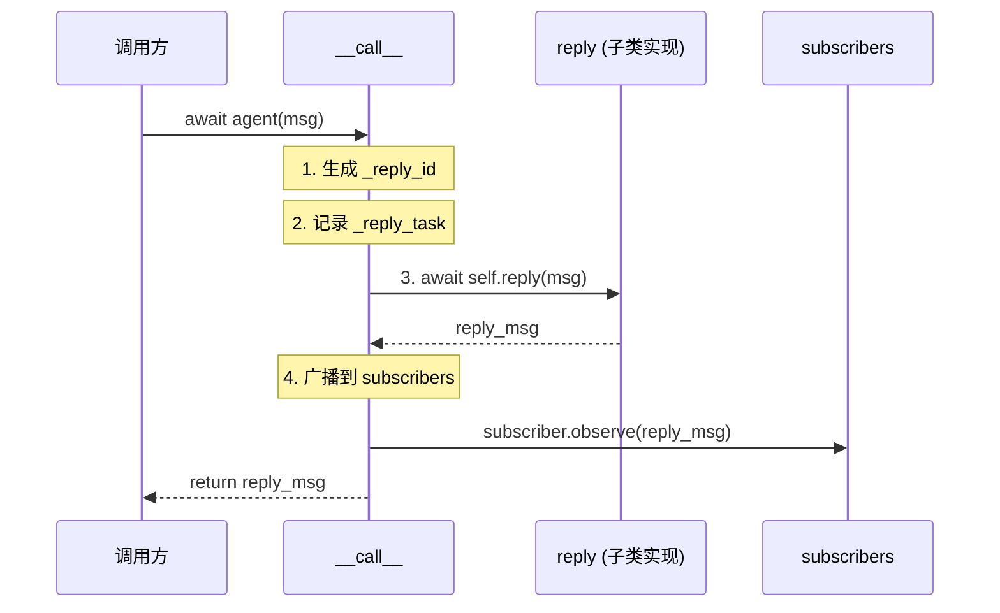
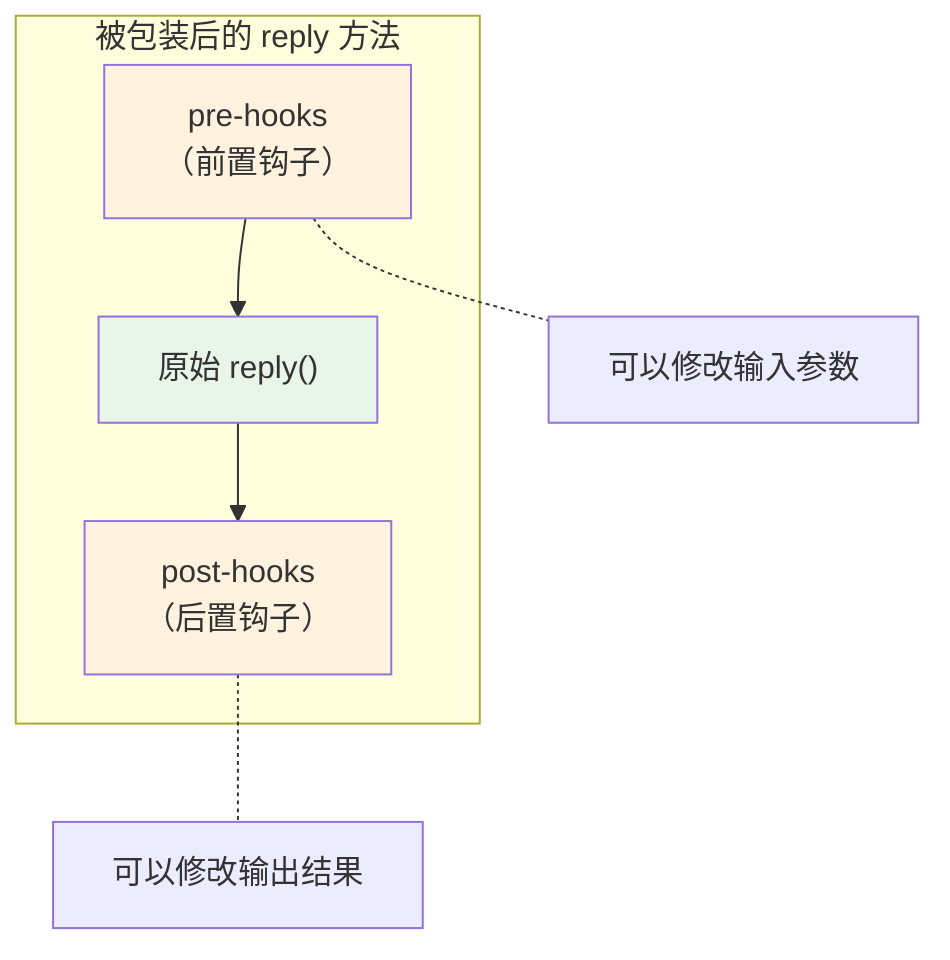
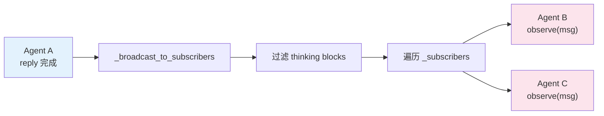

# 第 5 章 第 2 站：Agent 收信

> **卷一每章的结构**：路线图 → 知识补全 → 源码入口 → 逐行阅读 → 调试实践 → 试一试 → 检查点 → 下一站预告

上一章，我们见证了消息（Msg）的诞生。现在，这条承载着"北京今天天气怎么样？"的消息，即将被交到 Agent 手中。

这就是我们的第二站：`await agent(msg)` 的第一站——Agent 收信。

---

## 5.1 路线图

先回顾一下全局路线，看看我们现在在哪：


本章聚焦的消息接收入口，实际上是一段很短的代码。但它背后隐藏着两套精巧的机制——**元类（Metaclass）** 和 **Hook 系统**。理解了它们，你就掌握了 AgentScope 扩展性的根基。

---

## 5.2 知识补全：元类——自动给方法套一层包装

在进入源码之前，我们需要了解一个 Python 进阶概念：**元类（Metaclass）**。

### 一句话理解元类

元类是"类的类"。普通代码定义对象的行为，元类定义**类本身**的行为。

你只需要记住一件事：**元类可以在类定义时，自动给某些方法套上一层包装。**

### 日常类比

想象你开了一家连锁餐厅。每开一家分店，总部都会自动派人去给后厨装上监控摄像头。你不需要每家分店的店长自己去装——总部规则已经保证了这件事。

元类就是那个"总部规则"。当你定义一个 Agent 子类时，元类会自动检查：这个类里有没有 `reply`、`observe`、`print` 方法？如果有，就自动给它们套上一层"监控"——也就是我们后面要讲的 Hook。

### 代码对比

不用元类，你需要手动装饰每个方法：

```python
# 不用元类：每个子类都必须记得加装饰器
class MyAgent(AgentBase):
    @wrap_with_hooks   # 容易忘！
    async def reply(self, *args, **kwargs):
        ...

    @wrap_with_hooks   # 也容易忘！
    async def observe(self, msg):
        ...
```

用元类，类定义的那一刻就自动完成了包装：

```python
# 用元类：定义类时自动包装，无需手动操作
class MyAgent(AgentBase):   # AgentBase 使用了 _AgentMeta 元类
    async def reply(self, *args, **kwargs):   # 自动被包装
        ...

    async def observe(self, msg):   # 也自动被包装
        ...
```

这就是全部你需要知道的。元类的内部实现（`__new__`、MRO 等）在卷二第 15 章深入讲解。

---

## 5.3 源码入口

本章涉及两个核心文件：

| 文件 | 关注点 | 关键行号 |
|------|--------|---------|
| `src/agentscope/agent/_agent_base.py` | Agent 基类，`__call__` 入口 | 类定义 30，`__call__` 448，`reply` 197，`_subscribers` 168 |
| `src/agentscope/agent/_agent_meta.py` | 元类，Hook 包装逻辑 | `_wrap_with_hooks` 55，`_AgentMeta` 159 |

---

## 5.4 逐行阅读

### 5.4.1 起点：`__call__` 方法

当你写下 `await agent(msg)` 时，Python 会调用 `agent.__call__(msg)`。让我们看源码：

`src/agentscope/agent/_agent_base.py:448-467`

```python
async def __call__(self, *args: Any, **kwargs: Any) -> Msg:
    """Call the reply function with the given arguments."""
    self._reply_id = shortuuid.uuid()

    reply_msg: Msg | None = None
    try:
        self._reply_task = asyncio.current_task()
        reply_msg = await self.reply(*args, **kwargs)

    # The interruption is triggered by calling the interrupt method
    except asyncio.CancelledError:
        reply_msg = await self.handle_interrupt(*args, **kwargs)

    finally:
        # Broadcast the reply message to all subscribers
        if reply_msg:
            await self._broadcast_to_subscribers(reply_msg)
        self._reply_task = None

    return reply_msg
```

这段代码逻辑很清晰，一共做了四件事：

**第一步：生成回复 ID**（第 450 行）

```python
self._reply_id = shortuuid.uuid()
```

每次调用生成一个唯一 ID。这个 ID 在流式输出和中断处理中用来标识"这是哪一次回复"。

**第二步：记录当前任务**（第 454 行）

```python
self._reply_task = asyncio.current_task()
```

把当前的 asyncio Task 记录下来。这样做是为了支持**中断机制**——如果用户想打断 Agent 的回复，可以通过 `agent.interrupt()` 取消这个 Task。

**第三步：调用 reply**（第 455 行）

```python
reply_msg = await self.reply(*args, **kwargs)
```

这是核心：把收到的消息转发给 `reply` 方法。在 `AgentBase` 中，`reply` 只是一个抽象占位：

`src/agentscope/agent/_agent_base.py:197-203`

```python
async def reply(self, *args: Any, **kwargs: Any) -> Msg:
    """The main logic of the agent, which generates a reply based on the
    current state and input arguments."""
    raise NotImplementedError(
        "The reply function is not implemented in "
        f"{self.__class__.__name__} class.",
    )
```

真正的逻辑在子类中实现——比如 `ReActAgent`。我们会在第 11 章深入看它。

**第四步：广播 + 清理**（第 462-465 行）

```python
finally:
    if reply_msg:
        await self._broadcast_to_subscribers(reply_msg)
    self._reply_task = None
```

`finally` 块保证了无论 `reply` 正常完成还是被中断，广播和清理都会执行。广播机制我们在 5.4.4 节详细看。

用一张图来总结 `__call__` 的流程：



### 5.4.2 Hook 系统初见：元类在做什么

前面说到，`reply` 方法在子类中实现。但当你调用 `await agent.reply(msg)` 时，实际执行的不是"裸"的 `reply`，而是一个被包装过的版本。

这个包装是在类定义时由元类 `_AgentMeta` 完成的。

`src/agentscope/agent/_agent_meta.py:159-174`

```python
class _AgentMeta(type):
    """The agent metaclass that wraps the agent's reply, observe and print
    functions with pre- and post-hooks."""

    def __new__(mcs, name: Any, bases: Any, attrs: Dict) -> Any:
        """Wrap the agent's functions with hooks."""

        for func_name in [
            "reply",
            "print",
            "observe",
        ]:
            if func_name in attrs:
                attrs[func_name] = _wrap_with_hooks(attrs[func_name])

        return super().__new__(mcs, name, bases, attrs)
```

逐行理解：

1. `_AgentMeta` 继承自 `type`——Python 中所有类都是 `type` 的实例
2. `__new__` 在**类被创建时**自动调用（不是实例化时，是定义类时）
3. 它遍历三个方法名：`reply`、`print`、`observe`
4. 如果当前类定义了这些方法（`func_name in attrs`），就用 `_wrap_with_hooks` 包装它

注意 `AgentBase` 的类定义（第 30 行）：

```python
class AgentBase(StateModule, metaclass=_AgentMeta):
```

`metaclass=_AgentMeta` 这行注册了元类。这意味着**所有继承自 `AgentBase` 的类**，在定义时都会被 `_AgentMeta` 处理。

### 5.4.3 Hook 包装器内部

`_wrap_with_hooks` 是实际执行包装的函数。它很长（近 100 行），但核心逻辑是一个三明治结构：

`src/agentscope/agent/_agent_meta.py:55-156`（简化版）

```python
def _wrap_with_hooks(original_func: Callable) -> Callable:

    @wraps(original_func)
    async def async_wrapper(self: AgentBase, *args, **kwargs) -> Any:

        # 1. 防重入：如果已经在 Hook 中，直接执行原函数
        if getattr(self, hook_guard_attr, False):
            return await original_func(self, *args, **kwargs)

        # 2. 把所有参数归一化为关键字参数
        normalized_kwargs = _normalize_to_kwargs(...)

        # 3. 执行所有 pre-hooks（前置钩子）
        for pre_hook in pre_hooks:
            modified_kwargs = await pre_hook(self, normalized_kwargs)
            if modified_kwargs is not None:
                normalized_kwargs = modified_kwargs

        # 4. 执行原函数
        current_output = await original_func(self, **normalized_kwargs)

        # 5. 执行所有 post-hooks（后置钩子）
        for post_hook in post_hooks:
            modified_output = await post_hook(self, normalized_kwargs, output)
            if modified_output is not None:
                current_output = modified_output

        return current_output

    return async_wrapper
```

用一张图看清楚这个三明治结构：



**Hook 的两级层次**

Hook 分为两层：

- **实例级 Hook**（`_instance_pre_reply_hooks`）：只对单个 Agent 实例生效
- **类级 Hook**（`_class_pre_reply_hooks`）：对某一类的所有实例生效

执行顺序是：先实例级，后类级。两层 Hook 都在 `AgentBase.__init__` 中初始化为空的 `OrderedDict`：

`src/agentscope/agent/_agent_base.py:150-158`

```python
# Initialize the instance-level hooks
self._instance_pre_print_hooks = OrderedDict()
self._instance_post_print_hooks = OrderedDict()

self._instance_pre_reply_hooks = OrderedDict()
self._instance_post_reply_hooks = OrderedDict()

self._instance_pre_observe_hooks = OrderedDict()
self._instance_post_observe_hooks = OrderedDict()
```

默认情况下，这些 Hook 都是空的，所以 `reply` 就正常执行。当你需要扩展时，通过 `register_instance_hook` 或 `register_class_hook` 注册自定义 Hook。

**防重入机制**

注意第 80-81 行的这段代码：

```python
if getattr(self, hook_guard_attr, False):
    return await original_func(self, *args, **kwargs)
```

这是防止 Hook 被重复执行的守卫。当继承层次很深时（比如 `ReActAgent -> ReActAgentBase -> AgentBase`），每一层可能都有自己的 `reply` 方法被元类包装。守卫确保只有最外层的包装执行 Hook，内层的调用直接跳到原始函数。

### 5.4.4 广播机制：通知其他 Agent

`__call__` 的最后一步是广播。当 `reply` 完成后，Agent 会通知所有注册的订阅者：

`src/agentscope/agent/_agent_base.py:469-485`

```python
async def _broadcast_to_subscribers(
    self,
    msg: Msg | list[Msg] | None,
) -> None:
    """Broadcast the message to all subscribers."""
    if msg is None:
        return

    broadcast_msg = self._strip_thinking_blocks(msg)

    for subscribers in self._subscribers.values():
        for subscriber in subscribers:
            await subscriber.observe(broadcast_msg)
```

这里有两个值得注意的细节：

**细节一：过滤 thinking 块**

```python
broadcast_msg = self._strip_thinking_blocks(msg)
```

Agent 在回复过程中可能会产生"思考"内容（thinking blocks）——这是模型内部推理过程的记录。这些内容不应暴露给其他 Agent，所以广播前会被过滤掉。

**细节二：订阅者按 MsgHub 分组**

`_subscribers` 是一个字典，key 是 MsgHub 的名称，value 是 Agent 列表：

`src/agentscope/agent/_agent_base.py:168`

```python
self._subscribers: dict[str, list[AgentBase]] = {}
```

MsgHub 是 AgentScope 中多 Agent 通信的核心组件。当一个 Agent 在 MsgHub 中发言时，Hub 中的其他 Agent 会自动收到通知。我们会在第 11 章和卷二第 19 章深入看 MsgHub 的实现。

广播机制的完整流程：



---

## 5.5 调试实践

在阅读 `__call__` 和 Hook 系统时，以下调试技巧会帮助你理解实际运行时的行为。

### 5.5.1 追踪 `__call__` 的执行

在 `src/agentscope/agent/_agent_base.py` 的 `__call__` 方法中，第 450 行之后加一行：

```python
async def __call__(self, *args: Any, **kwargs: Any) -> Msg:
    """Call the reply function with the given arguments."""
    self._reply_id = shortuuid.uuid()
    print(f"[__call__] reply_id={self._reply_id}, args={args}, kwargs={kwargs}")
    # ...
```

这会打印每次调用的 `reply_id` 和传入参数，让你看到 `__call__` 何时被触发。

### 5.5.2 确认 Hook 是否被包装

如果你想验证 `reply` 方法确实被元类包装过，可以在 Python 中检查：

```python
from agentscope.agent import ReActAgent
from agentscope.memory import InMemoryMemory

agent = ReActAgent(
    name="test",
    sys_prompt="test",
    model=None,
    memory=InMemoryMemory(),
)

# 检查 reply 方法是否被包装
print(type(agent.reply))          # <class 'method'>
print(agent.reply.__wrapped__)    # 如果被 wraps 包装过，可以访问原始函数
print(agent.reply.__name__)       # 'reply'（@wraps 保留了原始名称）
```

### 5.5.3 使用断点

在 IDE 中设置断点的最佳位置：

| 断点位置 | 文件 | 行号 | 用途 |
|---------|------|------|------|
| `__call__` 入口 | `_agent_base.py` | 448 | 观察所有 Agent 调用的起点 |
| `reply` 调用 | `_agent_base.py` | 455 | 确认参数传递 |
| `async_wrapper` 入口 | `_agent_meta.py` | 69 | 观察 Hook 执行流程 |
| `_broadcast_to_subscribers` | `_agent_base.py` | 469 | 观察广播行为 |

---

> **设计一瞥**：为什么用元类而不是装饰器实现 Hook？
>
> 装饰器方案需要每个子类都记得在 `reply` 方法上加 `@wrap_with_hooks`。一旦某个子类忘了加，Hook 就不会生效，而且不会有任何报错——这是一个隐蔽的 bug。
>
> 元类方案在类定义时自动生效，不需要开发者做任何额外操作。子类的作者甚至不需要知道 Hook 的存在，只要继承 `AgentBase`，就自动拥有了 Hook 能力。
>
> 代价是增加了理解门槛——不熟悉元类的开发者在调试时可能会困惑"为什么我的方法执行前后多了额外的逻辑"。
>
> 详见卷四第 32 章。

---

## 5.6 试一试

### 练习：在 `__call__` 中追踪消息来源

打开 `src/agentscope/agent/_agent_base.py`，找到 `__call__` 方法（第 448 行），在第 450 行之后加一行 print：

```python
async def __call__(self, *args: Any, **kwargs: Any) -> Msg:
    """Call the reply function with the given arguments."""
    self._reply_id = shortuuid.uuid()
    # 加这一行 ↓
    if args and hasattr(args[0], 'name'):
        print(f"[收信] {self.name} 收到来自 {args[0].name} 的消息")
    reply_msg: Msg | None = None
    # ... 后续代码不变
```

然后运行你的天气 Agent：

```python
result = await agent(Msg("user", "北京今天天气怎么样？", "user"))
```

你应该能在控制台看到类似输出：

```
[收信] assistant 收到来自 user 的消息
```

**思考**：为什么 `args[0]` 是一个 `Msg` 对象？回顾第 4 章，`Msg` 的 `name` 字段记录了消息发送者的名字。

**进一步尝试**：试着连续调用两次 Agent：

```python
await agent(Msg("user", "北京天气如何？", "user"))
await agent(Msg("user", "上海呢？", "user"))
```

观察两次调用的 `reply_id` 是否不同。每次 `__call__` 都会生成新的 ID，这意味着框架可以区分不同的对话轮次。

---

## 5.7 检查点

读到这里，你应该能回答以下问题：

**`await agent(msg)` 实际上调用了什么方法？**

> 调用了 `AgentBase.__call__`，它负责生成 reply_id、记录 Task、调用 `reply`、广播结果。

**元类 `_AgentMeta` 在什么时候生效？**

> 在类**定义时**（不是实例化时）。当 Python 解释器读取 `class MyAgent(AgentBase):` 这行代码时，元类的 `__new__` 就会执行，自动包装 `reply`、`observe`、`print` 方法。

**Hook 的执行顺序是什么？**

> 三明治结构：pre-hooks → 原始方法 → post-hooks。其中 pre-hooks 可以修改输入参数，post-hooks 可以修改输出结果。

**广播机制做了什么？**

> `reply` 完成后，Agent 把回复消息（去掉 thinking blocks）发送给所有在 MsgHub 中注册的订阅者，调用它们的 `observe` 方法。

**自检练习**：如果两个 Agent A 和 B 都在同一个 MsgHub 中，当 A 回复了一条消息，B 的哪个方法会被调用？

> B 的 `observe` 方法会被调用，收到的消息已经去掉了 thinking blocks。

---

## 5.8 下一站预告

消息到达 Agent 之后，`__call__` 把它交给了 `reply`。但 `reply` 做的第一件事不是调用 LLM，而是把这条消息存入记忆（Memory）。

为什么？因为 LLM 需要看到完整的对话历史才能做出正确的回复。下一章，我们进入"工作记忆"的仓库，看看消息是如何被存储和检索的。

> **下一站**：第 3 站——工作记忆（Working Memory）。
