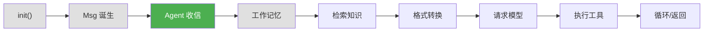
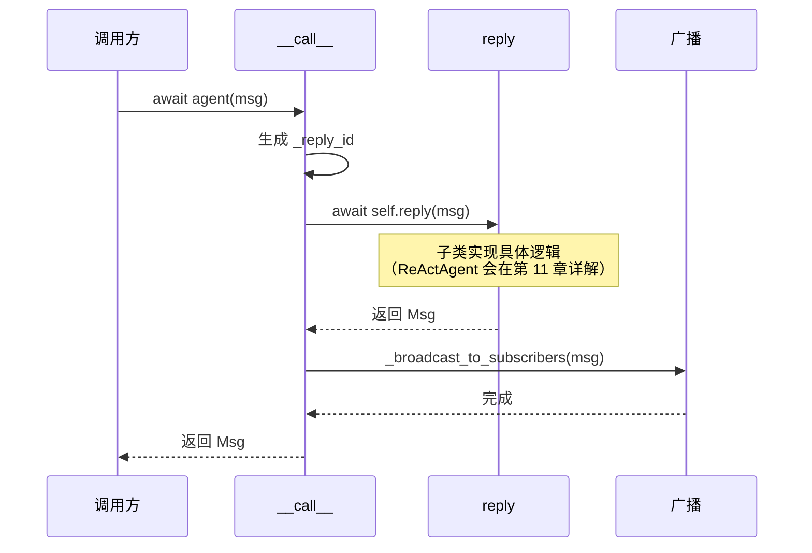
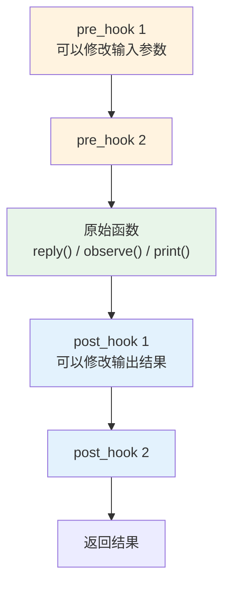

# 第 5 章 第 2 站：Agent 收信

> **追踪线**：消息已经诞生，现在它被传递给 Agent。`await agent(msg)` 发生了什么？
> 本章你将理解：`__call__()` → `reply()` 入口、元类初见、广播机制。

---

## 5.1 路线图



绿色是当前位置——Agent 正在接收消息。

> **源码验证日期**: 2026-05-11, commit `f17cfd0a`

---

## 5.2 知识补全：元类（Metaclass）

在 Agent 源码中你会看到 `metaclass=_AgentMeta`。元类是什么？

### 类也是对象

Python 中，一切都是对象。`class` 语句本质上是在**创建一个对象**——类对象。普通对象由类创建，类由**元类**创建。

```python
# 普通对象
obj = MyClass()      # MyClass 创建 obj

# 类对象
class MyClass:       # type 创建 MyClass
    pass
print(type(MyClass))  # <class 'type'>
```

`type` 是默认的元类。你可以自定义元类来控制类的创建过程。

### 元类能做什么？

自定义元类可以**在类被创建时自动修改类**。AgentScope 用它来自动给 Agent 的方法加上 Hook：

```python
class _AgentMeta(type):
    def __new__(mcs, name, bases, attrs):
        # 在类创建时，自动包装 reply、observe、print 方法
        for func_name in ["reply", "observe", "print"]:
            if func_name in attrs:
                attrs[func_name] = _wrap_with_hooks(attrs[func_name])
        return super().__new__(mcs, name, bases, attrs)
```

当 Python 解释器执行到 `class AgentBase(metaclass=_AgentMeta):` 时，`_AgentMeta.__new__` 被调用，自动把 `reply`、`observe`、`print` 方法包装上 Hook 逻辑。

你不需要现在完全理解 Hook 的实现——只需要知道：**元类在类创建时自动包装方法，就像一个自动化的装饰器**。第 15 章会深入讨论元类的设计。

---

## 5.3 源码入口

| 文件 | 内容 |
|------|------|
| `src/agentscope/agent/_agent_base.py` | `AgentBase` 基类 |
| `src/agentscope/agent/_agent_meta.py` | `_AgentMeta` 元类、Hook 包装 |

---

## 5.4 逐行阅读

### `await agent(msg)` —— 入口：`__call__`

当你调用 `await agent(Msg(...))` 时，Python 实际调用的是 `AgentBase.__call__`：

```python
async def __call__(self, *args: Any, **kwargs: Any) -> Msg:
    """Call the reply function with the given arguments."""
    self._reply_id = shortuuid.uuid()

    reply_msg: Msg | None = None
    try:
        self._reply_task = asyncio.current_task()
        reply_msg = await self.reply(*args, **kwargs)

    except asyncio.CancelledError:
        reply_msg = await self.handle_interrupt(*args, **kwargs)

    finally:
        if reply_msg:
            await self._broadcast_to_subscribers(reply_msg)
        self._reply_task = None

    return reply_msg
```

`__call__` 做了四件事：



**1. 生成回复 ID**

```python
self._reply_id = shortuuid.uuid()
```

每次调用都生成一个唯一 ID，用于追踪和中断控制。

**2. 调用 `reply()`**

```python
reply_msg = await self.reply(*args, **kwargs)
```

这是核心——调用子类实现的 `reply()` 方法。`AgentBase` 本身的 `reply()` 是抽象方法：

```python
async def reply(self, *args: Any, **kwargs: Any) -> Msg:
    raise NotImplementedError(...)
```

具体的 Agent 子类（如 `ReActAgent`）会覆盖 `reply()`，实现自己的逻辑。

**3. 处理中断**

```python
except asyncio.CancelledError:
    reply_msg = await self.handle_interrupt(*args, **kwargs)
```

如果在执行过程中被取消（比如用户主动中断），会调用 `handle_interrupt()` 处理。

**4. 广播结果**

```python
finally:
    if reply_msg:
        await self._broadcast_to_subscribers(reply_msg)
```

无论成功还是被中断，最终都会把结果广播给订阅者。

### Hook 机制：`_AgentMeta` 的魔法

前面说过，元类在类创建时自动包装方法。具体是怎么包装的？

打开 `src/agentscope/agent/_agent_meta.py`，看 `_wrap_with_hooks`：

```python
@wraps(original_func)
async def async_wrapper(self: AgentBase, *args, **kwargs) -> Any:
    # 1. 把参数统一为关键字参数
    normalized_kwargs = _normalize_to_kwargs(original_func, self, *args, **kwargs)

    # 2. 执行所有 pre-hooks
    for pre_hook in pre_hooks:
        modified_keywords = await _execute_async_or_sync_func(
            pre_hook, self, deepcopy(current_normalized_kwargs),
        )
        if modified_keywords is not None:
            current_normalized_kwargs = modified_keywords

    # 3. 执行原始函数
    current_output = await original_func(self, *args, **others, **kwargs)

    # 4. 执行所有 post-hooks
    for post_hook in post_hooks:
        modified_output = await _execute_async_or_sync_func(
            post_hook, self, deepcopy(current_normalized_kwargs),
            deepcopy(current_output),
        )
        if modified_output is not None:
            current_output = modified_output

    return current_output
```

这就是**洋葱模型**——Hook 像洋葱的层一样包裹着原始函数：



- **pre-hook**：在原始函数之前执行，可以修改输入参数
- **post-hook**：在原始函数之后执行，可以修改输出结果

Hook 分两层：

| 层级 | 存储位置 | 用途 |
|------|---------|------|
| 类级别 | `_class_pre_reply_hooks` | 所有实例共享的 Hook |
| 实例级别 | `_instance_pre_reply_hooks` | 单个实例特有的 Hook |

执行顺序：先实例级 Hook，再类级 Hook（pre-hook）；post-hook 同理。

### 广播机制：`_broadcast_to_subscribers`

`__call__` 在执行完毕后，会把结果广播给订阅了该 Agent 的其他 Agent：

```python
async def _broadcast_to_subscribers(
    self, msg: Msg | list[Msg] | None,
) -> None:
    if msg is None:
        return

    broadcast_msg = self._strip_thinking_blocks(msg)

    for subscribers in self._subscribers.values():
        for subscriber in subscribers:
            await subscriber.observe(broadcast_msg)
```

关键细节：**广播前会剥离思考块（ThinkingBlock）**。

```python
@staticmethod
def _strip_thinking_blocks_single(msg: Msg) -> Msg:
    """Remove thinking blocks from a single message."""
    if not isinstance(msg.content, list):
        return msg
    # 过滤掉 type == "thinking" 的块
    ...
```

为什么？因为 `ThinkingBlock` 代表模型的内部推理过程，不应该暴露给其他 Agent。就像你思考问题时自言自语的内容，不需要告诉别人。

---

## 5.5 调试实践

### 追踪 `__call__` 的执行流程

打开 `src/agentscope/agent/_agent_base.py`，在 `__call__` 中加 print：

```python
async def __call__(self, *args: Any, **kwargs: Any) -> Msg:
    self._reply_id = shortuuid.uuid()
    print(f"[CALL] Agent {self.name} 收到消息, reply_id={self._reply_id}")  # 加这行

    reply_msg: Msg | None = None
    try:
        self._reply_task = asyncio.current_task()
        reply_msg = await self.reply(*args, **kwargs)
        print(f"[CALL] reply() 返回: {repr(reply_msg.content)[:50]}")  # 加这行
    ...
```

### 查看 Hook 注册情况

```python
from agentscope.agent import ReActAgent

agent = ReActAgent(name="test", ...)

# 查看类级别 Hook
print("类级别 pre_reply hooks:", list(agent._class_pre_reply_hooks.keys()))
print("类级别 post_reply hooks:", list(agent._class_post_reply_hooks.keys()))

# 查看实例级别 Hook
print("实例级别 pre_reply hooks:", list(agent._instance_pre_reply_hooks.keys()))
```

---

## 5.6 试一试

### 在 `__call__` 中观察广播

在 `_broadcast_to_subscribers` 方法开头加 print：

```python
async def _broadcast_to_subscribers(self, msg, ...):
    print(f"[BROADCAST] Agent {self.name} 广播消息给 {sum(len(s) for s in self._subscribers.values())} 个订阅者")  # 加这行
    ...
```

如果 Agent 没有订阅者，你会看到"0 个订阅者"。第 19 章（发布订阅）会展示如何让 Agent 订阅其他 Agent。

### 添加一个简单的 Hook

```python
from agentscope.agent import ReActAgent

async def my_pre_hook(agent_self, kwargs):
    print(f"[HOOK] {agent_self.name} 即将处理消息")
    return kwargs  # 不修改参数，原样返回

agent = ReActAgent(name="test", ...)
agent.register_instance_hook("pre_reply", "my_hook", my_pre_hook)
```

现在每次 `reply()` 被调用前，都会先打印一条日志。

---

## 5.7 检查点

你现在已经理解了：

- **`__call__()`**：Agent 的入口，负责生成 ID、调用 `reply()`、处理中断、广播结果
- **`reply()`**：抽象方法，由子类（如 `ReActAgent`）实现具体逻辑
- **元类 `_AgentMeta`**：在类创建时自动给 `reply`、`observe`、`print` 加上 Hook 包装
- **Hook 机制**：pre-hook 修改输入，post-hook 修改输出，洋葱模型
- **广播机制**：`reply()` 完成后自动广播给订阅者，剥离 ThinkingBlock

**自检练习**：
1. 如果你在 `reply()` 中直接调用 `print()` 函数打印消息，Hook 会生效吗？（提示：Hook 包装的是 `print` 方法，不是内置的 `print()` 函数）
2. 为什么要剥离 ThinkingBlock 再广播？（提示：思考过程是私有的）

---

## 下一站预告

Agent 已经收到消息。下一站，消息被存入工作记忆。
