# 第 4 站：检索与知识

> `await self._retrieve_from_long_term_memory(msg)` 和 `await self._retrieve_from_knowledge(msg)` ——
> 消息存入记忆后，Agent 还不会立刻思考。它会先"翻旧账"和"查资料"。
> 本章拆解两条检索管道：长期记忆（Long-Term Memory）的两种控制模式，以及 RAG 知识库的查询 → 嵌入 → 向量搜索流程。
> 你将理解为什么 Agent 需要两种记忆检索策略，以及文本如何变成向量、向量又如何在数据库中找到"最相似"的答案。

---

## 1. 路线图

我们正在追随 `await agent(msg)` 穿越 AgentScope 框架。上一站消息被 `await self.memory.add(msg)` 存入工作记忆，现在到达 **"检索与知识"** 站。

```mermaid
flowchart LR
    A["agentscope.init()"] --> B["Msg 创建"]
    B --> C["Agent 收信"]
    C --> D["Memory 存储"]
    D --> E["检索与知识"]
    E --> F["Formatter 格式化"]
    F --> G["Model 调用"]
    G --> H["Toolkit 执行"]
    H --> I["ReAct 循环"]
    I --> J["返回结果"]

    style A fill:#ddd,stroke:#333
    style B fill:#ddd,stroke:#333
    style C fill:#ddd,stroke:#333
    style D fill:#ddd,stroke:#333
    style E fill:#f9f,stroke:#333,stroke-width:2px
    style F fill:#ddd,stroke:#333
    style G fill:#ddd,stroke:#333
    style H fill:#ddd,stroke:#333
    style I fill:#ddd,stroke:#333
    style J fill:#ddd,stroke:#333
```



**本章聚焦**：上图中高亮的 `检索与知识` 节点。从 `ReActAgent.reply()` 中记忆存入之后的两行检索调用开始，拆解长期记忆和 RAG 知识库两条检索管道。

这两行代码位于 `src/agentscope/agent/_react_agent.py:400-402`：

```python
# Retrieve relevant records from the long-term memory if activated
await self._retrieve_from_long_term_memory(msg)
# Retrieve relevant documents from the knowledge base(s) if any
await self._retrieve_from_knowledge(msg)
```

---

## 2. 源码入口

本章涉及的核心源文件：

| 文件 | 关键内容 | 行号参考 |
|------|----------|----------|
| `src/agentscope/agent/_react_agent.py` | `_retrieve_from_long_term_memory()` 检索入口 | :882 |
| `src/agentscope/agent/_react_agent.py` | `_retrieve_from_knowledge()` RAG 入口 | :908 |
| `src/agentscope/agent/_react_agent.py` | `long_term_memory_mode` 参数 | :186 |
| `src/agentscope/agent/_react_agent.py` | `_static_control` / `_agent_control` 标志 | :289-296 |
| `src/agentscope/memory/_long_term_memory/_long_term_memory_base.py` | `class LongTermMemoryBase(StateModule)` | :11 |
| `src/agentscope/memory/_long_term_memory/_long_term_memory_base.py` | `record()` 开发者接口 | :24 |
| `src/agentscope/memory/_long_term_memory/_long_term_memory_base.py` | `retrieve()` 开发者接口 | :35 |
| `src/agentscope/memory/_long_term_memory/_long_term_memory_base.py` | `record_to_memory()` 工具函数 | :48 |
| `src/agentscope/memory/_long_term_memory/_long_term_memory_base.py` | `retrieve_from_memory()` 工具函数 | :69 |
| `src/agentscope/memory/_long_term_memory/_mem0/_mem0_long_term_memory.py` | `Mem0LongTermMemory` 实现 | :72 |
| `src/agentscope/memory/_long_term_memory/_reme/_reme_long_term_memory_base.py` | `ReMeLongTermMemoryBase` 基类 | :77 |
| `src/agentscope/memory/_long_term_memory/_reme/_reme_personal_long_term_memory.py` | 个人记忆实现 | :17 |
| `src/agentscope/rag/_knowledge_base.py` | `class KnowledgeBase` RAG 基类 | :13 |
| `src/agentscope/rag/_simple_knowledge.py` | `class SimpleKnowledge(KnowledgeBase)` | :10 |
| `src/agentscope/rag/_store/_store_base.py` | `class VDBStoreBase` 向量存储基类 | :10 |
| `src/agentscope/embedding/_embedding_base.py` | `class EmbeddingModelBase` 嵌入基类 | :8 |
| `src/agentscope/embedding/_embedding_response.py` | `class EmbeddingResponse` 响应数据类 | :13 |

---

## 3. 逐行阅读

### 3.1 检索的触发时机

在 `ReActAgent.reply()` 中，消息存入工作记忆之后、推理循环开始之前，Agent 执行两步检索：

```python
# src/agentscope/agent/_react_agent.py:396-402
await self.memory.add(msg)

# Retrieve relevant records from the long-term memory if activated
await self._retrieve_from_long_term_memory(msg)
# Retrieve relevant documents from the knowledge base(s) if any
await self._retrieve_from_knowledge(msg)
```

这两步都是条件性的——只有当用户配置了长期记忆或知识库时才会真正执行。检索到的内容会以新的 `Msg` 对象注入工作记忆，供后续推理使用。

### 3.2 长期记忆的两种控制模式

`ReActAgent.__init__()` 接受一个 `long_term_memory_mode` 参数（`:186`），支持三种值：

```python
# src/agentscope/agent/_react_agent.py:186-188
long_term_memory_mode: Literal[
    "agent_control",
    "static_control",
    "both",
] = "static_control",
```

在构造函数中，这个参数被转化为两个内部标志（`:289-296`）：

```python
# src/agentscope/agent/_react_agent.py:289-296
self._static_control = long_term_memory and long_term_memory_mode in [
    "static_control",
    "both",
]
self._agent_control = long_term_memory and long_term_memory_mode in [
    "agent_control",
    "both",
]
```

**两种模式的区别**：

| 模式 | 检索时机 | 存储时机 | Agent 自主性 |
|------|----------|----------|------------|
| `static_control` | 每次 `reply()` 开始时自动检索 | 每次 `reply()` 结束时自动存储 | 低：开发者控制 |
| `agent_control` | Agent 通过工具函数主动检索 | Agent 通过工具函数主动存储 | 高：Agent 自主决定 |
| `both` | 两者都启用 | 两者都启用 | 最高 |

当选择 `agent_control` 时，两个工具函数被注册到 `Toolkit`（`:301-308`）：

```python
# src/agentscope/agent/_react_agent.py:301-308
if self._agent_control:
    self.toolkit.register_tool_function(
        long_term_memory.record_to_memory,
    )
    self.toolkit.register_tool_function(
        long_term_memory.retrieve_from_memory,
    )
```

这意味着 Agent 在 ReAct 推理循环中，可以像调用其他工具一样，主动决定何时记录和检索长期记忆。

### 3.3 `_retrieve_from_long_term_memory()` 详解

```python
# src/agentscope/agent/_react_agent.py:882-906
async def _retrieve_from_long_term_memory(
    self,
    msg: Msg | list[Msg] | None,
) -> None:
    if self._static_control and msg:
        # Retrieve information from the long-term memory if available
        retrieved_info = await self.long_term_memory.retrieve(msg)
        if retrieved_info:
            retrieved_msg = Msg(
                name="long_term_memory",
                content="<long_term_memory>The content below are "
                "retrieved from long-term memory, which maybe "
                f"useful:\n{retrieved_info}</long_term_memory>",
                role="user",
            )
            if self.print_hint_msg:
                await self.print(retrieved_msg, True)
            await self.memory.add(retrieved_msg)
```

执行流程：

1. 检查 `_static_control` 标志和 `msg` 是否存在
2. 调用 `long_term_memory.retrieve(msg)` —— 将输入消息作为查询
3. 如果有结果，包装成 XML 标签格式的 `Msg` 对象（`<long_term_memory>...</long_term_memory>`）
4. 注入工作记忆 `await self.memory.add(retrieved_msg)`

注意：检索结果被标记为 `role="user"`，这样模型会将其视为上下文信息而非系统指令。

在 `reply()` 末尾（`:528-535`），如果是 `static_control` 模式，Agent 会自动将本轮对话记录到长期记忆：

```python
# src/agentscope/agent/_react_agent.py:528-535
if self._static_control:
    await self.long_term_memory.record(
        [
            *await self.memory.get_memory(
                exclude_mark=_MemoryMark.COMPRESSED,
            ),
        ],
    )
```

### 3.4 LongTermMemoryBase 接口

`LongTermMemoryBase`（`src/agentscope/memory/_long_term_memory/_long_term_memory_base.py:11`）定义了四组方法，分为两个维度：

**开发者接口**（`record` / `retrieve`）—— 由框架在特定时机自动调用：

```python
# src/agentscope/memory/_long_term_memory/_long_term_memory_base.py:24-46
async def record(
    self,
    msgs: list[Msg | None],
    **kwargs: Any,
) -> Any:
    """A developer-designed method to record information from the given
    input message(s) to the long-term memory."""
    raise NotImplementedError(...)

async def retrieve(
    self,
    msg: Msg | list[Msg] | None,
    limit: int = 5,
    **kwargs: Any,
) -> str:
    """A developer-designed method to retrieve information from the
    long-term memory based on the given input message(s)."""
    raise NotImplementedError(...)
```

**工具函数接口**（`record_to_memory` / `retrieve_from_memory`）—— 注册为 Agent 可调用的工具：

```python
# src/agentscope/memory/_long_term_memory/_long_term_memory_base.py:48-94
async def record_to_memory(
    self,
    thinking: str,
    content: list[str],
    **kwargs: Any,
) -> ToolResponse:
    """Use this function to record important information..."""
    raise NotImplementedError(...)

async def retrieve_from_memory(
    self,
    keywords: list[str],
    limit: int = 5,
    **kwargs: Any,
) -> ToolResponse:
    """Retrieve the memory based on the given keywords..."""
    raise NotImplementedError(...)
```

基类的 docstring 精准描述了这个设计意图（`:15-22`）：

> The `record_to_memory` and `retrieve_from_memory` methods are two tool functions for agent to manage the long-term memory voluntarily.
> The `record` and `retrieve` methods are for developers to use.

### 3.5 Mem0 后端实现

`Mem0LongTermMemory`（`src/agentscope/memory/_long_term_memory/_mem0/_mem0_long_term_memory.py:72`）是长期记忆的第一个具体实现。

**初始化**（`:263-378`）需要三个核心组件：
- `model`：ChatModelBase，用于 mem0 内部的记忆推理
- `embedding_model`：EmbeddingModelBase，用于文本向量化
- `vector_store_config`：向量存储配置（默认使用 Qdrant）

构造函数会注册 AgentScope 自己的 LLM 和 Embedding provider 到 mem0 的工厂（`:92-128`），使得 mem0 可以复用 AgentScope 已有的模型实例。

**record() 方法**（`:573-618`）将 AgentScope 消息转换为 mem0 格式后存储：

```python
# src/agentscope/memory/_long_term_memory/_mem0/_mem0_long_term_memory.py:604-617
messages = [
    {
        "role": "assistant",
        "content": "\n".join([str(_.content) for _ in msg_list]),
        "name": "assistant",
    },
]
results = await self._mem0_record(
    messages,
    memory_type=memory_type,
    infer=infer,
    **kwargs,
)
```

**retrieve() 方法**（`:683-746`）将消息序列化为 JSON 后搜索：

```python
# src/agentscope/memory/_long_term_memory/_mem0/_mem0_long_term_memory.py:720-746
msg_strs = [
    json.dumps(_.to_dict()["content"], ensure_ascii=False) for _ in msg
]

search_coroutines = [
    self.long_term_working_memory.search(
        query=item,
        agent_id=self.agent_id,
        user_id=self.user_id,
        run_id=self.run_id,
        limit=limit,
    )
    for item in msg_strs
]
search_results = await asyncio.gather(*search_coroutines)
```

Mem0 的 `record_to_memory()` 使用三级回退策略（`:380-505`）：先尝试 user 角色，再 assistant 角色，最后不推理直接存储。这确保即使 mem0 的推理引擎提取不到有意义的信息，原始内容仍然会被保留。

### 3.6 ReMe 后端实现

`ReMeLongTermMemoryBase`（`src/agentscope/memory/_long_term_memory/_reme/_reme_long_term_memory_base.py:77`）提供了三个子类，针对不同类型的记忆：

| 子类 | 用途 | 记忆类型 |
|------|------|----------|
| `ReMePersonalLongTermMemory` | 用户偏好、个人信息 | 个人记忆 |
| `ReMeTaskLongTermMemory` | 任务执行经验、教训 | 任务记忆 |
| `ReMeToolLongTermMemory` | 工具使用模式、指南 | 工具记忆 |

ReMe 通过 `ReMeApp` 管理记忆生命周期，需要使用异步上下文管理器（`:287-318`）：

```python
# 使用示例
async with memory:
    await memory.record_to_memory(
        thinking="用户喜欢绿茶",
        content=["User enjoys drinking green tea"],
    )
```

`ReMePersonalLongTermMemory` 的 `retrieve()` 方法（`:332-414`）取最后一条消息的内容作为查询，调用 ReMe 的 `retrieve_personal_memory` 操作。

### 3.7 `_retrieve_from_knowledge()` 详解 —— RAG 管道

```python
# src/agentscope/agent/_react_agent.py:908-1013
async def _retrieve_from_knowledge(
    self,
    msg: Msg | list[Msg] | None,
) -> None:
    if self.knowledge and msg:
        # 1. 提取查询文本
        query = None
        if isinstance(msg, Msg):
            query = msg.get_text_content()
        elif isinstance(msg, list):
            texts = []
            for m in msg:
                text = m.get_text_content()
                if text:
                    texts.append(text)
            query = "\n".join(texts)

        if not query:
            return

        # 2. 可选：LLM 改写查询（:937-976）
        if self.enable_rewrite_query:
            # ... 调用 LLM 将查询改写为更精确的检索语句

        # 3. 遍历所有知识库执行检索（:978-983）
        docs: list[Document] = []
        for kb in self.knowledge:
            docs.extend(
                await kb.retrieve(query=query),
            )
```

RAG 管道的完整流程：

1. **提取查询** —— 从输入消息中提取纯文本作为查询
2. **查询改写**（可选） —— 如果 `enable_rewrite_query=True`，LLM 会将模糊查询改写为精确检索语句。例如将"昨天发生了什么"改写为"2023-10-01 发生了什么"
3. **多知识库检索** —— 遍历 `self.knowledge` 列表，对每个知识库执行检索
4. **结果排序** —— 按相关性分数降序排列（`:986-990`）
5. **注入记忆** —— 检索到的文档包装为 `<retrieved_knowledge>...</retrieved_knowledge>` 标签后注入工作记忆

检索结果注入的格式（`:992-1013`）：

```python
# src/agentscope/agent/_react_agent.py:992-1013
retrieved_msg = Msg(
    name="user",
    content=[
        TextBlock(
            type="text",
            text=(
                "<retrieved_knowledge>Use the following "
                "content from the knowledge base(s) if it's "
                "helpful:\n"
            ),
        ),
        *[_.metadata.content for _ in docs],
        TextBlock(
            type="text",
            text="</retrieved_knowledge>",
        ),
    ],
    role="user",
)
```

### 3.8 SimpleKnowledge：从查询到向量搜索

`SimpleKnowledge`（`src/agentscope/rag/_simple_knowledge.py:10`）是 `KnowledgeBase` 的默认实现。`retrieve()` 方法展示了 RAG 的核心流程（`:13-52`）：

```python
# src/agentscope/rag/_simple_knowledge.py:38-52
res_embedding = await self.embedding_model(
    [
        TextBlock(
            type="text",
            text=query,
        ),
    ],
)
res = await self.embedding_store.search(
    res_embedding.embeddings[0],
    limit=limit,
    score_threshold=score_threshold,
    **kwargs,
)
return res
```

三步操作：

1. **嵌入** —— 调用 `self.embedding_model()` 将查询文本转为向量
2. **搜索** —— 用向量在 `embedding_store` 中搜索最相似的文档
3. **返回** —— 返回 `list[Document]`

`add_documents()` 方法（`:54-84`）展示了写入流程：

```python
# src/agentscope/rag/_simple_knowledge.py:77-84
res_embeddings = await self.embedding_model(
    [_.metadata.content for _ in documents],
)
for doc, embedding in zip(documents, res_embeddings.embeddings):
    doc.embedding = embedding
await self.embedding_store.add(documents)
```

### 3.9 EmbeddingModelBase：文本到向量

`EmbeddingModelBase`（`src/agentscope/embedding/_embedding_base.py:8`）是所有嵌入模型的基类：

```python
# src/agentscope/embedding/_embedding_base.py:8-45
class EmbeddingModelBase:
    model_name: str
    supported_modalities: list[str]
    dimensions: int

    def __init__(
        self,
        model_name: str,
        dimensions: int,
    ) -> None:
        self.model_name = model_name
        self.dimensions = dimensions

    async def __call__(
        self,
        *args: Any,
        **kwargs: Any,
    ) -> EmbeddingResponse:
        raise NotImplementedError(...)
```

框架提供了多个具体实现：

| 文件 | 实现类 | 后端 |
|------|--------|------|
| `_openai_embedding.py` | `OpenAITextEmbedding` | OpenAI API |
| `_dashscope_embedding.py` | `DashScopeTextEmbedding` | 阿里云 DashScope |
| `_gemini_embedding.py` | `GeminiTextEmbedding` | Google Gemini |
| `_ollama_embedding.py` | `OllamaTextEmbedding` | Ollama 本地模型 |

`EmbeddingResponse`（`src/agentscope/embedding/_embedding_response.py:13`）包含嵌入结果：

```python
@dataclass
class EmbeddingResponse(DictMixin):
    embeddings: List[Embedding]   # 向量列表
    id: str                        # 响应 ID
    created_at: str                # 创建时间
    type: Literal["embedding"]     # 类型标记
    usage: EmbeddingUsage | None   # API 调用统计
    source: Literal["cache", "api"] # 来源：缓存还是 API
```

### 3.10 VDBStoreBase：向量数据库抽象

`VDBStoreBase`（`src/agentscope/rag/_store/_store_base.py:10`）定义了向量数据库的接口：

```python
# src/agentscope/rag/_store/_store_base.py:10-49
class VDBStoreBase:
    @abstractmethod
    async def add(self, documents: list[Document], **kwargs: Any) -> None:
        """Record the documents into the vector database."""

    @abstractmethod
    async def search(
        self,
        query_embedding: Embedding,
        limit: int,
        score_threshold: float | None = None,
        **kwargs: Any,
    ) -> list[Document]:
        """Retrieve relevant texts for the given queries."""
```

框架提供了多个向量存储后端：Qdrant、Milvus Lite、MongoDB、AlibabaCloud MySQL、OceanBase。

---

## 4. 设计一瞥

### 为什么长期记忆有两种控制模式？

`agent_control` 和 `static_control` 代表了两种截然不同的设计理念。

**static_control** 是"开发者决定"模式。框架在每次 `reply()` 的开始自动检索、结束时自动存储。开发者不需要 Agent 理解"记忆管理"这个概念——记忆就像一种隐形的增强，Agent 甚至不知道自己在使用长期记忆。

**agent_control** 是"Agent 自主"模式。`record_to_memory` 和 `retrieve_from_memory` 被注册为工具函数，Agent 在 ReAct 推理循环中像使用搜索或计算器一样使用它们。Agent 需要自己决定什么值得记住、什么时候该翻旧账。

这个设计权衡了两个维度：

1. **可靠性**：`static_control` 保证每次对话都会检索和存储，不会遗漏。但可能检索到无关内容，浪费 token。
2. **灵活性**：`agent_control` 让 Agent 根据上下文判断，只记录真正重要的信息。但依赖 Agent 的推理能力——如果 Agent 判断失误，可能忘记重要信息。

`both` 模式是两者的结合：框架自动检索/存储，同时 Agent 也可以主动操作。这提供了最大的灵活性，但也最复杂。

从源码可以看到，这个两模式设计直接映射到 `LongTermMemoryBase` 的四组方法：`record`/`retrieve` 给 `static_control` 用，`record_to_memory`/`retrieve_from_memory` 给 `agent_control` 用。方法签名也反映了使用场景的不同——前者接受 `Msg` 对象，后者接受 `keywords: list[str]` 和 `content: list[str]`，更符合工具函数的调用习惯。

---

## 5. 补充知识：向量嵌入（Vector Embedding）

如果你没有机器学习背景，"文本变向量"可能听起来很抽象。这里用一个简化的类比来解释。

**什么是向量嵌入？**

想象你要描述一个人。你可以用很多维度：身高、体重、年龄、性格外向度、运动偏好……每个维度一个数值，组合起来就是一组数字——这就是一个"向量"。

嵌入模型做的事情类似：它把一段文本映射到一个高维空间中的一个点。语义相近的文本，在空间中距离也近。例如：

- "北京今天天气怎么样" 和 "北京今日天气如何" → 距离很近
- "北京今天天气怎么样" 和 "Python 列表排序" → 距离很远

**向量搜索的流程**

```
1. 写入时：
   文档 → 嵌入模型 → 向量 → 存入向量数据库

2. 查询时：
   查询文本 → 嵌入模型 → 查询向量
   → 在向量数据库中找最近的 N 个向量
   → 返回对应的文档
```

在 AgentScope 中，`EmbeddingModelBase` 负责第 1 步的"文本 → 向量"转换，`VDBStoreBase` 负责第 2 步的向量搜索。

**常见的距离度量**

- **余弦相似度**（Cosine Similarity）：衡量两个向量方向的相似性，范围 [-1, 1]，值越大越相似
- **欧氏距离**（Euclidean Distance）：两点之间的直线距离，值越小越相似

AgentScope 的 `score_threshold` 参数（如 `SimpleKnowledge.retrieve()` 中的）用于过滤低相似度的结果。

---

## 6. 调试实践

### 观察长期记忆检索结果

`_retrieve_from_long_term_memory()` 中有一个调试开关 `self.print_hint_msg`（`:904-905`）。当它为 `True` 时，检索结果会被打印出来。

你可以在创建 Agent 时启用它：

```python
agent = ReActAgent(
    name="assistant",
    model=model,
    sys_prompt="You are a helpful assistant.",
    long_term_memory=memory,
    long_term_memory_mode="static_control",
    print_hint_msg=True,  # 打印检索结果
)
```

启用后，当长期记忆检索到内容时，你会看到类似这样的输出：

```
[long_term_memory]:
<long_term_memory>The content below are retrieved from long-term memory,
which maybe useful:
User prefers green tea
User works as a software engineer</long_term_memory>
```

### 观察 RAG 检索结果

同样地，`_retrieve_from_knowledge()` 也会在 `print_hint_msg=True` 时打印检索结果（`:1011-1012`）：

```
[user]:
<retrieved_knowledge>Use the following content from the knowledge base(s)
if it's helpful:
Score: 0.92, Content: 北京今日晴，最高气温 28°C...
</retrieved_knowledge>
```

### 检查注入的上下文

你可以在推理前查看工作记忆的内容，确认检索结果已被注入：

```python
# 在 reply() 之后
memory_content = await agent.memory.get_memory()
for msg in memory_content:
    if hasattr(msg, 'name') and msg.name in (
        'long_term_memory', 'user'
    ):
        content = msg.content
        if isinstance(content, str):
            print(f"[{msg.name}]: {content[:100]}...")
```

### 检查嵌入维度

确认嵌入模型返回的向量维度是否正确：

```python
response = await embedding_model(
    [TextBlock(type="text", text="测试文本")],
)
print(f"维度: {len(response.embeddings[0])}")
print(f"来源: {response.source}")  # "cache" 或 "api"
```

### 监控查询改写

如果启用了 `enable_rewrite_query`，可以观察 LLM 如何改写查询。改写逻辑在 `_retrieve_from_knowledge()` 的 `:937-976` 行。当改写失败时，系统会降级使用原始查询（`:970-976`）：

```python
except Exception as e:
    logger.warning(
        "Skipping the query rewriting due to error: %s",
        str(e),
    )
```

---

## 7. 检查点

现在你理解了长期记忆和 RAG 的检索机制。以下概念应该清晰：

1. **长期记忆的两种模式**：`static_control` 由框架自动控制，`agent_control` 由 Agent 通过工具函数自主控制
2. **`LongTermMemoryBase` 的四组方法**：`record`/`retrieve` 给开发者用，`record_to_memory`/`retrieve_from_memory` 给 Agent 用
3. **RAG 管道**：查询 → 嵌入 → 向量搜索 → 结果注入工作记忆
4. **嵌入模型**：将文本转为向量，支持多种后端
5. **检索结果的注入格式**：`<long_term_memory>` 和 `<retrieved_knowledge>` XML 标签

**练习**：

1. 创建一个使用 `static_control` 模式的 Agent，进行多轮对话后，观察长期记忆是否能在后续对话中被检索到
2. 创建一个 `SimpleKnowledge` 实例，添加一些文档，用不同的 `score_threshold` 值检索，观察过滤效果
3. 修改 `long_term_memory_mode` 为 `agent_control`，观察 Agent 在推理循环中是否主动调用 `record_to_memory` 和 `retrieve_from_memory`
4. 启用 `enable_rewrite_query=True`，用模糊查询（如"昨天的事"）测试，对比改写前后的检索结果

---

## 8. 下一站预告

检索完毕。Agent 的工作记忆中现在包含了：用户消息、历史对话、长期记忆检索结果、RAG 知识库文档。这些内容还是 `Msg` 对象的列表——但模型 API 不认识 `Msg`，它需要的是特定格式的消息数组。

下一站：**格式化**。我们将追踪 `Formatter` 如何将 `Msg` 对象转换为模型 API 能理解的消息格式。这是连接 Agent 内部世界和外部 LLM 的关键桥梁。

```
Msg 列表 → Formatter.format() → 模型 API 请求格式
```
