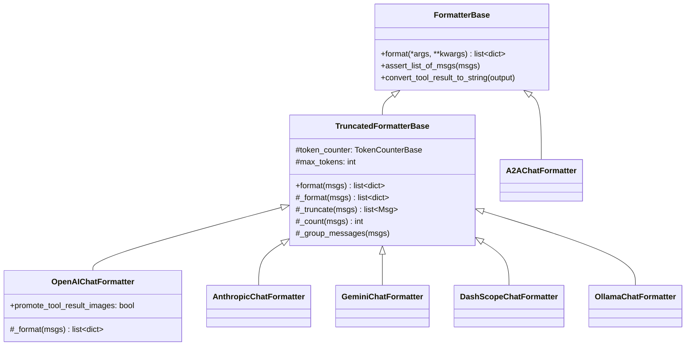

# 第 5 站：格式转换

> `prompt = await self.formatter.format(msgs=[...])` ——
> 记忆中的消息是框架内部的 `Msg` 对象，但 OpenAI、Anthropic、Gemini 等 LLM API 各有各的消息格式。
> Formatter（格式转换器）就是这座桥梁：它把 `Msg` 列表翻译成目标 API 能理解的 `list[dict]`，并在超出上下文窗口时自动截断。
> 你将理解为什么 Formatter 独立于 Model 存在、token 截断如何工作，以及一条 `Msg` 如何变成 OpenAI 的 `{"role": "user", "content": "..."}` 字典。

---

## 1. 路线图

我们正在追随 `await agent(msg)` 穿越 AgentScope 框架。上一站消息被检索和增强，现在到达 **"格式转换"** 站。

```mermaid
flowchart LR
    A["agentscope.init()"] --> B["Msg 创建"]
    B --> C["Agent 收信"]
    C --> D["Memory 存储"]
    D --> E["检索与知识"]
    E --> F["Formatter 格式化"]
    F --> G["Model 调用"]
    G --> H["Toolkit 执行"]
    H --> I["ReAct 循环"]
    I --> J["返回结果"]

    style A fill:#ddd,stroke:#333
    style B fill:#ddd,stroke:#333
    style C fill:#ddd,stroke:#333
    style D fill:#ddd,stroke:#333
    style E fill:#ddd,stroke:#333
    style F fill:#f9f,stroke:#333,stroke-width:2px
    style G fill:#ddd,stroke:#333
    style H fill:#ddd,stroke:#333
    style I fill:#ddd,stroke:#333
    style J fill:#ddd,stroke:#333
```



**本章聚焦**：上图中高亮的 `Formatter 格式化` 节点。从 `ReActAgent.reply()` 中格式转换的调用入口开始，逐层拆解 FormatterBase -> TruncatedFormatterBase -> OpenAIChatFormatter 的继承链。

调用发生在 `src/agentscope/agent/_react_agent.py:554`：

```python
# Convert Msg objects into the required format of the model API
prompt = await self.formatter.format(
    msgs=[
        Msg("system", self.sys_prompt, "system"),
        *await self.memory.get_memory(...),
    ],
)
```

**关键观察**：Formatter 接收的是一个 `Msg` 列表（系统提示 + 全部记忆消息），输出的是 `list[dict]`（API 就绪的字典列表）。中间发生了什么？本章将逐行拆解。

---

## 2. 源码入口

本章涉及的核心源文件：

| 文件 | 关键内容 | 行号参考 |
|------|----------|----------|
| `src/agentscope/formatter/_formatter_base.py` | `class FormatterBase` 基类 | :11 |
| `src/agentscope/formatter/_formatter_base.py` | `async format()` 抽象方法 | :15 |
| `src/agentscope/formatter/_formatter_base.py` | `convert_tool_result_to_string()` 多模态降级 | :37 |
| `src/agentscope/formatter/_truncated_formatter_base.py` | `class TruncatedFormatterBase` 截断基类 | :19 |
| `src/agentscope/formatter/_truncated_formatter_base.py` | `format()` 含截断逻辑 | :48 |
| `src/agentscope/formatter/_truncated_formatter_base.py` | `_truncate()` 消息裁剪 | :151 |
| `src/agentscope/formatter/_truncated_formatter_base.py` | `_group_messages()` 消息分组 | :231 |
| `src/agentscope/formatter/_openai_formatter.py` | `class OpenAIChatFormatter` OpenAI 格式 | :168 |
| `src/agentscope/formatter/_openai_formatter.py` | `async _format()` 核心转换 | :219 |
| `src/agentscope/formatter/_openai_formatter.py` | `class OpenAIMultiAgentFormatter` 多智能体 | :374 |
| `src/agentscope/token/_token_base.py` | `class TokenCounterBase` 计数基类 | :7 |
| `src/agentscope/token/_openai_token_counter.py` | `class OpenAITokenCounter` OpenAI 计数 | :297 |

---

## 3. 逐行阅读

### 3.1 FormatterBase：一切格式转换的起点

`src/agentscope/formatter/_formatter_base.py:11`

```python
class FormatterBase:
    """The base class for formatters."""

    @abstractmethod
    async def format(self, *args: Any, **kwargs: Any) -> list[dict[str, Any]]:
        """Format the Msg objects to a list of dictionaries that satisfy the
        API requirements."""
```

FormatterBase 是一个极简的抽象基类。它只定义了一个抽象方法 `format()`，签名非常宽泛（`*args, **kwargs`），具体的子类才决定参数的精确形态。

为什么签名这么宽松？因为不同 API 对"输入"的要求不同——OpenAI 需要 `list[Msg]`，但 A2A 协议可能需要额外的上下文参数。基类不预设约束。

**输入校验**：基类还提供了一个静态方法 `assert_list_of_msgs()`（:20），用于在转换之前验证输入确实是 `Msg` 对象列表：

```python
@staticmethod
def assert_list_of_msgs(msgs: list[Msg]) -> None:
    if not isinstance(msgs, list):
        raise TypeError("Input must be a list of Msg objects.")
    for msg in msgs:
        if not isinstance(msg, Msg):
            raise TypeError(f"Expected Msg object, got {type(msg)} instead.")
```

### 3.2 convert_tool_result_to_string：多模态降级

`src/agentscope/formatter/_formatter_base.py:37`

这是一个关键的工具方法。许多 LLM API 的 tool result 字段只支持纯文本，但 AgentScope 的工具可能返回图片、音频、视频。`convert_tool_result_to_string()` 的职责是：**把多模态内容降级为文本描述**。

```python
@staticmethod
def convert_tool_result_to_string(
    output: str | List[TextBlock | ImageBlock | AudioBlock | VideoBlock],
) -> tuple[str, Sequence[Tuple[str, ...]]]:
```

**工作流程**：

1. 如果输出已经是 `str`，直接返回（:71-72）
2. 遍历每个 block：
   - `text` 类型 → 提取文字（:81-82）
   - `image`/`audio`/`video` 类型 →
     - URL 来源：在文本中插入 `"The returned image can be found at: <url>"`（:92-95）
     - Base64 来源：先保存到本地文件，再插入文件路径（:100-107）
     - 同时将多模态数据收集到 `multimodal_data` 列表（:115-117）
3. 返回 `(textual_output, multimodal_data)` 元组

**设计意图**：这个方法不丢弃多模态数据。它把非文本内容"文本化"以满足 API 限制，同时把原始数据保存下来供后续使用（比如 OpenAI 的 `promote_tool_result_images` 功能会将图片重新插入到用户消息中）。

### 3.3 TruncatedFormatterBase：加上 token 感知

`src/agentscope/formatter/_truncated_formatter_base.py:19`

```python
class TruncatedFormatterBase(FormatterBase, ABC):
```

这一层引入了两个关键概念：**token 计数** 和 **自动截断**。

**构造函数**（:23-45）：

```python
def __init__(
    self,
    token_counter: TokenCounterBase | None = None,
    max_tokens: int | None = None,
) -> None:
    self.token_counter = token_counter
    assert max_tokens is None or 0 < max_tokens, "max_tokens must be greater than 0"
    self.max_tokens = max_tokens
```

两个参数都是可选的。如果都不提供，截断功能不生效——格式转换照常进行，只是不做 token 检查。

**核心 format() 方法**（:48-83）：

```python
@trace_format
async def format(self, msgs: list[Msg], **kwargs) -> list[dict[str, Any]]:
    self.assert_list_of_msgs(msgs)
    msgs = deepcopy(msgs)                       # ① 深拷贝，不修改原始消息

    while True:
        formatted_msgs = await self._format(msgs)   # ② 调用子类的格式转换
        n_tokens = await self._count(formatted_msgs) # ③ 计算 token 数

        if (
            n_tokens is None           # 没有计数器
            or self.max_tokens is None  # 没有上限
            or n_tokens <= self.max_tokens  # 没超限
        ):
            return formatted_msgs      # ④ 合格，返回

        msgs = await self._truncate(msgs)  # ⑤ 超限，截断后重试
```

这是一个 **while-true 重试循环**，逻辑清晰：

1. **深拷贝**（:69）——Formatter 会修改消息列表（比如插入 promoted 图片消息），深拷贝保护原始数据
2. **格式转换**（:72）——调用子类实现的 `_format()`
3. **Token 计数**（:73）——调用 `_count()` 计算已格式消息的 token 数
4. **判断是否合格**（:75-80）——三个条件任一满足就返回
5. **截断并重试**（:83）——从 `msgs` 头部丢弃消息，重新走格式转换

**注意**：这个循环在最坏情况下会多次调用 `_format()` 和 `_count()`，直到消息被截断到满足限制。对于正常长度的对话，循环只执行一次。

### 3.4 _truncate()：从头部丢弃消息

`src/agentscope/formatter/_truncated_formatter_base.py:151`

```python
async def _truncate(self, msgs: list[Msg]) -> list[Msg]:
```

截断策略非常直接：**从消息列表头部删除消息，保留系统提示和最新的消息**。

核心逻辑：

1. 如果系统提示（`msgs[0].role == "system"`）单独存在时已超限，抛出 `ValueError`（:184-186）
2. 维护一个 `tool_call_ids` 集合，跟踪尚未匹配的 tool call ID（:193）
3. 从头遍历消息：
   - 遇到 `tool_use` block → 将其 ID 加入集合
   - 遇到 `tool_result` block → 从集合中移除对应 ID
   - 当集合为空时 → 说明当前 tool 调用链已完整匹配，可以安全截断到此位置（:206-207）
4. 如果最终还有未匹配的 tool call，抛出错误（:209-213）

**为什么需要 tool_call_ids？** LLM API 要求 tool call 和 tool result 必须成对出现。如果只删掉 tool call 而保留 tool result（或反之），API 会报错。所以截断逻辑必须以完整的 tool 调用链为单位进行裁剪。

### 3.5 _group_messages()：消息分组

`src/agentscope/formatter/_truncated_formatter_base.py:231`

在多智能体场景中，消息需要分为两类处理：

- **`agent_message`**：普通对话消息，不含 tool 调用/结果
- **`tool_sequence`**：包含 `tool_use` 或 `tool_result` 的消息序列

```python
@staticmethod
async def _group_messages(msgs) -> AsyncGenerator[
    Tuple[Literal["tool_sequence", "agent_message"], list[Msg]], None
]:
```

这是一个异步生成器。它遍历消息列表，遇到类型切换时 yield 当前分组。例如：

```
[user_msg, assistant_msg, tool_use_msg, tool_result_msg, user_msg]
         ↓ 分组结果
(agent_message, [user_msg, assistant_msg])
(tool_sequence, [tool_use_msg, tool_result_msg])
(agent_message, [user_msg])
```

这种分组确保格式转换时能正确处理 tool 调用链和普通消息的不同需求。

### 3.6 OpenAIChatFormatter：翻译成 OpenAI 格式

`src/agentscope/formatter/_openai_formatter.py:168`

```python
class OpenAIChatFormatter(TruncatedFormatterBase):
```

这是最常用的 Formatter。它将 `Msg` 列表转换为 OpenAI Chat API 的 `messages` 格式。

**类属性**（:174-189）：

```python
support_tools_api: bool = True    # 支持 function calling
support_multiagent: bool = True   # 支持多智能体（通过 name 字段）
support_vision: bool = True       # 支持图片
supported_blocks: list[type] = [TextBlock, ImageBlock, AudioBlock, ToolUseBlock, ToolResultBlock]
```

**_format() 核心方法**（:219-371）：

这个方法遍历每条 `Msg`，根据内容 block 的类型分别处理：

| Block 类型 | 处理方式 | 代码位置 |
|-----------|----------|----------|
| `text` | 直接放入 `content_blocks` | :245-246 |
| `tool_use` | 转换为 `tool_calls` 列表 | :248-261 |
| `tool_result` | 调用 `convert_tool_result_to_string()` 降级，生成 `role: "tool"` 消息 | :263-278 |
| `image` | 调用 `_format_openai_image_block()` 转换 | :328-331 |
| `audio` | 调用 `_to_openai_audio_data()` 转换为 base64 | :335-347 |

**tool_use 的转换细节**（:248-261）：

```python
tool_calls.append({
    "id": block.get("id"),
    "type": "function",
    "function": {
        "name": block.get("name"),
        "arguments": json.dumps(block.get("input", {}), ensure_ascii=False),
    },
})
```

这里把 AgentScope 的 `ToolUseBlock` 翻译成 OpenAI 的 `tool_calls` 数组。`input` 字典被 `json.dumps()` 序列化为字符串——这是 OpenAI API 的要求。

**tool_result 的转换细节**（:263-278）：

```python
textual_output, multimodal_data = self.convert_tool_result_to_string(block["output"])
messages.append({
    "role": "tool",
    "tool_call_id": block.get("id"),
    "content": textual_output,
    "name": block.get("name"),
})
```

tool result 被转换为 OpenAI 的 `role: "tool"` 消息，`tool_call_id` 关联回对应的 tool call。

**最终输出结构**（:355-366）：

```python
msg_openai = {
    "role": msg.role,          # "system" / "user" / "assistant"
    "name": msg.name,          # 发送者名称（多智能体场景）
    "content": content_blocks or None,
}
if tool_calls:
    msg_openai["tool_calls"] = tool_calls
```

一条 `Msg(name="assistant", role="assistant", content=[TextBlock(...), ToolUseBlock(...)])` 最终变成：

```python
{
    "role": "assistant",
    "name": "assistant",
    "content": [{"type": "text", "text": "..."}],
    "tool_calls": [{"id": "...", "type": "function", "function": {"name": "...", "arguments": "..."}}]
}
```

### 3.7 OpenAIMultiAgentFormatter：多智能体的折叠策略

`src/agentscope/formatter/_openai_formatter.py:374`

```python
class OpenAIMultiAgentFormatter(TruncatedFormatterBase):
```

多智能体场景有一个独特挑战：OpenAI API 的 `role` 只有 `system`/`user`/`assistant` 三种，但对话中可能有 Alice、Bob、Charlie 三个不同 Agent。

**解决方案**：把多人的对话历史"折叠"进一个 `role: "user"` 消息中，用 `<history>` 标签包裹：

```python
# Conversation History
The content between <history></history> tags contains your conversation history
<history>
Alice: 你好，请问天气如何？
Bob: 让我查一下。
Alice: 北京今天晴天，25度。
</history>
```

`_format_agent_message()` 方法（:445-540）就是实现这个折叠：遍历所有非 tool 消息，把 `msg.name: block["text"]` 拼接起来，加上 `conversation_history_prompt` 前缀。

tool 序列则委托给 `OpenAIChatFormatter` 处理（:435-443），因为 tool 的格式与单智能体场景相同。

### 3.8 其他 Formatter：同一接口，不同方言

Formatter 目录下还有 6 个实现，它们都继承自 `TruncatedFormatterBase`，接口完全一致：

| Formatter | 文件 | 行号 |
|-----------|------|------|
| `AnthropicChatFormatter` | `_anthropic_formatter.py` | :98 |
| `GeminiChatFormatter` | `_gemini_formatter.py` | :108 |
| `DashScopeChatFormatter` | `_dashscope_formatter.py` | :159 |
| `OllamaChatFormatter` | `_ollama_formatter.py` | :73 |
| `DeepSeekChatFormatter` | `_deepseek_formatter.py` | :13 |
| `A2AChatFormatter` | `_a2a_formatter.py` | :31 |

每个 Formatter 的差异仅在于 `_format()` 的输出格式。例如 Anthropic 使用 `content: [{"type": "text", ...}]` 而非 OpenAI 的 `content: "string"`；Gemini 使用 `parts: [{"text": "..."}]` 而非 `content`。

继承关系一览：



注意 `A2AChatFormatter` 直接继承 `FormatterBase`（不经过截断层），因为 A2A 协议有自己的消息格式需求。

---

## 4. 设计一瞥

### "为什么 Formatter 独立于 Model？"

在许多 LLM 框架中，格式转换逻辑直接嵌在 Model 类里。AgentScope 将其抽取为独立的 Formatter，原因有三：

1. **复用**：同一个 Formatter 可以服务多个 Model 实例。比如 OpenAI 和 DeepSeek 都使用 OpenAI 兼容格式，共享 `OpenAIChatFormatter`。

2. **可测试**：Formatter 的输入是 `list[Msg]`，输出是 `list[dict]`。你可以不调用任何 API，只验证格式是否正确。这比在 Model 中嵌入格式逻辑更容易单元测试。

3. **关注点分离**：Model 负责"发送 HTTP 请求并解析响应"，Formatter 负责"翻译消息格式"。两者的变更理由不同——API 格式变了改 Formatter，网络层变了改 Model。

**ReActAgent 中的绑定关系**（`src/agentscope/agent/_react_agent.py:182,276`）：

```python
# 构造函数参数
formatter: FormatterBase,

# 存储为实例变量
self.formatter = formatter
```

Formatter 是在 Agent 构造时从外部注入的，而不是在 Agent 内部创建。这意味着同一个 Agent 类可以搭配不同的 Formatter 来适配不同的后端 API。

> **预告**：在第 4 卷第 33 章中，我们将深入讨论 Formatter 的设计模式，包括策略模式（Strategy Pattern）在这里的应用，以及如何为自定义 LLM 后端编写新的 Formatter。

---

## 5. 补充知识

### Token 计数是如何工作的

Formatter 的截断功能依赖 `TokenCounterBase`（`src/agentscope/token/_token_base.py:7`）：

```python
class TokenCounterBase:
    @abstractmethod
    async def count(self, messages: list[dict], **kwargs) -> int:
        """Count the number of tokens by the given model and messages."""
```

接口极简：输入格式化后的 `list[dict]`（不是 `Msg`），输出 token 总数。

AgentScope 提供了 5 种计数器实现：

| 计数器 | 文件 | 说明 |
|--------|------|------|
| `OpenAITokenCounter` | `_openai_token_counter.py:297` | 使用 tiktoken 库，支持视觉模型图片 token 计算 |
| `AnthropicTokenCounter` | `_anthropic_token_counter.py` | Anthropic 风格计数 |
| `GeminiTokenCounter` | `_gemini_token_counter.py` | Gemini 风格计数 |
| `HuggingFaceTokenCounter` | `_huggingface_token_counter.py` | 使用 HuggingFace tokenizer |
| `CharTokenCounter` | `_char_token_counter.py` | 按字符数估算，最简单的兜底方案 |

以 `OpenAITokenCounter` 为例（`src/agentscope/token/_openai_token_counter.py:297-384`）：

```python
class OpenAITokenCounter(TokenCounterBase):
    def __init__(self, model_name: str) -> None:
        self.model_name = model_name

    async def count(self, messages, tools=None, **kwargs) -> int:
        import tiktoken
        encoding = tiktoken.encoding_for_model(self.model_name)

        tokens_per_message = 3
        tokens_per_name = 1
        num_tokens = 3  # primer tokens

        for message in messages:
            num_tokens += tokens_per_message
            for key, value in message.items():
                if key == "content" and isinstance(value, list):
                    # 视觉模型：图片按 tile 计算
                    num_tokens += _count_content_tokens_for_openai_vision_model(...)
                elif isinstance(value, str):
                    num_tokens += len(encoding.encode(value))
                # ... tool_calls 等特殊字段
        return num_tokens
```

**图片 token 计算**值得单独说明。OpenAI 的视觉模型不按像素计费，而是按"瓦片"（tile）计费。算法步骤（:18-48）：

1. 将图片缩放到 2048x2048 范围内
2. 将短边缩放到 768 像素
3. 按 512x512 的瓦片划分
4. 总 token = 瓦片数 x tile_tokens + base_tokens

不同模型的 base/tile token 数不同（:82-118）：

| 模型 | base_tokens | tile_tokens |
|------|-------------|-------------|
| gpt-4o / gpt-4.1 / gpt-4.5 | 85 | 170 |
| o1 / o1-pro / o3 | 75 | 150 |
| gpt-4o-mini | 2833 | 5667 |

**截断触发时机**：只有当 `token_counter` 和 `max_tokens` **同时**提供时，截断才会生效。如果缺少任何一个，`_count()` 返回 `None`，`format()` 中的判断条件直接通过，不做截断。

---

## 6. 调试实践

### 打印 format() 的输出

在理解 Formatter 的工作时，最直观的方式是打印输入和输出：

```python
import asyncio
from agentscope.message import Msg
from agentscope.formatter import OpenAIChatFormatter

async def debug_format():
    formatter = OpenAIChatFormatter()

    # 构造一组简单的消息
    msgs = [
        Msg(name="system", content="You are a helpful assistant.", role="system"),
        Msg(name="user", content="What is the weather?", role="user"),
        Msg(name="assistant", content=[
            {"type": "text", "text": "Let me check."},
            {"type": "tool_use", "id": "call_001", "name": "get_weather",
             "input": {"city": "Beijing"}},
        ], role="assistant"),
        Msg(name="tool", content=[
            {"type": "tool_result", "id": "call_001", "name": "get_weather",
             "output": "Beijing: sunny, 25C"},
        ], role="tool"),
    ]

    result = await formatter.format(msgs=msgs)

    print("=== 输入：Msg 列表 ===")
    for msg in msgs:
        print(f"  Msg(name={msg.name}, role={msg.role}, blocks={len(msg.get_content_blocks())})")

    print("\n=== 输出：OpenAI API 字典列表 ===")
    import json
    for d in result:
        print(json.dumps(d, ensure_ascii=False, indent=2))

asyncio.run(debug_format())
```

**预期输出**：

```json
{"role": "system", "name": "system", "content": [{"type": "text", "text": "You are a helpful assistant."}]}
{"role": "user", "name": "user", "content": [{"type": "text", "text": "What is the weather?"}]}
{"role": "assistant", "name": "assistant", "content": [{"type": "text", "text": "Let me check."}], "tool_calls": [{"id": "call_001", "type": "function", "function": {"name": "get_weather", "arguments": "{\"city\": \"Beijing\"}"}}]}
{"role": "tool", "tool_call_id": "call_001", "content": "Beijing: sunny, 25C", "name": "get_weather"}
```

**对比观察点**：
1. `Msg` 的 `content` 字段变成了 `list[dict]` 中的 `content` 字段——格式不同
2. `tool_use` block 从 `Msg.content` 中提取出来，变成了 `tool_calls` 数组
3. `tool_result` block 变成了独立的 `role: "tool"` 消息
4. 每条消息增加了 `name` 字段（用于标识发送者）

### 观察 token 截断

```python
from agentscope.token import OpenAITokenCounter
from agentscope.formatter import OpenAIChatFormatter

async def debug_truncation():
    counter = OpenAITokenCounter("gpt-4o")
    formatter = OpenAIChatFormatter(token_counter=counter, max_tokens=50)

    # 构造大量消息
    msgs = [Msg(name="user", content=f"Message number {i}", role="user") for i in range(20)]
    msgs.insert(0, Msg(name="system", content="You are helpful.", role="system"))

    result = await formatter.format(msgs=msgs)
    print(f"Input: {len(msgs)} messages")
    print(f"Output: {len(result)} messages")
    print(f"Tokens: {await counter.count(result)}")

asyncio.run(debug_truncation())
```

你会看到输入 21 条消息，输出可能只有 2-3 条——早期的消息被截断了，因为 50 token 的上限非常小。

---

## 7. 检查点

你现在理解了 `Msg` 如何被转换为 API 格式。核心要点：

1. **FormatterBase** 定义了 `format()` 抽象接口——输入 `Msg`，输出 `list[dict]`
2. **TruncatedFormatterBase** 在基类上增加了 token 感知的截断——while 循环 + `_truncate()` 从头部裁剪
3. **OpenAIChatFormatter** 实现了具体的格式转换——text/image/audio/tool_use/tool_result 各有处理逻辑
4. **convert_tool_result_to_string()** 处理多模态降级——API 不支持的工具返回值被转为文本
5. **Formatter 独立于 Model**——通过外部注入实现解耦和复用

### 练习

1. **追踪一条图片消息**：构造一个包含 `ImageBlock`（URL 来源）的 `Msg`，用 `OpenAIChatFormatter` 格式化，观察图片 URL 如何被转换。如果是本地文件路径呢？（提示：看 `_format_openai_image_block()` 和 `_to_openai_image_url()`）

2. **模拟截断**：创建一个 `max_tokens=100` 的 `OpenAIChatFormatter`，传入 10 条长消息。打印每次 `_truncate()` 后的消息数量，验证从头部截断的行为。

3. **对比 Anthropic 格式**：阅读 `src/agentscope/formatter/_anthropic_formatter.py` 中的 `_format()` 方法，对比 OpenAI 的格式差异。重点关注 Anthropic 如何处理 `tool_use` 和 `tool_result`。

4. **阅读 `_group_messages()`**：手动构造一组交替出现的 `agent_message` 和 `tool_sequence` 消息，模拟 `_group_messages()` 的分组逻辑，验证 yield 的结果。

---

## 8. 下一站预告

格式转换完毕。`self.formatter.format()` 返回的 `list[dict]` 已经就绪，接下来就是向 LLM 发起调用。

在下一站——**第 6 站：模型调用**——我们将跟踪这个 `list[dict]` 如何被传入 Model 层，HTTP 请求如何构建，流式响应如何处理，以及 `ChatResponse` 如何被解析回框架内部的 `Msg` 对象。

从 Agent 到 API 的旅程已经完成了一半：消息创建 → 记忆存储 → 检索增强 → **格式转换** → 模型调用。
