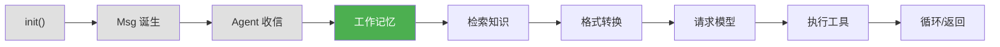
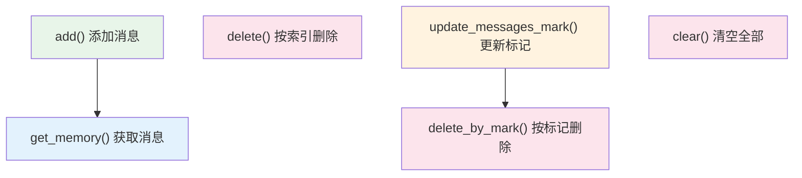
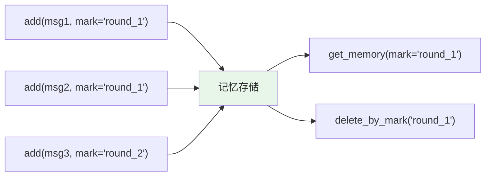

# 第 6 章 第 3 站：工作记忆

> **追踪线**：Agent 收到消息后，需要把它存起来。记忆是怎么工作的？
> 本章你将理解：工作记忆的 add/get/delete 机制、mark 系统。

---

## 6.1 路线图



绿色是当前位置——消息被存入工作记忆。

> **源码验证日期**: 2026-05-11, commit `f17cfd0a`

---

## 6.2 知识补全：本章无新增

工作记忆的源码不涉及特殊的 Python 进阶知识。唯一需要注意的是 `async` 方法——记忆操作是异步的，因为某些实现（如数据库存储）涉及 IO 操作。

---

## 6.3 源码入口

| 文件 | 内容 |
|------|------|
| `src/agentscope/memory/_working_memory/_base.py` | `MemoryBase` 基类 |
| `src/agentscope/memory/_working_memory/_in_memory_memory.py` | `InMemoryMemory` 实现 |

---

## 6.4 逐行阅读

### 工作记忆是什么？

Agent 的记忆分两种：

| 类型 | 用途 | 存储 |
|------|------|------|
| 工作记忆 | 当前对话的消息历史 | 内存或数据库 |
| 长期记忆 | 跨对话的知识和经验 | 向量数据库、知识库 |

本章关注工作记忆。它就像 Agent 的"短期记忆"——记住当前对话中说过的所有话。

### MemoryBase 基类

打开 `src/agentscope/memory/_working_memory/_base.py`：

```python
class MemoryBase:
    async def add(self, messages: Msg | list[Msg], ...) -> None:
        """Add messages to memory."""

    async def delete(self, index: int | str | list[int]) -> None:
        """Delete messages by index or mark."""

    async def delete_by_mark(self, mark: str) -> None:
        """Delete messages by mark."""

    async def update_messages_mark(self, mark: str, ...) -> None:
        """Update the mark of messages."""

    async def clear(self) -> None:
        """Clear all messages."""

    async def get_memory(self, ...) -> list[Msg]:
        """Get messages from memory."""
```

6 个核心方法，定义了工作记忆的完整接口：



### InMemoryMemory 实现

最简单的实现是 `InMemoryMemory`，把消息存在 Python 列表中：

```python
class InMemoryMemory(MemoryBase):
    async def get_memory(
        self,
        recent_n: int | None = None,
        ...
    ) -> list[Msg]:
        ...
```

#### add()：添加消息

```python
async def add(
    self,
    messages: Msg | list[Msg],
    rank: float | None = None,
    mark: str | None = None,
) -> None:
```

参数说明：

| 参数 | 含义 |
|------|------|
| `messages` | 要添加的消息（单条或列表） |
| `rank` | 优先级排序分数（可选） |
| `mark` | 标记，用于后续按标记操作（可选） |

添加时，每条消息被包装成一个内部数据结构，包含原始消息、索引、rank 和 mark：

```python
# 简化的内部结构
internal_msg = {
    "index": self._next_index,    # 自增索引
    "message": message,           # 原始 Msg 对象
    "rank": rank,                 # 排序分数
    "mark": mark,                 # 标记
}
self._storage.append(internal_msg)
```

#### get_memory()：获取消息

```python
async def get_memory(
    self,
    recent_n: int | None = None,
    mark: str | None = None,
) -> list[Msg]:
```

支持两种筛选：

- `recent_n`：只获取最近 N 条消息
- `mark`：只获取带特定标记的消息

如果都不指定，返回所有消息。

```python
# 获取全部
all_msgs = await memory.get_memory()

# 获取最近 5 条
recent = await memory.get_memory(recent_n=5)

# 获取带 "important" 标记的
important = await memory.get_memory(mark="important")
```

#### delete()：删除消息

```python
async def delete(self, index: int | str | list[int]) -> None:
```

支持三种删除方式：

```python
# 按索引删除
await memory.delete(3)          # 删除索引 3 的消息

# 按 mark 删除（传入字符串会被当作 mark）
await memory.delete("round_1")  # 删除标记为 "round_1" 的所有消息

# 批量删除
await memory.delete([1, 3, 5])  # 删除索引 1、3、5 的消息
```

#### mark 系统

mark 是工作记忆的特色功能——给消息打标签，然后按标签批量操作。



mark 的典型用法：

```python
# 第一轮对话
await memory.add(user_msg, mark="round_1")
await memory.add(agent_msg, mark="round_1")

# 第二轮对话
await memory.add(user_msg2, mark="round_2")

# 删除第一轮的所有消息
await memory.delete_by_mark("round_1")
```

这比按索引删除更安全——不需要知道消息的确切位置。

#### update_messages_mark()：更新标记

```python
async def update_messages_mark(
    self,
    mark: str,
    new_mark: str | None = None,
    index: int | list[int] | None = None,
) -> None:
```

可以给已有的消息添加或修改标记：

```python
# 给索引 5 的消息添加标记
await memory.update_messages_mark("important", index=5)

# 把标记 "round_1" 改为 "archived"
await memory.update_messages_mark("round_1", new_mark="archived")
```

---

## 6.5 调试实践

### 查看记忆的完整内容

```python
from agentscope.memory import InMemoryMemory
from agentscope.message import Msg

memory = InMemoryMemory()

# 添加几条消息
await memory.add(Msg("user", "你好", "user"), mark="round_1")
await memory.add(Msg("assistant", "你好！有什么可以帮你的？", "assistant"), mark="round_1")
await memory.add(Msg("user", "天气怎么样？", "user"), mark="round_2")

# 查看全部
all_msgs = await memory.get_memory()
print(f"共 {len(all_msgs)} 条消息")
for msg in all_msgs:
    print(f"  [{msg.role}] {msg.content}")
```

### 观察记忆的变化

在 `InMemoryMemory.add()` 中加 print：

```python
async def add(self, messages, rank=None, mark=None):
    print(f"[MEM] 添加消息: mark={mark}, content={repr(messages.content)[:30]}")  # 加这行
    ...
```

---

## 6.6 试一试

### 用 mark 管理对话轮次

```python
from agentscope.memory import InMemoryMemory
from agentscope.message import Msg

memory = InMemoryMemory()

# 模拟 3 轮对话
for i in range(3):
    await memory.add(Msg("user", f"第 {i+1} 轮问题", "user"), mark=f"round_{i+1}")
    await memory.add(Msg("assistant", f"第 {i+1} 轮回答", "assistant"), mark=f"round_{i+1}")

# 查看全部
print("全部消息:")
for msg in await memory.get_memory():
    print(f"  [{msg.role}] {msg.content}")

# 只看第 2 轮
print("\n第 2 轮:")
for msg in await memory.get_memory(mark="round_2"):
    print(f"  [{msg.role}] {msg.content}")

# 删除第 1 轮
await memory.delete_by_mark("round_1")
print(f"\n删除 round_1 后剩余: {len(await memory.get_memory())} 条")
```

### 在源码中观察索引自增

打开 `src/agentscope/memory/_working_memory/_in_memory_memory.py`，在 `add()` 方法中找到索引递增的地方，加 print：

```python
# 找到类似这样的代码
self._next_index += 1
print(f"[MEM] 索引递增到 {self._next_index}")  # 加这行
```

每添加一条消息，你会看到索引递增。

---

## 6.7 检查点

你现在已经理解了：

- **工作记忆**：Agent 的"短期记忆"，存储当前对话的消息历史
- **MemoryBase 接口**：add、get_memory、delete、clear 六个核心方法
- **InMemoryMemory**：基于 Python 列表的最简实现
- **mark 系统**：给消息打标签，按标签批量操作（查询、删除、更新）
- **rank 排序**：给消息设置优先级分数

**自检练习**：
1. 如果你想保留最近 10 条消息但删除更早的，怎么做？（提示：`get_memory()` + `delete()`）
2. mark 和 index 的区别是什么？什么场景用 mark 更方便？

---

## 下一站预告

消息已经存入记忆。下一站，Agent 可能需要从知识库中检索相关信息。
