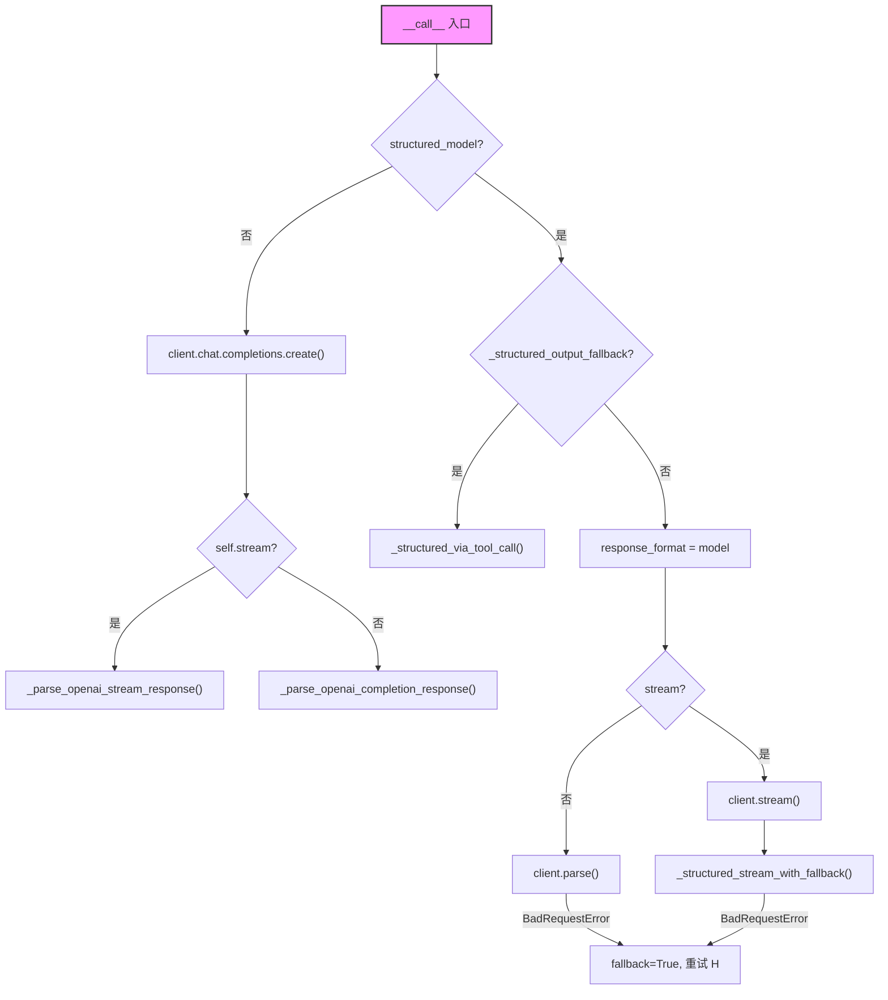

# 第 6 站：调用模型

> `response = await self.model(prompt, tools=tools)` ——
> Formatter 已经把 `Msg` 列表翻译成了 `list[dict]`，接下来就是真正向 LLM 发起 HTTP 请求了。
> Model 层是整个框架中最接近外部 API 的地方：它拿到字典列表、工具 schema、工具选择策略，
> 通过 OpenAI SDK 发出请求，再把 SSE 流式响应逐块解析成 `ChatResponse`。
> 你将理解流式与非流式两条路径的差异、四种 ContentBlock 如何从原始 JSON 中提取、
> 以及结构化输出（structured output）为何有两条实现路径。

---

## 1. 路线图

我们正在追随 `await agent(msg)` 穿越 AgentScope 框架。上一站消息被格式化成了 API 字典，现在到达 **"调用模型"** 站。

```mermaid
flowchart LR
    A["agentscope.init()"] --> B["Msg 创建"]
    B --> C["Agent 收信"]
    C --> D["Memory 存储"]
    D --> E["检索与知识"]
    E --> F["Formatter 格式化"]
    F --> G["Model 调用"]
    G --> H["Toolkit 执行"]
    H --> I["ReAct 循环"]
    I --> J["返回结果"]

    style A fill:#ddd,stroke:#333
    style B fill:#ddd,stroke:#333
    style C fill:#ddd,stroke:#333
    style D fill:#ddd,stroke:#333
    style E fill:#ddd,stroke:#333
    style F fill:#ddd,stroke:#333
    style G fill:#f9f,stroke:#333,stroke-width:2px
    style H fill:#ddd,stroke:#333
    style I fill:#ddd,stroke:#333
    style J fill:#ddd,stroke:#333
```



**本章聚焦**：上图中高亮的 `Model 调用` 节点。调用发生在 `ReActAgent.reply()` 中，紧跟 Formatter 之后：

```python
# src/agentscope/agent/_react_agent.py
response = await self.model(
    prompt,
    tools=tool_schemas,
    tool_choice=tool_choice,
)
```

**关键观察**：`self.model` 是一个 `ChatModelBase` 实例，它不知道 `Msg` 的存在——只接收 `list[dict]`。返回值可能是单个 `ChatResponse`，也可能是 `AsyncGenerator[ChatResponse, None]`（流式）。中间发生了什么？本章逐行拆解。

---

## 2. 源码入口

本章涉及的核心源文件：

| 文件 | 关键内容 | 行号参考 |
|------|----------|----------|
| `src/agentscope/model/_model_base.py` | `class ChatModelBase` 基类 | :13 |
| `src/agentscope/model/_model_base.py` | `async __call__()` 抽象方法 | :38 |
| `src/agentscope/model/_model_base.py` | `_validate_tool_choice()` 工具选择校验 | :46 |
| `src/agentscope/model/_openai_model.py` | `class OpenAIChatModel` OpenAI 模型 | :71 |
| `src/agentscope/model/_openai_model.py` | `async __call__()` 主入口 | :176 |
| `src/agentscope/model/_openai_model.py` | `_parse_openai_stream_response()` 流式解析 | :346 |
| `src/agentscope/model/_openai_model.py` | `_parse_openai_completion_response()` 非流式解析 | :561 |
| `src/agentscope/model/_openai_model.py` | `_structured_via_tool_call()` 结构化输出回退 | :730 |
| `src/agentscope/model/_model_response.py` | `class ChatResponse` 响应对象 | :20 |
| `src/agentscope/model/_model_usage.py` | `class ChatUsage` 用量统计 | :10 |
| `src/agentscope/message/_message_block.py` | `TextBlock / ThinkingBlock / ToolUseBlock / AudioBlock` | :9-66 |
| `src/agentscope/_utils/_common.py` | `_json_loads_with_repair()` JSON 修复 | :31 |
| `src/agentscope/_utils/_common.py` | `_parse_streaming_json_dict()` 流式 JSON 解析 | :72 |

---

## 3. 逐行阅读

### 3.1 ChatModelBase：统一的模型接口

`src/agentscope/model/_model_base.py:13`

```python
class ChatModelBase:
    """Base class for chat models."""

    model_name: str
    """The model name"""

    stream: bool
    """Is the model output streaming or not"""

    def __init__(
        self,
        model_name: str,
        stream: bool,
    ) -> None:
        self.model_name = model_name
        self.stream = stream

    @abstractmethod
    async def __call__(
        self,
        *args: Any,
        **kwargs: Any,
    ) -> ChatResponse | AsyncGenerator[ChatResponse, None]:
        pass
```

整个模型层只定义了两个属性和一个抽象方法：

- **`model_name`**：模型标识符，例如 `"gpt-4o"`、`"deepseek-chat"`。它会被直接传给 API 的 `model` 参数。
- **`stream`**：是否使用流式输出。这个布尔值决定了 `__call__` 返回的是单个 `ChatResponse` 还是 `AsyncGenerator`。
- **`__call__`**：统一的调用接口。Agent 不需要知道自己在用哪个模型厂商——只要调用 `await model(messages, tools=...)` 就行。

注意返回类型的联合体：`ChatResponse | AsyncGenerator[ChatResponse, None]`。调用方（Agent）需要根据 `model.stream` 判断如何消费结果。这不是最优雅的设计（后面会讨论），但它避免了为流式和非流式维护两套接口。

**工具选择校验**——`_validate_tool_choice` 在同一文件 :46：

```python
_TOOL_CHOICE_MODES = ["auto", "none", "required"]

def _validate_tool_choice(
    self,
    tool_choice: str,
    tools: list[dict] | None,
) -> None:
    if not isinstance(tool_choice, str):
        raise TypeError(f"tool_choice must be str, got {type(tool_choice)}")
    if tool_choice in _TOOL_CHOICE_MODES:
        return
    # 如果不是预设模式，检查是否是某个工具函数名
    available_functions = [tool["function"]["name"] for tool in tools]
    if tool_choice not in available_functions:
        all_options = _TOOL_CHOICE_MODES + available_functions
        raise ValueError(
            f"Invalid tool_choice '{tool_choice}'. "
            f"Available options: {', '.join(sorted(all_options))}",
        )
```

逻辑很清晰：`tool_choice` 要么是三个预设模式之一（`"auto"` 让模型自己决定、`"none"` 禁用工具、`"required"` 强制调用工具），要么是某个已注册工具的函数名。这个校验在 `OpenAIChatModel.__call__` 中被调用，确保在发 HTTP 请求之前就拦截无效参数。

### 3.2 OpenAIChatModel.\_\_call\_\_：向 API 发起请求

`src/agentscope/model/_openai_model.py:71`

`OpenAIChatModel` 继承 `ChatModelBase`，是框架中对 OpenAI API 的完整封装。先看初始化：

```python
class OpenAIChatModel(ChatModelBase):
    def __init__(
        self,
        model_name: str,
        api_key: str | None = None,
        stream: bool = True,
        reasoning_effort: Literal["low", "medium", "high"] | None = None,
        organization: str = None,
        stream_tool_parsing: bool = True,
        client_type: Literal["openai", "azure"] = "openai",
        client_kwargs: dict | None = None,
        generate_kwargs: dict | None = None,
        **kwargs: Any,
    ) -> None:
```

几个值得注意的参数：

- **`stream=True`**：默认流式。大部分场景下 Agent 需要尽快拿到部分结果来决定下一步动作。
- **`reasoning_effort`**：为 o3、o4 等推理模型提供的参数，控制推理深度。
- **`stream_tool_parsing=True`**：流式场景下是否实时解析不完整的 JSON。开启时，工具调用的 `input` 字段会随每个 chunk 逐步修复；关闭时，`input` 保持 `{}` 直到最终 chunk。
- **`client_type`**：支持 `"openai"` 和 `"azure"` 两种客户端。很多企业使用 Azure OpenAI Service，这里用同一参数切换。
- **`_structured_output_fallback = False`**：一个实例级标志，记录是否已经遇到过 `response_format` 不支持的 API 错误，后续调用直接走 tool-call 回退路径。

初始化的核心是创建 `openai.AsyncClient`：

```python
if client_type == "azure":
    self.client = openai.AsyncAzureOpenAI(
        api_key=api_key,
        organization=organization,
        **(client_kwargs or {}),
    )
else:
    self.client = openai.AsyncClient(
        api_key=api_key,
        organization=organization,
        **(client_kwargs or {}),
    )
```

这里用的是 **异步客户端**（`AsyncClient`），因为框架所有 Agent 操作都是 `async` 的。

**主调用入口** `__call__`（:176）签名：

```python
@trace_llm
async def __call__(
    self,
    messages: list[dict],
    tools: list[dict] | None = None,
    tool_choice: Literal["auto", "none", "required"] | str | None = None,
    structured_model: Type[BaseModel] | None = None,
    **kwargs: Any,
) -> ChatResponse | AsyncGenerator[ChatResponse, None]:
```

`@trace_llm` 装饰器来自 `tracing` 模块，为每次模型调用添加 OpenTelemetry 追踪。输入参数：

- **`messages`**：`list[dict]`，Formatter 输出的字典列表。每个字典包含 `role` 和 `content`。
- **`tools`**：工具 JSON schema 列表。从 `Toolkit` 获取的原始 schema 会被直接传给 API。
- **`tool_choice`**：工具选择策略。
- **`structured_model`**：Pydantic `BaseModel` 类，用于结构化输出。当提供时，`tools` 和 `tool_choice` 被忽略。

方法体首先构建请求参数：

```python
kwargs = {
    "model": self.model_name,
    "messages": messages,
    "stream": self.stream,
    **self.generate_kwargs,
    **kwargs,
}
if self.reasoning_effort and "reasoning_effort" not in kwargs:
    kwargs["reasoning_effort"] = self.reasoning_effort

if tools:
    kwargs["tools"] = self._format_tools_json_schemas(tools)

if tool_choice:
    # 处理已废弃的 "any" 选项
    if tool_choice == "any":
        warnings.warn('"any" is deprecated...', DeprecationWarning)
        tool_choice = "required"
    self._validate_tool_choice(tool_choice, tools)
    kwargs["tool_choice"] = self._format_tool_choice(tool_choice)

if self.stream:
    kwargs["stream_options"] = {"include_usage": True}
```

**`stream_options`** 是关键细节：`include_usage=True` 让 API 在流的最后一个 chunk 中返回 token 用量信息。没有这个选项，流式场景下你拿不到 `input_tokens` 和 `output_tokens`。

接下来根据是否需要结构化输出，分三条路径：



**路径一：普通调用**（:327）

```python
response = await self.client.chat.completions.create(**kwargs)
```

标准的 OpenAI SDK 调用。根据 `self.stream` 决定 `response` 是 `AsyncStream` 还是 `ChatCompletion`。

**路径二：结构化输出 —— response_format 方式**（:294-309）

```python
kwargs["response_format"] = structured_model
if not self.stream:
    response = await self.client.chat.completions.parse(**kwargs)
else:
    response = self.client.chat.completions.stream(**kwargs)
    return self._structured_stream_with_fallback(
        start_datetime, response, structured_model, kwargs,
    )
```

这是 OpenAI 原生支持的 `response_format` 方式：直接把 Pydantic 模型传给 API，API 返回符合 schema 的 JSON。非流式用 `parse()`，流式用 `stream()`。

**路径三：结构化输出 —— tool-call 回退**（:730）

```python
async def _structured_via_tool_call(self, kwargs, structured_model, start_datetime):
    format_tool = _create_tool_from_base_model(structured_model)
    kwargs["tools"] = self._format_tools_json_schemas([format_tool])
    kwargs["tool_choice"] = self._format_tool_choice(
        format_tool["function"]["name"],
    )
    response = await self.client.chat.completions.create(**kwargs)
```

当 API 不支持 `response_format` 时（例如 DeepSeek、DashScope），框架自动把 Pydantic 模型转成一个"假工具"：schema 就是模型字段定义，`tool_choice` 强制指定这个工具。模型以为自己是在调用工具函数，实际上是在生成结构化 JSON。

这种回退是**自动的**：第一次尝试 `response_format` 失败时捕获 `BadRequestError`，设置 `self._structured_output_fallback = True`，后续所有调用直接走 tool-call 路径，不再浪费时间尝试。这是一个很好的"记忆式降级"模式。

### 3.3 流式响应解析：_parse_openai_stream_response

`src/agentscope/model/_openai_model.py:346`

这是本章最复杂的方法。它的任务是从 SSE（Server-Sent Events）流中提取出 `ChatResponse` 对象序列。

先看方法签名和核心状态变量：

```python
async def _parse_openai_stream_response(
    self,
    start_datetime: datetime,
    response: AsyncStream,
    structured_model: Type[BaseModel] | None = None,
) -> AsyncGenerator[ChatResponse, None]:
```

```python
usage, res = None, None
response_id: str | None = None
text = ""          # 累积的文本内容
thinking = ""      # 累积的推理内容
audio = ""         # 累积的音频数据（base64）
tool_calls = OrderedDict()  # 累积的工具调用，按 index 排序
contents: List[TextBlock | ToolUseBlock | ThinkingBlock | AudioBlock] = []
```

**关键设计**：这些变量是跨 chunk 累积的。每个 SSE chunk 只包含增量（delta），而不是完整内容。框架需要在内存中维护"到目前为止的完整状态"，每次 yield 时都生成包含完整累积内容的 `ChatResponse`。

**遍历流的核心循环**：

```python
async with response as stream:
    async for item in stream:
        # 结构化输出的流格式略有不同
        if structured_model and not self._structured_output_fallback:
            if item.type != "chunk":
                continue
            chunk = item.chunk
        else:
            chunk = item
```

对于每个 chunk，首先提取 `response_id` 和 `usage`：

```python
if response_id is None:
    response_id = getattr(chunk, "id", None)

if chunk.usage:
    usage = ChatUsage(
        input_tokens=chunk.usage.prompt_tokens,
        output_tokens=chunk.usage.completion_tokens,
        time=(datetime.now() - start_datetime).total_seconds(),
        metadata=chunk.usage,
    )
```

`usage` 只在流的最后一个 chunk 中出现（因为前面设了 `stream_options: include_usage`）。如果当前 chunk 没有 `choices`（纯 usage chunk），直接跳过内容解析，只 yield 带 usage 的最终结果。

**内容累积**——四种内容类型并行处理：

```python
choice = chunk.choices[0]

# 1. 推理内容（reasoning_content 或 reasoning）
delta_reasoning = getattr(choice.delta, "reasoning_content", None)
if not isinstance(delta_reasoning, str):
    delta_reasoning = getattr(choice.delta, "reasoning", None)
if not isinstance(delta_reasoning, str):
    delta_reasoning = ""
thinking += delta_reasoning

# 2. 文本内容
text += getattr(choice.delta, "content", None) or ""

# 3. 音频数据
if hasattr(choice.delta, "audio") and "data" in choice.delta.audio:
    audio += choice.delta.audio["data"]
if hasattr(choice.delta, "audio") and "transcript" in choice.delta.audio:
    text += choice.delta.audio["transcript"]

# 4. 工具调用
for tool_call in (getattr(choice.delta, "tool_calls", None) or []):
    if tool_call.index in tool_calls:
        # 已有索引：追加 arguments
        if tool_call.function.arguments is not None:
            tool_calls[tool_call.index]["input"] += tool_call.function.arguments
    else:
        # 新索引：创建记录
        tool_calls[tool_call.index] = {
            "type": "tool_use",
            "id": tool_call.id,
            "name": tool_call.function.name,
            "input": tool_call.function.arguments or "",
        }
```

工具调用的累积特别值得注意：OpenAI 的流式协议中，同一个工具调用的 `id` 和 `name` 只在第一个 chunk 中出现，后续 chunk 只带 `arguments` 片段。`OrderedDict` 按 `index` 键维护，确保工具调用按模型输出的顺序排列。

**构建 contents 列表并 yield**：

每次循环末尾，把所有累积内容组装成 content blocks：

```python
contents = []

if thinking:
    contents.append(ThinkingBlock(type="thinking", thinking=thinking))

if audio:
    contents.append(AudioBlock(
        type="audio",
        source=Base64Source(data=audio, media_type=f"audio/{media_type}", type="base64"),
    ))

if text:
    contents.append(TextBlock(type="text", text=text))
    if structured_model:
        metadata = _json_loads_with_repair(text)

for tool_call in tool_calls.values():
    input_str = tool_call["input"]
    tool_id = tool_call["id"]

    if self.stream_tool_parsing:
        # 实时修复不完整 JSON
        repaired_input = _parse_streaming_json_dict(
            input_str,
            last_input_objs.get(tool_id),
        )
        last_input_objs[tool_id] = repaired_input
    else:
        repaired_input = {}

    contents.append(ToolUseBlock(
        type=tool_call["type"],
        id=tool_id,
        name=tool_call["name"],
        input=repaired_input,
        raw_input=input_str,
    ))

if contents:
    res = ChatResponse(content=contents, usage=usage, metadata=metadata, ...)
    yield res
    last_contents = copy.deepcopy(contents)
```

**为什么每次 yield 都包含完整累积内容？** 因为调用方（Agent）需要知道"到目前为止模型说了什么"，而不是只看到最后一个 delta。每次 yield 的 `ChatResponse` 都是一个完整的快照。

**stream_tool_parsing 的区别**：当 `stream_tool_parsing=True` 时，`_parse_streaming_json_dict` 会尝试把不完整的 JSON（比如 `'{"city": "Shangh'`）修复成有效字典（`{"city": "Shangh"}`）。这样 Agent 可以在流式过程中就拿到工具输入参数的"最佳猜测"，提前准备工具执行。如果关闭，`input` 始终为 `{}` 直到最终 chunk。

循环结束后，如果 `stream_tool_parsing=False`，还有一个收尾 yield：

```python
if not self.stream_tool_parsing and tool_calls and last_contents:
    for block in last_contents:
        if block.get("type") == "tool_use":
            block["input"] = _json_loads_with_repair(
                str(block.get("raw_input") or "{}"),
            )
    yield ChatResponse(content=last_contents, usage=usage, ...)
```

这时才用完整的 `raw_input` 做一次最终 JSON 解析。

### 3.4 非流式响应解析：_parse_openai_completion_response

`src/agentscope/model/_openai_model.py:561`

非流式路径简单得多——只需要处理一个完整的 `ChatCompletion` 对象：

```python
def _parse_openai_completion_response(
    self,
    start_datetime: datetime,
    response: ChatCompletion,
    structured_model: Type[BaseModel] | None = None,
) -> ChatResponse:
```

逻辑和流式版本类似，但不需要累积：

```python
if response.choices:
    choice = response.choices[0]

    # 推理内容
    reasoning = getattr(choice.message, "reasoning_content", None)
    if not isinstance(reasoning, str):
        reasoning = getattr(choice.message, "reasoning", None)
    if reasoning is not None:
        content_blocks.append(ThinkingBlock(type="thinking", thinking=reasoning))

    # 文本内容
    if choice.message.content:
        content_blocks.append(TextBlock(type="text", text=choice.message.content))

    # 音频
    if choice.message.audio:
        content_blocks.append(AudioBlock(...))
        if choice.message.audio.transcript:
            content_blocks.append(TextBlock(type="text", text=...))

    # 工具调用
    for tool_call in choice.message.tool_calls or []:
        content_blocks.append(ToolUseBlock(
            type="tool_use",
            id=tool_call.id,
            name=tool_call.function.name,
            input=_json_loads_with_repair(tool_call.function.arguments),
        ))
```

注意这里不需要 `_parse_streaming_json_dict`——因为 `tool_call.function.arguments` 已经是完整的 JSON 字符串，直接用 `_json_loads_with_repair` 解析即可。

### 3.5 ChatResponse：模型的统一返回格式

`src/agentscope/model/_model_response.py:20`

```python
@dataclass
class ChatResponse(DictMixin):
    """The response of chat models."""

    content: Sequence[TextBlock | ToolUseBlock | ThinkingBlock | AudioBlock]
    """The content of the chat response"""

    id: str = field(default_factory=lambda: _get_timestamp(True))
    """The unique identifier"""

    created_at: str = field(default_factory=_get_timestamp)
    """When the response was created"""

    type: Literal["chat"] = field(default_factory=lambda: "chat")
    """The type of the response, always 'chat'."""

    usage: ChatUsage | None = field(default_factory=lambda: None)
    """The usage information"""

    metadata: dict[str, JSONSerializableObject] | None = field(
        default_factory=lambda: None,
    )
    """The metadata"""
```

`ChatResponse` 是模型层返回给 Agent 的标准数据结构。不管底层是 OpenAI、Anthropic 还是 Gemini，Agent 看到的都是同一个 `ChatResponse`。

**content 字段**：一个 `Sequence`，可以同时包含多种 block。例如一次响应可能同时有推理（`ThinkingBlock`）和文本（`TextBlock`），或者文本和工具调用（`ToolUseBlock`）。Agent 遍历 `content` 列表，根据 `block["type"]` 分别处理。

**DictMixin** 继承自 `dict`（`src/agentscope/_utils/_mixin.py:5`）：

```python
class DictMixin(dict):
    """The dictionary mixin that allows attribute-style access."""
    __setattr__ = dict.__setitem__
    __getattr__ = dict.__getitem__
```

这让 `ChatResponse` 同时支持 `response.content` 和 `response["content"]` 两种访问方式。因为底层 content blocks 是 `TypedDict`，也支持字典式访问，所以整个响应链都是"字典优先"的设计。

**ChatUsage**（`src/agentscope/model/_model_usage.py:10`）：

```python
@dataclass
class ChatUsage(DictMixin):
    input_tokens: int
    output_tokens: int
    time: float
    type: Literal["chat"] = "chat"
    metadata: dict[str, Any] | None = None
```

`time` 字段记录从请求发起到收到响应的耗时（秒）。在流式场景下，这个值在最后一个 chunk 才计算。

### 3.6 四种 ContentBlock 的结构

所有 block 定义在 `src/agentscope/message/_message_block.py`，使用 `TypedDict`：

| Block 类型 | 判别字段 | 核心字段 | 来源 |
|------------|----------|----------|------|
| `TextBlock` | `type="text"` | `text: str` | `choice.delta.content` |
| `ThinkingBlock` | `type="thinking"` | `thinking: str` | `choice.delta.reasoning_content` |
| `ToolUseBlock` | `type="tool_use"` | `id`, `name`, `input`, `raw_input` | `choice.delta.tool_calls` |
| `AudioBlock` | `type="audio"` | `source: Base64Source` | `choice.delta.audio` |

`TypedDict` 的选择值得注意：这些不是普通类实例，而是类型化的字典。配合 `DictMixin`，整个响应数据可以无损序列化为 JSON，也可以用属性语法访问。这是框架在"开发者体验"和"序列化友好"之间的折中。

---

## 4. 设计一瞥：为什么用 AsyncGenerator 而不是一次性返回？

`ChatModelBase.__call__` 的返回类型是 `ChatResponse | AsyncGenerator[ChatResponse, None]`。为什么不让所有模型都一次性返回 `ChatResponse`？

**原因一：实时性**。LLM 生成一个完整响应可能需要 10-30 秒。在 ReAct 循环中，Agent 需要在模型输出过程中就展示进度（比如逐步显示思考过程或文本），而不是让用户盯着空白等待。流式 generator 让调用方在第一个 chunk 到达时就能开始处理。

**原因二：工具调用前置处理**。在 `stream_tool_parsing=True` 时，Agent 可以在工具参数还没完全生成时就看到部分解析结果，提前准备工具执行环境。

**原因三：网络效率**。SSE 流式传输在第一个 token 生成时就开始推送数据，而一次性返回需要等所有 token 生成完毕。对长时间生成的响应，流式能显著降低首字节延迟（TTFB）。

**代价**：调用方需要区分两种返回类型。在 `ReActAgent` 中，你会看到类似这样的消费逻辑：

```python
response = await self.model(prompt, tools=tools)
if isinstance(response, AsyncGenerator):
    async for chunk in response:
        # 逐步处理每个 chunk
        ...
else:
    # 直接处理单个 ChatResponse
    ...
```

这不是最优雅的 API（更理想的是统一返回 `AsyncGenerator`，非流式只是 yield 一次），但避免了性能开销。

---

## 5. 补充知识：AsyncGenerator

`AsyncGenerator[T, None]` 是 Python 的异步生成器类型。和普通生成器（`Generator`）不同，它用 `async for` 消费，用 `async def` + `yield` 定义：

```python
async def my_generator() -> AsyncGenerator[int, None]:
    for i in range(3):
        await asyncio.sleep(0.1)  # 模拟异步 IO
        yield i

# 消费方式
async for value in my_generator():
    print(value)  # 0, 1, 2
```

在本章场景中，`_parse_openai_stream_response` 就是一个 `async def` + `yield` 的异步生成器。每个 `yield` 对应一个 SSE chunk 被解析完毕。消费方（Agent）用 `async for chunk in response:` 逐步接收。

**和普通 Generator 的区别**：普通 `Generator` 里的 `yield` 是同步的——调用方请求下一个值时，生成器同步执行到下一个 `yield`。而 `AsyncGenerator` 允许在两个 `yield` 之间执行异步操作（比如 `await response.__anext__()`），不会阻塞事件循环。

这意味着：即使模型生成速度很慢，Agent 也可以在等待的同时处理其他任务（比如响应用户输入）。这是 `AsyncGenerator` 的核心价值。

---

## 6. 调试实践

### 练习 1：打印流式 ChatResponse chunks

创建一个简单脚本，观察流式响应的每个 chunk：

```python
import asyncio
from agentscope import OpenAIChatModel

async def debug_stream():
    model = OpenAIChatModel(
        model_name="gpt-4o",
        stream=True,
    )

    messages = [{"role": "user", "content": "说一个关于编程的笑话"}]
    response = await model(messages)

    chunk_count = 0
    async for chunk in response:
        chunk_count += 1
        for block in chunk.content:
            print(f"[chunk {chunk_count}] {block['type']}: ", end="")
            if block["type"] == "text":
                # 只打印新增部分
                print(repr(block["text"]))
            elif block["type"] == "thinking":
                print(f"(thinking: {len(block['thinking'])} chars)")
            elif block["type"] == "tool_use":
                print(f"{block['name']}({block['input']})")

        if chunk.usage:
            print(f"  usage: {chunk.usage.input_tokens} in / "
                  f"{chunk.usage.output_tokens} out")

asyncio.run(debug_stream())
```

预期输出类似：

```
[chunk 1] text: '为'
[chunk 2] text: '为什么'
[chunk 3] text: '为什么程序'
...
[chunk 15] text: '为什么程序员...完整笑话'
  usage: 12 in / 45 out
```

**观察要点**：
- 每个 chunk 的 `text` 是**累积**的，不是增量。chunk 1 是"为"，chunk 2 是"为什么"。
- `usage` 只在最后一个 chunk 出现。
- chunk 数量取决于模型生成的 token 数量和网络分块策略。

### 练习 2：识别 ContentBlock 类型

修改上面的脚本，让它调用一个带工具的模型，观察 `ToolUseBlock`：

```python
import asyncio
from agentscope import OpenAIChatModel

async def debug_tool_call():
    model = OpenAIChatModel(
        model_name="gpt-4o",
        stream=True,
        stream_tool_parsing=True,
    )

    tools = [{
        "type": "function",
        "function": {
            "name": "get_weather",
            "description": "Get weather for a city",
            "parameters": {
                "type": "object",
                "properties": {
                    "city": {"type": "string"},
                },
                "required": ["city"],
            },
        },
    }]

    messages = [{"role": "user", "content": "上海天气如何？"}]
    response = await model(messages, tools=tools, tool_choice="auto")

    async for chunk in response:
        for block in chunk.content:
            if block["type"] == "tool_use":
                print(f"Tool: {block['name']}")
                print(f"  id: {block['id']}")
                print(f"  input (repaired): {block['input']}")
                print(f"  raw_input: {block.get('raw_input', 'N/A')}")

asyncio.run(debug_tool_call())
```

**观察要点**：
- `raw_input` 是模型返回的原始 JSON 字符串片段，可能不完整。
- `input` 是修复后的字典。在中间 chunk 中它可能是不完整的最佳猜测。
- 如果把 `stream_tool_parsing` 设为 `False`，中间 chunk 的 `input` 全部是 `{}`，只有最后一个 chunk 包含完整的解析结果。

### 练习 3：对比非流式模式

```python
model = OpenAIChatModel(model_name="gpt-4o", stream=False)
response = await model(messages)
# response 直接是 ChatResponse，不是 AsyncGenerator
print(f"Content blocks: {len(response.content)}")
for block in response.content:
    print(f"  {block['type']}: ...")
print(f"Usage: {response.usage}")
```

注意非流式返回的是**单个** `ChatResponse`，没有中间过程。适合不需要实时反馈的批量处理场景。

---

## 7. 检查点

你现在理解了 LLM 调用的完整生命周期：

1. **输入组装**：`messages`（来自 Formatter）+ `tools` + `tool_choice` + 可选的 `structured_model`，合并成一个请求参数字典。
2. **HTTP 请求**：通过 `openai.AsyncClient` 发送到 OpenAI API（或 Azure OpenAI）。
3. **响应分流**：流式走 `_parse_openai_stream_response`，非流式走 `_parse_openai_completion_response`，结构化输出可能走 `_structured_via_tool_call` 回退。
4. **内容提取**：从原始 API 响应中提取 `text`、`thinking`、`audio`、`tool_calls`，构建成 `TextBlock`、`ThinkingBlock`、`AudioBlock`、`ToolUseBlock`。
5. **统一返回**：所有路径最终都产出 `ChatResponse`——一个包含 `content`（block 列表）、`usage`（token 统计）、`metadata`（结构化输出数据）的标准数据结构。

**关键认知**：
- 模型层**不知道 `Msg` 的存在**。它只接收 `list[dict]`，只返回 `ChatResponse`。`Msg` 到 `dict` 的转换是 Formatter 的工作。
- 流式和非流式的核心区别在于**内容是逐步 yield 还是一次性返回**，解析逻辑本质相同。
- 结构化输出有两条路径（`response_format` 和 tool-call 回退），框架自动选择和记忆。

### 练习

1. **阅读 `_format_tool_choice` 方法**（:766），理解为什么指定具体工具名时返回的是 `{"type": "function", "function": {"name": "..."}}` 而不是简单的字符串。查阅 OpenAI API 文档验证。

2. **追踪 `_structured_via_tool_call` 的完整流程**：当一个 Pydantic 模型被传入时，`_create_tool_from_base_model` 做了什么？生成的工具 schema 长什么样？（提示：在 `src/agentscope/_utils/_common.py` 中搜索这个函数。）

3. **思考题**：如果要在框架中添加一个新的模型提供商（比如 Cohere），你只需要实现什么？哪些逻辑可以复用？

---

## 8. 下一站预告

模型返回了一个 `ChatResponse`，它的 `content` 列表中包含一个 `ToolUseBlock`——模型说"我需要调用 `get_weather` 工具，参数是 `{"city": "上海"}`"。但模型本身不会执行工具，它只是生成了一个"工具调用请求"。

下一站，我们将进入 **Toolkit**（工具箱）：看看 Agent 如何找到对应的 Python 函数、传入参数、执行函数、把结果包装成 `ToolResultBlock` 返回给模型。这是 ReAct 循环中最"接地气"的一环——LLM 的推理最终要靠真实的代码执行来验证。
