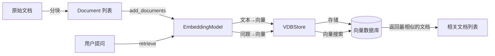
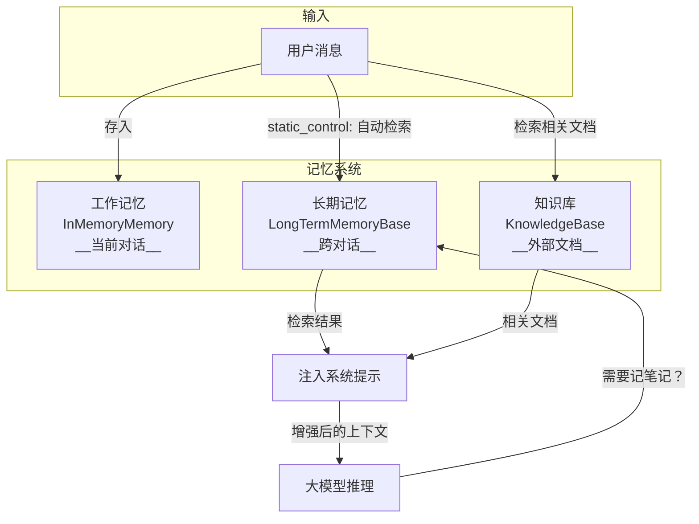

# 第 7 站：检索与知识

> 天气 Agent 收到"北京今天天气怎么样？"后，不仅要查天气工具，还可能需要记住用户之前说过"我经常去北京出差"——这种跨对话的信息，存在哪里？

## 路线图

上一站，我们看到 Agent 把消息存进了**工作记忆**（`InMemoryMemory`）。但工作记忆只在一次对话中有效——对话结束就消失了。

这一站，我们追踪两条平行的"长期记忆"路径：

```
用户消息 ──→ Agent.reply()
                │
                ├── 长期记忆（LongTermMemory）── 跨对话的个性化记忆
                │
                └── 知识库（KnowledgeBase/RAG）── 外部文档检索
```

读完本章，你会理解：
- 长期记忆的两种控制模式：`static_control` vs `agent_control`
- RAG 知识库的完整流程：文档 → Embedding → 向量存储 → 检索
- 为什么 Agent 要同时有"工作记忆"和"长期记忆"

---

## 知识补全：Embedding 与向量检索

在进入源码之前，先理解一个核心概念：**Embedding（嵌入向量）**。

### 什么是 Embedding？

简单说，Embedding 就是**把文本变成一组数字**。语义相近的文本，数字也相近。

```
"北京天气"     → [0.12, -0.34, 0.56, ...]   (假设 1536 维)
"北京气候"     → [0.11, -0.33, 0.55, ...]   (非常接近！)
"今天吃什么"   → [0.87, 0.22, -0.41, ...]   (完全不同)
```

这样，"检索相关文档"就变成了"找数字最接近的向量"——这是数学运算，计算机做起来非常快。

> 不需要理解 Embedding 模型内部的神经网络结构。只要记住：**文本 → 一串数字 → 用数字的"距离"衡量语义的"远近"**。

---

## 源码入口：LongTermMemoryBase

打开 `src/agentscope/memory/_long_term_memory/_long_term_memory_base.py`：

```python
# _long_term_memory_base.py:11
class LongTermMemoryBase(StateModule):
```

它继承自 `StateModule`——还记得吗？这意味着它也有 `state_dict()` / `load_state_dict()` 序列化能力。

### 四个核心方法

这个基类定义了四个方法，分为两组：

**开发者调用的方法**（在 `reply` 流程中自动调用）：

```python
# _long_term_memory_base.py:24
async def record(self, msgs: list[Msg | None], **kwargs) -> Any:
    """开发者设计的方法：从消息中提取信息，存入长期记忆"""

# _long_term_memory_base.py:35
async def retrieve(self, msg: Msg | list[Msg] | None, limit: int = 5, **kwargs) -> str:
    """开发者设计的方法：根据消息检索长期记忆，返回字符串"""
```

**Agent 自主调用的工具函数**（Agent 可以像调用 `get_weather` 一样调用它们）：

```python
# _long_term_memory_base.py:48
async def record_to_memory(self, thinking: str, content: list[str], **kwargs) -> ToolResponse:
    """Agent 可以主动调用的"记笔记"工具"""

# _long_term_memory_base.py:69
async def retrieve_from_memory(self, keywords: list[str], limit: int = 5, **kwargs) -> ToolResponse:
    """Agent 可以主动调用的"查笔记"工具"""
```

注意基类中这四个方法都直接 `raise NotImplementedError`——它只是一个接口定义。

### 两种控制模式

回到 ReActAgent 的构造函数，看它如何使用长期记忆：

```python
# _react_agent.py:286
self.long_term_memory = long_term_memory

# _react_agent.py:289
self._static_control = long_term_memory and long_term_memory_mode in [
    "static_control",
    "both",
]
self._agent_control = long_term_memory and long_term_memory_mode in [
    "agent_control",
    "both",
]
```

两种模式的区别：

| 模式 | 谁决定记录/检索什么 | 工作方式 |
|------|-------------------|---------|
| `static_control` | **开发者**（在代码中预设） | 每次对话开始时自动检索，结果注入系统提示 |
| `agent_control` | **Agent**（大模型自己决定） | 把 `record_to_memory`/`retrieve_from_memory` 注册为工具，Agent 自主决定何时记/查 |

如果设为 `"both"`，两种都启用。

```python
# _react_agent.py:303
if self._agent_control:
    self.toolkit.register_tool_function(
        long_term_memory.record_to_memory,
    )
    self.toolkit.register_tool_function(
        long_term_memory.retrieve_from_memory,
    )
```

> **设计一瞥**：为什么让 Agent 自己管理记忆？
> `static_control` 模式简单可控，但开发者必须预测所有需要记住的场景。
> `agent_control` 模式更灵活——Agent 可以在对话中主动说"这个用户的偏好我应该记住"。
> 代价是 Agent 可能遗忘不该忘的，或者记住不该记的。
> 详见卷四第 36 章。

---

## 现有实现：Mem0 和 ReMe

AgentScope 提供了两个长期记忆实现：

### Mem0（第三方集成）

```
src/agentscope/memory/_long_term_memory/_mem0/
├── _mem0_long_term_memory.py   # Mem0LongTermMemory at line 72
└── _mem0_utils.py
```

Mem0 是一个开源的记忆管理库，它会自动从对话中提取"事实"并存储。

### ReMe（内置实现）

```
src/agentscope/memory/_long_term_memory/_reme/
├── _reme_long_term_memory_base.py          # ReMeLongTermMemoryBase at line 77
├── _reme_personal_long_term_memory.py      # 个人记忆
├── _reme_task_long_term_memory.py          # 任务记忆
└── _reme_tool_long_term_memory.py          # 工具使用记忆
```

ReMe 把记忆分成了三种类型：个人偏好、任务经验、工具使用经验。

---

## RAG 知识库：另一条检索路径

长期记忆是从对话中"学习"的信息。但 Agent 还需要另一种知识——**外部文档**。

比如你有一个产品手册，想让 Agent 根据手册回答问题。这不是"记忆"，而是"知识检索"——RAG（Retrieval-Augmented Generation，检索增强生成）。

### RAG 的三大组件

打开 RAG 相关的三个核心文件：

**1. Document（文档数据结构）**

```python
# _document.py:35
@dataclass
class Document:
    metadata: DocMetadata    # 文档元信息（内容、ID、分块号）
    id: str = field(default_factory=shortuuid.uuid)
    embedding: Embedding | None = field(default_factory=lambda: None)
    score: float | None = None
```

一个 `Document` 代表文档的一个**分块**（chunk）。一段长文本会被切成多个小块，每块独立检索。

**2. EmbeddingModelBase（嵌入模型）**

```python
# _embedding_base.py:8
class EmbeddingModelBase:
    model_name: str
    supported_modalities: list[str]
    dimensions: int

    async def __call__(self, *args, **kwargs) -> EmbeddingResponse:
        """调用嵌入 API，把文本变成向量"""
```

支持的实现包括：OpenAI、DashScope、Gemini、Ollama。

**3. VDBStoreBase（向量数据库）**

```python
# _store_base.py:10
class VDBStoreBase:
    async def add(self, documents: list[Document], **kwargs) -> None: ...
    async def delete(self, *args, **kwargs) -> None: ...
    async def search(self, query_embedding: Embedding, limit: int, ...) -> list[Document]: ...
```

支持的向量数据库：Milvus、Qdrant、MongoDB、OceanBase、阿里云 MySQL。

### KnowledgeBase：把它们串起来

`KnowledgeBase` 是一个协调者，把"嵌入模型"和"向量数据库"组合在一起：

```python
# _knowledge_base.py:13
class KnowledgeBase:
    embedding_store: VDBStoreBase
    embedding_model: EmbeddingModelBase

    async def retrieve(self, query: str, limit: int = 5, ...) -> list[Document]:
        """检索相关文档"""

    async def add_documents(self, documents: list[Document], ...) -> None:
        """添加文档（自动 embedding + 存储）"""
```

完整的 RAG 流程：



### ReActAgent 如何使用 KnowledgeBase

回到 `_react_agent.py`，看 `knowledge` 参数的处理：

```python
# _react_agent.py:318
if isinstance(knowledge, KnowledgeBase):
    knowledge = [knowledge]
self.knowledge: list[KnowledgeBase] = knowledge or []
```

Agent 可以持有**多个**知识库。它们会在 `_reasoning` 阶段被检索，检索结果注入到系统提示中。

---

## 完整的"记忆 + 知识"流程图



**工作记忆**是短期记忆——当前对话说了什么。**长期记忆**是个性化记忆——跨对话记住用户偏好。**知识库**是外部知识——产品手册、FAQ、技术文档。

> 三者不互斥，可以同时使用。工作记忆是必需的；长期记忆和知识库是可选的增强。

AgentScope 官方文档的 Building Blocks > Memory 页面中长期记忆和 RAG 部分展示了 `KnowledgeBase` 和各种向量数据库的使用方法。本章解释了 `LongTermMemoryBase` 的两种控制模式（static_control vs agent_control）和 RAG 管道的内部流程。

AgentScope 1.0 论文对 Memory 模块的设计说明是：

> "we abstract foundational components essential for agentic applications and provide unified interfaces and extensible modules"
>
> — AgentScope 1.0: A Comprehensive Framework for Building Agentic Applications, arXiv:2508.16279, Section 2.1

Memory 模块的可扩展设计意味着你可以根据需求选择不同的存储后端——从简单的内存列表到分布式向量数据库。

---

## 试一试：观察长期记忆的注册过程

这个练习不需要 API key，只需要看源码和 print。

**目标**：观察 `agent_control` 模式下，长期记忆方法如何被注册为工具。

**步骤**：

1. 打开 `src/agentscope/agent/_react_agent.py`，找到第 303 行附近：

```python
if self._agent_control:
    self.toolkit.register_tool_function(
        long_term_memory.record_to_memory,
    )
    self.toolkit.register_tool_function(
        long_term_memory.retrieve_from_memory,
    )
```

2. 在 `register_tool_function` 调用之前加一行 print：

```python
if self._agent_control:
    print(f"[DEBUG] 注册长期记忆工具: {long_term_memory.record_to_memory.__name__}")
    self.toolkit.register_tool_function(
        long_term_memory.record_to_memory,
    )
    print(f"[DEBUG] 注册长期记忆工具: {long_term_memory.retrieve_from_memory.__name__}")
    self.toolkit.register_tool_function(
        long_term_memory.retrieve_from_memory,
    )
```

3. 如果你有 Mem0 或其他长期记忆实现，创建 ReActAgent 时设 `long_term_memory_mode="agent_control"`，运行后观察 print 输出。

4. 如果没有长期记忆实现，可以手动验证：搜索 `toolkit.register_tool_function` 的所有调用位置，看看除了长期记忆还有哪些函数被注册为工具：

```bash
grep -n "register_tool_function" src/agentscope/agent/_react_agent.py
```

你会看到至少 3 处调用：`record_to_memory`、`retrieve_from_memory`、以及 `meta_tool` 相关的注册。

**改完后记得用 `git checkout` 恢复源码：**

```bash
git checkout src/agentscope/agent/_react_agent.py
```

---

## 检查点

你现在理解了：

- **长期记忆**（`LongTermMemoryBase`）是跨对话的记忆，有两种控制模式
- `static_control` 由开发者控制（自动检索 + 注入系统提示），`agent_control` 由 Agent 自己决定（注册为工具）
- **RAG 知识库**（`KnowledgeBase`）是外部文档检索，流程是 文档 → Embedding → 向量存储 → 搜索
- 工作记忆、长期记忆、知识库各有分工，可以同时使用

**自检练习**：

1. 如果你想让 Agent 自动记住"用户喜欢用英文交流"，应该用 `static_control` 还是 `agent_control`？
2. RAG 的 `retrieve` 方法的输入是什么？输出是什么？（提示：看 `_knowledge_base.py:38`）

---

## 下一站预告

消息已经通过记忆和知识库被增强了。但大模型不接受 `Msg` 对象——它只认特定格式的 JSON。下一站，我们追踪 **Formatter**（格式转换器），看 `Msg` 如何被转换成 OpenAI API 需要的格式。

---

> **设计一瞥**：为什么长期记忆的基类方法都 raise NotImplementedError？
> 这是一种"可选实现"模式。`record` 和 `retrieve` 是给开发者用的，`record_to_memory` 和 `retrieve_from_memory` 是给 Agent 用的工具函数。
> 不是每个长期记忆实现都需要支持所有四种用法。比如你可能只想让开发者控制检索，不想让 Agent 自己调用——那就只实现 `record`/`retrieve`，让工具函数保持未实现。
> 详见卷四第 36 章。
