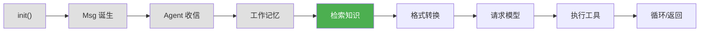
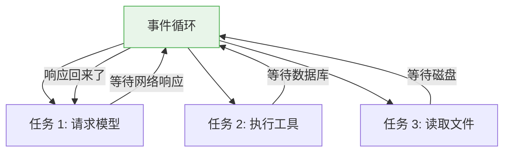
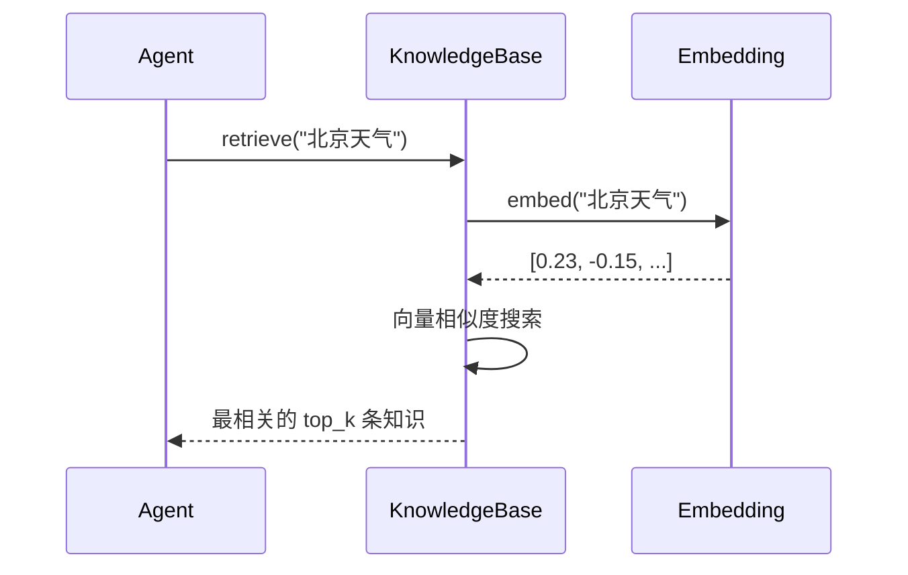

# 第 7 章 第 4 站：检索知识

> **追踪线**：消息存入记忆后，Agent 可能需要从知识库中查找相关信息。
> 本章你将理解：长期记忆检索、RAG 知识库查询、Embedding 流程、事件循环。

---

## 7.1 路线图



绿色是当前位置——从知识库检索信息。

> **源码验证日期**: 2026-05-11, commit `f17cfd0a`

---

## 7.2 知识补全：事件循环

上一章我们提到了 `async` 方法但没有深入。现在来解释事件循环（Event Loop）——async 的底层机制。

### 为什么需要事件循环？

`async` 函数不能直接运行——它需要一个"调度员"来管理。这个调度员就是事件循环。

想象一个餐厅服务员：

```
同步服务员：一次只服务一桌。点菜→等厨房做→上菜→再点菜→...
异步服务员：同时服务多桌。A 桌点菜→把菜单送厨房→去 B 桌点菜→
          A 桌菜好了→去上菜→继续服务 B 桌
```

事件循环就是这个异步服务员。它维护一个任务队列，在等待 IO 时切换到其他任务：



### 你需要知道的

- `await` 暂停当前协程，把控制权交给事件循环
- 事件循环发现有人在等待 IO → 切换到另一个就绪的任务
- IO 完成后 → 恢复之前的协程
- `asyncio.run()` 启动事件循环

在 AgentScope 中，你通常不需要手动管理事件循环——框架内部处理好了。

---

## 7.3 源码入口

| 文件 | 内容 |
|------|------|
| `src/agentscope/memory/_long_term_memory/_long_term_memory_base.py` | `LongTermMemoryBase` |
| `src/agentscope/rag/_knowledge_base.py` | 知识库 |
| `src/agentscope/rag/_simple_knowledge.py` | 简单知识实现 |
| `src/agentscope/embedding/` | Embedding 模型 |

---

## 7.4 逐行阅读

### 长期记忆 vs 工作记忆

上一章讲的是工作记忆（Working Memory）——存当前对话的消息。长期记忆（Long-term Memory）存的是跨对话的知识和经验。

| 特性 | 工作记忆 | 长期记忆 |
|------|---------|---------|
| 生命周期 | 单次对话 | 跨对话持久 |
| 存储内容 | 消息历史 | 知识片段 |
| 访问方式 | 按索引/mark | 按语义相似度检索 |
| 典型实现 | `InMemoryMemory` | 向量数据库 |

### LongTermMemoryBase

打开 `src/agentscope/memory/_long_term_memory/_long_term_memory_base.py`：

```python
class LongTermMemoryBase(StateModule):
    async def retrieve(
        self,
        query: str,
        top_k: int = 10,
        **kwargs,
    ) -> list[Msg]:
        """Retrieve relevant messages from long-term memory."""
```

核心方法只有两个：

- `retrieve()`：根据查询文本检索相关记忆
- `retrieve_from_memory()`：从工作记忆中检索（桥接两种记忆）

长期记忆的关键在于"语义检索"——不是按关键词匹配，而是按**意思相似度**匹配。这就需要 Embedding。

### Embedding：把文字变成向量

Embedding（嵌入）是把文字转换成数字向量的过程。语义相近的文字，向量也相近。

```
"今天天气很好" → [0.23, -0.15, 0.89, ...]
"阳光明媚"    → [0.21, -0.14, 0.87, ...]  ← 相似！
"今天下雨了"  → [0.05, 0.32, -0.41, ...]  ← 不同
```

AgentScope 的 Embedding 模块在 `src/agentscope/embedding/` 下，支持多种 embedding 提供商。

### RAG 知识库

RAG（Retrieval-Augmented Generation）的核心流程：



打开 `src/agentscope/rag/_knowledge_base.py`：

```python
async def retrieve(
    self,
    query: str,
    top_k: int = 10,
) -> list[Msg]:
    """Retrieve relevant knowledge."""

async def retrieve_knowledge(
    self,
    queries: list[str],
    top_k: int = 10,
) -> list[Msg]:
    """Retrieve knowledge for multiple queries."""
```

`retrieve()` 接受一个查询字符串，`retrieve_knowledge()` 支持批量查询。

### 简单知识实现

`src/agentscope/rag/_simple_knowledge.py` 提供了一个基础的知识检索实现。更复杂的实现可以对接向量数据库（如 ChromaDB、Milvus 等）。

---

## 7.5 调试实践

### 查看 Embedding 向量

```python
from agentscope.embedding import OpenAIEmbedding

embedder = OpenAIEmbedding(model_name="text-embedding-3-small")
vector = await embedder.embed("北京天气")
print(f"向量维度: {len(vector)}")
print(f"前 5 维: {vector[:5]}")
```

### 追踪检索过程

如果你配置了长期记忆，可以在 `retrieve()` 方法中加 print 观察检索过程。

---

## 7.6 试一试

### 在天气 Agent 中加入知识库（概念演示）

完整的 RAG 需要向量数据库，这里演示概念：

```python
from agentscope.message import Msg

# 模拟知识库
knowledge_base = [
    Msg("system", "北京春季干燥多风，气温 10-25°C", "system"),
    Msg("system", "北京夏季炎热多雨，气温 25-35°C", "system"),
    Msg("system", "上海全年湿润，冬季阴冷夏季闷热", "system"),
]

# 模拟检索：用简单的关键词匹配代替向量搜索
def simple_retrieve(query: str, knowledge: list[Msg], top_k: int = 2) -> list[Msg]:
    """简单的关键词匹配检索"""
    scored = []
    for msg in knowledge:
        # 计算关键词重叠度（简化版）
        query_words = set(query)
        msg_words = set(msg.content)
        overlap = len(query_words & msg_words)
        scored.append((overlap, msg))
    scored.sort(key=lambda x: x[0], reverse=True)
    return [msg for _, msg in scored[:top_k]]

# 试试看
results = simple_retrieve("北京天气", knowledge_base)
for msg in results:
    print(f"  知识: {msg.content}")
```

这个简化版本展示了 RAG 的核心思想：根据查询检索相关知识。真实的 RAG 用向量相似度代替关键词匹配，效果更好。

---

## 7.7 检查点

你现在已经理解了：

- **长期记忆**：跨对话持久存储，用语义相似度检索
- **Embedding**：把文字转换成数字向量，语义相近的文字向量也相近
- **RAG 流程**：查询 → Embedding → 向量搜索 → 返回相关知识
- **事件循环**：async 的底层调度机制，在等待 IO 时切换任务

**自检练习**：
1. 工作记忆和长期记忆的区别是什么？
2. 为什么 RAG 用向量相似度而不是关键词匹配？

---

## 下一站预告

知识检索完毕。下一站，Agent 需要把消息和知识转换成模型能理解的格式。
