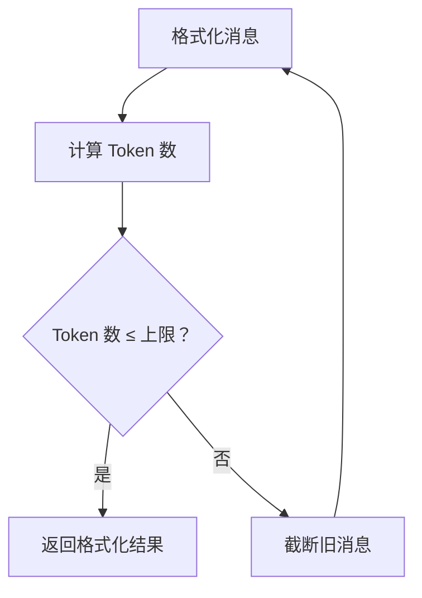
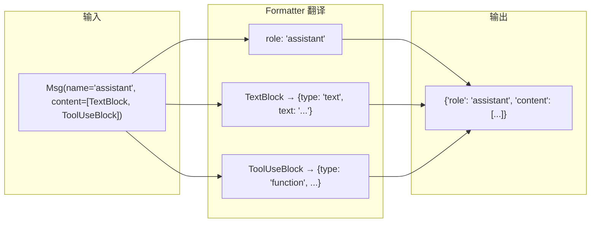

# 第 8 站：格式转换

> 消息在 Agent 内部用的是 `Msg` 对象，但 OpenAI API 要的是 `[{"role": "user", "content": "..."}]` 这样的 JSON——谁来负责翻译？

## 路线图

前几站我们追踪了消息从诞生到存储的路径。现在消息即将被发送给大模型，但有一个问题：**大模型 API 有自己要求的格式**。

```
Agent 内部: Msg(name="user", content=[TextBlock(...)], role="user")
                                    ↓
                          Formatter 翻译
                                    ↓
OpenAI API:  {"role": "user", "content": "北京今天天气怎么样？"}
```

这一站，我们打开 **Formatter（格式转换器）**，看翻译如何完成。

读完本章，你会理解：
- Formatter 的继承链：`FormatterBase` → `TruncatedFormatterBase` → `OpenAIChatFormatter`
- Token 截断策略：消息太长怎么办？
- 为什么 Formatter 独立于 Model（而不是 Model 自己做翻译）

---

## 知识补全：JSON Schema

Formatter 的输出是 JSON 字典列表。`{"role": "user", "content": "..."}` 这种结构就是 JSON。

JSON Schema 是一种描述 JSON 格式的规范——"这个字段必须是字符串""这个字段只能是 user/assistant/system 之一"。OpenAI API 就是用 JSON Schema 来定义请求格式的。

不需要深入了解 JSON Schema 规范。只要知道：**Formatter 的任务就是把 `Msg` 对象翻译成符合特定 API JSON 格式的字典列表**。

---

## 第一层：FormatterBase

打开 `src/agentscope/formatter/_formatter_base.py`：

```python
# _formatter_base.py:11
class FormatterBase:
    @abstractmethod
    async def format(self, *args, **kwargs) -> list[dict[str, Any]]:
        """把 Msg 对象格式化为 API 需要的字典列表"""
```

这就是全部的接口定义——**一个抽象方法**。输入是 `Msg` 列表，输出是字典列表。

还有一个实用静态方法：

```python
# _formatter_base.py:37
@staticmethod
def convert_tool_result_to_string(
    output: str | list[TextBlock | ImageBlock | AudioBlock | VideoBlock],
) -> tuple[str, ...]:
    """把工具结果转换为文本（有些 API 不支持工具结果中的多模态数据）"""
```

当工具返回了图片或音频，但目标 API 不支持在工具结果中放多模态数据时，这个方法会把它们提取出来，转为文本描述。

---

## 第二层：TruncatedFormatterBase

打开 `src/agentscope/formatter/_truncated_formatter_base.py`：

```python
# _truncated_formatter_base.py:19
class TruncatedFormatterBase(FormatterBase, ABC):
    def __init__(
        self,
        token_counter: TokenCounterBase | None = None,
        max_tokens: int | None = None,
    ): ...
```

这一层加入了**Token 截断**功能。看看核心的 `format` 方法：

```python
# _truncated_formatter_base.py:48
@trace_format
async def format(self, msgs: list[Msg], **kwargs) -> list[dict[str, Any]]:
    self.assert_list_of_msgs(msgs)
    msgs = deepcopy(msgs)    # 先深拷贝，不修改原始消息

    while True:
        formatted_msgs = await self._format(msgs)
        n_tokens = await self._count(formatted_msgs)

        if (
            n_tokens is None
            or self.max_tokens is None
            or n_tokens <= self.max_tokens
        ):
            return formatted_msgs

        # Token 数超标 → 截断旧消息 → 重新格式化
        msgs = self._truncate(msgs)
```

这是一个**循环截断**策略：



关键点：`_format` 和 `_truncate` 都是抽象方法，由具体子类实现。

### TokenCounterBase

Token 计数器是一个独立的抽象：

```python
# _token_base.py:7
class TokenCounterBase:
    @abstractmethod
    async def count(self, messages: list[dict], **kwargs) -> int:
        """计算消息列表的 Token 数"""
```

为什么 Token 计数要单独抽象？因为不同模型计算 Token 的方式不同——GPT-4o 和 Claude 的 tokenizer 不一样。

---

## 第三层：OpenAIChatFormatter

打开 `src/agentscope/formatter/_openai_formatter.py`，找到第 168 行：

```python
# _openai_formatter.py:168
class OpenAIChatFormatter(TruncatedFormatterBase):
    support_tools_api: bool = True
    support_multiagent: bool = True
    support_vision: bool = True
    supported_blocks: list[type] = [
        TextBlock, ImageBlock, AudioBlock, ToolUseBlock, ToolResultBlock,
    ]
```

这个类声明了它支持的能力：工具调用 API、多 Agent 对话、视觉（图片）、以及支持哪些 ContentBlock 类型。

### format 方法的实际工作

`OpenAIChatFormatter._format()` 方法（大约在第 210 行开始）做这些事：

1. **遍历每条消息**，按消息的 `name` 和 `role` 确定 OpenAI 格式中的 `role` 字段
2. **处理每个 ContentBlock**：
   - `TextBlock` → `{"type": "text", "text": "..."}`
   - `ImageBlock` → `{"type": "image_url", "image_url": {"url": "..."}}`
   - `ToolUseBlock` → `{"type": "function", "function": {"name": "...", "arguments": "..."}}`
   - `ToolResultBlock` → `{"type": "function", "output": "..."}`
3. **处理特殊的图片提升**：有些 API 不支持工具结果中带图片，`promote_tool_result_images=True` 会把图片提取到单独的用户消息中



### 其他 Formatter 实现

AgentScope 为不同的模型 API 提供了不同的 Formatter：

```
src/agentscope/formatter/
├── _formatter_base.py              # 基类
├── _truncated_formatter_base.py    # Token 截断层
├── _openai_formatter.py            # OpenAI / GPT 系列
├── _anthropic_formatter.py         # Anthropic / Claude
├── _dashscope_formatter.py         # 阿里云通义千问
├── _gemini_formatter.py            # Google Gemini
├── _ollama_formatter.py            # Ollama 本地模型
├── _deepseek_formatter.py          # DeepSeek
└── _a2a_formatter.py               # Agent-to-Agent 协议
```

每个 API 对消息格式的要求略有不同。比如 Anthropic 把系统提示放在单独的 `system` 字段，而不是 `{"role": "system"}` 消息中。

> **设计一瞥**：为什么 Formatter 独立于 Model？
> 你可能觉得"格式转换应该是模型自己的事"。但把它们分开有一个大好处：**同一个 Formatter 可以搭配不同的模型**。
> 比如 `OpenAIChatFormatter` 适用于所有兼容 OpenAI API 的服务（OpenAI、DeepSeek、本地 Ollama 等）。
> 如果 Formatter 和 Model 绑定，换一个兼容服务就要写一个新的 Model 类。
> 代价：用户需要自己选择 Formatter 和 Model 的组合。详见卷四第 35 章。

AgentScope 官方文档的 Building Blocks > Models 页面展示了不同模型的使用方法。本章解释了 Formatter 的三层继承体系（FormatterBase → TruncatedFormatterBase → OpenAIChatFormatter）和 Token 截断循环的实现。

AgentScope 1.0 论文对 Formatter 与 Model 分离的设计说明是：

> "we abstract foundational components essential for agentic applications and provide unified interfaces and extensible modules"
>
> — AgentScope 1.0: A Comprehensive Framework for Building Agentic Applications, arXiv:2508.16279, Section 2.1

Formatter 的独立设计正是"可扩展模块"思想的体现——新增模型提供商只需要实现对应的 Formatter，不需要修改 Model 的代码。

---

## 试一试：观察 Formatter 的输入和输出

这个练习不需要 API key。

**目标**：直接调用 Formatter，看看它如何把 `Msg` 转换成 OpenAI 格式。

**步骤**：

1. 在项目根目录创建一个测试脚本 `test_formatter.py`：

```python
import asyncio
from agentscope.message import Msg, TextBlock, ToolUseBlock
from agentscope.formatter import OpenAIChatFormatter

async def main():
    formatter = OpenAIChatFormatter()

    # 创建几条消息
    msgs = [
        Msg(name="system", content="你是天气助手。", role="system"),
        Msg(name="user", content="北京天气如何？", role="user"),
        Msg(
            name="assistant",
            content=[
                TextBlock(type="text", text="让我查一下天气。"),
                ToolUseBlock(
                    type="tool_use",
                    id="call_123",
                    name="get_weather",
                    input={"city": "北京"},
                ),
            ],
            role="assistant",
        ),
    ]

    # 格式化
    result = await formatter.format(msgs)

    # 打印结果
    import json
    for msg in result:
        print(json.dumps(msg, ensure_ascii=False, indent=2))
        print("---")

asyncio.run(main())
```

2. 运行：

```bash
python test_formatter.py
```

3. 观察输出：每条消息如何被转换成 OpenAI API 的 JSON 格式。

4. **进阶**：在 `src/agentscope/formatter/_openai_formatter.py` 的 `_format` 方法中加一行 `print(f"[DEBUG] 格式化消息: {msg.name}")`，再运行一次，观察遍历过程。

**完成后清理：**

```bash
rm test_formatter.py
git checkout src/agentscope/formatter/
```

---

## 检查点

你现在理解了：

- **Formatter** 是 `Msg` 对象和模型 API 之间的翻译器
- 三层继承链：`FormatterBase`（接口）→ `TruncatedFormatterBase`（加 Token 截断）→ 具体实现（如 `OpenAIChatFormatter`）
- Token 截断是一个"格式化 → 计数 → 超标则截断旧消息 → 重新格式化"的循环
- Formatter 独立于 Model，使得同一格式转换可以复用于多个兼容模型

**自检练习**：

1. 如果不传 `token_counter` 和 `max_tokens`，`TruncatedFormatterBase.format()` 的 `while True` 循环会执行几次？（提示：看 `n_tokens` 为 `None` 时的判断）
2. AgentScope 提供了多少种 Formatter 实现？（提示：`ls src/agentscope/formatter/`）

---

## 下一站预告

消息已经被格式化成 OpenAI API 需要的 JSON 了。下一站，我们追踪最核心的一步——**调用大模型**。看看 `ChatModelBase` 如何发送请求、接收响应、处理流式返回。
