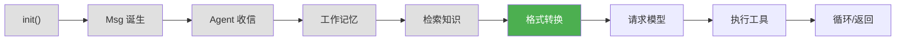
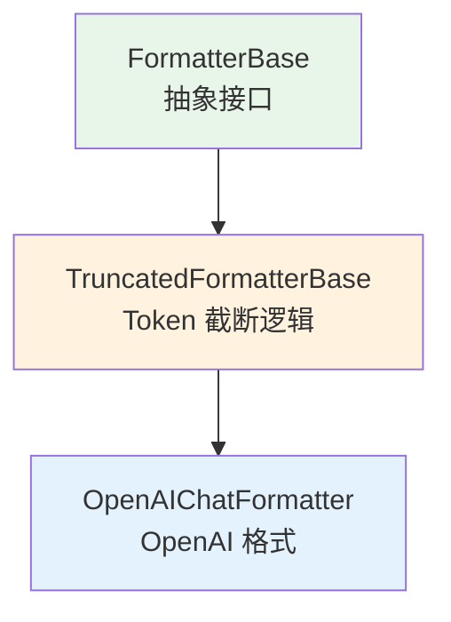
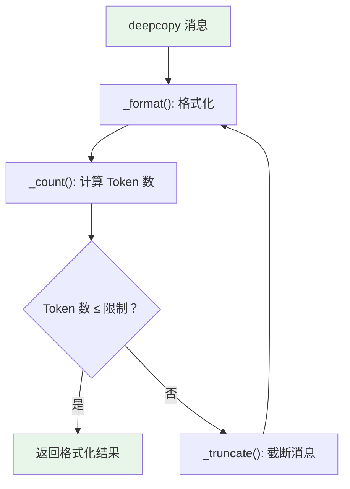

# 第 8 章 第 5 站：格式转换

> **追踪线**：消息和知识都准备好了，但模型 API 需要特定的 JSON 格式。Formatter 负责这个转换。
> 本章你将理解：Msg 列表 → API messages 格式、Token 截断、JSON Schema。

---

## 8.1 路线图



绿色是当前位置——Formatter 把消息转为模型格式。

> **源码验证日期**: 2026-05-11, commit `f17cfd0a`

---

## 8.2 知识补全：JSON Schema

Formatter 需要把工具定义转成 JSON Schema 格式告诉模型。JSON Schema 是什么？

### JSON Schema 是什么

JSON Schema 是一种用 JSON 描述 JSON 数据结构的规范。它回答的问题是："这个 JSON 应该长什么样？"

```json
{
    "type": "object",
    "properties": {
        "city": {
            "type": "string",
            "description": "城市名"
        }
    },
    "required": ["city"]
}
```

这段 JSON Schema 描述了一个对象：必须有一个 `city` 字符串字段。AgentScope 用 JSON Schema 来描述工具函数的参数，这样模型就知道该怎么调用工具。

### 从函数到 JSON Schema

```python
def get_weather(city: str, unit: str = "celsius") -> str:
    """获取城市天气"""
    ...
```

AgentScope 会自动把这个函数转换成 JSON Schema：

```json
{
    "name": "get_weather",
    "description": "获取城市天气",
    "parameters": {
        "type": "object",
        "properties": {
            "city": {"type": "string"},
            "unit": {"type": "string", "default": "celsius"}
        },
        "required": ["city"]
    }
}
```

这个转换在 Toolkit 注册工具时自动完成，Formatter 只需要把结果格式化给模型。

---

## 8.3 源码入口

| 文件 | 内容 |
|------|------|
| `src/agentscope/formatter/_formatter_base.py` | `FormatterBase` 基类 |
| `src/agentscope/formatter/_truncated_formatter_base.py` | `TruncatedFormatterBase` 截断基类 |
| `src/agentscope/formatter/_openai_formatter.py` | `OpenAIChatFormatter` 实现 |
| `src/agentscope/token/` | Token 计数 |

---

## 8.4 逐行阅读

### Formatter 的三层继承



- **FormatterBase**：定义 `format()` 抽象方法
- **TruncatedFormatterBase**：加上 Token 截断逻辑
- **OpenAIChatFormatter**：实现 OpenAI API 的具体格式

### FormatterBase：抽象接口

打开 `src/agentscope/formatter/_formatter_base.py`：

```python
class FormatterBase:
    @abstractmethod
    async def format(self, *args, **kwargs) -> list[dict[str, Any]]:
        """Format the Msg objects to a list of dictionaries."""
```

接口很简单——输入 `Msg` 列表，输出字典列表。字典的格式由具体实现决定。

### TruncatedFormatterBase：截断逻辑

这是 Formatter 的核心。打开 `src/agentscope/formatter/_truncated_formatter_base.py`：

```python
class TruncatedFormatterBase(FormatterBase, ABC):
    def __init__(
        self,
        token_counter: TokenCounterBase | None = None,
        max_tokens: int | None = None,
    ):
        self.token_counter = token_counter
        self.max_tokens = max_tokens
```

两个可选参数：
- `token_counter`：Token 计数器，计算消息占多少 token
- `max_tokens`：最大 token 数限制

#### format() 主流程

```python
async def format(self, msgs: list[Msg], **kwargs) -> list[dict[str, Any]]:
    self.assert_list_of_msgs(msgs)
    msgs = deepcopy(msgs)

    while True:
        formatted_msgs = await self._format(msgs)
        n_tokens = await self._count(formatted_msgs)

        if (
            n_tokens is None
            or self.max_tokens is None
            or n_tokens <= self.max_tokens
        ):
            return formatted_msgs

        msgs = await self._truncate(msgs)
```

核心循环：



1. 格式化消息
2. 计算 token 数
3. 如果没超限，返回
4. 如果超限，截断最早的几条消息，重新格式化

#### _format()：消息分组与格式化

```python
async def _format(self, msgs: list[Msg]) -> list[dict[str, Any]]:
    formatted_msgs = []
    start_index = 0

    # 系统消息单独处理
    if len(msgs) > 0 and msgs[0].role == "system":
        formatted_msgs.append(await self._format_system_message(msgs[0]))
        start_index = 1

    # 消息分组：tool_sequence vs agent_message
    async for typ, group in self._group_messages(msgs[start_index:]):
        match typ:
            case "tool_sequence":
                formatted_msgs.extend(await self._format_tool_sequence(group))
            case "agent_message":
                formatted_msgs.extend(
                    await self._format_agent_message(group, is_first_agent_message),
                )
```

消息被分成两类：

| 类型 | 包含 | 格式化策略 |
|------|------|-----------|
| `tool_sequence` | ToolUseBlock / ToolResultBlock | 按 API 要求的工具调用格式 |
| `agent_message` | 纯文本消息 | 按 API 要求的 assistant/user 格式 |

#### _truncate()：截断策略

当消息超过 token 限制时，截断策略是**删除最早的消息**，但保留系统消息和配对的工具调用/结果：

```python
async def _truncate(self, msgs: list[Msg]) -> list[Msg]:
    # 系统消息不能删
    start_index = 0
    if len(msgs) > 0 and msgs[0].role == "system":
        start_index = 1

    # 从最早的非系统消息开始删除
    # 注意：工具调用和工具结果必须一起删除
    tool_call_ids = set()
    for i in range(start_index, len(msgs)):
        for block in msg.get_content_blocks("tool_use"):
            tool_call_ids.add(block["id"])
        for block in msg.get_content_blocks("tool_result"):
            tool_call_ids.remove(block["id"])

        # 找到配对的最后一个工具结果后，截断到这里
        if len(tool_call_ids) == 0:
            return msgs[:start_index] + msgs[i + 1:]
```

关键约束：**工具调用和工具结果必须配对删除**。如果只删除了工具调用但保留了工具结果，API 会报错。

### OpenAIChatFormatter：具体格式

打开 `src/agentscope/formatter/_openai_formatter.py`：

```python
class OpenAIChatFormatter(TruncatedFormatterBase):
```

它实现了 `_format_tool_sequence()` 和 `_format_agent_message()` 两个抽象方法，把消息转成 OpenAI API 要求的格式。

例如，一条包含 TextBlock 的 assistant 消息会被格式化为：

```json
{"role": "assistant", "content": "让我查一下天气"}
```

一条 ToolUseBlock 会被格式化为：

```json
{
    "role": "assistant",
    "tool_calls": [{
        "id": "call_001",
        "type": "function",
        "function": {
            "name": "get_weather",
            "arguments": "{\"city\": \"北京\"}"
        }
    }]
}
```

对应的 ToolResultBlock 会被格式化为：

```json
{
    "role": "tool",
    "tool_call_id": "call_001",
    "content": "晴天，25°C"
}
```

---

## 8.5 调试实践

### 查看格式化后的消息

```python
from agentscope.message import Msg
from agentscope.formatter import OpenAIChatFormatter
from agentscope.message._message_block import TextBlock, ToolUseBlock

formatter = OpenAIChatFormatter()

msgs = [
    Msg("system", "你是天气助手", "system"),
    Msg("user", "北京天气怎么样？", "user"),
    Msg("assistant", [
        TextBlock(type="text", text="让我查一下"),
        ToolUseBlock(type="tool_use", id="call_001", name="get_weather",
                     input={"city": "北京"}),
    ], "assistant"),
]

formatted = await formatter.format(msgs)
import json
for msg in formatted:
    print(json.dumps(msg, ensure_ascii=False, indent=2))
```

---

## 8.6 试一试

### 在 Formatter 中加 print 观察截断

打开 `src/agentscope/formatter/_truncated_formatter_base.py`，在 `format()` 的循环中加 print：

```python
while True:
    formatted_msgs = await self._format(msgs)
    n_tokens = await self._count(formatted_msgs)
    print(f"[FORMAT] 消息数={len(formatted_msgs)}, tokens={n_tokens}, 限制={self.max_tokens}")  # 加这行

    if n_tokens is None or self.max_tokens is None or n_tokens <= self.max_tokens:
        return formatted_msgs
    msgs = await self._truncate(msgs)
```

如果你设置了 `max_tokens`，会看到消息被逐步截断的过程。

### 修改截断策略

默认截断策略是"删除最早的"。你可以尝试改为"删除最旧的但保留系统消息"，只需在 `_truncate()` 中调整逻辑。

---

## 8.7 检查点

你现在已经理解了：

- **Formatter 三层继承**：FormatterBase → TruncatedFormatterBase → OpenAIChatFormatter
- **format() 流程**：deepcopy → 格式化 → 计数 → 检查 → 截断（循环）
- **消息分组**：tool_sequence（工具调用序列）和 agent_message（普通消息）
- **Token 截断**：超过限制时删除最早的消息，保持工具调用配对
- **JSON Schema**：描述工具参数的标准格式

**自检练习**：
1. 为什么要 deepcopy 消息再格式化？（提示：格式化会修改消息内容）
2. 工具调用和工具结果为什么要配对删除？

---

## 下一站预告

消息已经格式化好了。下一站，把这些消息发送给模型。
