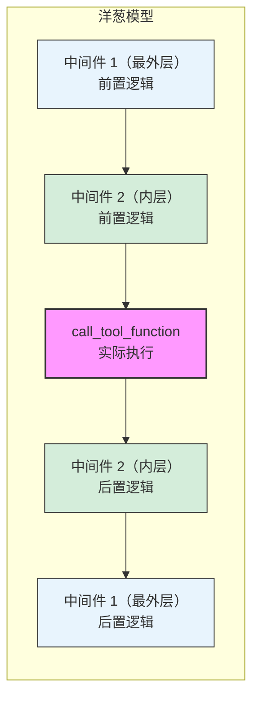
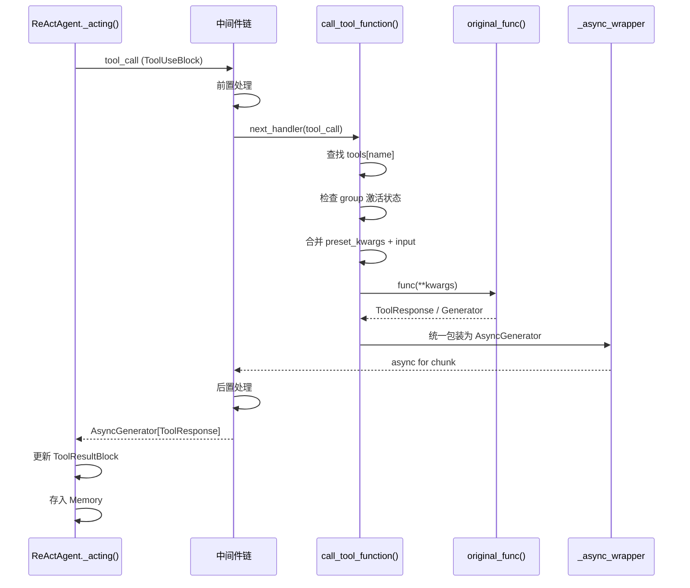

# 第 7 站：执行工具

> `tool_res = await self.toolkit.call_tool_function(tool_call)` ——
> LLM 已经在响应中返回了 `ToolUseBlock`，告诉框架"我想调用 `google_search`，参数是 `query='AgentScope'`"。
> 但 LLM 自己并不能真正执行任何函数——它只是给出了函数名和参数。
> 真正的执行发生在这里：Toolkit 查找注册表、合并参数、运行函数、包装结果，最终产出 `ToolResultBlock`。
> 你将理解工具注册如何把普通 Python 函数变成 LLM 可调用的工具、
> 统一流式接口如何将同步/异步/生成器三种函数统一为 `AsyncGenerator`、
> 以及中间件（Middleware）洋葱模型如何在执行前后插入横切逻辑。

---

## 1. 路线图

我们正在追随 `await agent(msg)` 穿越 AgentScope 框架。上一站 LLM 模型已经返回了响应，其中可能包含 `ToolUseBlock`。现在到达 **"执行工具"** 站。

```mermaid
flowchart LR
    A["agentscope.init()"] --> B["Msg 创建"]
    B --> C["Agent 收信"]
    C --> D["Memory 存储"]
    D --> E["检索与知识"]
    E --> F["Formatter 格式化"]
    F --> G["Model 调用"]
    G --> H["Toolkit 执行"]
    H --> I["ReAct 循环"]
    I --> J["返回结果"]

    style A fill:#ddd,stroke:#333
    style B fill:#ddd,stroke:#333
    style C fill:#ddd,stroke:#333
    style D fill:#ddd,stroke:#333
    style E fill:#ddd,stroke:#333
    style F fill:#ddd,stroke:#333
    style G fill:#ddd,stroke:#333
    style H fill:#f9f,stroke:#333,stroke-width:2px
    style I fill:#ddd,stroke:#333
    style J fill:#ddd,stroke:#333
```



**本章聚焦**：上图中高亮的 `Toolkit 执行` 节点。调用发生在 `ReActAgent._acting()` 中，当模型响应包含 `tool_use` 块时触发：

```python
# src/agentscope/agent/_react_agent.py:440-445
futures = [
    self._acting(tool_call)
    for tool_call in msg_reasoning.get_content_blocks("tool_use")
]
```

**关键问题**：LLM 说"调用 `google_search`"，但框架怎么知道 `google_search` 对应哪个 Python 函数？参数怎么传递？同步函数和异步生成器怎么统一处理？

---

## 2. 源码入口

本章涉及的核心源文件：

| 文件 | 关键内容 | 行号参考 |
|------|----------|----------|
| `src/agentscope/tool/_toolkit.py` | `class Toolkit` 工具管理核心 | :117 |
| `src/agentscope/tool/_toolkit.py` | `register_tool_function()` 工具注册 | :274 |
| `src/agentscope/tool/_toolkit.py` | `call_tool_function()` 工具执行 | :853 |
| `src/agentscope/tool/_toolkit.py` | `_apply_middlewares()` 中间件装饰器 | :57 |
| `src/agentscope/tool/_toolkit.py` | `register_middleware()` 注册中间件 | :1441 |
| `src/agentscope/tool/_response.py` | `class ToolResponse` 工具响应对象 | :12 |
| `src/agentscope/tool/_types.py` | `class RegisteredToolFunction` 注册信息 | :16 |
| `src/agentscope/tool/_async_wrapper.py` | `_object_wrapper` / `_sync_generator_wrapper` / `_async_generator_wrapper` | :38, :50, :63 |
| `src/agentscope/_utils/_common.py` | `_parse_tool_function()` JSON Schema 生成 | :339 |
| `src/agentscope/message/_message_block.py` | `ToolUseBlock` / `ToolResultBlock` | :79, :94 |
| `src/agentscope/agent/_react_agent.py` | `_acting()` 工具调用入口 | :657 |

---

## 3. 逐行阅读

### 3.1 起点：_acting()——从 ToolUseBlock 到 ToolResultBlock

当 LLM 返回的响应中包含 `tool_use` 块时，`ReActAgent.reply()` 中的 ReAct 循环会调用 `_acting()`。

`src/agentscope/agent/_react_agent.py:657`

```python
async def _acting(self, tool_call: ToolUseBlock) -> dict | None:
    """Perform the acting process, and return the structured output if
    it's generated and verified in the finish function call."""
```

`_acting()` 做三件事：

1. 创建一个空的 `ToolResultBlock` 容器
2. 调用 `self.toolkit.call_tool_function(tool_call)` 获取结果
3. 遍历结果的每个分块（chunk），更新 `ToolResultBlock` 并打印

```python
# src/agentscope/agent/_react_agent.py:671-682
tool_res_msg = Msg(
    "system",
    [
        ToolResultBlock(
            type="tool_result",
            id=tool_call["id"],
            name=tool_call["name"],
            output=[],
        ),
    ],
    "system",
)
```

注意 `tool_res_msg` 使用了与 `ToolUseBlock` 相同的 `id`——这是 LLM API 要求的配对机制：工具调用和工具结果必须通过 `id` 关联。

接下来是核心执行调用：

```python
# src/agentscope/agent/_react_agent.py:685
tool_res = await self.toolkit.call_tool_function(tool_call)

# 遍历流式结果
async for chunk in tool_res:
    tool_res_msg.content[0]["output"] = chunk.content
    await self.print(tool_res_msg, chunk.is_last)
```

`call_tool_function` 返回一个 `AsyncGenerator[ToolResponse, None]`，即使是同步函数也会被包装成异步生成器。这种 **统一流式接口** 设计让 `_acting()` 不需要关心底层函数是同步还是异步。

### 3.2 注册环节：register_tool_function()

在工具能被调用之前，必须先注册。注册入口是 `Toolkit.register_tool_function()`。

`src/agentscope/tool/_toolkit.py:274`

```python
def register_tool_function(
    self,
    tool_func: ToolFunction,
    group_name: str | Literal["basic"] = "basic",
    preset_kwargs: dict[str, JSONSerializableObject] | None = None,
    ...
) -> None:
```

注册过程分三个阶段：**函数识别 → Schema 生成 → 存储注册**。

#### 阶段一：函数识别

框架区分三种函数来源（`_toolkit.py:383-425`）：

```python
# MCP 工具函数
if isinstance(tool_func, MCPToolFunction):
    input_func_name = tool_func.name
    original_func = tool_func.__call__
    json_schema = json_schema or tool_func.json_schema

# functools.partial 偏函数
elif isinstance(tool_func, partial):
    # 将位置参数转为关键字参数，合并到 preset_kwargs
    ...
    input_func_name = tool_func.func.__name__
    original_func = tool_func.func
    json_schema = json_schema or _parse_tool_function(tool_func.func, ...)

# 普通函数
else:
    input_func_name = tool_func.__name__
    original_func = tool_func
    json_schema = json_schema or _parse_tool_function(tool_func, ...)
```

**关键观察**：如果开发者手动提供了 `json_schema`，则跳过自动解析。否则调用 `_parse_tool_function()` 自动生成。

#### 阶段二：Schema 生成——_parse_tool_function()

`src/agentscope/_utils/_common.py:339`

这个函数将 Python 函数签名 + docstring 转换为 LLM API 需要的 JSON Schema。过程分四步：

**步骤 1**：解析 docstring，提取参数描述。

```python
# src/agentscope/_utils/_common.py:362-363
docstring = parse(tool_func.__doc__)
params_docstring = {_.arg_name: _.description for _ in docstring.params}
```

使用 `docstring_parser` 库解析 Google/Numpy/Sphinx 风格的 docstring，将每个参数名映射到其描述文字。

**步骤 2**：遍历函数签名，为每个参数建立 Pydantic 字段。

```python
# src/agentscope/_utils/_common.py:377-432
for name, param in inspect.signature(tool_func).parameters.items():
    if name in ["self", "cls"]:
        continue

    # 处理 **kwargs
    if param.kind == inspect.Parameter.VAR_KEYWORD:
        if not include_var_keyword:
            continue
        fields[name] = (
            Dict[str, Any],
            Field(description=..., default=...),
        )

    # 处理 *args
    elif param.kind == inspect.Parameter.VAR_POSITIONAL:
        if not include_var_positional:
            continue
        fields[name] = (list[Any], Field(description=..., default=...))

    # 普通参数
    else:
        fields[name] = (
            Any if param.annotation == inspect.Parameter.empty
            else param.annotation,
            Field(
                description=params_docstring.get(name, None),
                default=... if param.default is param.empty
                else param.default,
            ),
        )
```

**步骤 3**：动态创建 Pydantic 模型，生成 JSON Schema。

```python
# src/agentscope/_utils/_common.py:434-442
base_model = create_model(
    "_StructuredOutputDynamicClass",
    __config__=ConfigDict(arbitrary_types_allowed=True),
    **fields,
)
params_json_schema = base_model.model_json_schema()
_remove_title_field(params_json_schema)
```

为什么不直接手写 JSON Schema？因为 Pydantic 自动处理了类型嵌套、默认值、`Optional` 等复杂情况。`_remove_title_field()` 移除 Pydantic 自动生成的 `title` 字段，避免干扰 LLM。

**步骤 4**：组装最终 Schema。

```python
# src/agentscope/_utils/_common.py:444-455
func_json_schema: dict = {
    "type": "function",
    "function": {
        "name": tool_func.__name__,
        "parameters": params_json_schema,
    },
}
if func_description not in [None, ""]:
    func_json_schema["function"]["description"] = func_description
```

生成的 Schema 示例：

```json
{
    "type": "function",
    "function": {
        "name": "google_search",
        "description": "Search on Google.",
        "parameters": {
            "type": "object",
            "properties": {
                "query": {
                    "type": "string",
                    "description": "The search query."
                }
            },
            "required": ["query"]
        }
    }
}
```

#### 阶段三：存储注册

回到 `register_tool_function()`，Schema 生成后，框架将所有信息打包为 `RegisteredToolFunction` 并存入字典：

```python
# src/agentscope/tool/_toolkit.py:461-473
func_obj = RegisteredToolFunction(
    name=func_name,
    group=group_name,
    source="function",
    original_func=original_func,
    json_schema=json_schema,
    preset_kwargs=preset_kwargs or {},
    original_name=original_name,
    extended_model=None,
    mcp_name=mcp_name,
    postprocess_func=postprocess_func,
    async_execution=async_execution,
)
```

然后根据同名策略（`namesake_strategy`）处理冲突（`_toolkit.py:475-534`）：
- `"raise"`（默认）：抛出 `ValueError`
- `"override"`：覆盖已有函数
- `"skip"`：跳过注册
- `"rename"`：自动追加随机后缀

最终存入 `self.tools` 字典：

```python
# src/agentscope/tool/_toolkit.py:534
self.tools[func_name] = func_obj
```

注册完成后的数据结构示意：

```
Toolkit
  ├── tools: dict[str, RegisteredToolFunction]
  │     ├── "google_search" → RegisteredToolFunction(
  │     │       name="google_search",
  │     │       original_func=<function google_search at 0x...>,
  │     │       json_schema={...},
  │     │       preset_kwargs={},
  │     │       group="basic",
  │     │     )
  │     └── "read_file" → RegisteredToolFunction(...)
  └── groups: dict[str, ToolGroup]
```

### 3.3 执行环节：call_tool_function()

当 `_acting()` 调用 `self.toolkit.call_tool_function(tool_call)` 时，流程如下。

`src/agentscope/tool/_toolkit.py:851-853`

```python
@trace_toolkit
@_apply_middlewares
async def call_tool_function(
    self,
    tool_call: ToolUseBlock,
) -> AsyncGenerator[ToolResponse, None]:
```

注意两个装饰器的顺序：`@trace_toolkit` 在外层（追踪完整执行时间），`@_apply_middlewares` 在内层（构建中间件链）。

#### 步骤 1：查找函数

```python
# src/agentscope/tool/_toolkit.py:873-885
if tool_call["name"] not in self.tools:
    return _object_wrapper(
        ToolResponse(
            content=[
                TextBlock(
                    type="text",
                    text="FunctionNotFoundError: Cannot find the "
                    f"function named {tool_call['name']}",
                ),
            ],
        ),
        None,
    )
```

直接在 `self.tools` 字典中按名称查找。如果找不到，返回一个包含错误信息的 `ToolResponse`，而不是抛异常——这让 LLM 能看到错误并自行修正。

#### 步骤 2：检查工具组激活状态

```python
# src/agentscope/tool/_toolkit.py:891-909
if (
    tool_func.group != "basic"
    and not self.groups[tool_func.group].active
):
    return _object_wrapper(
        ToolResponse(
            content=[
                TextBlock(
                    type="text",
                    text="FunctionInactiveError: The function "
                    f"'{tool_call['name']}' is in the inactive "
                    f"group '{tool_func.group}'. ...",
                ),
            ],
        ),
        None,
    )
```

"basic" 组的工具永远可用。其他组的工具需要先被激活才能调用——这是动态工具管理的基础。

#### 步骤 3：合并参数

```python
# src/agentscope/tool/_toolkit.py:912-915
kwargs = {
    **tool_func.preset_kwargs,
    **(tool_call.get("input", {}) or {}),
}
```

`preset_kwargs` 是开发者在注册时预设的参数（如 API key），不会暴露给 LLM。`tool_call["input"]` 是 LLM 提供的参数。两者合并，前者优先级低，后者可覆盖。

#### 步骤 4：执行函数

框架根据函数类型走不同路径（`_toolkit.py:970-1033`）：

```python
# 异步函数（coroutine function）
if inspect.iscoroutinefunction(tool_func.original_func):
    res = await tool_func.original_func(**kwargs)
else:
    # 异步生成器函数或同步函数
    res = tool_func.original_func(**kwargs)
```

执行结果 `res` 的类型决定了后续处理方式：

```python
# src/agentscope/tool/_toolkit.py:1019-1033
# 异步生成器 → 直接包装
if isinstance(res, AsyncGenerator):
    return _async_generator_wrapper(res, partial_postprocess_func)

# 同步生成器 → 包装为异步生成器
if isinstance(res, Generator):
    return _sync_generator_wrapper(res, partial_postprocess_func)

# 普通 ToolResponse 对象 → 包装为只 yield 一次的异步生成器
if isinstance(res, ToolResponse):
    return _object_wrapper(res, partial_postprocess_func)

# 其他类型 → 报错
raise TypeError(...)
```

**三种包装函数** 都定义在 `_async_wrapper.py` 中，它们的工作是统一的：把任何返回类型都转换为 `AsyncGenerator[ToolResponse, None]`。

### 3.4 统一流式包装器

`src/agentscope/tool/_async_wrapper.py`

#### _object_wrapper（:38）

最简单的包装——yield 一次就结束：

```python
async def _object_wrapper(
    obj: ToolResponse,
    postprocess_func: ...,
) -> AsyncGenerator[ToolResponse, None]:
    """Wrap a ToolResponse object to an async generator."""
    yield await _postprocess_tool_response(obj, postprocess_func)
```

#### _sync_generator_wrapper（:50）

遍历同步生成器的每个 chunk，逐个 yield：

```python
async def _sync_generator_wrapper(
    sync_generator: Generator[ToolResponse, None, None],
    postprocess_func: ...,
) -> AsyncGenerator[ToolResponse, None]:
    for chunk in sync_generator:
        yield await _postprocess_tool_response(chunk, postprocess_func)
```

#### _async_generator_wrapper（:63）

最复杂——需要处理用户中断（`CancelledError`）：

```python
async def _async_generator_wrapper(
    async_func: AsyncGenerator[ToolResponse, None],
    postprocess_func: ...,
) -> AsyncGenerator[ToolResponse, None]:
    last_chunk = None
    try:
        async for chunk in async_func:
            processed_chunk = await _postprocess_tool_response(
                chunk, postprocess_func,
            )
            yield processed_chunk
            last_chunk = processed_chunk

    except asyncio.CancelledError:
        # 被中断时，附加中断信息到最后一个 chunk
        interrupted_info = TextBlock(
            type="text",
            text="<system-info>"
            "The tool call has been interrupted by the user."
            "</system-info>",
        )
        # ... yield 中断标记
```

所有包装器都调用 `_postprocess_tool_response()`，如果注册时提供了后处理函数，它会在每个 chunk 上执行。

### 3.5 中间件系统：洋葱模型

中间件（Middleware）允许开发者在工具执行前后插入自定义逻辑，采用经典的 **洋葱模型**（也称为装饰器链）。

#### 注册中间件

```python
# src/agentscope/tool/_toolkit.py:1539
def register_middleware(self, middleware):
    self._middlewares.append(middleware)
```

中间件就是一个接受 `(kwargs, next_handler)` 的异步函数，返回 `AsyncGenerator[ToolResponse, None]`。

#### 构建执行链——_apply_middlewares

`src/agentscope/tool/_toolkit.py:57`

```python
def _apply_middlewares(func):
    @wraps(func)
    async def wrapper(self, tool_call):
        middlewares = getattr(self, "_middlewares", [])

        if not middlewares:
            # 没有中间件，直接执行
            async for chunk in await func(self, tool_call):
                yield chunk
            return

        # 构建 base handler
        async def base_handler(**kwargs):
            return await func(self, **kwargs)

        # 从内到外包裹中间件
        current_handler = base_handler
        for middleware in reversed(middlewares):
            def make_handler(mw, handler):
                async def wrapped(**kwargs):
                    return mw(kwargs, handler)
                return wrapped
            current_handler = make_handler(middleware, current_handler)

        # 执行整个链
        async for chunk in await current_handler(tool_call=tool_call):
            yield chunk

    return wrapper
```

#### 洋葱模型的执行流程



开发者编写中间件时，`yield` 之前是"前置逻辑"，`yield` 是将控制权传递给下一层，`yield` 之后是"后置逻辑"：

```python
async def logging_middleware(kwargs, next_handler):
    tool_call = kwargs["tool_call"]
    print(f"[前] 调用工具: {tool_call['name']}")  # 前置

    async for response in await next_handler(**kwargs):
        yield response  # 传递给下一层

    print(f"[后] 工具完成: {tool_call['name']}")  # 后置
```

### 3.6 完整流程回顾

把以上环节串联起来，一次工具调用的完整路径如下：



---

## 4. 设计一瞥

> **设计一瞥**：为什么用显式注册（`register_tool_function`）而不是装饰器（`@tool`）？
>
> 许多框架使用 `@tool` 装饰器来标记工具函数，例如 LangChain 的 `@tool`。AgentScope 选择了显式注册的方式，这基于几个考虑：
>
> 1. **函数复用**：同一个 Python 函数可以在不同 Agent 中以不同参数注册——`preset_kwargs` 让你在注册时注入 API key、base URL 等上下文，而函数定义本身保持干净。
>
> 2. **分组管理**：注册时指定 `group_name`，同一个函数可以在不同场景下归属不同工具组，由 Agent 动态激活/停用。装饰器方式难以做到运行时动态分组。
>
> 3. **Schema 覆盖**：`json_schema`、`func_name`、`func_description` 参数允许在不修改函数源码的情况下调整 LLM 看到的工具描述。
>
> 4. **MCP 兼容**：MCP（Model Context Protocol）工具函数通过 `MCPToolFunction` 对象传入，它不是普通 Python 函数——装饰器无法处理这种外部来源。
>
> 5. **同名策略**：`namesake_strategy` 参数支持 `"override"`、`"skip"`、`"rename"`，这在动态环境中很实用——装饰器的同名冲突处理则较为笨拙。

---

## 5. 补充知识

> **补充知识**：AsyncGenerator 与统一流式接口
>
> Python 的 `AsyncGenerator` 是异步迭代器的一种，使用 `async for` 遍历、在函数内用 `yield` 产出值。AgentScope 将所有工具函数的返回值统一包装为 `AsyncGenerator[ToolResponse, None]`，这是一个精妙的设计：
>
> ```python
> # 同步函数 → _object_wrapper → yield 一次
> def get_weather(city: str) -> ToolResponse:
>     return ToolResponse(content=[TextBlock(type="text", text="晴天")])
>
> # 异步函数 → _object_wrapper → yield 一次
> async def query_db(sql: str) -> ToolResponse:
>     result = await db.execute(sql)
>     return ToolResponse(content=[TextBlock(type="text", text=str(result))])
>
> # 流式函数 → _async_generator_wrapper → yield 多次
> async def stream_file(path: str) -> AsyncGenerator[ToolResponse, None]:
>     for chunk in read_large_file(path):
>         yield ToolResponse(
>             content=[TextBlock(type="text", text=chunk)],
>             is_last=False,
>         )
>     yield ToolResponse(content=[...], is_last=True)
> ```
>
> 调用方（`_acting()`）只需要一个 `async for` 循环就能处理所有情况：
>
> ```python
> async for chunk in tool_res:
>     tool_res_msg.content[0]["output"] = chunk.content
>     await self.print(tool_res_msg, chunk.is_last)
> ```
>
> `ToolResponse` 上的 `is_last` 字段告诉调用方当前是否是最后一个 chunk。对于非流式函数，`is_last` 默认为 `True`，`async for` 循环只执行一次。

---

## 6. 调试实践

调试工具执行时，以下断点位置最为关键：

### 断点 1：工具调用入口

```
文件: src/agentscope/agent/_react_agent.py:685
代码: tool_res = await self.toolkit.call_tool_function(tool_call)
```

检查 `tool_call` 的 `name` 和 `input` 是否符合预期。如果这里收到的参数不对，问题出在上游的模型响应或 Formatter 解析。

### 断点 2：函数查找

```
文件: src/agentscope/tool/_toolkit.py:873
代码: if tool_call["name"] not in self.tools:
```

如果命中这个分支，说明函数未注册或名称不匹配。在调试器中查看 `self.tools.keys()` 确认可用工具列表。

### 断点 3：参数合并

```
文件: src/agentscope/tool/_toolkit.py:912-915
代码: kwargs = {**tool_func.preset_kwargs, **(tool_call.get("input", {}) or {})}
```

检查最终传给函数的参数是否正确，特别是 `preset_kwargs` 是否按预期注入。

### 断点 4：结果写入 Memory

```
文件: src/agentscope/agent/_react_agent.py:714
代码: await self.memory.add(tool_res_msg)
```

工具执行完成后，结果必须写入 Memory，否则 LLM 在下一轮推理时看不到工具返回值，会重复调用同一工具。

### 调试技巧

在工具函数内部打印日志时，推荐使用框架的 logger：

```python
from agentscope._logging import logger

def my_tool(query: str) -> ToolResponse:
    logger.info("Tool called with query: %s", query)
    result = do_something(query)
    return ToolResponse(content=[TextBlock(type="text", text=result)])
```

---

## 7. 检查点

你现在已经理解了工具执行机制。具体来说，你应该能够回答以下问题：

**自测题 1**：如果一个工具函数既不在 `self.tools` 字典中，也没有返回 `FunctionNotFoundError`，可能的原因是什么？

提示：检查 `register_tool_function()` 是否被调用、`namesake_strategy` 是否为 `"skip"`、以及函数是否在非活跃的工具组中。

**自测题 2**：为什么 `call_tool_function` 要把所有返回类型（`ToolResponse`、`Generator`、`AsyncGenerator`）统一包装为 `AsyncGenerator`，而不是让 `_acting()` 分别处理？

提示：考虑调用方的代码复杂度、流式打印需求、以及中间件的拦截方式。

---

## 8. 下一站预告

工具执行完毕，`ToolResultBlock` 已经写入 Memory。但一次 `reply()` 调用通常不会只执行一轮工具——ReAct 循环会反复"推理 → 执行 → 观察"，直到 LLM 认为任务完成或达到最大迭代次数。下一站我们将完整走一遍这个循环。
