# 第 8 站：循环与返回

> `for _ in range(self.max_iters): msg_reasoning = await self._reasoning(...)` ——
> 工具执行完毕，`ToolResultBlock` 已写入 Memory。但这不是终点。
> ReAct 循环会反复"推理 → 执行 → 观察"，直到 LLM 认为任务完成、结构化输出满足要求、
> 或迭代次数达到上限。你将理解循环何时终止、Memory 压缩如何避免上下文溢出、
> PlanNotebook 如何引导多步骤任务、TTS 如何让 Agent "开口说话"，
> 以及最终的 `Msg` 如何穿越 `__call__` 回到调用者手中。

---

## 1. 路线图

我们正在追随 `await agent(msg)` 穿越 AgentScope 框架。上一站工具执行完毕，`ToolResultBlock` 写入了 Memory。现在进入 **"ReAct 循环与返回"** 站——这也是整个旅程的最后一个活跃站点。

```mermaid
flowchart LR
    A["agentscope.init()"] --> B["Msg 创建"]
    B --> C["Agent 收信"]
    C --> D["Memory 存储"]
    D --> E["检索与知识"]
    E --> F["Formatter 格式化"]
    F --> G["Model 调用"]
    G --> H["Toolkit 执行"]
    H --> I["ReAct 循环"]
    I --> J["返回结果"]

    style A fill:#ddd,stroke:#333
    style B fill:#ddd,stroke:#333
    style C fill:#ddd,stroke:#333
    style D fill:#ddd,stroke:#333
    style E fill:#ddd,stroke:#333
    style F fill:#ddd,stroke:#333
    style G fill:#ddd,stroke:#333
    style H fill:#ddd,stroke:#333
    style I fill:#f9f,stroke:#333,stroke-width:2px
    style J fill:#f9f,stroke:#333,stroke-width:2px
```



**本章聚焦**：上图中高亮的 `ReAct 循环` 与 `返回结果` 节点。核心调用发生在 `ReActAgent.reply()` 中：

```python
# src/agentscope/agent/_react_agent.py:432-537
for _ in range(self.max_iters):
    await self._compress_memory_if_needed()
    msg_reasoning = await self._reasoning(tool_choice)
    # ... acting, exit checks ...
```

**关键问题**：循环什么时候停止？Memory 太长怎么办？如果任务很复杂需要多步规划呢？最终的回复如何回到 `await agent(msg)` 的调用者？

---

## 2. 源码入口

本章涉及的核心源文件：

| 文件 | 关键内容 | 行号参考 |
|------|----------|----------|
| `src/agentscope/agent/_react_agent.py` | `class ReActAgent` | :98 |
| `src/agentscope/agent/_react_agent.py` | `reply()` ReAct 主循环 | :376 |
| `src/agentscope/agent/_react_agent.py` | `_reasoning()` 推理过程 | :540 |
| `src/agentscope/agent/_react_agent.py` | `_acting()` 行动过程 | :657 |
| `src/agentscope/agent/_react_agent.py` | `_summarizing()` 超限总结 | :725 |
| `src/agentscope/agent/_react_agent.py` | `_compress_memory_if_needed()` 压缩 | :1015 |
| `src/agentscope/agent/_react_agent.py` | `CompressionConfig` 压缩配置 | :107 |
| `src/agentscope/agent/_react_agent.py` | `SummarySchema` 压缩摘要模型 | :43 |
| `src/agentscope/agent/_agent_base.py` | `__call__()` 调用入口 | :448 |
| `src/agentscope/agent/_agent_base.py` | `_broadcast_to_subscribers()` 广播 | :469 |
| `src/agentscope/agent/_react_agent_base.py` | `class ReActAgentBase` 抽象基类 | :12 |
| `src/agentscope/plan/_plan_notebook.py` | `class PlanNotebook` 计划笔记本 | :172 |
| `src/agentscope/plan/_plan_notebook.py` | `DefaultPlanToHint` 提示生成 | :16 |
| `src/agentscope/plan/_plan_model.py` | `class Plan` / `class SubTask` | :104 / :11 |
| `src/agentscope/token/_token_base.py` | `class TokenCounterBase` | :7 |
| `src/agentscope/tts/_tts_base.py` | `class TTSModelBase` | :12 |
| `src/agentscope/tts/_tts_response.py` | `class TTSResponse` | :31 |
| `src/agentscope/agent/_utils.py` | `_AsyncNullContext` 空上下文 | :6 |

---

## 3. 逐行阅读

### 3.1 ReAct 主循环：reply() 的骨架

`reply()` 方法是整个 ReAct 循环的编排器。我们关注循环结构与退出条件：

```python
# src/agentscope/agent/_react_agent.py:428-537
# -------------- The reasoning-acting loop --------------
structured_output = None
reply_msg = None
for _ in range(self.max_iters):
    # -------------- Memory compression --------------
    await self._compress_memory_if_needed()

    # -------------- The reasoning process --------------
    msg_reasoning = await self._reasoning(tool_choice)

    # -------------- The acting process --------------
    futures = [
        self._acting(tool_call)
        for tool_call in msg_reasoning.get_content_blocks("tool_use")
    ]
    if self.parallel_tool_calls:
        structured_outputs = await asyncio.gather(*futures)
    else:
        structured_outputs = [await _ for _ in futures]

    # -------------- Check for exit condition --------------
    if self._required_structured_model:
        # ... 结构化输出逻辑 ...
        pass
    elif not msg_reasoning.has_content_blocks("tool_use"):
        # 无工具调用，纯文本响应 → 退出循环
        msg_reasoning.metadata = structured_output
        reply_msg = msg_reasoning
        break

# 超过最大迭代次数
if reply_msg is None:
    reply_msg = await self._summarizing()
    reply_msg.metadata = structured_output
    await self.memory.add(reply_msg)

return reply_msg
```

循环的每一轮做三件事：**压缩 Memory**（如果需要）、**推理**（调用 LLM）、**执行工具**（如果有 tool_use）。退出检查是关键——我们逐一分析。

### 3.2 退出条件一：LLM 只返回文本，不调用工具

最简单的退出路径。当 LLM 认为任务已完成，它直接返回文本回复，不带任何 `tool_use` 块：

```python
# src/agentscope/agent/_react_agent.py:513-518
elif not msg_reasoning.has_content_blocks("tool_use"):
    msg_reasoning.metadata = structured_output
    reply_msg = msg_reasoning
    break
```

此时 `msg_reasoning` 就是最终的回复消息，直接跳出循环。

### 3.3 退出条件二：结构化输出满足

当调用者通过 `structured_model` 参数要求结构化输出时，循环行为变得更加复杂。Agent 内部注册了一个特殊工具函数 `generate_response`：

```python
# src/agentscope/agent/_react_agent.py:408-426
self._required_structured_model = structured_model
if structured_model:
    if self.finish_function_name not in self.toolkit.tools:
        self.toolkit.register_tool_function(
            getattr(self, self.finish_function_name),
        )
    self.toolkit.set_extended_model(
        self.finish_function_name,
        structured_model,
    )
    tool_choice = "required"
```

`tool_choice = "required"` 强制 LLM 必须调用工具。当 LLM 调用 `generate_response` 工具时，`_acting()` 会验证参数是否符合 Pydantic 模型，返回结构化数据。满足后，循环有两种情况：

```python
# src/agentscope/agent/_react_agent.py:460-475
if structured_outputs:
    structured_output = structured_outputs[-1]
    if msg_reasoning.has_content_blocks("text"):
        # 情况 A：LLM 同时返回了文本和工具调用 → 直接用文本作为回复
        reply_msg = Msg(
            self.name,
            msg_reasoning.get_content_blocks("text"),
            "assistant",
            metadata=structured_output,
        )
        break

    # 情况 B：LLM 只调用了工具，没有文本 → 再来一轮生成文本
    msg_hint = Msg("user", "<system-hint>Now generate a text "
                   "response based on your current situation</system-hint>",
                   "user")
    await self.memory.add(msg_hint, marks=_MemoryMark.HINT)
    tool_choice = "none"       # 下一轮不允许工具调用
    self._required_structured_model = None  # 不再要求结构化输出
```

情况 A 中 LLM 既调用了 `generate_response` 又输出了文本，一步到位。情况 B 中 LLM 只调用了工具但没输出文本，需要额外一轮让 LLM 只生成文本（`tool_choice = "none"`）。

### 3.4 退出条件三：达到最大迭代次数

当循环用尽 `max_iters` 次迭代，`reply_msg` 仍然为 `None`，此时触发兜底策略：

```python
# src/agentscope/agent/_react_agent.py:522-525
if reply_msg is None:
    reply_msg = await self._summarizing()
    reply_msg.metadata = structured_output
    await self.memory.add(reply_msg)
```

`_summarizing()` 向 LLM 发送一条提示，要求它总结当前状况并直接回复：

```python
# src/agentscope/agent/_react_agent.py:725-796
async def _summarizing(self) -> Msg:
    hint_msg = Msg(
        "user",
        "You have failed to generate response within the maximum "
        "iterations. Now respond directly by summarizing the current "
        "situation.",
        role="user",
    )
    # ... 格式化 Memory + hint_msg，调用 model ...
    res = await self.model(prompt)
    # ... 处理流式输出和 TTS ...
```

这个方法与 `_reasoning()` 结构类似——都会处理流式输出和 TTS——但不再传递 `tools` 参数，强制 LLM 只返回纯文本。

### 3.5 Memory 压缩：当上下文窗口不够用

在循环的每一轮开始时，`_compress_memory_if_needed()` 检查 Memory 中的 token 数量是否超过阈值：

```python
# src/agentscope/agent/_react_agent.py:1015-1053
async def _compress_memory_if_needed(self) -> None:
    if (self.compression_config is None
            or not self.compression_config.enable):
        return

    to_compressed_msgs = await self.memory.get_memory(
        exclude_mark=_MemoryMark.COMPRESSED,
    )

    # 保留最近 N 条消息不压缩（注意保持 tool_use/tool_result 配对）
    n_keep = 0
    accumulated_tool_call_ids = set()
    for i in range(len(to_compressed_msgs) - 1, -1, -1):
        msg = to_compressed_msgs[i]
        for block in msg.get_content_blocks("tool_result"):
            accumulated_tool_call_ids.add(block["id"])
        for block in msg.get_content_blocks("tool_use"):
            if block["id"] in accumulated_tool_call_ids:
                accumulated_tool_call_ids.remove(block["id"])
        if len(accumulated_tool_call_ids) == 0:
            n_keep += 1
        if n_keep >= self.compression_config.keep_recent:
            to_compressed_msgs = to_compressed_msgs[:i]
            break

    if not to_compressed_msgs:
        return
```

这里有一个精巧的细节：保留最近消息时，从后往前扫描，追踪 `tool_use` 和 `tool_result` 的配对关系（通过 `id` 字段匹配），确保不会把一个工具调用和它的结果拆开——否则 LLM 会看到"悬空"的工具调用或结果。

当 token 数超过阈值，框架用一个结构化 Pydantic 模型（`SummarySchema`）让 LLM 生成压缩摘要：

```python
# src/agentscope/agent/_react_agent.py:1095-1124
compression_model = (
    self.compression_config.compression_model or self.model
)
res = await compression_model(
    compression_prompt,
    structured_model=(self.compression_config.summary_schema),
)

# 将摘要写入 Memory，并标记旧消息为 COMPRESSED
if last_chunk.metadata:
    await self.memory.update_compressed_summary(
        self.compression_config.summary_template.format(
            **last_chunk.metadata,
        ),
    )
    await self.memory.update_messages_mark(
        msg_ids=[_.id for _ in to_compressed_msgs],
        new_mark=_MemoryMark.COMPRESSED,
    )
```

`SummarySchema` 定义了五个字段，确保压缩后的信息结构化、可操作：

```python
# src/agentscope/agent/_react_agent.py:43-86
class SummarySchema(BaseModel):
    task_overview: str       # 任务概述（≤300字）
    current_state: str       # 当前进度（≤300字）
    important_discoveries: str  # 重要发现（≤300字）
    next_steps: str          # 下一步行动（≤200字）
    context_to_preserve: str # 需要保留的上下文（≤300字）
```

被标记为 `COMPRESSED` 的消息在后续 `_reasoning()` 中被排除：

```python
# src/agentscope/agent/_react_agent.py:557-561
*await self.memory.get_memory(
    exclude_mark=_MemoryMark.COMPRESSED
    if self.compression_config
    and self.compression_config.enable
    else None,
),
```

### 3.6 计划子系统：PlanNotebook

对于复杂任务，ReActAgent 可以配备 `PlanNotebook`，将任务分解为有序子任务。它在初始化时被注入：

```python
# src/agentscope/agent/_react_agent.py:328-348
self.plan_notebook = None
if plan_notebook:
    self.plan_notebook = plan_notebook
    if enable_meta_tool:
        self.toolkit.create_tool_group(
            "plan_related",
            description=self.plan_notebook.description,
        )
        for tool in plan_notebook.list_tools():
            self.toolkit.register_tool_function(
                tool, group_name="plan_related",
            )
    else:
        for tool in plan_notebook.list_tools():
            self.toolkit.register_tool_function(tool)
```

PlanNotebook 提供七个工具函数（`src/agentscope/plan/_plan_notebook.py:822-843`）：

```python
def list_tools(self) -> list[Callable]:
    return [
        self.view_subtasks,
        self.update_subtask_state,
        self.finish_subtask,
        self.create_plan,
        self.revise_current_plan,
        self.finish_plan,
        self.view_historical_plans,
        self.recover_historical_plan,
    ]
```

在每一轮推理前，PlanNotebook 生成一条提示（hint），告诉 LLM 当前计划状态和可选操作：

```python
# src/agentscope/agent/_react_agent.py:546-551
if self.plan_notebook:
    hint_msg = await self.plan_notebook.get_current_hint()
    if self.print_hint_msg and hint_msg:
        await self.print(hint_msg)
    await self.memory.add(hint_msg, marks=_MemoryMark.HINT)
```

`get_current_hint()` 委托给 `DefaultPlanToHint`，它根据子任务状态生成不同提示（`src/agentscope/plan/_plan_notebook.py:101-169`）：

- **无计划时**：建议创建计划
- **计划刚开始**：提示开始第一个子任务
- **某个子任务进行中**：提示继续执行或标记完成
- **没有子任务进行中但有已完成**：提示开始下一个
- **全部完成**：提示总结并结束计划

提示消息使用 `_MemoryMark.HINT` 标记，在 `_reasoning()` 使用后立即删除：

```python
# src/agentscope/agent/_react_agent.py:566
await self.memory.delete_by_mark(mark=_MemoryMark.HINT)
```

这保证了提示消息不会被永久保留在 Memory 中，也不会被下一轮重复使用。

### 3.7 Token 计数：TokenCounterBase

压缩依赖 token 计数。`TokenCounterBase` 是一个简单的抽象类（`src/agentscope/token/_token_base.py:7-16`）：

```python
class TokenCounterBase:
    @abstractmethod
    async def count(
        self,
        messages: list[dict],
        **kwargs: Any,
    ) -> int:
        """Count the number of tokens by the given model and messages."""
```

框架提供了五个实现：

| 实现类 | 文件 | 适用场景 |
|--------|------|----------|
| `OpenAITokenCounter` | `_openai_token_counter.py` | OpenAI 模型（含图像 token 计算） |
| `AnthropicTokenCounter` | `_anthropic_token_counter.py` | Anthropic 模型 |
| `GeminiTokenCounter` | `_gemini_token_counter.py` | Gemini 模型 |
| `HuggingFaceTokenCounter` | `_huggingface_token_counter.py` | 本地 HuggingFace tokenizer |
| `CharTokenCounter` | `_char_token_counter.py` | 简单字符计数（粗估） |

在压缩流程中，计数器计算格式化后 prompt 的 token 数量，与 `trigger_threshold` 比较：

```python
# src/agentscope/agent/_react_agent.py:1056-1066
prompt = await self.formatter.format([
    Msg("system", self.sys_prompt, "system"),
    *to_compressed_msgs,
])
n_tokens = await self.compression_config.agent_token_counter.count(prompt)

if n_tokens > self.compression_config.trigger_threshold:
    # 触发压缩
```

### 3.8 TTS 输出：让 Agent 说话

`ReActAgent` 可选地配备 TTS（Text-to-Speech，文本转语音）模型。在 `_reasoning()` 中，TTS 的处理贯穿整个推理流程：

```python
# src/agentscope/agent/_react_agent.py:578-619
tts_context = self.tts_model or _AsyncNullContext()
speech: AudioBlock | list[AudioBlock] | None = None

try:
    async with tts_context:
        msg = Msg(name=self.name, content=[], role="assistant")
        if self.model.stream:
            async for content_chunk in res:
                msg.content = content_chunk.content
                speech = msg.get_content_blocks("audio") or None

                # 推送到 TTS 模型
                if (self.tts_model
                        and self.tts_model.supports_streaming_input):
                    tts_res = await self.tts_model.push(msg)
                    speech = tts_res.content

                await self.print(msg, False, speech=speech)
        # ...

        if self.tts_model:
            tts_res = await self.tts_model.synthesize(msg)
            if self.tts_model.stream:
                async for tts_chunk in tts_res:
                    speech = tts_chunk.content
                    await self.print(msg, False, speech=speech)
            else:
                speech = tts_res.content

        await self.print(msg, True, speech=speech)
```

`TTSModelBase`（`src/agentscope/tts/_tts_base.py:12`）是一个异步上下文管理器，有两种工作模式：

1. **流式输入模式**（`supports_streaming_input = True`）：通过 `push()` 方法逐块推送文本，实时获取语音。连接在 `__aenter__` 时建立，在 `__aexit__` 时关闭。

2. **非流式模式**：推理完成后一次性调用 `synthesize()`，将整段文本转为语音。

`_AsyncNullContext`（`src/agentscope/agent/_utils.py:6`）是一个空操作的异步上下文管理器——当没有 TTS 模型时替代使用，让代码不需要 `if self.tts_model:` 分支：

```python
tts_context = self.tts_model or _AsyncNullContext()
```

框架提供了六种 TTS 实现：`OpenAITTSModel`、`GeminiTTSModel`、`DashScopeTTSModel`、`DashScopeRealtimeTTSModel`、`DashScopeCosyVoiceTTSModel` 和 `DashScopeCosyVoiceRealtimeTTSModel`。

### 3.9 返回路径：从 reply() 到 __call__()

当 `reply()` 返回 `reply_msg` 后，控制流回到 `AgentBase.__call__()`：

```python
# src/agentscope/agent/_agent_base.py:448-467
async def __call__(self, *args: Any, **kwargs: Any) -> Msg:
    self._reply_id = shortuuid.uuid()

    reply_msg: Msg | None = None
    try:
        self._reply_task = asyncio.current_task()
        reply_msg = await self.reply(*args, **kwargs)

    except asyncio.CancelledError:
        reply_msg = await self.handle_interrupt(*args, **kwargs)

    finally:
        if reply_msg:
            await self._broadcast_to_subscribers(reply_msg)
        self._reply_task = None

    return reply_msg
```

这里有三件重要的事：

1. **任务追踪**：`self._reply_task` 记录当前异步任务，使得外部可以通过 `interrupt()` 取消正在进行的回复。

2. **中断处理**：如果用户在回复过程中打断（`CancelledError`），`handle_interrupt()` 返回一条礼貌的中断消息（`src/agentscope/agent/_react_agent.py:799-827`）。

3. **广播**：`_broadcast_to_subscribers()` 将回复消息发送给所有订阅者——这是 MsgHub 机制的基础。注意广播前会剥离 thinking blocks（思考块），因为它们是 Agent 的内部推理，不应暴露给其他 Agent：

```python
# src/agentscope/agent/_agent_base.py:469-485
async def _broadcast_to_subscribers(self, msg):
    if msg is None:
        return
    broadcast_msg = self._strip_thinking_blocks(msg)
    for subscribers in self._subscribers.values():
        for subscriber in subscribers:
            await subscriber.observe(broadcast_msg)
```

最终，`__call__()` 返回 `reply_msg`——这就是调用者通过 `result = await agent(msg)` 收到的 `Msg` 对象。我们的旅程至此完成。

---

## 4. 设计一瞥

> **设计一瞥**：为什么要分离 reasoning 和 acting？
>
> ReAct（Reasoning + Acting）是 2022 年由 Yao 等人提出的范式。AgentScope 将其拆分为 `_reasoning()` 和 `_acting()` 两个独立方法，这不仅仅是代码组织——它带来了三个架构优势：
>
> 1. **Hook 插桩**：`ReActAgentBase` 在 reasoning 和 acting 前后各定义了 hook 点（`pre_reasoning`、`post_reasoning`、`pre_acting`、`post_acting`），开发者可以在不修改 Agent 源码的情况下插入日志、监控、缓存等横切逻辑。如果推理和执行混在一个方法里，这种细粒度拦截就很难实现。
>
> 2. **结构化输出分离**：`_acting()` 返回的不是 `Msg`，而是 `dict | None`（结构化输出数据）。它只关心"工具是否成功产生了结构化数据"，文本回复的组装留给 `reply()` 的循环控制逻辑。这种分离让 acting 的职责单一化。
>
> 3. **并行执行**：`_acting()` 被设计为接收单个 `ToolUseBlock` 并返回单个结果。`reply()` 中的循环控制负责收集所有 tool_use 块、创建 futures、用 `asyncio.gather` 并行执行。如果 reasoning 和 acting 不分离，并行化的编排逻辑会与推理逻辑纠缠不清。

---

## 5. 补充知识

> **补充知识**：Memory 标记（Mark）机制
>
> AgentScope 的 Memory 支持"标记"功能，用于对消息进行分类管理。在 ReAct 循环中有两种标记：
>
> - `_MemoryMark.HINT`（`"hint"`）：PlanNotebook 生成的引导提示。这些消息只在当前推理轮次使用，使用后通过 `delete_by_mark()` 立即删除。它们不会累积在 Memory 中。
>
> - `_MemoryMark.COMPRESSED`（`"compressed"`）：已被压缩摘要替代的旧消息。这些消息仍然存在于 Memory 中，但 `_reasoning()` 调用 `get_memory(exclude_mark=_MemoryMark.COMPRESSED)` 时被排除。
>
> ```python
> # src/agentscope/agent/_react_agent.py:88-96
> class _MemoryMark(str, Enum):
>     HINT = "hint"
>     COMPRESSED = "compressed"
> ```
>
> 继承 `str` 和 `Enum` 使得标记值既可以用作枚举成员，也可以直接当字符串比较。这是一种常见的 Python 模式。

---

## 6. 调试实践

调试 ReAct 循环时，以下断点位置最为关键：

### 断点 1：循环入口

```
文件: src/agentscope/agent/_react_agent.py:432
代码: for _ in range(self.max_iters):
```

在每次迭代开始时检查 `tool_choice` 的值和 Memory 大小。如果 `tool_choice` 被意外设为 `"none"` 或 `"required"`，循环行为会与预期不同。

### 断点 2：退出条件检查

```
文件: src/agentscope/agent/_react_agent.py:513
代码: elif not msg_reasoning.has_content_blocks("tool_use"):
```

检查 `msg_reasoning` 的内容——是纯文本还是有 tool_use 块？如果 LLM 一直在调用工具而从不给出纯文本回复，循环会耗尽 `max_iters`。

### 断点 3：压缩触发

```
文件: src/agentscope/agent/_react_agent.py:1066
代码: if n_tokens > self.compression_config.trigger_threshold:
```

检查 `n_tokens` 与 `trigger_threshold` 的差距。如果压缩太频繁，`keep_recent` 可能需要调大。

### 断点 4：PlanNotebook 提示注入

```
文件: src/agentscope/agent/_react_agent.py:548
代码: hint_msg = await self.plan_notebook.get_current_hint()
```

查看生成的提示内容是否符合当前计划状态。如果提示不正确，LLM 可能会做出错误的决策。

### 断点 5：最终返回

```
文件: src/agentscope/agent/_agent_base.py:455
代码: reply_msg = await self.reply(*args, **kwargs)
```

在 `__call__` 层面设置断点，检查返回的 `reply_msg` 是否包含预期的内容和 metadata。如果 `reply_msg` 为 `None`，说明 `reply()` 内部有异常路径。

### 调试技巧

如果需要追踪循环的每一轮，可以在 `_reasoning()` 返回后打印工具调用信息：

```python
# 在循环体内临时添加
print(f"[Round {_}] tool_calls: "
      f"{[b['name'] for b in msg_reasoning.get_content_blocks('tool_use')]}")
```

---

## 7. 检查点

你现在已经理解了 ReAct 循环的完整机制。具体来说，你应该能够回答以下问题：

**自测题 1**：假设 `max_iters = 5`，LLM 在前三轮都调用了工具，第四轮返回了纯文本。`_summarizing()` 会被调用吗？为什么？

提示：追踪 `reply_msg` 的赋值——只要 `break` 执行了，`reply_msg` 就不会是 `None`，`_summarizing()` 只在循环正常结束时才触发。

**自测题 2**：如果 Memory 压缩的 `keep_recent = 3`，而 Memory 中最后三条消息分别是 `tool_use`、`tool_result`、`tool_result`（一个工具调用产生了两个结果），压缩会保留哪些消息？

提示：看 `_compress_memory_if_needed()` 中 `accumulated_tool_call_ids` 的配对逻辑——框架会从后往前追踪，确保 `tool_use` 和它的所有 `tool_result` 一起保留。

---

## 8. 下一站预告

`reply_msg` 已经返回到了 `await agent(msg)` 的调用者手中。从工具箱的初始化、消息的创建、Agent 的收信与存储、检索与知识、格式化、模型调用、工具执行，到循环与返回——我们的 `await agent(msg)` 之旅走完了每一步。下一站是全书的旅程回顾。
