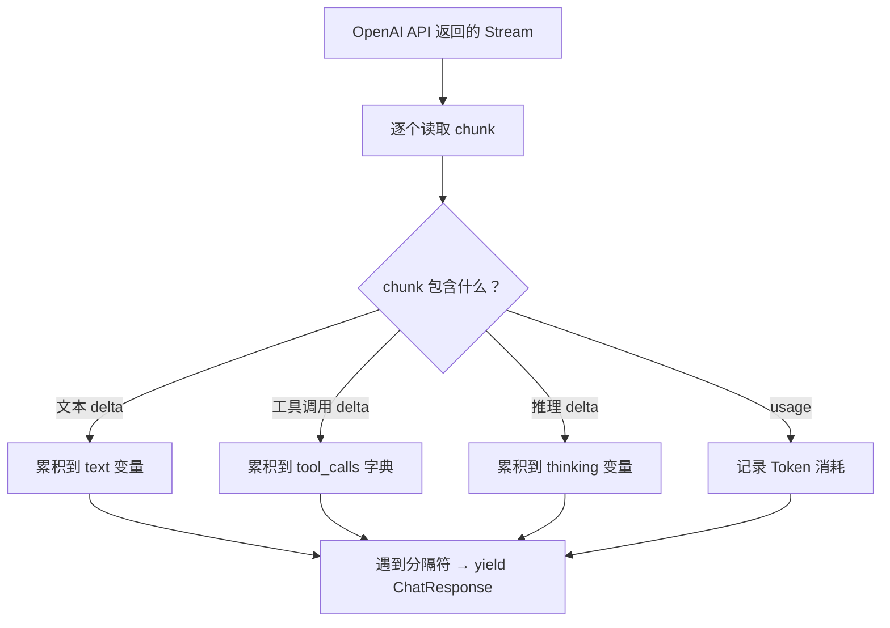
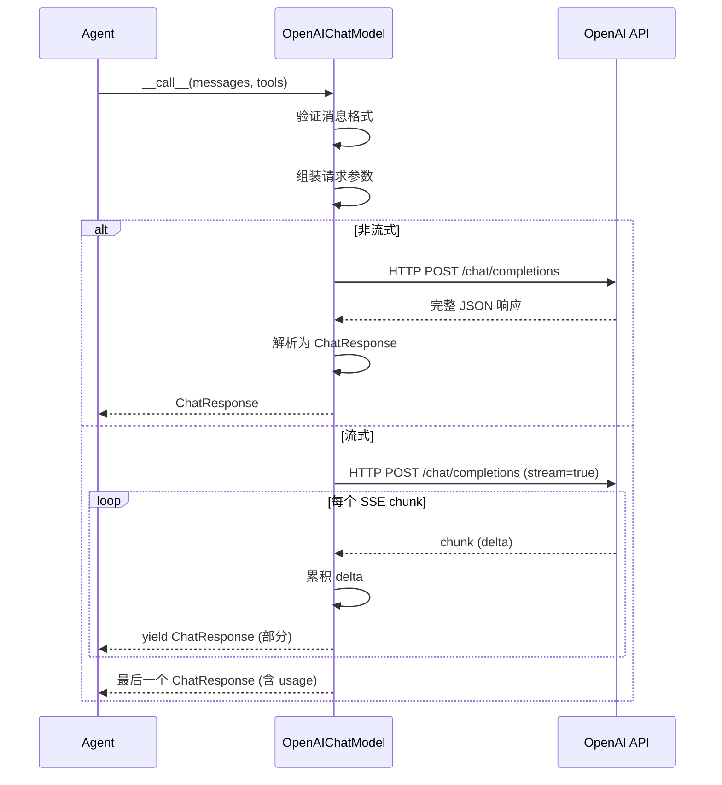

# 第 9 站：调用模型

> Formatter 把消息翻译好了，现在终于要发送给大模型了。我们追踪 HTTP 请求从发出到响应的全过程。

## 路线图

上一站，Formatter 把 `Msg` 列表翻译成了 `[{"role": "user", "content": "..."}]` 这样的字典列表。现在这些字典被传给 `Model`（模型适配器），由它负责和 API 通信。

```
Formatter 输出: [{"role": "user", "content": "北京天气如何？"}, ...]
                              ↓
                    Model.__call__(messages)
                              ↓
                    HTTP 请求 → OpenAI API
                              ↓
                    HTTP 响应 → ChatResponse
```

读完本章，你会理解：
- `ChatModelBase` 的统一接口
- 流式响应的解析过程
- `ChatResponse` 的内容块（ContentBlock）类型
- 结构化输出（Structured Output）的实现

---

## 知识补全：AsyncGenerator

`ChatModelBase.__call__` 的返回类型有两种：

```python
async def __call__(...) -> ChatResponse | AsyncGenerator[ChatResponse, None]:
```

- **非流式**（`stream=False`）：一次性返回完整的 `ChatResponse`
- **流式**（`stream=True`）：返回一个 `AsyncGenerator`，每次 `yield` 一个包含部分内容的 `ChatResponse`

`AsyncGenerator` 就像一个"异步迭代器"。你可以用 `async for` 遍历它：

```python
async for chunk in model(messages):
    print(chunk)  # 每次收到一小段
```

流式的好处是用户不需要等模型生成完所有内容才开始看到结果。

---

## 第一层：ChatModelBase

打开 `src/agentscope/model/_model_base.py`：

```python
# _model_base.py:13
class ChatModelBase:
    model_name: str    # 模型名称，如 "gpt-4o"
    stream: bool       # 是否流式输出

    @abstractmethod
    async def __call__(
        self, *args, **kwargs,
    ) -> ChatResponse | AsyncGenerator[ChatResponse, None]:
        """调用模型 API"""
```

注意 `__call__` 意味着模型对象可以像函数一样调用：`response = await model(messages)`。

还有一个验证方法：

```python
# _model_base.py:46
def _validate_tool_choice(self, tool_choice: str, tools: list[dict] | None):
    """验证 tool_choice 参数是否合法"""
```

`tool_choice` 有三种预设模式：`"auto"`（模型自己决定）、`"none"`（不调用工具）、`"required"`（必须调用工具）。也可以指定具体的工具名称。

---

## ChatResponse：模型响应的数据结构

打开 `src/agentscope/model/_model_response.py`：

```python
# _model_response.py:20
@dataclass
class ChatResponse(DictMixin):
    content: Sequence[TextBlock | ToolUseBlock | ThinkingBlock | AudioBlock]
    id: str
    created_at: str
    type: Literal["chat"]
    usage: ChatUsage | None
    metadata: dict | None
```

`content` 是核心字段——一个内容块列表。四种可能的类型：

| 内容块 | 含义 | 什么时候出现 |
|--------|------|-------------|
| `TextBlock` | 普通文本 | 模型返回文字回答 |
| `ToolUseBlock` | 工具调用 | 模型决定调用工具 |
| `ThinkingBlock` | 思考过程 | 推理模型（如 o1/o3）的内部推理 |
| `AudioBlock` | 语音 | 语音模型返回音频数据 |

### ChatUsage

```python
# _model_usage.py:11
@dataclass
class ChatUsage(DictMixin):
    input_tokens: int     # 输入 Token 数
    output_tokens: int    # 输出 Token 数
    time: float           # 耗时（秒）
```

每次 API 调用都会消耗 Token。`ChatUsage` 记录了消耗了多少。

---

## OpenAIChatModel 的实现

打开 `src/agentscope/model/_openai_model.py`，找到第 71 行：

```python
# _openai_model.py:71
class OpenAIChatModel(ChatModelBase):
```

### __call__ 方法的签名

```python
# _openai_model.py:176
@trace_llm
async def __call__(
    self,
    messages: list[dict],
    tools: list[dict] | None = None,
    tool_choice: Literal["auto", "none", "required"] | str | None = None,
    structured_model: Type[BaseModel] | None = None,
    **kwargs,
) -> ChatResponse | AsyncGenerator[ChatResponse, None]:
```

四个关键参数：

1. `messages`：Formatter 翻译好的消息列表
2. `tools`：工具的 JSON Schema 列表（告诉模型有哪些工具可用）
3. `tool_choice`：工具选择策略
4. `structured_model`：结构化输出的 Pydantic 模型

方法内部会：
1. 验证消息格式
2. 组装请求参数（model、messages、stream、tools 等）
3. 如果有 `structured_model`，走结构化输出路径
4. 调用 OpenAI SDK 发送请求
5. 解析响应为 `ChatResponse`

### 流式解析

流式响应的解析在 `_parse_openai_stream_response`（第 346 行）中。它的工作是：



关键数据结构：

```python
# _openai_model.py:376
text = ""           # 累积文本
thinking = ""       # 累积推理
audio = ""          # 累积音频
tool_calls = OrderedDict()   # 累积工具调用
```

每个 chunk 只包含一小段增量（delta）。解析器需要把这些增量累积起来，在适当的时机（比如一段完整的文本结束、一个工具调用完成）yield 一个 `ChatResponse`。

### 结构化输出

```python
# _openai_model.py:730
async def _structured_via_tool_call(self, ...):
    """通过"伪装成工具调用"的方式实现结构化输出"""
```

结构化输出的巧妙实现：把 Pydantic 模型转换成一个"工具函数"的 JSON Schema，让模型以为自己要调用工具——但实际上这只是为了让模型返回特定格式的 JSON。

---

## 完整流程图



> **设计一瞥**：为什么 `__call__` 的返回类型是 Union？
> `ChatResponse | AsyncGenerator[ChatResponse, None]` 是一种妥协。非流式返回一个对象，流式返回一个异步生成器——调用者需要自己判断。
> 另一种设计是让流式和非流式有统一接口（都返回 AsyncGenerator，非流式只是 yield 一次）。但 AgentScope 选择区分它们，因为大多数调用者只使用其中一种模式。
> 详见卷四第 31 章。

---

## 试一试：观察 Model 的调用过程

这个练习需要一个 API key（OpenAI 或兼容服务）。如果你没有，可以用"纯源码阅读"替代方案。

### 方案 A：有 API key

1. 在 `src/agentscope/model/_openai_model.py` 的 `__call__` 方法中（第 176 行后），加一行：

```python
print(f"[DEBUG] 发送请求: model={kwargs.get('model')}, messages={len(messages)}条, stream={self.stream}")
```

2. 运行任意使用 `OpenAIChatModel` 的示例，观察 print 输出。

### 方案 B：无 API key（纯源码阅读）

1. 打开 `_parse_openai_stream_response` 方法（第 346 行），阅读累积逻辑
2. 搜索 `text +=` 和 `tool_calls[`，看看文本和工具调用的增量是如何累积的

```bash
grep -n "text +=" src/agentscope/model/_openai_model.py | head -5
grep -n "tool_calls\[" src/agentscope/model/_openai_model.py | head -5
```

3. 思考：如果一个工具调用的参数被分成了 3 个 chunk 发送，代码如何把它们拼起来？

**改完后恢复：**

```bash
git checkout src/agentscope/model/
```

---

## 检查点

你现在理解了：

- **ChatModelBase** 定义了统一的模型调用接口 `__call__`
- **流式响应**通过 `_parse_openai_stream_response` 解析，逐 chunk 累积内容
- **ChatResponse** 的 `content` 是内容块列表（TextBlock / ToolUseBlock / ThinkingBlock / AudioBlock）
- **结构化输出**通过把 Pydantic 模型伪装成工具调用实现
- `ChatUsage` 记录每次调用的 Token 消耗

**自检练习**：

1. 模型返回了 `ToolUseBlock`，下一步 Agent 应该做什么？（提示：回忆贯穿示例的 ReAct 循环）
2. 流式解析中，`text += chunk_text` 的累积发生在哪个方法中？它在什么时候 yield 一个 ChatResponse？

---

## 下一站预告

模型返回了 `ToolUseBlock`——"请调用 `get_weather` 工具，参数是 `city: 北京`"。但怎么从 JSON Schema 描述的工具变成真正执行 Python 函数？下一站，我们打开 **Toolkit（工具箱）**，追踪工具注册和调用的全过程。
