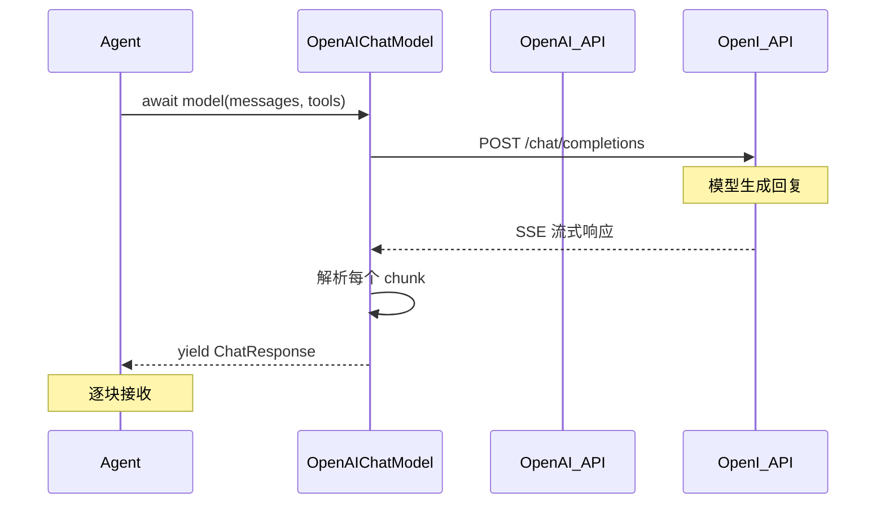

# 第 9 章 第 6 站：调用模型

> **追踪线**：消息已格式化，现在发送给模型。HTTP 请求、流式响应、ThinkingBlock 处理。
> 本章你将理解：ChatModelBase 接口、OpenAI API 调用、流式响应解析。

---

## 9.1 路线图

```mermaid
graph LR
    Init["init()"] --> Msg["Msg 诞生"]
    Msg --> Agent["Agent 收信"]
    Agent --> Memory["工作记忆"]
    Memory --> Retrieve["检索知识"]
    Retrieve --> Format["格式转换"]
    Format --> Model["请求模型"]
    Model --> Tool["执行工具"]
    Tool --> Loop["循环/返回"]

    style Init fill:#e0e0e0
    style Msg fill:#e0e0e0
    style Agent fill:#e0e0e0
    style Memory fill:#e0e0e0
    style Retrieve fill:#e0e0e0
    style Format fill:#e0e0e0
    style Model fill:#4caf50,color:white
```



绿色是当前位置——向模型发送请求。

> **源码验证日期**: 2026-05-11, commit `f17cfd0a`

---

## 9.2 知识补全：AsyncGenerator

流式响应用到了 `AsyncGenerator`。它是什么？

### 生成器（Generator）

普通函数一次返回所有结果。生成器用 `yield` 一次返回一个值：

```python
def count_to_3():
    yield 1
    yield 2
    yield 3

for num in count_to_3():
    print(num)  # 1, 2, 3
```

### 异步生成器（AsyncGenerator）

异步版本用 `async for` 消费：

```python
async def stream_response():
    yield "你"
    yield "好"
    yield "！"

async for chunk in stream_response():
    print(chunk, end="")  # 你好！
```

在流式响应中，模型每生成一个 token 就 `yield` 一个，调用方用 `async for` 逐个接收。这就是你在聊天软件中看到文字逐字出现的效果。

---

## 9.3 源码入口

| 文件 | 内容 |
|------|------|
| `src/agentscope/model/_model_base.py` | `ChatModelBase` 基类 |
| `src/agentscope/model/_openai_model.py` | `OpenAIChatModel` 实现 |
| `src/agentscope/model/_model_response.py` | `ChatResponse` 响应类型 |
| `src/agentscope/model/_model_usage.py` | `ChatUsage` Token 统计 |

---

## 9.4 逐行阅读

### ChatModelBase：模型接口

打开 `src/agentscope/model/_model_base.py`：

```python
class ChatModelBase:
    model_name: str
    stream: bool

    def __init__(self, model_name: str, stream: bool) -> None:
        self.model_name = model_name
        self.stream = stream

    @abstractmethod
    async def __call__(
        self, *args, **kwargs,
    ) -> ChatResponse | AsyncGenerator[ChatResponse, None]:
        pass
```

接口简洁：

| 属性/方法 | 用途 |
|----------|------|
| `model_name` | 模型名称（如 `"gpt-4o"`） |
| `stream` | 是否流式 |
| `__call__()` | 调用模型，返回响应或流式生成器 |

返回值有两种：
- **非流式**：`ChatResponse` —— 一次性返回完整响应
- **流式**：`AsyncGenerator[ChatResponse]` —— 逐块返回

### ChatResponse：统一的响应格式

不管用哪个模型提供商（OpenAI、Anthropic、Gemini），`ChatResponse` 都是一样的结构：

```python
class ChatResponse:
    message: Msg                    # 模型的回复消息
    usage: ChatUsage | None         # Token 使用统计
    ...
```

这种统一让上层代码不需要关心底层 API 的差异。

### OpenAIChatModel：具体实现

打开 `src/agentscope/model/_openai_model.py`：

```python
class OpenAIChatModel(ChatModelBase):
    async def __call__(
        self,
        messages: list[dict],
        tools: list[dict] | None = None,
        ...
    ) -> ChatResponse | AsyncGenerator[ChatResponse, None]:
```

#### 调用流程



#### 流式响应解析

在流式模式下，OpenAI API 返回 Server-Sent Events (SSE) 格式的数据：

```
data: {"choices":[{"delta":{"content":"北"},"index":0}]}
data: {"choices":[{"delta":{"content":"京"},"index":0}]}
data: {"choices":[{"delta":{"content":"今"},"index":0}]}
...
data: [DONE]
```

`OpenAIChatModel` 把这些 chunk 解析成 `ChatResponse` 对象，每个包含一个增量内容块。

#### ThinkingBlock 处理

某些模型（如 Claude）支持"思考"模式——模型先展示推理过程，再给出答案。思考内容被包装为 `ThinkingBlock`：

```python
ThinkingBlock(type="thinking", thinking="让我分析一下这个问题...")
```

在 `OpenAIChatModel` 中，思考内容和正常内容被分别解析，最终组装到 `Msg.content` 列表里。

---

## 9.5 调试实践

### 开启 DEBUG 日志观察 API 请求

```python
import agentscope
agentscope.init(logging_level="DEBUG")
```

你会看到模型请求和响应的详细日志。

### 查看 Token 使用统计

```python
model = OpenAIChatModel(model_name="gpt-4o", stream=False)
response = await model(messages=[...])
print(f"输入 tokens: {response.usage.prompt_tokens}")
print(f"输出 tokens: {response.usage.completion_tokens}")
```

---

## 9.6 试一试

### 在 OpenAIChatModel 中加 print

打开 `src/agentscope/model/_openai_model.py`，在 `__call__` 方法开头加：

```python
async def __call__(self, messages, tools=None, ...):
    print(f"[MODEL] 调用 {self.model_name}, 消息数={len(messages)}, 工具数={len(tools) if tools else 0}")  # 加这行
    ...
```

### 观察流式输出

```python
model = OpenAIChatModel(model_name="gpt-4o", stream=True)
async for chunk in await model(messages=[{"role": "user", "content": "你好"}]):
    if chunk.message.content:
        print(chunk.message.content, end="", flush=True)
print()  # 换行
```

---

## 9.7 检查点

你现在已经理解了：

- **ChatModelBase**：统一的模型接口，`__call__()` 返回响应或流式生成器
- **OpenAIChatModel**：OpenAI API 的具体实现
- **ChatResponse**：统一的响应格式，包含 `Msg` 和 `ChatUsage`
- **流式响应**：SSE 格式，逐 chunk 解析
- **ThinkingBlock**：模型的思考过程，独立于正文内容

**自检练习**：
1. 为什么 `ChatModelBase.__call__()` 的返回类型是 `ChatResponse | AsyncGenerator`？（提示：取决于 `stream`）
2. 为什么要用统一的 `ChatResponse` 格式？（提示：多个提供商的 API 响应格式不同）

---

## 下一站预告

模型返回了结果，其中可能包含工具调用请求。下一站，解析并执行工具。
