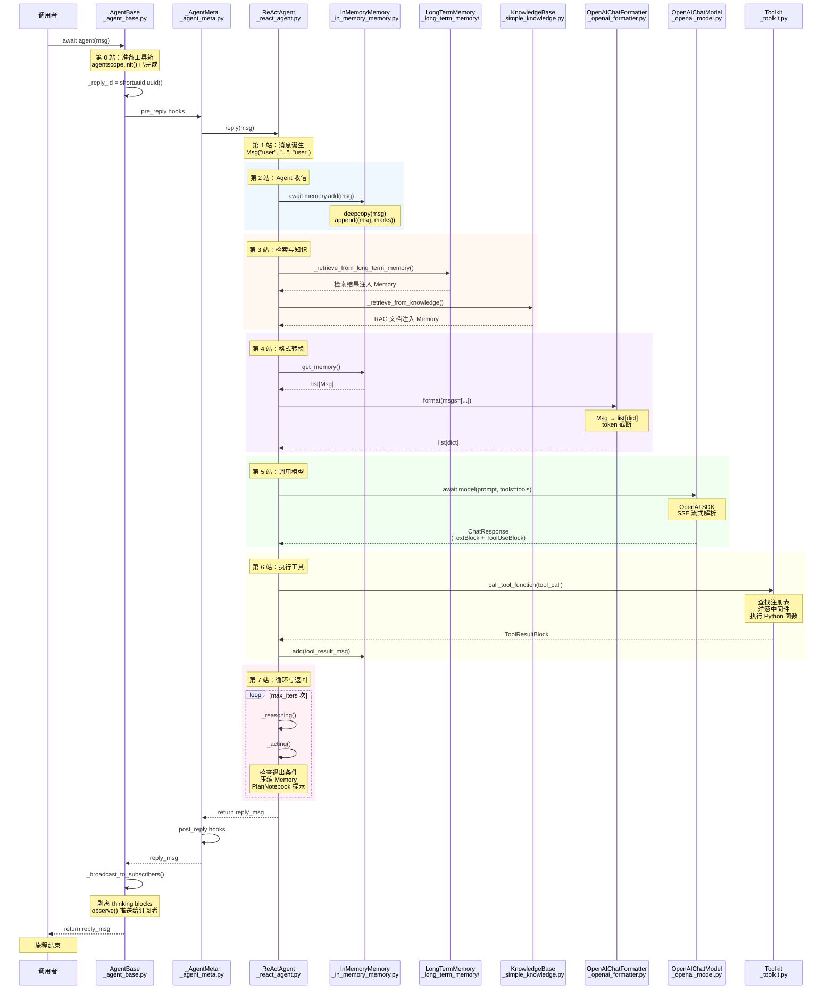

# 第十章：旅程复盘

> 你已经走完了 `await agent(msg)` 的全部旅程。从 `agentscope.init()` 到最终返回 `Msg`，我们穿越了九个站点，拆解了数万行源码，看清了一条消息从诞生到回归的完整路径。
> 现在是停下来回望的时刻——把九个站点重新串成一条全景线，为进入卷二的设计模式世界做好准备。

---

## 1. 全景图

下面这张时序图展示了 `await agent(msg)` 的完整调用链。从 `AgentBase.__call__()` 进入，经过消息存入、检索增强、格式转换、模型调用、工具执行、ReAct 循环，最终回到 `__call__()` 返回结果。标注了每一站对应的源文件和关键方法。

---

## 2. 一条消息的六次变身

在全景图中，数据在不同模块之间以不同的形态流动。如果我们把视角固定在那条原始消息——`Msg("user", "北京今天天气怎么样？", "user")`——上，追踪它从创建到返回所经历的每一次类型转换，会看到这样的轨迹：

**第一次：str → list[ContentBlock]**

`Msg.content` 初始化时是字符串 `"北京今天天气怎么样？"`。当 `get_content_blocks()` 被调用时，它被自动包装为 `[TextBlock(type="text", text="北京今天天气怎么样？")]`。这是框架内部的统一处理——不管 `content` 是字符串还是块列表，下游代码总能以列表形式处理。

**第二次：Msg → tuple[Msg, list[str]]**

`await self.memory.add(msg)` 在 `_in_memory_memory.py:93` 中将消息 `deepcopy` 后追加到 `content` 列表。存储形态变成 `(msg_copy, [])`——元组的第二个元素是 mark 标签列表。此时消息有了一份独立的记忆副本。

**第三次：list[tuple[Msg, list[str]]] → list[Msg]**

`get_memory()` 从 `content` 列表中过滤、提取，返回纯净的 `list[Msg]`。如果启用了压缩摘要，摘要在这一步被拼接到列表头部。Formatter 接收到的就是这个列表。

**第四次：list[Msg] → list[dict]**

`OpenAIChatFormatter._format()` 遍历每条 `Msg`，根据 role 和 content block 类型，构建 OpenAI API 格式的字典。`TextBlock` 变成 `{"type": "text", "text": "..."}`, `ToolUseBlock` 变成 `tool_calls` 数组。这是跨越框架边界的翻译——从 AgentScope 的内部表示到外部 API 的约定。

**第五次：SSE chunks → ChatResponse**

`_parse_openai_stream_response()` 从 HTTP 流中逐块累积内容，构建 `ChatResponse`。每个 yield 的 `ChatResponse` 都包含完整累积的 content blocks。这是从网络协议到框架对象的转换。

**第六次：ChatResponse → Msg**

`ReActAgent._reasoning()` 从 `ChatResponse.content` 中提取内容，构建新的 `Msg(name=self.name, content=content_blocks, role="assistant")`。这条新消息被存入 Memory、用于判断是否需要调用工具、最终作为回复返回。

---

## 3. 数据流转换速查

下表从模块间传递的视角追踪数据类型转换。

| 阶段 | 输入类型 | 输出类型 | 转换发生在 | 关键操作 |
|------|----------|----------|------------|----------|
| 调用者 → `__call__` | `Msg` | `Msg`（原样传入） | `_agent_base.py:455` | `reply(msg)` |
| `reply()` → Memory | `Msg` | `tuple[Msg, list[str]]` | `_in_memory_memory.py:93` | `deepcopy(msg)` + append |
| Memory → Formatter | `list[tuple[Msg, list[str]]]` | `list[Msg]` | `_in_memory_memory.py:67` | mark 过滤 + 摘要拼接 |
| Formatter 输入 → 输出 | `list[Msg]` | `list[dict]` | `_openai_formatter.py:219` | ContentBlock → API 字段 |
| Formatter → Model | `list[dict]` | `list[dict]`（原样传入） | `_openai_model.py:71` | 加上 tools/tool_choice |
| Model 输出 | SSE chunks | `ChatResponse` | `_openai_model.py:346` | 累积 + 构建 ContentBlock |
| ChatResponse → Msg | `ChatResponse` | `Msg` | `_react_agent.py:578` | `content` 字段赋值 |
| 工具结果 → Msg | `ToolResultBlock` | `Msg` | `_react_agent.py` — `_acting()` | 包装为带 `role="tool"` 的 Msg |
| Msg → Memory（循环内） | `Msg` | `tuple[Msg, list[str]]` | `_in_memory_memory.py:93` | 再次 deepcopy + append |
| `reply()` → `__call__` | `Msg` | `Msg`（原样返回） | `_agent_base.py:455` | `return reply_msg` |
| `__call__` → 调用者 | `Msg` | `Msg`（thinking 剥离后） | `_agent_base.py:469` | 广播 + `_strip_thinking_blocks` |

一条消息在旅途中经历了**六次类型转换**和**至少两次 `deepcopy`**。这些转换并非多余——每一次转换都对应了一个架构上的关注点：`deepcopy` 保证隔离，`list[Msg]` → `list[dict]` 适配 API，SSE chunks → `ChatResponse` 统一流式接口。

---

## 4. 八站回顾

### 第 0 站：准备工具箱（ch01）

`agentscope.init()` 初始化全局配置。它通过 `_ConfigCls` 将五个 `ContextVar`（`run_id`、`project`、`name`、`created_at`、`trace_enabled`）包装为普通属性接口，实现线程安全的配置管理。`import agentscope` 时模块级代码已经创建了带默认值的 `_config`，`init()` 只是覆盖其中的字段。

这一站的源码位置：
- `src/agentscope/__init__.py:72` — `init()` 函数
- `src/agentscope/_run_config.py:6` — `_ConfigCls` 类

### 第 1 站：消息诞生（ch02）

`Msg("user", "北京今天天气怎么样？", "user")` 创建了框架唯一的数据流通单位。`content` 有两种形态——`str` 和 `list[ContentBlock]`，通过 `get_content_blocks()` 统一处理。七种 `ContentBlock`（`TextBlock`、`ThinkingBlock`、`ImageBlock`、`AudioBlock`、`VideoBlock`、`ToolUseBlock`、`ToolResultBlock`）都是 `TypedDict`，与 JSON 天然对齐。

关键认知：`Msg` 是整个系统中唯一贯穿所有模块的数据结构。它从调用者手中创建，进入 Agent，被存入 Memory，从 Memory 中取出，被 Formatter 翻译，从 Model 的响应中重建，再回到调用者手中——形态不变，内容不断丰富。

这一站的源码位置：
- `src/agentscope/message/_message_base.py:21` — `Msg` 类
- `src/agentscope/message/_message_block.py:110` — `ContentBlock` 联合类型

### 第 2 站：Agent 收信（ch03）

`AgentBase.__call__()` 是消息进入 Agent 的唯一入口。它生成 `_reply_id`，调用 `reply()`，在 `finally` 中广播结果。元类 `_AgentMeta` 在类定义时自动包装 `reply()`、`observe()`、`print()` 三个方法，注入 Hook 三层结构（pre-hooks → 原始函数 → post-hooks）。`ReActAgent` 通过 `_ReActAgentMeta` 额外获得 4 个 Hook 点（reasoning/acting 前后）。

关键认知：`__call__()` 只有 20 行代码，但它承担了三个职责——任务追踪（`_reply_task`）、中断处理（`CancelledError`）和结果广播（`_broadcast_to_subscribers`）。元类的介入时机是类定义时（`class` 语句被 Python 解释器执行时），而非实例化或方法调用时——这意味着 Hook 的存在对开发者完全透明。

这一站的源码位置：
- `src/agentscope/agent/_agent_base.py:448` — `__call__()` 方法
- `src/agentscope/agent/_agent_meta.py:159` — `_AgentMeta` 元类

### 第 3 站：记忆存入（ch04）

`await self.memory.add(msg)` 是 `reply()` 的第一行。`InMemoryMemory` 内部用 `list[tuple[Msg, list[str]]]` 存储消息和 mark 标签，`deepcopy` 保证记忆中的版本不受外部修改影响。mark 系统支持灵活过滤——`_MemoryMark.HINT` 标记临时提示消息（用完即删），`_MemoryMark.COMPRESSED` 标记已压缩消息（检索时跳过）。`StateModule` 基类提供 PyTorch 风格的 `state_dict()` / `load_state_dict()` 序列化。

关键认知：Memory 选择了 `list` 而非 `dict`，因为对话历史的**时序性**是第一需求。`deepcopy` 保证了记忆与外部世界的隔离——即使调用者在存入后修改了原始 `Msg`，记忆中的版本也不受影响。

这一站的源码位置：
- `src/agentscope/memory/_working_memory/_base.py:11` — `MemoryBase` 抽象基类
- `src/agentscope/memory/_working_memory/_in_memory_memory.py:93` — `InMemoryMemory.add()`

### 第 4 站：检索与知识（ch05）

两条检索管道为 Agent 提供"旧账"和"资料"。长期记忆支持两种控制模式：`static_control`（框架自动）和 `agent_control`（Agent 自主通过工具函数）。RAG 管道的核心流程是"查询 → 嵌入 → 向量搜索 → 结果注入 Memory"。检索结果以 `<long_term_memory>` 和 `<retrieved_knowledge>` XML 标签注入工作记忆。

关键认知：长期记忆的 `static_control` vs `agent_control` 代表了两种设计理念——前者是"开发者决定"，保证每次对话都检索；后者是"Agent 自主"，让 Agent 根据上下文判断什么值得记住。RAG 管道的"查询 → 嵌入 → 向量搜索"三步走，本质上是在高维向量空间中找语义最近邻。

这一站的源码位置：
- `src/agentscope/agent/_react_agent.py:858` — `_retrieve_from_long_term_memory()`
- `src/agentscope/agent/_react_agent.py:908` — `_retrieve_from_knowledge()`

### 第 5 站：格式转换（ch06）

`self.formatter.format()` 将 `list[Msg]` 翻译为 `list[dict]`。`FormatterBase` 定义抽象接口，`TruncatedFormatterBase` 增加 token 感知的截断（while 循环 + 从头部裁剪），`OpenAIChatFormatter` 实现具体的块转换逻辑。Formatter 独立于 Model 存在，通过外部注入实现解耦——同一个 Agent 可以搭配不同 Formatter 适配不同 API。

关键认知：Formatter 是 Agent 内部世界（`Msg` 对象）和外部 LLM 世界（API 字典）之间的**翻译层**。它的独立性意味着：如果你要支持一个新的 LLM 提供商，只需要编写一个新的 Formatter 子类，而不需要修改 Agent 或 Model 的代码。这是策略模式（Strategy Pattern）的典型应用。

这一站的源码位置：
- `src/agentscope/formatter/_openai_formatter.py:168` — `OpenAIChatFormatter` 类
- `src/agentscope/formatter/_formatter_base.py` — `FormatterBase` / `TruncatedFormatterBase`

### 第 6 站：调用模型（ch07）

`await self.model(prompt, tools=tools)` 通过 OpenAI SDK 发送 HTTP 请求。流式响应通过 `_parse_openai_stream_response` 逐块解析 SSE，用 `OrderedDict` 累积工具调用。四种内容块（`TextBlock`、`ThinkingBlock`、`AudioBlock`、`ToolUseBlock`）从原始 API 响应中提取。结构化输出有两条路径：`response_format` 和 tool-call 回退，框架自动记忆降级。

关键认知：Model 层**不知道 `Msg` 的存在**——它只接收 `list[dict]`，只返回 `ChatResponse`。流式路径中，每个 yield 的 `ChatResponse` 都是一个**完整累积快照**，而非增量 delta。`_json_loads_with_repair` 在流式场景下持续修复不完整的 JSON，让 Agent 能在工具参数还未完全生成时就拿到"最佳猜测"。

这一站的源码位置：
- `src/agentscope/model/_openai_model.py:71` — `OpenAIChatModel` 类
- `src/agentscope/model/_openai_model.py:346` — `_parse_openai_stream_response()`

### 第 7 站：执行工具（ch08）

`await self.toolkit.call_tool_function(tool_call)` 查找注册表、合并参数、运行 Python 函数。`_parse_tool_function()` 从函数签名和 docstring 自动提取 JSON Schema。中间件洋葱模型通过 `_apply_middlewares` 装饰器实现，在执行前后插入横切逻辑。统一流式接口将同步/异步/生成器三种函数统一为 `AsyncGenerator`。

关键认知：工具系统的核心设计是**让普通 Python 函数变成 LLM 可调用的工具**，整个过程对函数编写者完全透明——只需要写一个有类型注解和 docstring 的函数，框架自动完成 Schema 提取、参数校验、结果包装。中间件洋葱模型则提供了不侵入业务逻辑的横切扩展能力。

这一站的源码位置：
- `src/agentscope/tool/_toolkit.py:117` — `Toolkit` 类
- `src/agentscope/tool/_toolkit.py:853` — `call_tool_function()` 方法

### 第 8 站：循环与返回（ch09）

`for _ in range(self.max_iters)` 控制推理-行动循环。每轮调用 `_reasoning()` 获取 LLM 响应，`_acting()` 执行工具，直到 LLM 给出纯文本回复、结构化输出满足要求、或迭代次数达到上限。`PlanNotebook` 引导多步骤任务，`Memory` 压缩避免上下文溢出。最终的 `reply_msg` 穿过 `__call__()` 回到调用者手中，沿途剥离 thinking blocks 并广播给 MsgHub 订阅者。

关键认知：ReAct 循环是整个旅程的**主循环**——如果 LLM 在第一轮就返回纯文本，循环只执行一次；如果 LLM 连续调用工具，循环会反复经过"格式化 → 模型调用 → 工具执行"这个子环。`_reasoning()` 和 `_acting()` 的分离让 Hook 可以在推理和行动两个阶段分别拦截，也为并行工具执行提供了清晰的编排边界。

这一站的源码位置：
- `src/agentscope/agent/_react_agent.py:98` — `ReActAgent` 类
- `src/agentscope/agent/_react_agent.py:376` — `reply()` 方法

---

## 5. 调用链速查表

| 站 | 源文件 | 关键类/方法 | 行号 | 做什么 |
|----|--------|-------------|------|--------|
| 0 | `src/agentscope/__init__.py` | `init()` | :72 | 初始化全局配置、日志、Tracing |
| 0 | `src/agentscope/_run_config.py` | `_ConfigCls` | :6 | ContextVar 包装的线程安全配置 |
| 1 | `src/agentscope/message/_message_base.py` | `Msg.__init__()` | :24 | 创建消息，分配 id 和 timestamp |
| 1 | `src/agentscope/message/_message_block.py` | `ContentBlock` (Union) | :110 | 七种内容块的联合类型 |
| 2 | `src/agentscope/agent/_agent_base.py` | `AgentBase.__call__()` | :448 | 消息入口：生成 ID、调用 reply、广播 |
| 2 | `src/agentscope/agent/_agent_meta.py` | `_AgentMeta.__new__()` | :159 | 元类在类定义时包装方法、注入 Hook |
| 2 | `src/agentscope/agent/_agent_meta.py` | `_wrap_with_hooks()` | :55 | Hook 三层结构：pre → func → post |
| 3 | `src/agentscope/memory/_working_memory/_base.py` | `MemoryBase` | :11 | 记忆抽象基类，定义 add/delete/get_memory |
| 3 | `src/agentscope/memory/_working_memory/_in_memory_memory.py` | `InMemoryMemory.add()` | :93 | deepcopy + append，list 存储 |
| 3 | `src/agentscope/module/_state_module.py` | `StateModule` | :20 | PyTorch 风格序列化基类 |
| 4 | `src/agentscope/agent/_react_agent.py` | `_retrieve_from_long_term_memory()` | :858 | 长期记忆检索 |
| 4 | `src/agentscope/agent/_react_agent.py` | `_retrieve_from_knowledge()` | :908 | RAG 管道：查询 → 嵌入 → 搜索 |
| 4 | `src/agentscope/rag/_simple_knowledge.py` | `SimpleKnowledge.retrieve()` | :38 | 向量搜索实现 |
| 5 | `src/agentscope/formatter/_openai_formatter.py` | `OpenAIChatFormatter._format()` | :219 | Msg → OpenAI API 字典 |
| 5 | `src/agentscope/formatter/_formatter_base.py` | `TruncatedFormatterBase.format()` | — | token 感知的截断 |
| 6 | `src/agentscope/model/_openai_model.py` | `OpenAIChatModel.__call__()` | :71 | HTTP 请求 + SSE 流解析 |
| 6 | `src/agentscope/model/_openai_model.py` | `_parse_openai_stream_response()` | :346 | 流式 chunk 累积 + ContentBlock 构建 |
| 6 | `src/agentscope/model/_model_response.py` | `ChatResponse` | :20 | 模型统一返回格式 |
| 7 | `src/agentscope/tool/_toolkit.py` | `Toolkit.call_tool_function()` | :853 | 查找函数 → 执行 → ToolResultBlock |
| 7 | `src/agentscope/tool/_toolkit.py` | `Toolkit` | :117 | 工具注册、管理、中间件 |
| 8 | `src/agentscope/agent/_react_agent.py` | `ReActAgent.reply()` | :376 | ReAct 循环入口 |
| 8 | `src/agentscope/agent/_react_agent.py` | `ReActAgent._reasoning()` | :557 | 推理：格式化 → 调用模型 → 返回 |
| 8 | `src/agentscope/agent/_react_agent.py` | `ReActAgent._acting()` | — | 行动：执行工具 → 写入 Memory |
| 8 | `src/agentscope/agent/_agent_base.py` | `AgentBase.__call__()` finally | :462 | 广播 + 返回 |

---

## 6. 贯穿全程的设计线索

在逐一回顾了九个站点之后，有几条设计线索值得单独拎出来——它们不是某一个站点的特征，而是贯穿了多个站点的架构选择。

### 线索一：TypedDict 优先于 dataclass

`Msg` 的七种 `ContentBlock` 全部用 `TypedDict` 定义，而非 Python 更常见的 `dataclass`。这个选择影响了从消息创建到 API 调用的整条链路：

- ch02（消息诞生）：`ContentBlock` 是联合类型别名，`TypedDict` 可以直接用 `|` 组合
- ch06（格式转换）：`Formatter` 从 API 响应中提取数据后可以直接作为 `TypedDict` 使用，无需转换
- ch07（模型调用）：`ChatResponse.content` 中的块就是 `TypedDict`，序列化为 JSON 时零开销

`TypedDict` 在运行时就是普通 `dict`，没有额外的实例化开销。对频繁创建消息的高吞吐场景，这是一个关键的性能优势。

### 线索二：deepcopy 作为隔离墙

框架中有两处关键的 `deepcopy`：

- ch04（记忆存入）：`InMemoryMemory.add()` 对传入的 `Msg` 执行 `deepcopy`，确保记忆中的版本与外部互不影响
- ch03（广播）：`_broadcast_to_subscribers()` 在广播前对 `Msg` 执行 `deepcopy`（`_agent_base.py:503`），确保每个订阅者拿到独立的副本

这两处 `deepcopy` 的共同目的都是**隔离**——防止一个模块对消息的修改意外影响另一个模块。在异步多 Agent 场景中，这种隔离尤为重要。

### 线索三：抽象基类的一致接口

框架中至少有五个关键抽象基类，它们遵循相同的设计模式——定义统一接口，由多个具体实现分别适配不同后端：

| 抽象基类 | 定义位置 | 具体实现数 | 接口方法 |
|----------|----------|------------|----------|
| `MemoryBase` | `_working_memory/_base.py:11` | InMemory, Redis, SQLAlchemy, Mem0 | add, delete, get_memory, size |
| `FormatterBase` | `_formatter_base.py` | OpenAI, Anthropic, Gemini, DashScope, Ollama | format |
| `ChatModelBase` | `_model_base.py` | OpenAI, Anthropic, DashScope, Gemini, Ollama | __call__ |
| `EmbeddingModelBase` | `_embedding_base.py:8` | OpenAI, DashScope, Gemini, Ollama | __call__ |
| `VDBStoreBase` | `_store/_store_base.py:10` | Qdrant, Milvus, MongoDB, OceanBase | add, search |

这个一致性意味着：如果你理解了一个抽象基类的设计，你就理解了所有五个。切换后端只需要更换具体实现，调用方代码不变。

### 线索四：异步优先

整个调用链中，几乎所有关键方法都是 `async` 的：`__call__()`、`reply()`、`add()`、`get_memory()`、`format()`、`model.__call__()`、`call_tool_function()`。这不是偶然——异步优先的设计让框架能在 `asyncio` 事件循环上高效运行多个并发 Agent，而不会因为一个 Agent 等待 LLM 响应而阻塞其他 Agent。

唯一的例外是 `StateModule.state_dict()` / `load_state_dict()`——它们是同步方法，因为序列化操作不涉及 I/O。

---

## 7. 卷一 → 卷二过渡

你已经跟着一条消息走完了 `await agent(msg)` 的全程。

九个站点，九次深入源码，九次从"这是什么"到"为什么这样设计"的追问。回顾这条路径，你可能注意到了一些反复出现的模式——它们在卷一中一闪而过，但值得停下来仔细端详：

**继承的脉络**：`StateModule` 出现在 `AgentBase`、`MemoryBase`、`Toolkit` 三处。为什么这三个模块都需要序列化能力？`__setattr__` 如何在赋值时自动追踪子模块？`state_dict()` 如何递归地序列化整棵对象树？这些问题的答案构成了卷二 ch12 的主题——继承体系。

**元类的隐形之手**：`_AgentMeta` 在类定义时（而非实例化或方法调用时）就已经改写了 `reply()`、`observe()`、`print()` 三个方法。这意味着开发者在 `ReActAgent` 中写的 `async def reply(...)` 在类定义完成后就已经不是原始版本了。为什么用元类而非装饰器？防重入守卫如何工作？卷二 ch13 将拆解元类与 Hook 的完整机制。

**策略模式的复用**：`OpenAIChatFormatter`、`AnthropicChatFormatter`、`GeminiChatFormatter` 共享同一个 `FormatterBase` 接口，但输出格式各不相同。为什么 Formatter 独立于 Model 存在？同一个 Agent 如何无缝切换不同 API 后端？卷二 ch14 将深入策略模式在 Formatter 中的应用。

**自动化 Schema 生成**：`_parse_tool_function()` 从一个普通 Python 函数的签名和 docstring 自动提取 JSON Schema——类型注解变成 `"type"` 字段，参数说明变成 `"description"` 字段。这个"函数 → Schema"的工厂模式是如何实现的？卷二 ch15 将展示自动化工具注册的完整流程。

**洋葱模型**：`_apply_middlewares` 装饰器将多个中间件函数嵌套包装，形成从外到内再从内到外的执行流。这和 Web 框架中的中间件模式有什么异同？卷二 ch16 将展开洋葱模型的层与层。

**发布-订阅的连接**：`_broadcast_to_subscribers()` 将回复消息推送给所有通过 `subscribe()` 注册的 Agent。这是 MsgHub 机制的基础——多个 Agent 通过 `observe()` 互相监听，形成一个对话网络。卷二 ch17 将追踪 MsgHub 的完整生命周期。

**可观测性的纵深**：OpenTelemetry 的 Tracing 如何追踪一次 `await agent(msg)` 中包含的多次子调用？`trace_reply`、`trace_toolkit` 等装饰器如何在不侵入业务代码的情况下记录调用链？卷二 ch18 将展开可观测性的设计。

在卷一中，我们把这些当作"旅途中的风景"快速路过——你知道它们在那里，但来不及停下来拆开每一个齿轮。卷二的目标正是如此：回到这些站点，深入每一个设计模式的内部，理解**为什么这样设计**而不仅仅是**怎么工作**。

卷一是纵向的——跟着一次调用从上到下穿越整个框架。卷二是横向的——在每一个设计维度上横向展开，理解同一种模式如何在不同模块中复现。

打个比方：卷一是跟着快递员走完一次完整的配送路线，你知道每个中转站的名称和位置；卷二是回到每个中转站，拆开分拣机、扫描仪、调度系统，理解它们各自的工程原理。

---

## 8. 站 → 章映射表

下表将卷一的旅程站点映射到卷二的设计模式章节。卷二的每一章都是独立的，可以按任意顺序阅读。

| 卷一站点 | 卷二章节 | 设计模式 | 核心问题 |
|----------|----------|----------|----------|
| ch01 工具箱、所有模块 | ch11 模块系统 | `_prefix` 惯例、re-export、lazy import | 为什么 `src/agentscope/` 下的文件以 `_` 开头？`__init__.py` 如何实现延迟加载？ |
| ch03 Agent 收信、ch04 Memory | ch12 继承体系 | StateModule → AgentBase → ReActAgent | `__setattr__` 如何自动追踪子模块？`state_dict()` 如何递归序列化整棵对象树？ |
| ch03 Agent 收信 | ch13 元类与 Hook | `_AgentMeta`、`_wrap_with_hooks` | 元类如何在不修改子类代码的情况下注入横切逻辑？防重入守卫如何工作？ |
| ch06 格式转换 | ch14 策略模式 | Formatter 多态 | 为什么 Formatter 独立于 Model？同一个 Agent 如何无缝切换不同 API 后端？ |
| ch08 工具执行 | ch15 工厂与 Schema | `_parse_tool_function`、JSON Schema 自动生成 | 如何从 Python 函数签名和 docstring 自动生成 OpenAI 兼容的工具描述？ |
| ch08 工具执行 | ch16 中间件与洋葱模型 | `_apply_middlewares` | 如何在工具执行前后插入日志、缓存、权限检查等横切逻辑？ |
| ch03 广播、ch09 返回 | ch17 发布-订阅 | MsgHub | 多个 Agent 如何通过 `observe()` 互相监听？`_subscribers` 字典如何维护？ |
| ch01 初始化、ch09 全程 | ch18 可观测性 | Tracing、Session | OpenTelemetry 如何追踪一次 `await agent(msg)` 的完整调用链？ |

---

## 9. 卷二预告

**卷二：设计模式**（ch11-ch18）独立于卷一的线性叙事。每一章聚焦一个设计模式，以卷一中遇到的源码为起点，深入该模式的动机、实现细节和变体。

**阅读建议**：

- 如果你对元类感到好奇，可以直接跳到 ch13（元类与 Hook）
- 如果你更关心"如何为框架添加新的 LLM 后端"，ch14（策略模式）是最佳起点
- 如果你对工具系统的扩展机制感兴趣，ch15（工厂与 Schema）和 ch16（中间件）可以一起阅读
- ch17（发布-订阅）和 ch18（可观测性）相对独立，可以在任何时候阅读
- ch11（模块系统）是所有后续章节的基础设施——如果时间有限，可以优先阅读

每一章都遵循与卷一相同的结构：路线图 → 源码追踪 → 设计一瞥 → 补充知识 → 调试实践 → 检查点。你可以用卷一中学到的方法论——设断点、读源码、跑示例——来拆解卷二的每一个设计模式。

**卷二学完之后，你将能够**：

- 为框架添加新的 Formatter 以适配新的 LLM 提供商
- 编写自定义中间件为工具执行添加缓存或权限控制
- 利用元类机制为自定义 Agent 注入 Hook 点
- 理解模块化设计如何让 10 万行代码保持可维护性

---

## 10. 检查点

你现在已经走完了 `await agent(msg)` 的完整旅程。从 `agentscope.init()` 的全局配置，到 `Msg` 的诞生，到 Agent 的收信与记忆，到检索增强与格式转换，到 LLM 的流式调用，到工具的注册与执行，再到 ReAct 循环的控制与最终返回——每一个环节的源码路径和关键方法，你都已经走过一遍。

如果用一句话概括这趟旅程：**一条 `Msg` 从调用者手中出发，经过 deepcopy 存入 Memory，被 Formatter 翻译为 API 字典，由 Model 发送给 LLM 获取 `ChatResponse`，再从中提取 `ToolUseBlock` 交给 Toolkit 执行，执行结果写回 Memory 触发下一轮循环，直到 LLM 给出纯文本回复，最终 `reply_msg` 穿过广播回到调用者手中。**

### 综合练习

1. **画出你自己的调用链**：不参考本章的全景图，在一张白纸上从 `await agent(msg)` 开始，画出消息经过的每一个模块、调用的每一个关键方法、以及传递的数据类型（`Msg`、`list[Msg]`、`list[dict]`、`ChatResponse`、`ToolResultBlock`）。然后与全景图对照，看看你遗漏了什么。

2. **追踪一条带工具调用的完整路径**：假设用户发送 `"帮我搜索 AgentScope 框架的最新版本"`，Agent 调用了 `google_search` 工具并获得结果后返回。写出这条消息从创建到返回所经过的**每一个方法调用**，包括：
   - `Msg` 在哪里创建（ch02）
   - 它何时被 `deepcopy`（ch04）
   - Formatter 如何处理其中的 `ToolUseBlock`（ch06）
   - Model 返回的 `ChatResponse` 中 `ToolUseBlock` 如何被提取（ch07）
   - Toolkit 如何找到 `google_search` 函数并执行（ch08）
   - 循环在哪里终止（ch09）

3. **跨站关联思考**：`StateModule` 出现在 `AgentBase`、`MemoryBase` 和 `Toolkit` 三个地方。找出这三处继承分别带来了什么能力，然后思考：如果 `Formatter` 也继承 `StateModule`，会带来什么好处和什么问题？这个问题的答案将引导你进入卷二 ch12 的核心讨论。
