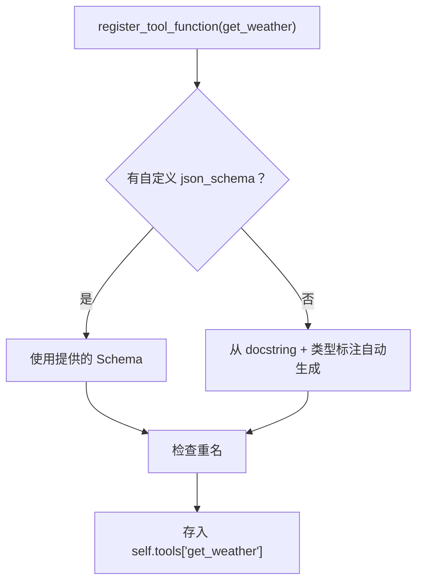
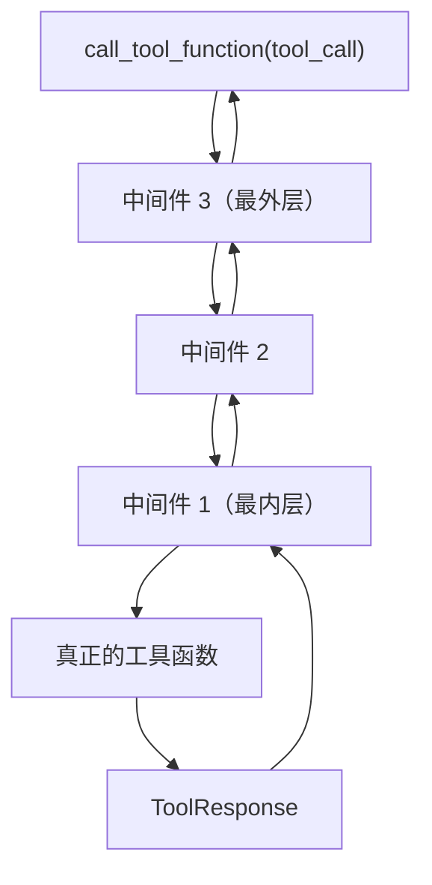

# 第 10 站：执行工具

> 模型返回了 `ToolUseBlock(name="get_weather", input={"city": "北京"})`。但这只是一个 JSON 对象——怎么从它变成真正执行 `get_weather("北京")` 的函数调用？

## 路线图

上一站，模型通过 API 返回了工具调用请求。现在我们需要：
1. 找到 `get_weather` 对应的真实 Python 函数
2. 传入参数执行它
3. 把结果包装成 `ToolResultBlock` 返回给 Agent

```
模型返回 ToolUseBlock(name="get_weather", input={"city": "北京"})
                              ↓
                    Toolkit.call_tool_function()
                              ↓
                    找到注册的 Python 函数
                              ↓
                    执行 get_weather(city="北京")
                              ↓
                    ToolResponse(content=[TextBlock(...)])
```

读完本章，你会理解：
- `Toolkit` 如何注册和管理工具函数
- 从 `ToolUseBlock` 到真实函数调用的完整路径
- 工具分组的激活/停用机制
- 中间件（Middleware）的洋葱模型

---

## 知识补全：装饰器模式

在 Python 中，装饰器（decorator）是一个函数，它"包装"另一个函数，在不修改原函数代码的情况下增加功能。

```python
def log_decorator(func):
    def wrapper(*args, **kwargs):
        print(f"调用 {func.__name__}")
        result = func(*args, **kwargs)
        print(f"完成 {func.__name__}")
        return result
    return wrapper

@log_decorator
def get_weather(city):
    return f"{city}: 晴"
```

调用 `get_weather("北京")` 时，实际执行的是 `wrapper("北京")`——它在调用真实函数前后加了日志。

`Toolkit` 的中间件就是这个模式的高级版本：多个装饰器层层嵌套，像洋葱一样。

---

## Toolkit：工具箱的总管

打开 `src/agentscope/tool/_toolkit.py`，找到第 117 行：

```python
# _toolkit.py:117
class Toolkit(StateModule):
    """Toolkit 是注册、管理、删除工具函数的核心模块"""
```

`Toolkit` 也继承自 `StateModule`——可以被序列化。

### 内部数据结构

```python
# _toolkit.py:157
self.tools: dict[str, RegisteredToolFunction] = {}    # 所有注册的工具
self.groups: dict[str, ToolGroup] = {}                 # 工具分组
self.skills: dict[str, AgentSkill] = {}                # Agent 技能
self._middlewares: list = []                           # 中间件列表
```

`tools` 字典是核心——键是函数名，值是 `RegisteredToolFunction` 对象。

### RegisteredToolFunction

打开 `src/agentscope/tool/_types.py`：

```python
# _types.py:16
@dataclass
class RegisteredToolFunction:
    name: str                  # 函数名
    group: str | Literal["basic"]  # 所属分组
    source: Literal["function", "mcp_server", "function_group"]  # 来源
    original_func: ToolFunction    # 原始 Python 函数
    json_schema: dict              # 自动生成的 JSON Schema
    preset_kwargs: dict            # 预设参数（不暴露给模型）
    postprocess_func: ... | None   # 后处理函数
    async_execution: bool          # 是否异步执行
```

注册一个工具函数时，`Toolkit` 会：
1. 从函数的 docstring 和类型标注中自动提取 JSON Schema
2. 把函数包装成 `RegisteredToolFunction` 对象
3. 存入 `self.tools` 字典

---

## 注册：register_tool_function

```python
# _toolkit.py:274
def register_tool_function(
    self,
    tool_func: ToolFunction,
    group_name: str | Literal["basic"] = "basic",
    preset_kwargs: dict | None = None,
    func_name: str | None = None,
    func_description: str | None = None,
    json_schema: dict | None = None,
    ...
) -> None:
```

这个方法做的事情：

1. **确定函数名**：如果没传 `func_name`，用函数的 `__name__`
2. **提取 JSON Schema**：如果没传 `json_schema`，从函数签名和 docstring 自动生成
3. **检查重名**：如果有同名工具，按 `namesake_strategy` 处理（报错/跳过/覆盖/重命名）
4. **创建并存储**：构造 `RegisteredToolFunction`，存入 `self.tools`



> **设计一瞥**：为什么不用装饰器注册工具？
> 很多框架（如 LangChain）用 `@tool` 装饰器注册工具函数。AgentScope 选择 `toolkit.register_tool_function(fn)` 的显式注册方式。
> 原因：装饰器注册是"声明式"的，函数定义时就绑定了框架。显式注册是"命令式"的，可以在运行时动态决定注册什么、什么时候注册。
> 代价：多写一行代码。详见卷四第 30 章。

---

## 执行：call_tool_function

```python
# _toolkit.py:853
@trace_toolkit
@_apply_middlewares     # 注意这个装饰器！
async def call_tool_function(
    self,
    tool_call: ToolUseBlock,
) -> AsyncGenerator[ToolResponse, None]:
```

`@_apply_middlewares` 装饰器是中间件机制的入口。我们先看核心执行逻辑，再看中间件。

### 执行流程

```python
# 简化的执行逻辑（_toolkit.py:853 之后）

# 1. 检查工具是否存在
if tool_call["name"] not in self.tools:
    return ToolResponse(content=[TextBlock(text="FunctionNotFoundError: ...")])

# 2. 检查工具分组是否激活
if tool_func.group != "basic" and not self.groups[tool_func.group].active:
    return ToolResponse(content=[TextBlock(text="FunctionInactiveError: ...")])

# 3. 合并参数
kwargs = {**tool_func.preset_kwargs, **(tool_call.get("input", {}) or {})}

# 4. 执行函数 → 返回 AsyncGenerator[ToolResponse]
```

注意第 3 步——`preset_kwargs` 和 `tool_call["input"]` 合并。`preset_kwargs` 是开发者预设的参数（如 API key），不会被模型看到。

### ToolResponse

```python
# _response.py:12
@dataclass
class ToolResponse:
    content: list[TextBlock | ImageBlock | AudioBlock | VideoBlock]
    metadata: dict | None
    stream: bool
    is_last: bool
    is_interrupted: bool
```

工具函数的返回值。`content` 是内容块列表——工具可以返回文字、图片、甚至音频。

---

## 工具分组：动态激活/停用

```python
# _toolkit.py:187
def create_tool_group(
    self,
    group_name: str,
    description: str,
    active: bool = False,
    ...
) -> None:
```

默认情况下，所有工具在 `"basic"` 分组中，始终激活。但你可以创建自定义分组：

```python
toolkit.create_tool_group("advanced", description="高级工具", active=False)
toolkit.register_tool_function(complex_tool, group_name="advanced")
```

`"advanced"` 分组的工具默认不激活——模型看不到它们。Agent 可以通过 `reset_equipped_tools` 这个 meta 工具来激活/停用分组。

这是一种**动态工具管理**机制——不是所有工具都一次性给模型，而是让 Agent 自己决定需要哪些。

---

## 中间件：洋葱模型

```python
# _toolkit.py:1441
def register_middleware(
    self,
    middleware: Callable,
) -> None:
    """注册洋葱式中间件"""
```

中间件是一个"包装"工具执行过程的函数。它的签名是：

```python
async def my_middleware(
    kwargs: dict,          # 包含 tool_call
    next_handler: Callable  # 下一个中间件或真正的工具函数
) -> AsyncGenerator[ToolResponse, None]:
    # 前置处理
    print(f"即将调用: {kwargs['tool_call']['name']}")

    # 调用下一层
    async for response in await next_handler(**kwargs):
        # 可以修改每个响应
        yield response

    # 后置处理
    print("工具调用完成")
```

### `_apply_middlewares` 装饰器

```python
# _toolkit.py:57
def _apply_middlewares(func):
    """装饰器：在运行时动态构建中间件链"""
    @wraps(func)
    async def wrapper(self, tool_call):
        middlewares = self._middlewares
        if not middlewares:
            return func(self, tool_call)  # 没有中间件，直接执行

        # 构建洋葱链：最内层是真正的函数，外层依次包裹中间件
        chain = func
        for middleware in reversed(middlewares):
            chain = partial(middleware, next_handler=chain)
        return chain(kwargs={"tool_call": tool_call})
```



每个中间件可以：
- **前置处理**：在调用 `next_handler` 之前做事情（日志、验证、修改参数）
- **拦截响应**：`async for response in` 可以修改或过滤每个响应块
- **后置处理**：在 `for` 循环结束后做事情（记录、缓存）
- **跳过执行**：不调用 `next_handler`，直接返回自定义响应

---

## 试一试：注册并调用一个自定义工具

这个练习不需要 API key。

**目标**：创建一个简单的工具函数，注册到 Toolkit，模拟调用。

**步骤**：

1. 在 `src/agentscope/tool/_toolkit.py` 的 `call_tool_function` 方法中（第 853 行后），加一行 print：

```python
print(f"[DEBUG] 调用工具: {tool_call['name']}, 参数: {tool_call.get('input', {})}")
```

2. 创建测试脚本 `test_toolkit.py`：

```python
import asyncio
from agentscope.tool import Toolkit
from agentscope.tool._response import ToolResponse
from agentscope.message import TextBlock, ToolUseBlock

def get_weather(city: str) -> ToolResponse:
    """获取指定城市的天气。

    Args:
        city (str): 城市名称

    Returns:
        ToolResponse: 天气信息
    """
    return ToolResponse(
        content=[TextBlock(type="text", text=f"{city}: 晴，25°C")]
    )

async def main():
    toolkit = Toolkit()
    toolkit.register_tool_function(get_weather)

    # 打印自动生成的 JSON Schema
    print("=== 注册的工具 ===")
    for name, func in toolkit.tools.items():
        print(f"工具名: {name}")
        import json
        print(json.dumps(func.json_schema, ensure_ascii=False, indent=2))

    # 模拟模型返回的 ToolUseBlock
    tool_call = ToolUseBlock(
        type="tool_use",
        id="call_test",
        name="get_weather",
        input={"city": "北京"},
    )

    # 调用工具
    print("\n=== 调用工具 ===")
    async for response in toolkit.call_tool_function(tool_call):
        for block in response.content:
            print(f"结果: {block['text']}")

asyncio.run(main())
```

3. 运行：

```bash
python test_toolkit.py
```

4. 观察输出：JSON Schema 是如何从 docstring 和类型标注自动生成的。

**完成后清理：**

```bash
rm test_toolkit.py
git checkout src/agentscope/tool/
```

---

## 检查点

你现在理解了：

- **Toolkit** 是工具注册、管理、执行的核心模块
- `register_tool_function` 把 Python 函数注册为工具，自动提取 JSON Schema
- `call_tool_function` 从 `ToolUseBlock` 找到注册的函数并执行
- **工具分组**允许动态激活/停用工具集
- **中间件**是洋葱模型，可以在工具执行前后插入自定义逻辑

**自检练习**：

1. 如果注册了两个同名函数，默认会怎样？（提示：看 `namesake_strategy` 参数的默认值）
2. `preset_kwargs` 和 `tool_call["input"]` 合并时，如果有相同的键，哪个优先？（提示：看合并顺序 `{**preset, **input}`）

---

## 下一站预告

工具执行完毕，结果已经返回。但 ReAct Agent 不会只做一轮——它要**循环**，直到得出最终答案。下一站是全卷最长的一章，我们打开 `ReActAgent.reply()`，追踪推理-行动-总结的完整循环。
