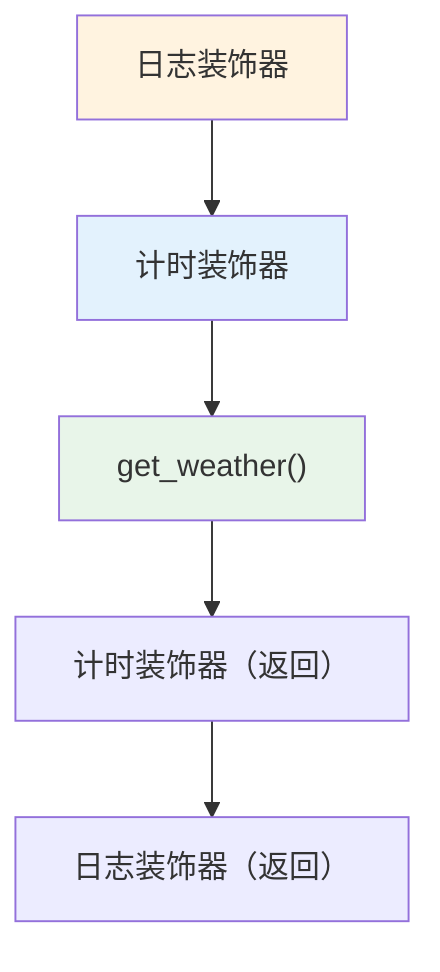
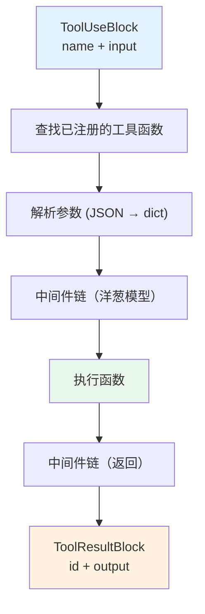

# 第 10 章 第 7 站：执行工具

> **追踪线**：模型返回了 ToolUseBlock，现在需要实际执行工具函数。
> 本章你将理解：ToolUseBlock → tool function → ToolResultBlock 的完整流程。

---

## 10.1 路线图

```mermaid
graph LR
    Init["init()"] --> Msg["Msg 诞生"]
    Msg --> Agent["Agent 收信"]
    Agent --> Memory["工作记忆"]
    Memory --> Retrieve["检索知识"]
    Retrieve --> Format["格式转换"]
    Format --> Model["请求模型"]
    Model --> Tool["执行工具"]
    Tool --> Loop["循环/返回"]

    style Init fill:#e0e0e0
    style Msg fill:#e0e0e0
    style Agent fill:#e0e0e0
    style Memory fill:#e0e0e0
    style Retrieve fill:#e0e0e0
    style Format fill:#e0e0e0
    style Model fill:#e0e0e0
    style Tool fill:#4caf50,color:white
```



绿色是当前位置——解析并执行工具。

> **源码验证日期**: 2026-05-11, commit `f17cfd0a`

---

## 10.2 知识补全：装饰器模式

工具执行使用了装饰器模式来添加中间件。理解装饰器模式的本质——洋葱模型。

### 什么是装饰器模式

装饰器模式是"在不修改原函数的前提下，给函数添加新行为"。

```python
# 原函数
def get_weather(city: str) -> str:
    return "晴天，25°C"

# 加装饰器后：先记日志，再执行，再记日志
@log_decorator
def get_weather(city: str) -> str:
    return "晴天，25°C"

# 等价于：
get_weather = log_decorator(get_weather)
```

装饰器把原函数包了一层，调用时先执行装饰器逻辑，再执行原函数。

### 洋葱模型

多层装饰器像洋葱一样层层包裹：



请求从外到内穿过每一层，响应从内到外穿过每一层。Toolkit 的中间件也是这样工作的。

---

## 10.3 源码入口

| 文件 | 内容 |
|------|------|
| `src/agentscope/tool/_toolkit.py` | `Toolkit` 工具管理 |
| `src/agentscope/tool/_response.py` | `ToolResponse` 执行结果 |
| `src/agentscope/tool/_async_wrapper.py` | 同步/异步包装 |
| `src/agentscope/tool/_types.py` | 工具类型定义 |

---

## 10.4 逐行阅读

### Toolkit：工具管理器

打开 `src/agentscope/tool/_toolkit.py`：

```python
class Toolkit(StateModule):
```

Toolkit 管理三样东西：

| 类型 | 注册方法 | 用途 |
|------|---------|------|
| 工具函数 | `register_tool_function()` | 普通 Python 函数 |
| MCP 客户端 | `register_mcp_client()` | Model Context Protocol 工具 |
| Agent 技能 | `register_agent_skill()` | 预定义的技能包 |

### 注册工具函数

```python
def register_tool_function(
    self,
    func: Callable,
) -> None:
```

注册时自动完成三件事：

1. **提取 JSON Schema**：从函数签名和文档字符串自动生成工具的参数描述
2. **存储函数引用**：保存函数对象，等待执行时调用
3. **记录工具信息**：名称、描述、参数列表

```python
def get_weather(city: str) -> str:
    """获取城市天气"""
    return "晴天，25°C"

toolkit = Toolkit()
toolkit.register_tool_function(get_weather)
# 自动生成:
# {
#     "name": "get_weather",
#     "description": "获取城市天气",
#     "parameters": {
#         "type": "object",
#         "properties": {"city": {"type": "string"}},
#         "required": ["city"]
#     }
# }
```

### 执行工具函数

当模型返回 `ToolUseBlock` 时，Toolkit 负责执行：

```python
async def call_tool_function(
    self,
    tool_name: str,
    tool_args: dict,
    ...
) -> ToolResponse:
```

执行流程：



### ToolResponse：执行结果

```python
class ToolResponse:
    content: str | list[ContentBlock]
    ...
```

工具函数的返回值被包装成 `ToolResponse`，最终转换为 `ToolResultBlock`。

### 同步/异步包装

工具函数可能是同步的也可能是异步的。Toolkit 用 `_async_wrapper` 统一处理：

```python
# 同步函数
def get_weather(city: str) -> str:
    return "晴天"

# 异步函数
async def get_weather_async(city: str) -> str:
    await some_async_operation()
    return "晴天"
```

Toolkit 自动检测函数类型，同步函数在异步环境中用 `asyncio.to_thread()` 包装执行，不会阻塞事件循环。

### 中间件链

Toolkit 支持中间件——在工具执行前后插入自定义逻辑：

```python
# 注册中间件
toolkit.register_middleware(logging_middleware)
toolkit.register_middleware(retry_middleware)
```

中间件按洋葱模型执行：

```
请求 → logging_middleware → retry_middleware → 工具函数 → retry_middleware → logging_middleware → 响应
```

典型用途：
- 日志记录
- 错误重试
- 参数校验
- 性能计时

---

## 10.5 调试实践

### 查看已注册的工具

```python
toolkit = Toolkit()
toolkit.register_tool_function(get_weather)

# 查看工具的 JSON Schema
print(toolkit.get_tool_schemas())
```

### 追踪工具执行

在 `call_tool_function` 中加 print：

```python
async def call_tool_function(self, tool_name, tool_args, ...):
    print(f"[TOOL] 执行工具: {tool_name}, 参数: {tool_args}")  # 加这行
    ...
    print(f"[TOOL] 结果: {result}")  # 加这行
```

---

## 10.6 试一试

### 注册一个带中间件的工具

```python
from agentscope.tool import Toolkit
import time

# 定义中间件
async def timing_middleware(agent_self, kwargs):
    start = time.time()
    print(f"  [中间件] 即将执行 {kwargs.get('name', '?')}")
    return kwargs  # 不修改参数

# 定义工具函数
def get_weather(city: str) -> str:
    """获取城市天气"""
    data = {"北京": "晴天，25°C", "上海": "多云，22°C"}
    return data.get(city, "未知")

# 注册
toolkit = Toolkit()
toolkit.register_tool_function(get_weather)

# 查看自动生成的工具 Schema
import json
schemas = toolkit.get_tool_schemas()
for schema in schemas:
    print(json.dumps(schema, ensure_ascii=False, indent=2))
```

### 在源码中观察参数解析

打开 `src/agentscope/tool/_toolkit.py`，在 `call_tool_function` 中找到参数解析的部分，加 print 观察参数是怎么从 JSON 字符串转换成 Python 参数的。

---

## 10.7 检查点

你现在已经理解了：

- **Toolkit**：管理工具函数、MCP 客户端、Agent 技能
- **register_tool_function()**：自动从函数签名提取 JSON Schema
- **call_tool_function()**：查找函数 → 解析参数 → 中间件链 → 执行 → 返回结果
- **同步/异步包装**：自动检测函数类型，统一为异步执行
- **中间件链**：洋葱模型，请求从外到内，响应从内到外

**自检练习**：
1. 为什么 Toolkit 要自动提取 JSON Schema？（提示：模型需要知道工具的参数格式）
2. 同步函数在异步环境中执行会怎样？（提示：`asyncio.to_thread()`）

---

## 下一站预告

工具执行完毕，结果返回给 Agent。下一站，ReAct 循环决定是继续还是结束。
