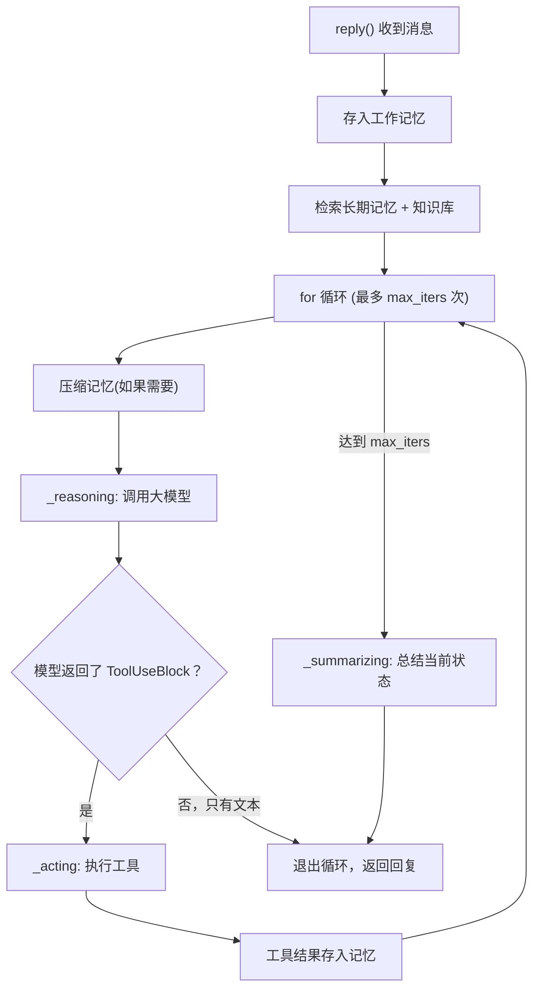
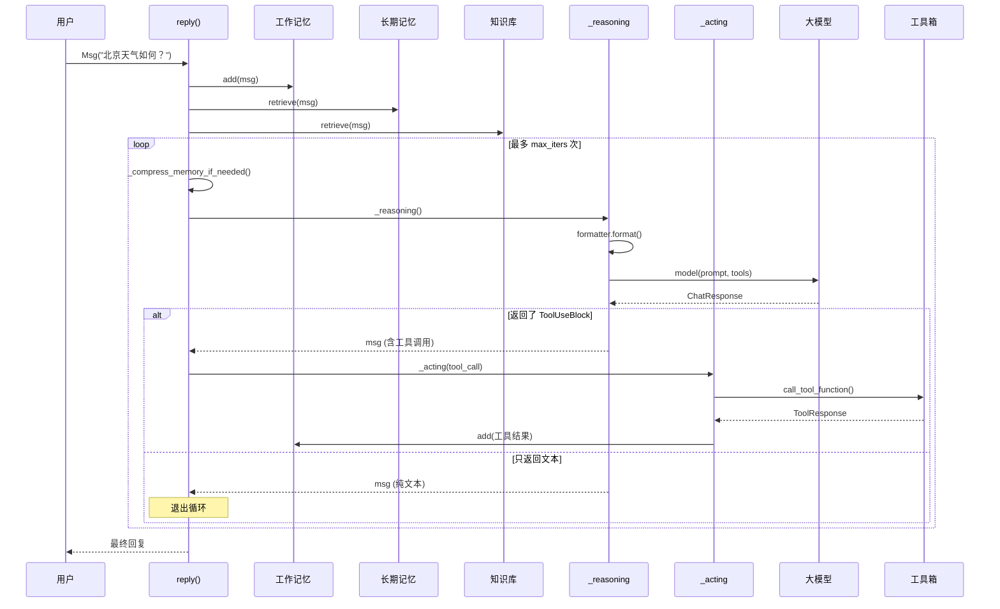

# 第 11 站：循环与返回

> 天气 Agent 收到了工具结果"北京：晴，25°C"。它是不是直接把这个结果返回给用户？不是——它还要再思考一次，用自然语言回答"北京今天天气晴朗，气温 25 度"。这就是 ReAct 循环。

## 路线图

前几站我们追踪了 ReAct 循环的每一站：消息、Agent 收信、记忆、知识、格式化、模型调用、工具执行。现在我们站在最高层，看 `ReActAgent.reply()` 如何把它们串成一个**循环**。



读完本章，你会理解：
- `reply()` 的完整循环结构
- 循环的退出条件
- `_reasoning`、`_acting`、`_summarizing` 三个阶段
- 记忆压缩机制
- PlanNotebook 计划子系统

---

## 知识补全：结构化输出

有时候你不想要一段文字，而想要特定格式的数据。比如让模型返回 `{"city": "北京", "temp": 25, "condition": "晴"}`。

这就是**结构化输出（Structured Output）**：用 Pydantic BaseModel 定义期望的格式，模型会被强制按这个格式返回。

AgentScope 通过 `structured_model` 参数支持这个功能。内部实现是：把 Pydantic 模型伪装成一个"工具函数"，让模型以为自己要调用工具——从而获得结构化的 JSON。

---

## reply() 的骨架

打开 `src/agentscope/agent/_react_agent.py`，找到第 376 行：

```python
# _react_agent.py:376
async def reply(
    self,
    msg: Msg | list[Msg] | None = None,
    structured_model: Type[BaseModel] | None = None,
) -> Msg:
```

整个方法的骨架可以用伪代码表示：

```python
async def reply(self, msg, structured_model=None):
    # 1. 记录输入
    await self.memory.add(msg)

    # 2. 检索增强
    await self._retrieve_from_long_term_memory(msg)
    await self._retrieve_from_knowledge(msg)

    # 3. 结构化输出准备
    if structured_model:
        # 注册 generate_response 工具
        self.toolkit.register_tool_function(self.generate_response)
        self.toolkit.set_extended_model(self.finish_function_name, structured_model)
        tool_choice = "required"
    else:
        self.toolkit.remove_tool_function(self.finish_function_name)

    # 4. ReAct 循环
    for _ in range(self.max_iters):
        await self._compress_memory_if_needed()
        msg_reasoning = await self._reasoning(tool_choice)

        # 执行所有工具调用
        futures = [self._acting(tc) for tc in msg_reasoning.get_content_blocks("tool_use")]
        if self.parallel_tool_calls:
            results = await asyncio.gather(*futures)
        else:
            results = [await f for f in futures]

        # 检查退出条件
        if not msg_reasoning.has_content_blocks("tool_use"):
            return msg_reasoning    # 没有工具调用 → 退出

    # 5. 达到最大迭代次数 → 总结
    return await self._summarizing()
```

五个清晰的阶段。让我们逐个展开。

---

## 阶段 1：记录输入

```python
# _react_agent.py:408
await self.memory.add(msg)
```

把用户消息存入工作记忆。这是每次对话的起点。

---

## 阶段 2：检索增强

```python
# _react_agent.py:411-413
await self._retrieve_from_long_term_memory(msg)
await self._retrieve_from_knowledge(msg)
```

两个检索操作，对应上一站学到的长期记忆和知识库：

- `_retrieve_from_long_term_memory`（第 882 行）：如果 `static_control` 模式开启，用当前消息作为查询，检索长期记忆，结果注入系统提示
- `_retrieve_from_knowledge`（第 908 行）：如果配置了知识库，用当前消息检索相关文档，结果也注入系统提示

这两个检索发生在循环**之前**——每次 `reply` 只检索一次。

---

## 阶段 3：循环体

```python
# _react_agent.py:432
for _ in range(self.max_iters):
```

默认 `max_iters = 10`（第 197 行）。循环最多跑 10 轮。

### 3a. 记忆压缩

```python
# _react_agent.py:434
await self._compress_memory_if_needed()
```

`_compress_memory_if_needed`（第 1015 行）做的事：

1. 获取未压缩的消息
2. 保留最近 N 条消息不压缩（`keep_recent` 参数）
3. 计算待压缩消息的 Token 数
4. 如果超过阈值（`trigger_threshold`），用大模型把旧消息压缩成摘要

这是一种**滑动窗口 + 摘要**策略：最近的消息保持原样，太旧的被压缩。

### 3b. 推理：_reasoning

```python
# _react_agent.py:540
async def _reasoning(self, tool_choice=None) -> Msg:
```

这是"思考"阶段。核心流程：

```python
# 1. 如果有计划，插入计划提示
if self.plan_notebook:
    hint_msg = await self.plan_notebook.get_current_hint()
    await self.memory.add(hint_msg, marks=_MemoryMark.HINT)

# 2. 格式化消息
prompt = await self.formatter.format([
    Msg("system", self.sys_prompt, "system"),
    *await self.memory.get_memory(exclude_mark=_MemoryMark.COMPRESSED),
])

# 3. 调用大模型
res = await self.model(prompt, tools=self.toolkit.get_json_schemas(), tool_choice=tool_choice)

# 4. 处理流式/非流式响应
msg = Msg(name=self.name, content=[], role="assistant")
if self.model.stream:
    async for content_chunk in res:
        msg.content = content_chunk.content
        await self.print(msg, False)    # 流式打印
else:
    msg.content = list(res.content)

# 5. 存入记忆
await self.memory.add(msg)
return msg
```

注意 `_MemoryMark.HINT`——计划提示和系统提示是"临时"消息，用完就删：

```python
await self.memory.delete_by_mark(mark=_MemoryMark.HINT)
```

### 3c. 行动：_acting

```python
# _react_agent.py:657
async def _acting(self, tool_call: ToolUseBlock) -> dict | None:
```

这是"行动"阶段。对每个 `ToolUseBlock`：

```python
# 1. 创建工具结果消息
tool_res_msg = Msg("system", [ToolResultBlock(...)], "system")

# 2. 执行工具
tool_res = await self.toolkit.call_tool_function(tool_call)

# 3. 流式处理结果
async for chunk in tool_res:
    tool_res_msg.content[0]["output"] = chunk.content
    await self.print(tool_res_msg, chunk.is_last)

# 4. 结果存入记忆
await self.memory.add(tool_res_msg)
```

如果 `parallel_tool_calls = True`（第 440-445 行），多个工具会**并行执行**：

```python
futures = [self._acting(tc) for tc in tool_calls]
if self.parallel_tool_calls:
    results = await asyncio.gather(*futures)   # 并行
else:
    results = [await f for f in futures]       # 顺序
```

---

## 阶段 4：退出条件

循环有三种退出方式：

### 退出 1：模型只返回文本（没有工具调用）

```python
# _react_agent.py:496（简化）
elif not msg_reasoning.has_content_blocks("tool_use"):
    reply_msg = msg_reasoning
    break
```

当模型认为不需要调用工具、直接给出文字回答时，循环退出。

### 退出 2：结构化输出成功

```python
# _react_agent.py:455（简化）
if self._required_structured_model:
    if structured_outputs:
        structured_output = structured_outputs[-1]
        reply_msg = Msg(self.name, text_blocks, "assistant", metadata=structured_output)
        break
```

当模型调用了 `generate_response` 工具并成功生成结构化输出时，循环退出。

### 退出 3：达到最大迭代次数

```python
# _react_agent.py:525（简化）
if reply_msg is None:
    reply_msg = await self._summarizing()
```

循环跑完 `max_iters` 次还没有退出 → 调用 `_summarizing()` 让模型总结当前状态。

---

## 阶段 5：_summarizing

```python
# _react_agent.py:725
async def _summarizing(self) -> Msg:
```

这是一个"紧急出口"：告诉模型"你已经达到了最大迭代次数，请直接总结"。

```python
hint_msg = Msg("user",
    "You have failed to generate response within the maximum iterations. "
    "Now respond directly by summarizing the current situation.",
    role="user")
```

---

## 辅助子系统

### PlanNotebook（计划子系统）

```python
# _plan_notebook.py:172
class PlanNotebook(StateModule):
```

高级 Agent 可以在推理前制定计划。`PlanNotebook` 管理计划（`Plan`）和子任务（`SubTask`），在每轮推理时插入提示，引导 Agent 按计划执行。

### TTS（语音合成）

`_reasoning` 和 `_summarizing` 中都有 TTS（Text-to-Speech）处理：如果配置了语音模型，文字回答会被转换成语音输出。

AgentScope 官方文档的 Building Blocks > Agent > ReActAgent 页面展示了 `ReActAgent` 的使用方法和配置参数（`max_iters`、`sys_prompt`、`model`、`toolkit`、`memory` 等）。本章解释了 `reply()` 中的完整 ReAct 循环、三种退出条件和 `_compress_memory_if_needed` 的压缩机制。

AgentScope 1.0 论文对 ReAct Agent 的推理循环设计说明是：

> "we ground agent behaviors in the ReAct paradigm and offer advanced agent-level infrastructure based on a systematic asynchronous design"
>
> — AgentScope 1.0: A Comprehensive Framework for Building Agentic Applications, arXiv:2508.16279, Section 2.2

---

## 完整的循环流程图



> **设计一瞥**：为什么 max_iters 默认是 10？
> 这是一个经验值。大多数简单任务在 2-3 轮内完成（推理 → 调工具 → 推理 → 回答）。复杂任务可能需要 5-8 轮。10 是一个合理的上限，防止 Agent 陷入无限循环。
> 用户可以根据任务复杂度调整：`ReActAgent(max_iters=3)` 适合简单任务，`ReActAgent(max_iters=20)` 适合复杂多步任务。

---

## 试一试：观察 ReAct 循环的次数

这个练习需要修改源码中的 `max_iters`。

**目标**：观察不同 `max_iters` 值对 Agent 行为的影响。

**步骤**：

1. 打开 `src/agentscope/agent/_react_agent.py`，找到第 432 行的循环：

```python
for _ in range(self.max_iters):
```

2. 在循环体开头加一行 print：

```python
for _ in range(self.max_iters):
    print(f"[DEBUG] ReAct 循环第 {_ + 1} 轮 (共 {self.max_iters} 轮)")
    await self._compress_memory_if_needed()
    ...
```

3. 在 `_reasoning` 方法（第 540 行后）加一行 print：

```python
msg_reasoning = await self._reasoning(tool_choice)
print(f"[DEBUG] 推理结果: {len(msg_reasoning.get_content_blocks('tool_use'))} 个工具调用, {len(msg_reasoning.get_content_blocks('text'))} 个文本块")
```

4. 如果你有 API key，运行天气 Agent 示例，观察 print 输出。
5. 如果没有 API key，直接阅读循环代码，数一数"北京天气"这个查询大概需要几轮循环（提示：推理 → 调用 get_weather → 推理 → 回答 = 2 轮）。

**改完后恢复：**

```bash
git checkout src/agentscope/agent/_react_agent.py
```

---

## 检查点

你现在理解了：

- **ReAct 循环**是 `for _ in range(max_iters)` 的推理-行动循环
- 三个核心方法：`_reasoning`（思考）、`_acting`（行动）、`_summarizing`（紧急总结）
- 三种退出条件：模型只返回文本、结构化输出成功、达到最大迭代次数
- **记忆压缩**在每轮循环开始时检查，超过阈值就压缩旧消息
- **工具并行执行**：`asyncio.gather` 同时运行多个工具
- PlanNotebook 和 TTS 是可选的辅助子系统

**自检练习**：

1. 一个"查天气"的简单查询，ReAct 循环会跑几轮？每轮分别做了什么？
2. 如果 `max_iters=1`，Agent 还能完成"查天气"任务吗？为什么？（提示：回忆 `_summarizing` 在什么时候被调用）
3. 记忆压缩的"滑动窗口"策略保留了哪些消息不压缩？

---

## 下一站预告

我们已经追踪了一次完整的 `agent()` 调用，从消息诞生到循环返回。下一站是卷一的**复盘章**——我们拉远视角，画一张完整的全景图，把 8 个站点串联起来。
