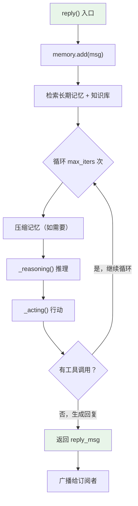

# 第 11 章 第 8 站：循环与返回

> **追踪线**：工具执行完毕，结果返回给 Agent。现在到了 ReAct 循环的核心——决定继续还是结束。
> 本章你将理解：ReAct 循环的终止条件、推理-行动分离、结构化输出。

---

## 11.1 路线图

```mermaid
graph LR
    Init["init()"] --> Msg["Msg 诞生"]
    Msg --> Agent["Agent 收信"]
    Agent --> Memory["工作记忆"]
    Memory --> Retrieve["检索知识"]
    Retrieve --> Format["格式转换"]
    Format --> Model["请求模型"]
    Model --> Tool["执行工具"]
    Tool --> Loop["循环/返回"]

    style Init fill:#e0e0e0
    style Msg fill:#e0e0e0
    style Agent fill:#e0e0e0
    style Memory fill:#e0e0e0
    style Retrieve fill:#e0e0e0
    style Format fill:#e0e0e0
    style Model fill:#e0e0e0
    style Tool fill:#e0e0e0
    style Loop fill:#4caf50,color:white
```



绿色是当前位置——ReAct 循环的最后一站。

> **源码验证日期**: 2026-05-11, commit `f17cfd0a`

---

## 11.2 知识补全：结构化输出

ReAct 循环中有一个"结构化输出"功能。什么是结构化输出？

普通情况下，模型返回自由文本。结构化输出让模型返回特定格式的 JSON：

```python
from pydantic import BaseModel

class WeatherReport(BaseModel):
    city: str
    temperature: int
    condition: str

# Agent 可以被要求返回这个格式
result = await agent(msg, structured_model=WeatherReport)
print(result.metadata)  # {"city": "北京", "temperature": 25, "condition": "晴"}
```

这在需要精确数据格式时很有用（比如返回给 API 或写入数据库）。

---

## 11.3 源码入口

| 文件 | 内容 |
|------|------|
| `src/agentscope/agent/_react_agent.py` | `ReActAgent` 实现 |
| `src/agentscope/agent/_react_agent_base.py` | `ReActAgentBase` 基类 |
| `src/agentscope/plan/` | 规划子系统 |
| `src/agentscope/token/` | Token 压缩 |
| `src/agentscope/tts/` | TTS 语音合成 |

---

## 11.4 逐行阅读

### ReAct 循环的整体结构

打开 `src/agentscope/agent/_react_agent.py` 的 `reply()` 方法：

```python
async def reply(self, msg=None, structured_model=None) -> Msg:
    # 1. 记录输入消息到记忆
    await self.memory.add(msg)

    # 2. 从长期记忆和知识库检索
    await self._retrieve_from_long_term_memory(msg)
    await self._retrieve_from_knowledge(msg)

    # 3. 推理-行动循环
    for _ in range(self.max_iters):
        await self._compress_memory_if_needed()
        msg_reasoning = await self._reasoning(tool_choice)

        futures = [self._acting(tool_call) for tool_call in ...]
        structured_outputs = await asyncio.gather(*futures)

        # 检查退出条件
        ...

    return reply_msg
```



### _reasoning()：推理阶段

```python
async def _reasoning(self, tool_choice=None) -> Msg:
```

推理阶段做的事：

1. 从记忆中获取消息历史
2. 用 Formatter 格式化消息
3. 调用模型
4. 打印模型的回复（流式输出到控制台）
5. 把模型的回复存入记忆
6. 返回模型的回复消息

模型可能返回：
- 纯文本 → 没有 `ToolUseBlock` → 循环结束
- 工具调用请求 → 有 `ToolUseBlock` → 进入行动阶段

### _acting()：行动阶段

```python
async def _acting(self, tool_call: ToolUseBlock) -> dict | None:
```

行动阶段做的事：

1. 从 `ToolUseBlock` 提取工具名和参数
2. 调用 `Toolkit.call_tool_function()`
3. 把结果包装成 `ToolResultBlock`
4. 存入记忆
5. 返回结果

### 循环终止条件

循环在以下情况下结束：

| 条件 | 含义 |
|------|------|
| 模型不返回 `ToolUseBlock` | 模型认为不需要更多工具调用，直接回答 |
| 达到 `max_iters` 次迭代 | 防止无限循环 |
| 结构化输出完成 | 模型通过 `finish` 函数返回了结构化数据 |

### ReActAgentBase：推理-行动的抽象

`ReActAgentBase` 是 `ReActAgent` 的中间层：

```python
class ReActAgentBase(AgentBase, metaclass=_ReActAgentMeta):
    @abstractmethod
    async def _reasoning(self, *args, **kwargs) -> Any:
        ...

    @abstractmethod
    async def _acting(self, *args, **kwargs) -> Any:
        ...
```

它定义了 `_reasoning` 和 `_acting` 两个抽象方法，并使用 `_ReActAgentMeta` 元类给它们加 Hook。

### 并行工具调用

```python
futures = [self._acting(tool_call) for tool_call in tool_calls]

if self.parallel_tool_calls:
    structured_outputs = await asyncio.gather(*futures)  # 并行
else:
    structured_outputs = [await _ for _ in futures]      # 串行
```

当模型一次返回多个工具调用时，`parallel_tool_calls=True` 允许并行执行。

---

## 11.5 调试实践

### 追踪 ReAct 循环

在 `reply()` 的循环中加 print：

```python
for _ in range(self.max_iters):
    print(f"[REACT] 第 {_+1}/{self.max_iters} 轮")  # 加这行
    msg_reasoning = await self._reasoning(tool_choice)

    tool_calls = msg_reasoning.get_content_blocks("tool_use")
    print(f"[REACT] 模型返回 {len(tool_calls)} 个工具调用")  # 加这行
    ...
```

---

## 11.6 试一试

### 修改 max_iters 观察循环

```python
agent = ReActAgent(
    name="assistant",
    max_iters=2,  # 限制最多 2 轮
    ...
)
```

如果任务需要超过 2 轮工具调用，Agent 会在第 2 轮后强制结束。观察行为变化。

### 在 _reasoning 中加 print

打开 `src/agentscope/agent/_react_agent.py`，在 `_reasoning()` 中加 print：

```python
async def _reasoning(self, tool_choice=None):
    print(f"[REASONING] 开始推理，tool_choice={tool_choice}")  # 加这行
    ...
```

观察每轮推理的 `tool_choice` 值变化。

---

## 11.7 检查点

你现在已经理解了：

- **ReAct 循环**：`for _ in range(max_iters)` 循环，每轮执行 reasoning + acting
- **_reasoning()**：格式化消息 → 调用模型 → 存入记忆
- **_acting()**：提取工具调用 → 执行工具 → 存入记忆
- **终止条件**：模型不返回工具调用 / 达到 max_iters / 结构化输出完成
- **并行工具调用**：`asyncio.gather()` 并行执行多个工具
- **ReActAgentBase**：抽象中间层，给 _reasoning 和 _acting 加 Hook

**自检练习**：
1. 如果模型一直返回工具调用，循环会无限继续吗？（提示：`max_iters`）
2. `parallel_tool_calls` 在什么场景下有用？（提示：多个独立的工具调用）

---

## 下一站预告

请求已经从出发到返回，走完了全程。下一章，我们回顾整个旅程。
