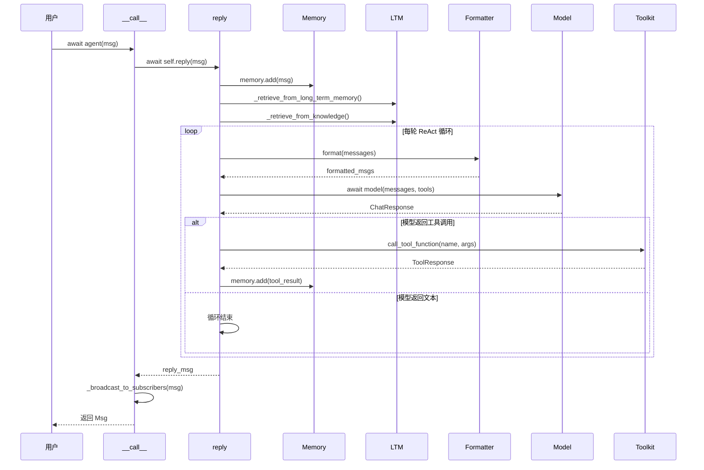

# 第 12 章 旅程回顾

> **追踪线**：全程走完了。现在站到高处，看一眼全景。
> 本章你将理解：完整的调用链、各站之间的串联、从追踪到拆解的转折。

---

## 12.1 全景图：`await agent(msg)` 的完整旅程



---

## 12.2 各站回顾

| 站 | 章节 | 核心文件 | 做了什么 |
|----|------|---------|---------|
| 出发 | ch03 | `__init__.py`, `_run_config.py` | `agentscope.init()` 初始化配置 |
| 第 1 站 | ch04 | `message/_message_base.py` | `Msg` 创建，content 的两种形态 |
| 第 2 站 | ch05 | `agent/_agent_base.py`, `_agent_meta.py` | `__call__()` → `reply()`，Hook 包装 |
| 第 3 站 | ch06 | `memory/_working_memory/` | `add()` / `get_memory()` / mark 系统 |
| 第 4 站 | ch07 | `memory/_long_term_memory/`, `rag/` | Embedding + 语义检索 |
| 第 5 站 | ch08 | `formatter/` | Msg 列表 → API 格式 + Token 截断 |
| 第 6 站 | ch09 | `model/` | HTTP 请求、流式响应、ThinkingBlock |
| 第 7 站 | ch10 | `tool/_toolkit.py` | 工具注册、执行、中间件 |
| 第 8 站 | ch11 | `agent/_react_agent.py` | ReAct 循环、终止条件 |

> **源码验证日期**: 2026-05-11, commit `f17cfd0a`

---

## 12.3 一条消息的一生

追踪"北京今天天气怎么样？"这条消息从创建到最终回复的完整路径：

```
1. Msg("user", "北京今天天气怎么样？", "user")     ← ch04: 消息诞生

2. await agent(msg)                                ← ch05: __call__ 入口
   └─ await self.reply(msg)                        ← ch05: 调用 reply()
       ├─ memory.add(msg)                          ← ch06: 存入工作记忆
       ├─ _retrieve_from_knowledge(msg)            ← ch07: 检索知识
       │
       ├─ 第 1 轮循环:
       │   ├─ formatter.format(messages)           ← ch08: 格式化
       │   ├─ model(messages, tools)               ← ch09: 调用模型
       │   ├─ 模型返回 ToolUseBlock(get_weather)   ← ch09: 工具调用请求
       │   └─ toolkit.call_tool_function(...)      ← ch10: 执行工具
       │       └─ "晴天，25°C"
       │
       ├─ 第 2 轮循环:
       │   ├─ formatter.format(messages)           ← ch08: 格式化（含工具结果）
       │   ├─ model(messages, tools)               ← ch09: 调用模型
       │   └─ 模型返回文本："北京今天晴天，25°C"     ← ch11: 循环结束
       │
       └─ 返回 reply_msg                           ← ch11: 返回结果

3. _broadcast_to_subscribers(reply_msg)            ← ch05: 广播给订阅者

4. 返回给调用方
```

---

## 12.4 设计一瞥：为什么这样分层？

读完卷一，你可能注意到几个设计选择：

**Formatter 独立于 Model**。Formatter 负责把 `Msg` 转成 API 格式，Model 负责发请求。为什么不把格式化写在 Model 里？因为不同 API（OpenAI、Anthropic、Gemini）的格式不同，把格式化抽出来可以让 Formatter 和 Model 独立变化。（第 35 章详解）

**Memory 独立于 Agent**。Agent 不直接操作列表，而是通过 `MemoryBase` 接口。这让 Memory 可以替换实现（内存、Redis、数据库），Agent 不需要改代码。

**Toolkit 独立于 Agent**。工具注册和执行是独立的模块，Agent 只需要持有一个 Toolkit 引用。这让工具可以在不同 Agent 之间共享。

**Hook 用元类实现**。用元类在类创建时自动包装方法，而不是手动装饰器。这样使用者不需要记得给每个方法加装饰器，框架自动处理。（第 32 章详解）

---

## 12.5 从追踪到拆解

你已经走完了全程——跟随一条消息从创建到返回，经过了所有 8 个站。现在你知道了"发生了什么"。

但还有一个问题没回答：**为什么这样设计？**

- 为什么 `Msg.content` 要有两种形态？
- 为什么用 TypedDict 而不是 dataclass？
- 为什么 Formatter 要三层继承？
- 为什么 Hook 用元类而不用装饰器？

卷二将回答这些问题。我们将不再跟随调用链，而是**拆开每一个齿轮**，看设计模式是怎么组织的。

---

## 12.6 卷一 → 卷二映射

| 卷一（追踪线） | 卷二（拆齿轮） |
|---------------|--------------|
| ch03: init 配置 | ch13: 模块系统 |
| ch04: Msg 消息 | ch14: 继承体系 |
| ch05: Agent + Hook | ch15: 元类与 Hook |
| ch08: Formatter | ch16: 格式化策略 |
| ch09: Model | ch17: Schema 工厂 |
| ch10: Toolkit 中间件 | ch18: 中间件管道 |
| ch05: 广播机制 | ch19: 发布订阅 |
| ch09: 流式响应 | ch20: 可观测性 |

---

## 12.7 检查点

你现在已经理解了：

- **完整调用链**：从 `await agent(msg)` 到返回结果的全过程
- **各站串联**：每一站的输入、输出、职责
- **设计分层**：Formatter / Memory / Toolkit 各自独立
- **叙事转折**：从"追踪发生了什么"转向"理解为什么这样设计"

**自检练习**：
1. 画出天气 Agent 两轮 ReAct 循环中，记忆里存储的消息列表变化。
2. 如果你要给 Agent 加一个新工具，需要修改哪些模块？（提示：只需要在 Toolkit 注册）

---

## 卷二预告

你已经走完了全程，现在回来拆开每一个齿轮。卷二开始——拆开设计模式。
