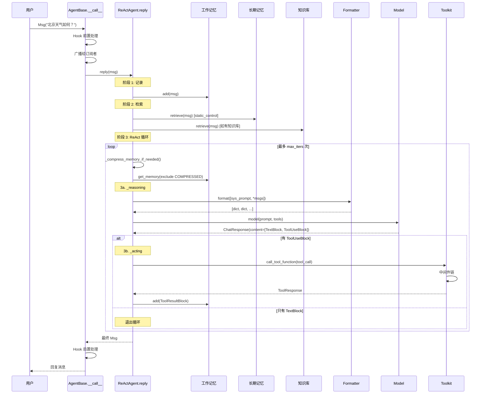

# 旅程复盘

> 恭喜你走完了卷一的全部 8 个站点！现在我们拉远视角，画一张全景图。

## 全景图

---

## 各站回顾

| 站 | 文件 | 核心概念 | 关键代码行 |
|----|------|---------|-----------|
| **第 1 站**：消息诞生 | `message/` | `Msg` + 7 种 ContentBlock | `Msg` dataclass |
| **第 2 站**：Agent 收信 | `agent/_agent_base.py` | `__call__` → Hook → `reply` + 广播 | line 448 (`__call__`) |
| **第 3 站**：工作记忆 | `memory/_working_memory/` | `MemoryBase` 的 5 个抽象方法 | `_base.py:11`, `_in_memory:10` |
| **第 4 站**：检索与知识 | `memory/_long_term_memory/`, `rag/` | 长期记忆两种模式 + RAG | `_base.py:11`, `_knowledge_base.py:13` |
| **第 5 站**：格式转换 | `formatter/` | `FormatterBase` → 截断 → 具体实现 | `_base.py:11`, `_openai.py:168` |
| **第 6 站**：调用模型 | `model/` | `ChatModelBase` + 流式解析 | `_base.py:13`, `_openai.py:71` |
| **第 7 站**：执行工具 | `tool/_toolkit.py` | 注册 → JSON Schema → 调用 → 中间件 | line 117, 274, 853 |
| **第 8 站**：循环与返回 | `agent/_react_agent.py` | `reply()` 的 ReAct 循环 | line 376, 540, 657, 725 |

---

## 卷一 → 卷二 映射

卷一我们"跟着请求走"，看到了每一步做了什么。卷二我们将"拆开每个齿轮"，看为什么这样设计。

| 卷一（做了什么） | 卷二（为什么这样设计） |
|-----------------|---------------------|
| ch03: `agentscope.init()` 和目录结构 | ch13: 模块系统的命名与导入规则 |
| ch04: Msg 和 ContentBlock | — （已在本卷深入讲解） |
| ch05: AgentBase 和 Hook | ch14: 继承体系（StateModule → AgentBase） |
| ch05: Hook 系统 | ch15: 元类与 Hook 的实现细节 |
| ch06: 工作记忆 | ch14: MemoryBase 的继承设计 |
| ch08: Formatter 继承链 | ch16: 策略模式与 Formatter 多态 |
| ch07: 知识库和 Embedding | ch17: 工厂与 Schema（从函数到 JSON Schema） |
| ch10: Toolkit 中间件 | ch18: 中间件与洋葱模型 |
| ch05: 广播机制 | ch19: 发布-订阅（多 Agent 通信） |
| ch05: `state_dict` / `load_state_dict` | ch20: 可观测性与持久化 |

> **官方文档对照**：本章是卷一的总结章，串联了 [Basic Concepts](https://docs.agentscope.io/basic-concepts) 和 [Building Blocks](https://docs.agentscope.io/building-blocks) 的所有核心模块。官方文档按功能模块分别介绍，本章把它们串成一次完整的调用旅程。
>
> **推荐阅读**：[AgentScope 1.0 论文](https://arxiv.org/pdf/2508.16279) 的 Figure 1 展示了框架的完整架构图，可以和本章的全景序列图对照阅读。

---

## 你现在能做什么

读完卷一，你已经能够：

1. **读懂源码**：打开任意模块的源码文件，能追踪代码执行路径
2. **定位 bug**：从错误信息出发，沿调用链找到问题所在
3. **修改源码**：知道在哪里加 print、改参数、调整行为
4. **理解设计**：知道 Formatter、Memory、Toolkit 各自的职责边界

---

## 叙事转折

卷一像一场旅行——我们跟着请求从头走到尾。现在你已经知道每个站点在做什么了。

但有些问题卷一没有回答：

- **为什么**消息是 `Msg` 而不是普通的字典？为什么 ContentBlock 是 TypedDict？
- **为什么** Hook 用元类实现而不是装饰器？
- **为什么** Formatter 独立于 Model？
- **为什么**不用 `@tool` 装饰器注册工具？
- **为什么**长期记忆有 `static_control` 和 `agent_control` 两种模式？

这些"为什么"的答案在卷二和卷四。卷二拆解设计模式，卷四讨论设计权衡。

但在进入"为什么"之前，卷二还有一件事要做：**学会造新齿轮**。如果你能自己添加一个新的 Tool、一个新的 Model、一个新的 Memory——那就真正理解了框架的设计。

---

## 全卷知识自测

**5 道题，检验你对卷一的理解：**

1. `Msg` 对象的 `content` 字段可以包含哪些类型？列出至少 4 种。

2. `AgentBase.__call__` 方法中，`_wrap_with_hooks` 包装的是哪个方法？执行顺序是什么？

3. `InMemoryMemory` 的内部存储结构是什么类型？（提示：`list[tuple[...]]`）

4. `FormatterBase.format()` 的输入和输出分别是什么类型？

5. ReAct 循环的三种退出条件是什么？

---

## 下一卷预告

卷二"拆开每个齿轮"，我们将不再跟随一次请求，而是**横向**打开框架的设计模式：

- 模块系统怎么组织的？
- 继承体系怎么设计的？
- 元类如何实现 Hook？
- 策略模式在哪里用了？
- 中间件的洋葱模型怎么工作的？

每个问题都是一个设计模式的实战案例。准备好了吗？让我们开始卷二。
