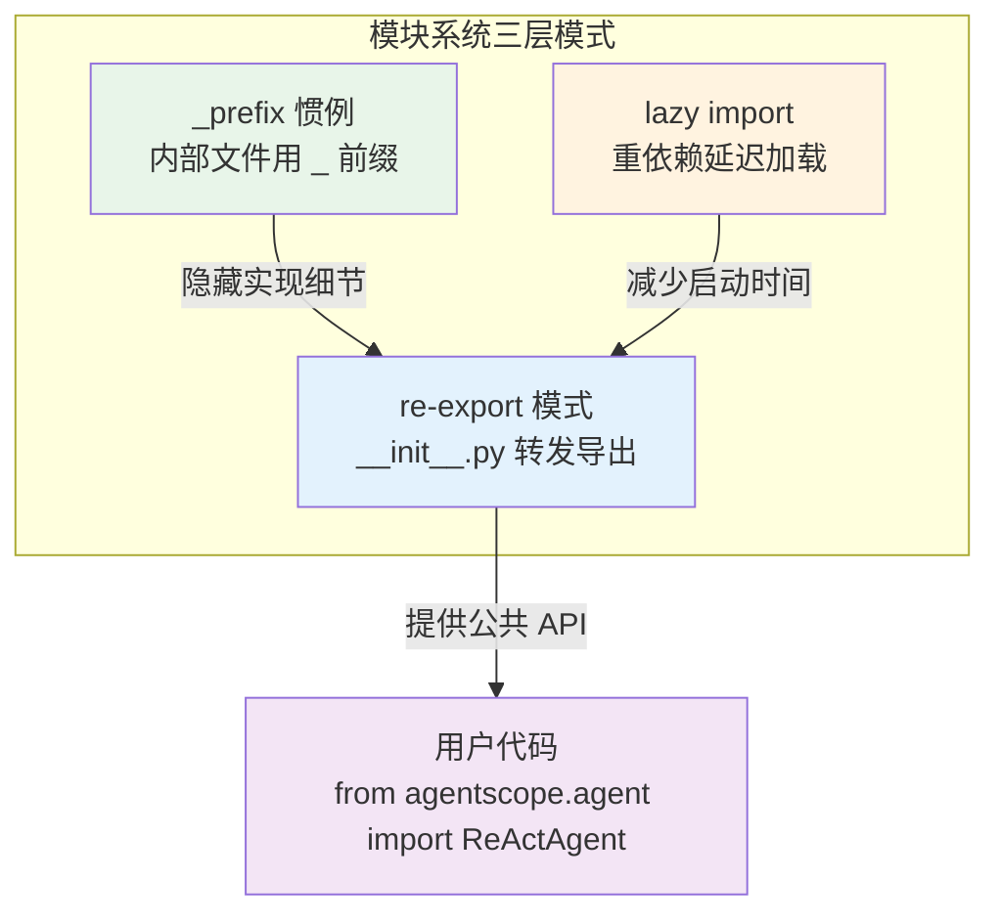

# 第十一章：模块系统——文件的命名与导入

**难度**：入门

> 你 clone 了仓库，打开 `src/agentscope/` 看到一堆 `_` 开头的文件——`_agent_base.py`、`_toolkit.py`、`_model_base.py`…… 为什么？用户明明可以 `from agentscope.agent import ReActAgent` 丝滑地导入，这背后是什么机制在运转？本章拆解 AgentScope 的三大模块设计模式：`_` 前缀惯例、re-export 模式、lazy import 模式。

---

## 1. 开场场景

在卷一中，我们每次追踪源码都要写类似这样的路径：

```
src/agentscope/agent/_react_agent.py
src/agentscope/tool/_toolkit.py
src/agentscope/model/_openai_model.py
```

但你写应用代码时，从来不需要写 `_react_agent`：

```python
from agentscope.agent import ReActAgent       # 直接导入，没有下划线
from agentscope.model import OpenAIChatModel   # 同样干净
from agentscope.tool import Toolkit            # 也是
```

这是怎么做到的？打开 `src/agentscope/agent/` 目录看看：

```
agent/
├── __init__.py           # 公共入口
├── _agent_base.py        # 内部实现
├── _react_agent_base.py  # 内部实现
├── _react_agent.py       # 内部实现
├── _user_agent.py        # 内部实现
├── _a2a_agent.py         # 内部实现
├── _realtime_agent.py    # 内部实现
├── _user_input.py        # 内部实现
├── _agent_meta.py        # 内部实现
└── _utils.py             # 内部工具
```

除了 `__init__.py`，其余文件全部以 `_` 开头。这不是巧合，而是一套精心设计的模块组织模式。本章逐层拆解它。

---

## 2. 设计模式概览

AgentScope 的模块系统由三个互相配合的模式组成：



| 模式 | 目的 | 实现位置 |
|------|------|----------|
| `_prefix` 惯例 | 标记内部实现，引导用户使用公共接口 | 所有 `_<name>.py` 文件 |
| re-export 模式 | 在 `__init__.py` 中集中导出公共 API | 各模块的 `__init__.py` |
| lazy import | 推迟重型第三方库的加载时机 | Model 子类内部、`init()` 函数内 |

---

## 3. 源码分析

### 3.1 `_` 前缀惯例

Python 没有像 Java `private` 那样的访问控制关键字。但它有一个约定：以 `_` 开头的名称表示"内部实现，不要直接使用"。AgentScope 全面采用了这个约定。

对比 `src/agentscope/agent/` 目录下的命名：

| 文件 | 角色 | 用户是否直接导入 |
|------|------|------------------|
| `__init__.py` | 公共接口 | 是 |
| `_agent_base.py` | 基类实现 | 否（通过 `__init__.py` 间接导入） |
| `_react_agent.py` | 核心实现 | 否 |
| `_agent_meta.py` | 元类 | 否 |
| `_utils.py` | 内部工具 | 否 |

`_` 前缀传达的信息是："这个文件是实现细节，可能随时变动。如果你想稳定地使用这个模块，请通过 `__init__.py` 导出列表来导入。"

这不仅是给人类的提示——某些工具也遵守这个约定。例如 `pytest` 默认不会收集以 `_` 开头的文件作为测试用例；某些 linter 会对直接导入 `_` 前缀模块发出警告。

### 3.2 re-export 模式

`__init__.py` 是 re-export 模式的核心。来看 `src/agentscope/agent/__init__.py` 的完整内容：

```python
# src/agentscope/agent/__init__.py:1-28
"""The agent base class."""
from ._agent_base import AgentBase
from ._react_agent_base import ReActAgentBase
from ._react_agent import ReActAgent
from ._user_input import (
    UserInputBase,
    UserInputData,
    TerminalUserInput,
    StudioUserInput,
)
from ._user_agent import UserAgent
from ._a2a_agent import A2AAgent
from ._realtime_agent import RealtimeAgent


__all__ = [
    "AgentBase",
    "ReActAgentBase",
    "ReActAgent",
    "UserInputData",
    "UserInputBase",
    "TerminalUserInput",
    "StudioUserInput",
    "UserAgent",
    "A2AAgent",
    "RealtimeAgent",
]
```

这个文件只做两件事：**import** 和 **`__all__`**。

**import 行**：从内部文件把类"捞"出来。`from ._react_agent import ReActAgent` 使得 `agentscope.agent.ReActAgent` 成为有效路径。

**`__all__` 列表**：显式声明模块的公共 API。它的作用是：

1. `from agentscope.agent import *` 只导入 `__all__` 中列出的名称
2. 给 IDE 和静态分析工具提供"这些是公共 API"的信号
3. 作为文档——阅读 `__all__` 就知道这个模块暴露了什么

这种模式在每个子模块中都被一致地使用。对比几个模块的 `__init__.py`：

**Model 模块**（`src/agentscope/model/__init__.py:1-22`）：

```python
from ._model_base import ChatModelBase
from ._model_response import ChatResponse
from ._dashscope_model import DashScopeChatModel
from ._openai_model import OpenAIChatModel
from ._anthropic_model import AnthropicChatModel
from ._ollama_model import OllamaChatModel
from ._gemini_model import GeminiChatModel
from ._trinity_model import TrinityChatModel
```

**Tool 模块**（`src/agentscope/tool/__init__.py:1-44`）：

```python
from ._response import ToolResponse
from ._coding import (
    execute_python_code,
    execute_shell_command,
)
from ._toolkit import Toolkit
```

**Formatter 模块**（`src/agentscope/formatter/__init__.py:1-48`）：

```python
from ._formatter_base import FormatterBase
from ._truncated_formatter_base import TruncatedFormatterBase
from ._openai_formatter import (
    OpenAIChatFormatter,
    OpenAIMultiAgentFormatter,
)
from ._anthropic_formatter import (
    AnthropicChatFormatter,
    AnthropicMultiAgentFormatter,
)
# ... 更多 provider
```

规律清晰：每个 `__init__.py` 都是从 `_<internal>` 导入，汇总到公共命名空间。

### 3.3 顶层包的 re-export

`src/agentscope/__init__.py` 是整个框架的入口。它把子模块挂载到顶层命名空间：

```python
# src/agentscope/__init__.py:43-59
from . import exception
from . import module
from . import message
from . import model
from . import tool
from . import formatter
from . import memory
from . import agent
from . import session
from . import embedding
from . import token
from . import evaluate
from . import pipeline
from . import tracing
from . import rag
from . import a2a
from . import realtime
```

注意这里用的是 `from . import <module>`，而不是 `from .<module> import *`。这意味着用户可以这样写：

```python
import agentscope
agentscope.agent.ReActAgent    # OK
agentscope.model.OpenAIChatModel  # OK
```

但最常见的写法还是直接从子模块导入：

```python
from agentscope.agent import ReActAgent
from agentscope.model import OpenAIChatModel
```

### 3.4 lazy import 模式

re-export 解决了"导出什么"的问题，但没有解决"什么时候导入"的问题。AgentScope 的 Model 子类展示了一个关键设计：**第三方 SDK 在函数/方法内部导入，而非模块顶层**。

来看 `src/agentscope/model/_openai_model.py`：

```python
# src/agentscope/model/_openai_model.py:38-40
if TYPE_CHECKING:
    from openai.types.chat import ChatCompletion
    from openai import AsyncStream
```

```python
# src/agentscope/model/_openai_model.py:150
import openai  # 在 __init__ 方法内部，而非文件顶部
```

`TYPE_CHECKING` 是 Python 标准库的一个常量，值为 `True` 仅在静态类型检查时。运行时这段 `import` 不执行。真正的 `import openai` 被推迟到 `__init__` 方法内部（第 150 行）。

同样的模式出现在其他 Model 子类中：

- `_anthropic_model.py:118`：`import anthropic` 在 `__init__` 内部
- `_dashscope_model.py:139`：`import dashscope` 在 `__init__` 内部
- `_gemini_model.py:185`：`from google import genai` 在 `__init__` 内部

为什么要这样做？因为如果这些 `import` 放在模块顶部：

1. 用户 `pip install agentscope` 后，即使只用 DashScope，也会因为缺少 `anthropic` 而报错
2. `import agentscope` 会触发所有子模块的顶层导入，启动变慢

lazy import 让依赖变成了"按需加载"——只有你真正实例化 `OpenAIChatModel` 时，才会加载 `openai` 库。

在顶层 `__init__.py` 中也能看到这个模式的变体。`init()` 函数内部（`src/agentscope/__init__.py:153`）：

```python
# src/agentscope/__init__.py:152-155
if endpoint:
    from .tracing import setup_tracing

    setup_tracing(endpoint=endpoint)
```

`setup_tracing` 只在用户配置了 tracing 时才导入。如果不需要 tracing 功能，OpenTelemetry 的依赖就不会被加载。

---

## 4. 设计一瞥

### 4.1 替代方案：flat 结构

如果不用 `_` 前缀 + re-export，文件可以直接以公共名称命名：

```
agent/
├── __init__.py
├── agent_base.py      # 没有 _ 前缀
├── react_agent.py     # 没有 _ 前缀
└── ...
```

优点：少一层间接，文件名更直观。缺点：用户可能直接 `from agentscope.agent._react_agent import ReActAgent`——绕过 `__init__.py` 的版本约束，将来重命名文件时用户代码会崩溃。

### 4.2 替代方案：`__getattr__` 延迟加载

Python 3.7+ 支持在模块级别定义 `__getattr__`，实现真正的按需加载：

```python
# __init__.py
def __getattr__(name):
    if name == "ReActAgent":
        from ._react_agent import ReActAgent
        return ReActAgent
    raise AttributeError(f"module {__name__!r} has no attribute {name!r}")
```

AgentScope 没有采用这个方案。原因是 re-export 模式已经足够——`from . import agent` 的开销很小（只导入 `__init__.py`，不会递归加载所有子文件），而 `__getattr__` 增加了调试难度（`dir(agentscope.agent)` 可能看不到延迟加载的属性）。

### 4.3 `_` 前缀 vs `__` 前缀

Python 中 `_name` 是"受保护"的约定，`__name` 会触发名称改写（name mangling）。AgentScope 只使用单下划线 `_`，这是模块级别的惯例，不涉及名称改写。

---

## 5. 横向对比

| 框架 | 模块组织方式 | re-export | lazy import |
|------|-------------|-----------|-------------|
| **AgentScope** | `_` 前缀 + `__init__.py` re-export | 集中在 `__init__.py` | Model 子类内部延迟加载 |
| **LangChain** | `langchain-core` / `langchain` 分包 | 顶层 `__init__.py` 大量 re-export | 使用 `__getattr__` 延迟加载 |
| **AutoGen** | flat 结构，文件名即类名 | 少量 re-export | 依赖在顶层直接导入 |

LangChain 的做法更激进——它的 `langchain` 包几乎是一个空壳，所有实现在 `langchain-core` 中，通过 re-export 和 `__getattr__` 汇总到用户可见的命名空间。这带来了灵活的版本管理（`langchain-core` 可以独立升级），但也增加了调试难度——报错时用户看到的堆栈经常穿越多个包。

AutoGen 的做法最简单——文件就是公共接口，用户直接导入文件名。这在项目初期效率很高，但随着模块增长，重命名或重组文件的代价更大。

AgentScope 选择了中间路线：`_` 前缀清晰地标记了内部/公共边界，但不拆分成多个包。这适合单一仓库、中等规模的项目。

---

## 6. 调试实践

### 场景 1：ImportError 诊断

如果你看到：

```
ImportError: cannot import name 'ReActAgent' from 'agentscope.agent'
```

检查步骤：

1. 确认 `agentscope` 已安装：`pip show agentscope`
2. 检查 `agentscope.agent.__init__.py` 的 `__all__` 是否包含 `ReActAgent`
3. 检查 `agentscope/agent/_react_agent.py` 是否存在

### 场景 2：第三方依赖缺失

实例化 Model 时报错：

```
ModuleNotFoundError: No module named 'openai'
```

这是 lazy import 生效的标志——`openai` 不是 `agentscope` 的硬依赖，只有在你使用 `OpenAIChatModel` 时才需要。解决方法：

```bash
pip install openai
# 或者安装全量依赖
pip install "agentscope[full]"
```

### 场景 3：查看模块的公共 API

快速了解一个子模块暴露了什么：

```python
import agentscope.agent
print(agentscope.agent.__all__)
# ['AgentBase', 'ReActAgentBase', 'ReActAgent', ...]
```

或者用 `dir()` 过滤掉 `_` 开头的内部属性：

```python
[name for name in dir(agentscope.agent) if not name.startswith('_')]
```

### 场景 4：追踪导入路径

当你在 IDE 中 `Ctrl+Click` `ReActAgent` 时，IDE 会跳到 `_react_agent.py` 而不是 `__init__.py`。这是因为 re-export 使用的是 `from ._react_agent import ReActAgent`——IDE 追踪到了定义处。

如果你需要确认某个名称的导入路径，可以用：

```python
from agentscope.agent import ReActAgent
print(ReActAgent.__module__)  # 'agentscope.agent._react_agent'
```

---

## 7. 检查点

### 基础题

1. 打开 `src/agentscope/memory/__init__.py`，列出它 re-export 了哪些类。哪些来自 `_working_memory`，哪些来自 `_long_term_memory`？

2. `src/agentscope/pipeline/__init__.py` 同时导出了类和函数（如 `sequential_pipeline`）。检查哪些来自 `_class.py`，哪些来自 `_functional.py`。

3. 在 `src/agentscope/model/_openai_model.py` 中，`TYPE_CHECKING` 保护了哪些导入？为什么这些类型不需要在运行时加载？

### 进阶题

4. 如果你需要给 `agentscope.agent` 添加一个新的 `XYZAgent`，你需要修改哪些文件？写出步骤。

5. 对比 `src/agentscope/model/__init__.py` 和 `src/agentscope/formatter/__init__.py` 的 re-export 方式。它们有什么共同的模式？有没有差异？

6. 思考：如果用户直接 `from agentscope.agent._react_agent import ReActAgent`，功能上能正常工作吗？有什么风险？

---

## 8. 下一章预告

模块系统告诉我们文件怎么组织，但没回答一个更深层的问题：`AgentBase` 继承自 `StateModule`，而 `MemoryBase` 和 `Toolkit` 也继承自它——`StateModule` 是什么？下一章拆解这个 PyTorch 风格的状态管理体系。
