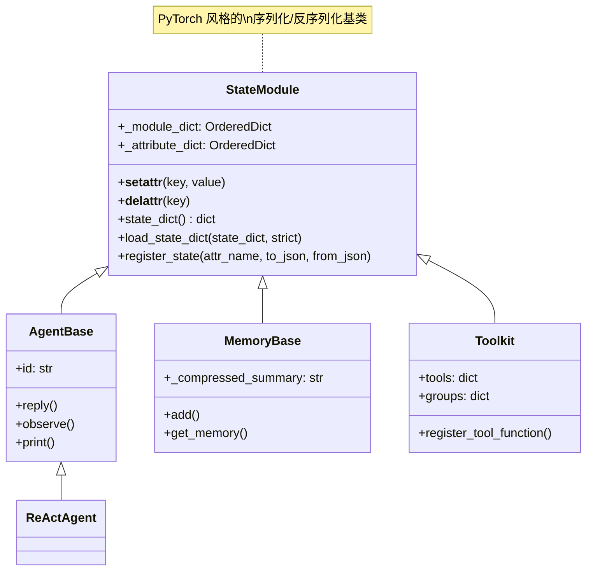

# 第十二章：继承体系——从 StateModule 到 AgentBase

**难度**：中等

> 你收到一个 bug：Agent 序列化失败。生产环境里，`agent.state_dict()` 抛出 `AttributeError: Call the super().__init__() method within the constructor...`。你打开堆栈追踪，发现错误来自 `_state_module.py` 里的 `__setattr__`。这个 `StateModule` 是什么？为什么 Agent、Memory、Toolkit 都继承自它？本章拆解 AgentScope 的状态管理继承体系——一个模仿 PyTorch `state_dict` / `load_state_dict` 的设计模式。

---

## 1. 开场场景

你的应用需要把 Agent 的状态保存到磁盘，下次启动时恢复：

```python
agent = ReActAgent(name="assistant", model=model)

# ... agent 运行了一段时间 ...

state = agent.state_dict()          # 保存状态
with open("state.json", "w") as f:
    json.dump(state, f)
```

这看起来很简单。但有一天你写了一个自定义 Agent：

```python
class MyAgent(AgentBase):
    def __init__(self):
        self.memory = InMemoryMemory()  # 在 super().__init__() 之前设置属性
        super().__init__()
```

运行 `my_agent.state_dict()`，炸了：

```
AttributeError: Call the super().__init__() method within the constructor
of MyAgent before setting any attributes.
```

原因藏在 `StateModule.__setattr__` 里。要理解这个 bug，我们需要从继承链的最顶端开始看。

---

## 2. 设计模式概览

AgentScope 的状态管理围绕一个基类 `StateModule` 展开，三个核心组件继承自它：



继承链：

| 子类 | 文件位置 | 行号 |
|------|---------|------|
| `AgentBase(StateModule)` | `src/agentscope/agent/_agent_base.py` | 第 30 行 |
| `MemoryBase(StateModule)` | `src/agentscope/memory/_working_memory/_base.py` | 第 11 行 |
| `Toolkit(StateModule)` | `src/agentscope/tool/_toolkit.py` | 第 117 行 |

`StateModule` 本身不到 150 行代码，但它建立了一套贯穿整个框架的序列化契约。

---

## 3. 源码分析

### 3.1 StateModule：基类结构

文件：`src/agentscope/module/_state_module.py`，共 152 行。

**构造函数**（第 24-27 行）：

```python
def __init__(self) -> None:
    self._module_dict = OrderedDict()
    self._attribute_dict = OrderedDict()
```

两个 `OrderedDict` 分别存储两种状态：

- `_module_dict`：值为 `StateModule` 子类实例的属性（嵌套模块）
- `_attribute_dict`：值为普通 Python 对象的属性（需要序列化的标量状态）

关键在于这两个字典不是手动维护的——它们由 `__setattr__` 和 `__delattr__` 自动管理。

### 3.2 __setattr__：自动注册子模块

第 29-39 行：

```python
def __setattr__(self, key: str, value: Any) -> None:
    if isinstance(value, StateModule):
        if not hasattr(self, "_module_dict"):
            raise AttributeError(
                f"Call the super().__init__() method within the "
                f"constructor of {self.__class__.__name__} before setting "
                f"any attributes.",
            )
        self._module_dict[key] = value
    super().__setattr__(key, value)
```

这就是开场场景中 bug 的来源。逻辑分三步：

1. **检查类型**：如果 `value` 是 `StateModule` 的实例，它就是一个需要递归序列化的子模块
2. **安全检查**：如果 `_module_dict` 还不存在，说明 `super().__init__()` 还没被调用——抛出错误
3. **注册**：将属性名记入 `_module_dict`，然后正常设置属性

这意味着任何 `StateModule` 子类在构造函数中设置 `StateModule` 类型的属性时，这个属性会被自动追踪。例如 `ReActAgent.__init__` 中：

```python
# src/agentscope/agent/_react_agent.py:281-300
self.memory = memory or InMemoryMemory()   # memory 是 StateModule -> 自动注册
self.toolkit = toolkit or Toolkit()        # toolkit 是 StateModule -> 自动注册
```

`__delattr__`（第 41-47 行）则是逆操作——删除属性时同时从 `_module_dict` 和 `_attribute_dict` 中移除。

### 3.3 state_dict：递归序列化

第 49-72 行：

```python
def state_dict(self) -> dict:
    state = {}
    for key in self._module_dict:
        attr = getattr(self, key, None)
        if isinstance(attr, StateModule):
            state[key] = attr.state_dict()  # 递归调用子模块的 state_dict

    for key in self._attribute_dict:
        attr = getattr(self, key)
        to_json_function = self._attribute_dict[key].to_json
        if to_json_function is not None:
            state[key] = to_json_function(attr)
        else:
            state[key] = attr

    return state
```

`state_dict()` 遍历两个字典，分别处理：

1. **子模块**（`_module_dict`）：递归调用子模块的 `state_dict()`，形成嵌套字典
2. **注册属性**（`_attribute_dict`）：如果有自定义序列化函数则使用它，否则直接存储

最终生成的字典结构类似：

```python
{
    "name": "assistant",
    "_sys_prompt": "You are a helpful assistant.",
    "memory": {
        "_compressed_summary": ""
    },
    "toolkit": {
        "active_groups": ["basic"]
    }
}
```

注意这里**没有使用 deepcopy**。`state_dict()` 返回的是当前状态的快照，但里面的可变对象（如列表、字典）仍然与原始对象共享引用。调用者如果需要完全隔离，需自行深拷贝。

### 3.4 load_state_dict：反序列化与 strict 模式

第 74-106 行：

```python
def load_state_dict(self, state_dict: dict, strict: bool = True) -> None:
    for key in self._module_dict:
        if key not in state_dict:
            if strict:
                raise KeyError(...)
            continue
        self._module_dict[key].load_state_dict(state_dict[key])  # 递归

    for key in self._attribute_dict:
        if key not in state_dict:
            if strict:
                raise KeyError(...)
            continue
        from_json_func = self._attribute_dict[key].load_json
        if from_json_func is not None:
            setattr(self, key, from_json_func(state_dict[key]))
        else:
            setattr(self, key, state_dict[key])
```

`strict` 参数直接致敬 PyTorch 的同名参数：

- `strict=True`（默认）：如果 `state_dict` 缺少任何已注册的键，抛出 `KeyError`
- `strict=False`：跳过缺失的键，只加载匹配的部分

这个设计在模型微调场景下很实用——你可能只想恢复部分状态（比如恢复 memory 但不恢复 toolkit 的 group 配置）。

### 3.5 register_state：手动注册标量属性

`__setattr__` 只自动追踪 `StateModule` 类型的属性。对于普通 Python 对象（字符串、数字、列表等），需要手动调用 `register_state`。

第 108-151 行：

```python
def register_state(
    self,
    attr_name: str,
    custom_to_json: Callable | None = None,
    custom_from_json: Callable | None = None,
) -> None:
    attr = getattr(self, attr_name)

    if custom_to_json is None:
        try:
            json.dumps(attr)
        except Exception as e:
            raise TypeError(
                f"Attribute '{attr_name}' is not JSON serializable. "
                "Please provide a custom function..."
            ) from e

    if attr_name in self._module_dict:
        raise ValueError(
            f"Attribute `{attr_name}` is already registered as a module."
        )

    self._attribute_dict[attr_name] = _JSONSerializeFunction(
        to_json=custom_to_json,
        load_json=custom_from_json,
    )
```

三个要点：

1. **JSON 兼容性检查**：如果不提供自定义序列化函数，属性必须是 `json.dumps` 能直接处理的类型
2. **互斥检查**：同一个属性不能同时注册为模块和标量状态
3. **自定义转换**：通过 `custom_to_json` / `custom_from_json` 支持非 JSON 原生类型

`_JSONSerializeFunction`（第 12-17 行）是一个简单的 dataclass，存储序列化/反序列化函数对。

### 3.6 子类如何使用：三个实例

**MemoryBase**（`src/agentscope/memory/_working_memory/_base.py:14-20`）：

```python
class MemoryBase(StateModule):
    def __init__(self) -> None:
        super().__init__()
        self._compressed_summary: str = ""
        self.register_state("_compressed_summary")
```

MemoryBase 只注册了一个标量属性 `_compressed_summary`。它没有子模块属性——具体的 Memory 实现（如 `InMemoryMemory`）会在自己的 `state_dict` / `load_state_dict` 中处理消息列表的序列化。

**AgentBase**（`src/agentscope/agent/_agent_base.py:30`）：

```python
class AgentBase(StateModule, metaclass=_AgentMeta):
```

AgentBase 继承了 `StateModule` 但没有在构造函数中调用 `register_state`。它只在第 142 行调用 `super().__init__()`，初始化 `_module_dict` 和 `_attribute_dict`。状态的注册推迟到具体子类。

**ReActAgent**（`src/agentscope/agent/_react_agent.py:263-364`）：

```python
super().__init__()                     # 第 263 行：初始化 StateModule
# ... 设置各种属性 ...
self.memory = memory or InMemoryMemory()   # 第 282 行：StateModule -> 自动注册到 _module_dict
self.toolkit = toolkit or Toolkit()         # 第 300 行：StateModule -> 自动注册到 _module_dict
# ...
self.register_state("name")                 # 第 363 行：手动注册标量
self.register_state("_sys_prompt")          # 第 364 行：手动注册标量
```

ReActAgent 混合使用了两种注册方式：`memory` 和 `toolkit` 通过 `__setattr__` 自动注册，`name` 和 `_sys_prompt` 通过 `register_state` 手动注册。

**Toolkit**（`src/agentscope/tool/_toolkit.py:117-1231`）：

```python
class Toolkit(StateModule):
```

Toolkit 做了更特殊的事——它完全**重写**了 `state_dict` 和 `load_state_dict`（第 1180-1231 行），不使用基类的递归逻辑，而是只保存/恢复活跃的工具组名称：

```python
def state_dict(self) -> dict[str, Any]:
    return {
        "active_groups": [
            name for name, group in self.groups.items() if group.active
        ],
    }
```

这说明 `StateModule` 的子类可以选择性地重写序列化行为，而不是被基类逻辑绑定。

---

## 4. 设计一瞥

### 4.1 为什么模仿 PyTorch 的 state_dict？

PyTorch 的 `nn.Module` 是深度学习框架中最成功的序列化设计之一。它的核心思想：

- `state_dict()` 把模型参数导出为纯字典
- `load_state_dict()` 从字典恢复参数
- 字典是 JSON 兼容的，可以方便地保存/传输

AgentScope 借鉴了这个模式，但做了关键的简化：

| 维度 | PyTorch `nn.Module` | AgentScope `StateModule` |
|------|---------------------|--------------------------|
| 追踪对象 | `Parameter` 和 `Buffer` | `StateModule` 子实例和 `register_state` 属性 |
| 自动注册 | `__setattr__` 追踪 `nn.Module` | `__setattr__` 追踪 `StateModule` |
| 递归深度 | 可达数十层（ResNet 等） | 通常 2-3 层（Agent -> Memory/Toolkit） |
| deepcopy | 不使用 | 不使用 |

简化是合理的——AgentScope 的对象图比神经网络浅得多，不需要 PyTorch 那样复杂的参数管理。

### 4.2 两种注册机制的权衡

`__setattr__` 自动注册 + `register_state` 手动注册，这种双轨制引入了一个微妙的设计选择：

- **自动注册的优点**：零样板代码，开发者设置属性时就自动追踪
- **自动注册的缺点**：`super().__init__()` 必须先于任何 `StateModule` 属性的设置，否则报错
- **手动注册的优点**：显式声明哪些属性需要序列化，语义清晰
- **手动注册的缺点**：容易遗忘——如果忘记调用 `register_state`，属性不会被序列化，且不报错

AgentScope 将自动注册用于"必定需要追踪的子模块"（memory、toolkit），手动注册用于"可能变化的标量"（name、sys_prompt）。这个划分是合理的。

### 4.3 strict 模式的取舍

`strict=True` 默认值意味着序列化和反序列化的结构必须完全匹配。这在版本升级时可能成为问题——如果新版 Agent 注册了新属性，旧版保存的 `state_dict` 加载时会报错。

PyTorch 也面临同样的问题，它的社区实践是：保存时用 `state_dict()`，加载时用 `strict=False` 并手动处理兼容性。AgentScope 的用户也应遵循这个模式。

---

## 5. 横向对比

| 框架 | 序列化方式 | 基类支持 | 递归序列化 |
|------|-----------|---------|-----------|
| **AgentScope** | `state_dict()` / `load_state_dict()` | `StateModule` 基类 | 是，通过 `_module_dict` |
| **LangChain** | 无统一机制，各组件自行处理 | 无 | 否 |
| **AutoGen** | 无统一机制 | 无 | 否 |
| **CrewAI** | `pickle` 或 JSON 手动序列化 | 无 | 否 |
| **PyTorch** | `state_dict()` / `load_state_dict()` | `nn.Module` 基类 | 是，通过 `_modules` |

AgentScope 是目前主流 Agent 框架中唯一系统性地借鉴 PyTorch 序列化模式的。LangChain 和 AutoGen 将序列化留给用户处理（通常用 `pickle` 或手动 JSON），CrewAI 也是类似。

PyTorch 的成功证明了 `state_dict` 模式的价值——它是检查点（checkpoint）系统的基石。AgentScope 的这个设计选择暗示了它的目标场景：需要长时间运行、中途保存/恢复的 Agent。

---

## 6. 调试实践

### 场景 1：super().__init__() 顺序错误

```python
class MyAgent(AgentBase):
    def __init__(self):
        self.memory = InMemoryMemory()  # 错误：在 super().__init__() 之前
        super().__init__()
```

报错信息：

```
AttributeError: Call the super().__init__() method within the constructor
of MyAgent before setting any attributes.
```

**修复**：将 `super().__init__()` 移到构造函数的第一行。

### 场景 2：注册了不可序列化的属性

```python
self.some_callback = lambda x: x + 1
self.register_state("some_callback")  # lambda 不是 JSON serializable
```

报错信息：

```
TypeError: Attribute 'some_callback' is not JSON serializable.
Please provide a custom function to convert the attribute to a
JSON-serializable format.
```

**修复**：提供自定义序列化函数，或者不注册这个属性（回调函数通常不需要持久化）。

### 场景 3：检查 state_dict 的内容

调试序列化问题时，先看 `state_dict()` 返回了什么：

```python
import json
state = agent.state_dict()
print(json.dumps(state, indent=2, ensure_ascii=False))
```

如果某个预期的字段没有出现，检查：
- 如果是 `StateModule` 类型：确认属性名在 `_module_dict` 中（`agent._module_dict.keys()`）
- 如果是标量：确认调用了 `register_state`（`agent._attribute_dict.keys()`）

### 场景 4：strict 模式下的版本兼容

加载旧版本保存的状态时报错：

```python
agent.load_state_dict(old_state)  # KeyError: 'new_field'
```

**修复**：使用 `strict=False`，然后手动设置缺失的字段：

```python
agent.load_state_dict(old_state, strict=False)
agent.new_field = default_value
```

---

## 7. 检查点

### 基础题

1. 在 `StateModule.__setattr__` 中，为什么需要 `hasattr(self, "_module_dict")` 检查？如果去掉这个检查会发生什么？

2. 打开 `src/agentscope/agent/_react_agent.py`，找到 `ReActAgent.__init__` 中所有 `StateModule` 类型的属性赋值（会被自动注册到 `_module_dict` 的那些）。列出它们。

3. `MemoryBase` 在构造函数中注册了 `_compressed_summary`，但它的子类（如 `InMemoryMemory`）可能还有消息列表需要序列化。去查看 `InMemoryMemory` 是如何处理消息列表的序列化的。

### 进阶题

4. `Toolkit` 重写了 `state_dict` 和 `load_state_dict`，完全不使用基类的递归逻辑。如果你需要在 `Toolkit` 的 state 中同时保存工具组信息和已注册工具的名称列表，你会怎么修改？

5. 设计一个自定义 Agent，它有一个 `dict` 类型的 `_metadata` 属性需要序列化。写出构造函数，使用 `register_state` 注册这个属性。注意：`dict` 是 JSON 兼容的，所以不需要自定义序列化函数。

6. 思考：`state_dict()` 没有使用 `deepcopy`，这意味着返回的字典中的可变对象与原始对象共享引用。在什么场景下这会导致 bug？你会怎么修复？

---

## 8. 下一章预告

`AgentBase` 的类定义中有一行我们还没细看：`metaclass=_AgentMeta`。这个元类在类创建时自动包装了 `reply`、`observe`、`print` 方法——给它们套上了 pre/post hook。下一章拆解这个元类钩子系统。
