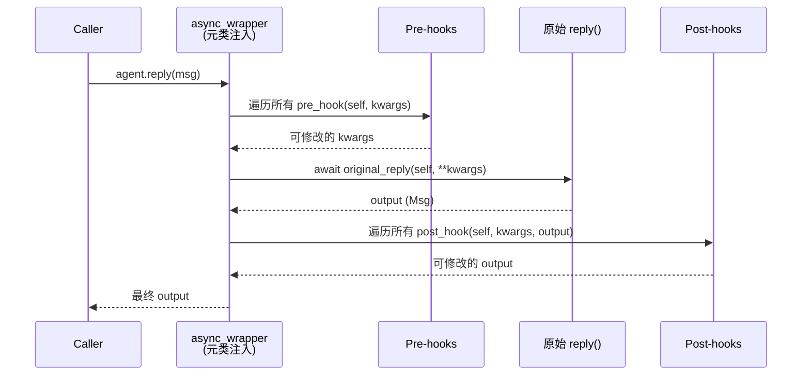

# 第十三章：元类与 Hook——方法调用的拦截

**难度**：进阶

> 你在 `reply()` 方法的第一行加了 `print("reply called")`，运行却发现输出顺序不对——hook 里打印的东西比你早。你盯着屏幕想：我没有在 `reply()` 里调用任何 hook 啊？答案是 `_AgentMeta`。这个元类在类**定义**的时候就把你的 `reply` 悄悄换成了一个包装版本。本章拆解 AgentScope 的编译期方法包装和 Hook 拦截系统。

---

## 1. 开场场景

你想给 Agent 的每次回复加上耗时统计：

```python
class MyAgent(AgentBase):
    async def reply(self, *args, **kwargs) -> Msg:
        import time
        start = time.time()
        # ... 原有逻辑 ...
        print(f"reply took {time.time() - start:.2f}s")
        return msg
```

这个方案能用，但你发现：如果你的同事也想在 `reply` 前后做事（比如记录输入参数、修改输出消息），他就得修改 `reply` 本身。三个人的需求混在一起，代码很快变成面条。

AgentScope 的方案是用 Hook——在 `reply` 外面套一层可插拔的前置/后置处理器。但这个"套一层"不是你在代码里显式写的，而是 `_AgentMeta` 元类在类定义时自动完成的。

我们来看源码。

---

## 2. 设计模式概览

Hook 系统由三层组成：

```
元类层（编译期）       Hook 层（运行时）        类型层（约束）
_AgentMeta            _wrap_with_hooks          AgentHookTypes
    |                      |                        |
    | 包装 reply/observe   | pre-hook → 原函数       | Literal 类型
    | /print 方法          | → post-hook            | 约束合法值
    v                      v                        v
AgentBase              async_wrapper            "pre_reply",
(metaclass=            (替换原方法)              "post_reply", ...
 _AgentMeta)
```

执行流程：



关键特点：

| 特点 | 说明 |
|------|------|
| **编译期注入** | 元类在 `class` 语句执行时就完成包装，不是运行时 |
| **双层存储** | class-level hooks（所有实例共享）+ instance-level hooks（单个实例私有） |
| **参数标准化** | 所有位置参数先转为关键字参数，hook 统一操作 dict |
| **重入保护** | MRO 中多层包装只执行一次 hook |

---

## 3. 源码分析

### 3.1 _AgentMeta：编译期方法替换

文件：`src/agentscope/agent/_agent_meta.py`，第 159-174 行。

```python
class _AgentMeta(type):
    """The agent metaclass that wraps the agent's reply, observe and print
    functions with pre- and post-hooks."""

    def __new__(mcs, name: Any, bases: Any, attrs: Dict) -> Any:
        """Wrap the agent's functions with hooks."""

        for func_name in [
            "reply",
            "print",
            "observe",
        ]:
            if func_name in attrs:
                attrs[func_name] = _wrap_with_hooks(attrs[func_name])

        return super().__new__(mcs, name, bases, attrs)
```

这是整个 Hook 系统的入口。逻辑极简：

1. `__new__` 在 Python 解释器处理 `class AgentBase(...)` 语句时被调用
2. `attrs` 字典包含这个类**直接定义**的所有属性和方法
3. 遍历 `"reply"`, `"print"`, `"observe"` 三个名字
4. 如果当前类的 `attrs` 中有这个方法，就把它替换成 `_wrap_with_hooks()` 的返回值

注意 `if func_name in attrs` 这个条件：它只包装**当前类直接定义**的方法，不会触碰从父类继承的方法。这很重要——如果 `ReActAgent` 没有重写 `print`，它不会被二次包装。

`_ReActAgentMeta`（第 177-192 行）继承 `_AgentMeta`，额外包装两个方法：

```python
class _ReActAgentMeta(_AgentMeta):
    def __new__(mcs, name: Any, bases: Any, attrs: Dict) -> Any:
        for func_name in [
            "_reasoning",
            "_acting",
        ]:
            if func_name in attrs:
                attrs[func_name] = _wrap_with_hooks(attrs[func_name])

        return super().__new__(mcs, name, bases, attrs)
```

`super().__new__()` 调用会触发 `_AgentMeta.__new__`，先包装 `_reasoning` 和 `_acting`，再让父类包装 `reply`/`print`/`observe`。

在类定义处的连接：

```python
# src/agentscope/agent/_agent_base.py:30
class AgentBase(StateModule, metaclass=_AgentMeta):

# src/agentscope/agent/_react_agent_base.py:12
class ReActAgentBase(AgentBase, metaclass=_ReActAgentMeta):
```

### 3.2 _wrap_with_hooks：核心包装器

文件：`src/agentscope/agent/_agent_meta.py`，第 55-156 行。

这是 Hook 系统的核心——一个高阶函数，接收原始方法，返回一个 `async_wrapper`。

**函数名提取**（第 64 行）：

```python
func_name = original_func.__name__.replace("_", "")
```

这行把方法名中的下划线去掉：`reply` → `"reply"`，`_reasoning` → `"reasoning"`，`_acting` → `"acting"`。去掉下划线后的名字用于查找 hook 属性：`_instance_pre_reply_hooks`、`_class_post_reasoning_hooks` 等。

**重入保护**（第 66, 80-81, 128-137 行）：

```python
hook_guard_attr = f"_hook_running_{func_name}"

# 在 wrapper 内部：
if getattr(self, hook_guard_attr, False):
    return await original_func(self, *args, **kwargs)

# 调用原始方法前：
setattr(self, hook_guard_attr, True)
try:
    current_output = await original_func(self, *args, **others, **kwargs)
finally:
    setattr(self, hook_guard_attr, False)
```

为什么需要重入保护？因为 Python 的 MRO（方法解析顺序）中，如果 `ReActAgentBase` 和 `ReActAgent` 都在 `attrs` 中定义了 `reply`，元类会给**每个**类的 `reply` 各包一层。当 `ReActAgent.reply` 调用 `super().reply()` 时，会进入 `ReActAgentBase.reply` 的包装器。如果不做保护，pre/post hook 会在每一层都执行一次。

guard 标志确保：只有最外层的包装器执行 hook 逻辑，内层直接调用原始函数。

**参数标准化**（第 21-52, 84-89 行）：

```python
normalized_kwargs = _normalize_to_kwargs(
    original_func,
    self,
    *args,
    **kwargs,
)
```

`_normalize_to_kwargs` 用 `inspect.signature` 把所有参数绑定到函数签名，再转为纯字典。这样 hook 函数只需要处理 `dict[str, Any]`，不用关心原始方法的位置参数。

标准化过程中还会调用 `bound.apply_defaults()`（第 34 行），填充默认参数值。这保证 hook 看到的参数是完整的，不会因为调用者省略了某个带默认值的参数而缺失。

**Pre-hook 执行**（第 100-117 行）：

```python
pre_hooks = list(
    getattr(self, f"_instance_pre_{func_name}_hooks").values(),
) + list(
    getattr(self, f"_class_pre_{func_name}_hooks").values(),
)
for pre_hook in pre_hooks:
    modified_keywords = await _execute_async_or_sync_func(
        pre_hook,
        self,
        deepcopy(current_normalized_kwargs),
    )
    if modified_keywords is not None:
        assert isinstance(modified_keywords, dict), ...
        current_normalized_kwargs = modified_keywords
```

执行顺序：**instance hooks 先于 class hooks**。每个 hook 接收 `self` 和参数字典的 `deepcopy`。如果 hook 返回非 `None` 的字典，它替换当前参数字典——hook 形成了链式修改管道。

注意 `deepcopy`（第 109 行）：每个 hook 拿到的是参数的独立副本。这样即使 hook 修改了字典，也不会影响下一个 hook 拿到的原始值（除非前一个 hook 返回了修改后的字典）。

**Post-hook 执行**（第 139-153 行）：

```python
post_hooks = list(
    getattr(self, f"_instance_post_{func_name}_hooks").values(),
) + list(
    getattr(self, f"_class_post_{func_name}_hooks").values(),
)
for post_hook in post_hooks:
    modified_output = await _execute_async_or_sync_func(
        post_hook,
        self,
        deepcopy(current_normalized_kwargs),
        deepcopy(current_output),
    )
    if modified_output is not None:
        current_output = modified_output
```

Post-hook 同时接收参数字典和输出值。同样是链式传递：如果返回非 `None`，替换当前输出。

### 3.3 Hook 的存储结构

AgentBase 的类定义中声明了类级 hook 存储（`src/agentscope/agent/_agent_base.py`，第 46-138 行）：

```python
_class_pre_reply_hooks: dict[str, Callable] = OrderedDict()
_class_post_reply_hooks: dict[str, Callable] = OrderedDict()
_class_pre_print_hooks: dict[str, Callable] = OrderedDict()
_class_post_print_hooks: dict[str, Callable] = OrderedDict()
_class_pre_observe_hooks: dict[str, Callable] = OrderedDict()
_class_post_observe_hooks: dict[str, Callable] = OrderedDict()
```

实例级 hook 在 `__init__` 中初始化（第 151-158 行）：

```python
self._instance_pre_print_hooks = OrderedDict()
self._instance_post_print_hooks = OrderedDict()
self._instance_pre_reply_hooks = OrderedDict()
self._instance_post_reply_hooks = OrderedDict()
self._instance_pre_observe_hooks = OrderedDict()
self._instance_post_observe_hooks = OrderedDict()
```

命名规则：`_{level}_{position}_{func_name}_hooks`

- `level`：`instance` 或 `class`
- `position`：`pre` 或 `post`
- `func_name`：`reply`、`print`、`observe`（或 ReAct 扩展的 `reasoning`、`acting`）

所有存储都用 `OrderedDict`——hook 的执行顺序就是注册顺序。

ReActAgentBase（`src/agentscope/agent/_react_agent_base.py`，第 35-102 行）额外声明了 `_reasoning` 和 `_acting` 对应的类级和实例级 hook 存储。

### 3.4 Hook 注册与移除

AgentBase 提供两套注册 API：

**实例级注册**（`_agent_base.py`，第 533-559 行）：

```python
def register_instance_hook(
    self,
    hook_type: AgentHookTypes,
    hook_name: str,
    hook: Callable,
) -> None:
    hooks = getattr(self, f"_instance_{hook_type}_hooks")
    hooks[hook_name] = hook
```

**类级注册**（第 590-616 行）：

```python
@classmethod
def register_class_hook(
    cls,
    hook_type: AgentHookTypes,
    hook_name: str,
    hook: Callable,
) -> None:
    assert hook_type in cls.supported_hook_types
    hooks = getattr(cls, f"_class_{hook_type}_hooks")
    hooks[hook_name] = hook
```

类级注册有一个 `assert` 校验：`hook_type` 必须在 `supported_hook_types` 列表中。这防止了拼写错误导致的静默失败。

对应的移除方法：`remove_instance_hook`（第 561-588 行）和 `remove_class_hook`（第 618-645 行）。还有批量清理方法 `clear_instance_hooks` 和 `clear_class_hooks`（第 647-699 行）。

### 3.5 类型约束

文件：`src/agentscope/types/_hook.py`

```python
AgentHookTypes = (
    str
    | Literal[
        "pre_reply",
        "post_reply",
        "pre_print",
        "post_print",
        "pre_observe",
        "post_observe",
    ]
)

ReActAgentHookTypes = (
    AgentHookTypes
    | Literal[
        "pre_reasoning",
        "post_reasoning",
        "pre_acting",
        "post_acting",
    ]
)
```

注意 `AgentHookTypes = str | Literal[...]`——它同时允许 `str`。这意味着类型检查器不会对拼写错误的字符串报错。运行时的保护靠的是 `supported_hook_types` 列表中的 `assert` 检查和 `getattr` 查找——如果 hook 类型不存在对应的属性，会抛出 `AttributeError`。

`ReActAgentHookTypes` 通过类型联合扩展了基础类型，增加了 reasoning 和 acting 的四种 hook。

---

## 4. 设计一瞥

### 4.1 编译期注入 vs 运行时装饰器

Python 中给方法加拦截器有两种常见方案：

**方案 A：运行时装饰器**

```python
class AgentBase:
    @with_hooks
    async def reply(self, *args, **kwargs):
        ...
```

**方案 B：元类编译期注入**（AgentScope 的选择）

```python
class _AgentMeta(type):
    def __new__(mcs, name, bases, attrs):
        if "reply" in attrs:
            attrs["reply"] = _wrap_with_hooks(attrs["reply"])
        return super().__new__(mcs, name, bases, attrs)

class AgentBase(metaclass=_AgentMeta):
    async def reply(self, *args, **kwargs):
        ...
```

两种方案的对比：

| 维度 | 运行时装饰器 | 元类注入 |
|------|-------------|---------|
| 可见性 | 显式，开发者能看到 `@with_hooks` | 隐式，需要知道元类的存在 |
| 强制性 | 开发者可能忘记加装饰器 | 元类自动包装，无法遗漏 |
| 继承控制 | 每个类独立决定 | 元类可以统一控制所有子类 |
| 调试难度 | 低——装饰器就在源码中 | 高——包装在类定义时发生，源码中看不到 |

AgentScope 选择元类方案，是因为它需要保证**所有** Agent 子类的关键方法都被包装。如果用装饰器，开发者可能忘记加 `@with_hooks`，导致 hook 不生效——而且这种错误不会报任何异常，只是静默跳过。

### 4.2 为什么要 deepcopy 参数

`_wrap_with_hooks` 中两次出现 `deepcopy`（第 109、150 行）。为什么要付出深拷贝的性能代价？

```python
modified_keywords = await _execute_async_or_sync_func(
    pre_hook,
    self,
    deepcopy(current_normalized_kwargs),  # ← deepcopy
)
```

原因：hook 函数可能修改传入的字典。如果不深拷贝，hook 函数对参数字典的修改会影响下一个 hook 的"原始值"输入，产生不可预期的依赖链。深拷贝保证每个 hook 拿到的是独立的快照。

### 4.3 Hook 签名契约

Pre-hook 和 post-hook 有不同的签名契约：

- **Pre-hook**：`(self, kwargs: dict) -> dict | None`。返回修改后的参数字典，或 `None` 表示不修改。
- **Post-hook**：`(self, kwargs: dict, output) -> output | None`。接收参数和输出，返回修改后的输出，或 `None` 表示不修改。

返回 `None` 不修改是关键的设计选择——它允许 hook 既是"观察者"（只读，如日志记录），也是"拦截者"（修改参数或输出）。不需要两种 hook 类型。

---

## 5. 横向对比

| 框架 | 拦截机制 | 注入时机 | 扩展性 |
|------|---------|---------|--------|
| **AgentScope** | 元类 + hook 字典 | 类定义时 | class/instance 两级 |
| **LangChain** | 无统一 hook 机制 | — | — |
| **AutoGen** | 无统一 hook 机制 | — | — |
| **PyTorch Lightning** | 类似 hook 系统 | 运行时方法调用 | 方法重写 |
| **Django** | 中间件 + 信号 | 请求处理链 | 装饰器模式 |
| **FastAPI** | 依赖注入 + 中间件 | 请求处理链 | 装饰器 + 函数 |

PyTorch Lightning 的 hook 系统（`on_train_start`、`on_batch_end` 等）是最接近的对比。但 Lightning 的 hook 是通过方法重写实现的——你定义一个同名方法，基类在特定时机调用它。AgentScope 的 hook 是真正的拦截器——它们包裹原始方法，可以修改输入和输出。

Django 的信号系统和 AgentScope 的 hook 系统有本质区别：信号是发布-订阅模式，不修改数据流；hook 是拦截器模式，可以修改方法参数和返回值。

---

## 6. 调试实践

### 场景 1：为什么我的日志没打印？

你在 `reply()` 第一行加了 `print`，但运行时发现 hook 里的日志先出现：

```python
class MyAgent(AgentBase):
    async def reply(self, *args, **kwargs) -> Msg:
        print("2. inside reply")  # 你加的
        ...
```

```python
async def my_pre_hook(agent, kwargs):
    print("1. pre hook fired")
    return kwargs

agent.register_instance_hook("pre_reply", "my_hook", my_pre_hook)
await agent(msg)
# 输出：
# 1. pre hook fired
# 2. inside reply
```

这是正确行为。元类包装后的实际调用链是 `async_wrapper → pre_hooks → original reply`。你的 `print("2. inside reply")` 在原始方法中，当然在 pre-hook 之后。

### 场景 2：检查已注册的 hooks

调试 hook 问题时，先看注册了什么：

```python
# 查看实例级 hooks
for key in ["pre_reply", "post_reply", "pre_observe", "post_observe"]:
    hooks = getattr(agent, f"_instance_{key}_hooks", {})
    if hooks:
        print(f"Instance {key}: {list(hooks.keys())}")

# 查看类级 hooks
for key in ["pre_reply", "post_reply"]:
    hooks = getattr(agent.__class__, f"_class_{key}_hooks", {})
    if hooks:
        print(f"Class {key}: {list(hooks.keys())}")
```

### 场景 3：Hook 抛异常的后果

如果 pre-hook 抛出异常，原始方法**不会执行**：

```python
async def bad_hook(agent, kwargs):
    raise ValueError("something went wrong")

agent.register_instance_hook("pre_reply", "bad", bad_hook)
await agent(msg)  # ValueError: something went wrong
```

因为异常在 `for pre_hook in pre_hooks` 循环中抛出，直接传播到调用者。没有 try/except 包裹 hook 调用——这是刻意的设计。Hook 的失败应该让整个方法调用失败，而不是静默跳过。

### 场景 4：理解重入保护

如果你在 hook 中调用了被 hook 的方法本身：

```python
async def recursive_hook(agent, kwargs):
    # 这会触发 reply，但不会无限递归
    result = await agent.reply(**kwargs)
    return kwargs

agent.register_instance_hook("pre_reply", "recursive", recursive_hook)
```

当 hook 调用 `agent.reply()` 时，`_hook_running_reply` 已经是 `True`。内层的 `async_wrapper` 检测到这个标志，直接调用原始方法，跳过 hook 逻辑。所以不会无限递归，但原始方法会被执行两次（一次来自 hook 内的调用，一次来自 hook 返回后的正常流程）。

---

## 7. 检查点

### 基础题

1. `_AgentMeta.__new__` 中，`if func_name in attrs` 这个判断的作用是什么？如果去掉这个条件改为直接 `attrs[func_name] = _wrap_with_hooks(attrs[func_name])` 会发生什么？

2. `_normalize_to_kwargs` 的 `bound.apply_defaults()` 调用（第 34 行）为什么重要？如果去掉，hook 在什么场景下会拿到不完整的参数？

3. 打开 `src/agentscope/agent/_react_agent_base.py`，找到 `supported_hook_types` 列表（第 21-32 行）。对比 `AgentBase` 的 `supported_hook_types`（`_agent_base.py` 第 36-43 行），列出新增的四种 hook 类型。

### 进阶题

4. Hook 执行顺序是 instance hooks 先于 class hooks（第 100-104 行）。如果反过来（class hooks 先执行），会有什么不同的效果？在什么场景下顺序很重要？

5. 写一个 post_reply hook，它检查输出 `Msg` 的 `content`，如果包含敏感词（如密码、API key 模式），就替换为 `[REDACTED]`。提示：post-hook 接收 `(self, kwargs, output)`，返回修改后的 `output`。

6. 思考：为什么 `_wrap_with_hooks` 返回的 `async_wrapper` 只处理 `async` 函数？如果有人定义了一个同步的 `reply` 方法，会发生什么？去源码中确认 `reply` 方法的定义是否都是 `async` 的。

---

## 8. 下一章预告

Hook 系统让 Agent 的方法调用可以被拦截和修改。但 Agent 不是孤立的——它们需要协作。下一章我们看 AgentScope 的管道（Pipeline）模式：多个 Agent 如何组合成一个工作流。
