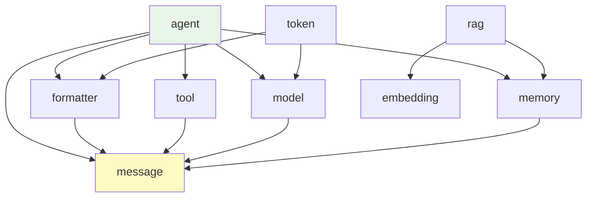

# 第 13 章 模块系统

> **卷二：拆开每个齿轮**。不再追踪调用链，而是拆开看设计模式。
> 本章你将理解：AgentScope 的包结构、`__init__.py` 导出策略、lazy loading。

---

## 13.1 从追踪到拆解

卷一我们跟随一条消息走完了全程。现在换个视角——站远一点，看整个项目的组织方式。

为什么先看模块系统？因为模块结构决定了你能在哪里找到东西。理解了模块系统，你就能快速定位任何功能的源码位置。

> **源码验证日期**: 2026-05-11, commit `f17cfd0a`

---

## 13.2 包结构总览

```
src/agentscope/
├── __init__.py          ← 顶层入口：init(), 配置, 子模块导入
├── _run_config.py       ← _ConfigCls: 全局配置
├── _logging.py          ← 日志系统
├── _version.py          ← 版本号
│
├── message/             ← 消息：Msg, ContentBlock
├── agent/               ← Agent：AgentBase, ReActAgent
├── model/               ← 模型：ChatModelBase, OpenAIChatModel
├── formatter/           ← 格式化：FormatterBase, OpenAIChatFormatter
├── tool/                ← 工具：Toolkit
├── memory/              ← 记忆：MemoryBase, InMemoryMemory
├── embedding/           ← 向量化：Embedding 模型
├── token/               ← Token 计数
├── rag/                 ← RAG：知识库检索
├── pipeline/            ← 流水线：MsgHub
├── session/             ← 会话管理
├── tracing/             ← OpenTelemetry 追踪
├── a2a/                 ← Agent-to-Agent 协议
├── realtime/            ← 实时语音
├── mcp/                 ← Model Context Protocol
├── evaluate/            ← 评估
├── plan/                ← 规划子系统
├── tts/                 ← 语音合成
├── types/               ← 公共类型定义
├── hooks/               ← Studio Hook
├── exception/           ← 异常定义
└── _utils/              ← 内部工具函数
```

### 设计一瞥：下划线前缀约定

内部模块用 `_` 前缀（如 `_run_config.py`、`_utils/`），表示"不要直接导入这些"。公开 API 通过 `__init__.py` 导出。

这不是 Python 的强制规则（不像 Java 的 private），但是一个清晰的约定：看到 `_` 开头的文件，意味着它是内部实现细节，可能随时变化。

---

## 13.3 `__init__.py` 的导出策略

### 顶层 `__init__.py`

```python
# src/agentscope/__init__.py

from ._run_config import _ConfigCls

# 子模块导入
from . import exception
from . import module
from . import message
from . import model
from . import tool
...

__all__ = [
    "exception", "module", "message", "model", "tool",
    "formatter", "memory", "agent", "session", "logger",
    ...
]
```

这让你可以：

```python
from agentscope.agent import ReActAgent   # 通过子模块导入
from agentscope.model import OpenAIChatModel
from agentscope.message import Msg
```

### 子模块 `__init__.py`

以 `model/` 为例：

```python
# src/agentscope/model/__init__.py

from ._model_base import ChatModelBase
from ._model_response import ChatResponse
from ._openai_model import OpenAIChatModel
from ._anthropic_model import AnthropicChatModel
from ._gemini_model import GeminiChatModel
from ._dashscope_model import DashScopeChatModel
from ._ollama_model import OllamaChatModel

__all__ = [
    "ChatModelBase", "ChatResponse",
    "OpenAIChatModel", "AnthropicChatModel", ...
]
```

注意几个要点：

1. **导入的是内部文件（`_` 前缀），但导出的是公开名字（无前缀）**。`_openai_model.py` 是内部实现，`OpenAIChatModel` 是公开 API
2. **`__all__` 列表明确指定导出范围**。用 `from agentscope.model import *` 只会导入 `__all__` 中的名字
3. **所有提供商的模型类都在这里汇聚**。使用者不需要知道文件在哪里，只需要知道类名

### 设计一瞥：为什么不用 lazy loading？

Python 的 lazy loading（延迟导入）可以加快启动速度——只在真正用到时才导入模块。AgentScope 没有使用这个技术，而是在 `__init__.py` 中直接导入所有子模块。

原因：AgentScope 的模块之间有依赖关系（比如 Agent 依赖 Model、Memory、Tool），lazy loading 会增加复杂性，而框架本身的启动时间不是瓶颈。

---

## 13.4 模块依赖关系

核心模块之间的依赖：



`message` 是最底层的模块——几乎所有模块都依赖它。`agent` 是最上层的模块——它依赖几乎所有其他模块。

这个依赖方向是合理的：消息是最基础的数据结构，Agent 是最复杂的组合体。

---

## 13.5 试一试

### 画一张你自己的依赖图

```python
import importlib
import agentscope

# 查看所有子模块
for name in dir(agentscope):
    obj = getattr(agentscope, name)
    if hasattr(obj, '__file__') and obj.__file__:
        print(f"模块: {name}, 文件: {obj.__file__}")
```

### 查看 `__all__` 导出

```python
import agentscope.model
print("model 导出:", agentscope.model.__all__)

import agentscope.agent
print("agent 导出:", agentscope.agent.__all__)
```

---

## 13.6 检查点

你现在已经理解了：

- **包结构**：15 个子模块，各有明确职责
- **`_` 前缀约定**：内部文件用 `_`，公开 API 通过 `__init__.py` 导出
- **导出策略**：子模块 `__init__.py` 把内部实现汇聚为公开 API
- **依赖方向**：message 是最底层，agent 是最上层

---

## 下一章预告

模块系统搭好了架子。下一章，看继承体系——基类和子类怎么分层。
