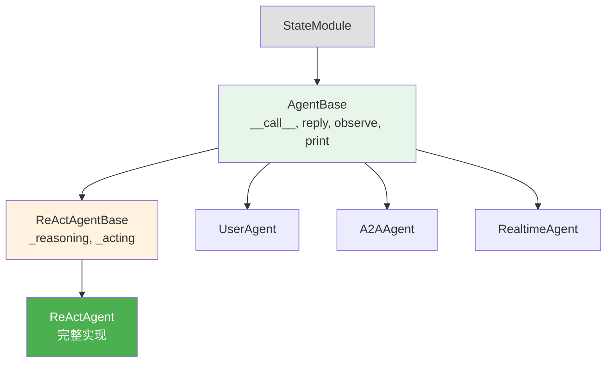

# 第 14 章 继承体系

> 本章你将理解：AgentScope 的基类/子类层次、为什么用多层基类、抽象方法的职责划分。

---

## 14.1 为什么需要继承体系？

AgentScope 支持多种模型提供商（OpenAI、Anthropic、Gemini 等）、多种记忆后端（内存、Redis、数据库）、多种 Agent 类型。如果每种组合都从头写，代码会大量重复。

继承体系解决的问题是：**把通用逻辑放在基类，把特定实现留给子类**。

> **源码验证日期**: 2026-05-11, commit `f17cfd0a`

---

## 14.2 四大核心继承树

### Agent 继承树



| 类 | 职责 |
|----|------|
| `StateModule` | 状态管理基类（序列化/反序列化） |
| `AgentBase` | Agent 核心接口：`__call__`, `reply`, `observe`, `print`, Hook |
| `ReActAgentBase` | ReAct 模式的抽象：`_reasoning`, `_acting` |
| `ReActAgent` | 完整的 ReAct 实现：循环逻辑、工具执行、记忆管理 |

### Model 继承树

```
ChatModelBase (抽象)
├── OpenAIChatModel
├── AnthropicChatModel
├── GeminiChatModel
├── DashScopeChatModel
└── OllamaChatModel
```

`ChatModelBase` 定义了统一的 `__call__()` 接口，各提供商实现自己的 API 调用和响应解析。

### Formatter 继承树

```
FormatterBase (抽象)
└── TruncatedFormatterBase (截断逻辑)
    ├── OpenAIChatFormatter
    └── OpenAIMultiAgentFormatter
```

三层继承：接口 → 截断逻辑 → 具体格式。

### Memory 继承树

```
MemoryBase (抽象)
├── InMemoryMemory (内存实现)
└── [其他实现: Redis, SQLAlchemy 等]
```

---

## 14.3 抽象方法的职责划分

### AgentBase 的抽象方法

```python
class AgentBase(StateModule, metaclass=_AgentMeta):
    async def reply(self, *args, **kwargs) -> Msg:
        raise NotImplementedError(...)

    async def observe(self, msg) -> None:
        raise NotImplementedError(...)
```

`AgentBase` 实现了 `__call__`（入口逻辑、广播、中断处理），但把 `reply` 和 `observe` 留给子类。这意味着：

- 任何 Agent 都有统一的入口行为（`__call__`）
- 具体的回复逻辑由子类决定

### ReActAgentBase 的抽象方法

```python
class ReActAgentBase(AgentBase):
    async def _reasoning(self, *args) -> Any:
        raise NotImplementedError(...)

    async def _acting(self, *args) -> Any:
        raise NotImplementedError(...)
```

`ReActAgentBase` 在 `AgentBase` 之上增加了推理-行动的抽象，但具体的推理和行动逻辑留给 `ReActAgent`。

### 设计一瞥：三层继承的好处

```
AgentBase       → 通用入口逻辑（所有 Agent 共享）
ReActAgentBase  → ReAct 模式的抽象（所有 ReAct Agent 共享）
ReActAgent      → 完整实现（可以直接使用）
```

如果你想创建自己的 Agent：
- 只需要覆盖 `reply()` → 继承 `AgentBase`
- 需要推理-行动分离 → 继承 `ReActAgentBase`
- 只需要微调 → 继承 `ReActAgent`

---

## 14.4 StateModule：序列化基类

所有核心组件都继承自 `StateModule`：

```python
class StateModule:
    def state_dict(self) -> dict:
        """获取模块状态"""

    def load_state_dict(self, state: dict) -> None:
        """加载模块状态"""
```

`StateModule` 提供了状态的保存和恢复能力。这在以下场景有用：

- 保存 Agent 的运行状态到磁盘
- 跨进程传递 Agent 状态
- 检查点和恢复

---

## 14.5 试一试

### 查看继承链

```python
from agentscope.agent import ReActAgent

# 打印继承链
for cls in ReActAgent.__mro__:
    print(f"  {cls.__name__}")
```

输出：

```
ReActAgent → ReActAgentBase → AgentBase → StateModule → object
```

### 创建自定义 Agent

```python
from agentscope.agent import AgentBase
from agentscope.message import Msg

class MyAgent(AgentBase):
    async def reply(self, msg=None):
        # 最简单的 Agent：原样返回
        return Msg(self.name, f"你说: {msg.content}", "assistant")

    async def observe(self, msg):
        pass

agent = MyAgent(name="echo")
result = await agent(Msg("user", "你好", "user"))
print(result.content)  # "你说: 你好"
```

---

## 14.6 检查点

你现在已经理解了：

- **四大继承树**：Agent / Model / Formatter / Memory
- **三层 Agent 继承**：AgentBase → ReActAgentBase → ReActAgent
- **抽象方法职责划分**：基类实现通用逻辑，子类实现特定逻辑
- **StateModule**：序列化基类，提供状态保存/恢复

**自检练习**：
1. 如果你要创建一个不用 ReAct 模式的 Agent，应该继承哪个类？（提示：`AgentBase`）
2. 为什么 `ReActAgentBase` 要单独存在，而不是把 `_reasoning` 和 `_acting` 直接放在 `ReActAgent` 里？

---

## 下一章预告

继承体系搭好了骨架。下一章，看元类是怎么自动给方法加 Hook 的。
