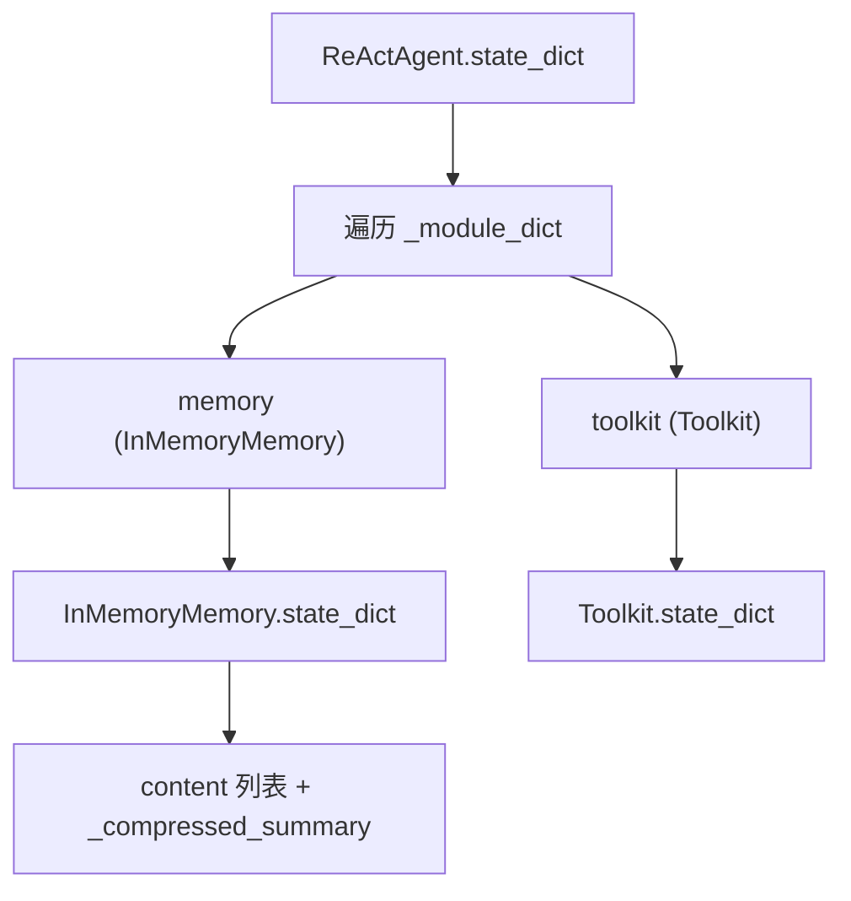

# 第 14 章：继承体系——从 StateModule 到 AgentBase

> **难度**：中等
>
> 你收到一个 bug：Agent 序列化后恢复，但记忆丢失了。要修这个 bug，你需要理解 Agent 的四层继承链——每一层都做了什么。

## 知识补全：继承与多态

**继承**是面向对象编程中"代码复用"的方式。子类继承父类，自动获得父类的所有方法，还可以覆盖（override）或扩展。

```python
class Animal:
    def speak(self):
        return "..."

class Dog(Animal):
    def speak(self):       # 覆盖父类方法
        return "汪汪"
```

**多态**是指：同一个方法调用，不同子类有不同行为。`animal.speak()` 对于 `Dog` 返回"汪汪"，对于 `Cat` 返回"喵喵"。

---

## 四层继承链

```
StateModule                    # 序列化能力
  └── AgentBase                # Agent 基础（Hook、广播、打印）
        └── ReActAgentBase     # ReAct 推理框架
              └── ReActAgent   # 具体的 ReAct 实现
```

每一层增加不同的能力。我们自底向上看。

---

## 第一层：StateModule

打开 `src/agentscope/module/_state_module.py`：

```python
# _state_module.py:20
class StateModule:
```

这一层提供**序列化**能力——把对象的状态保存成字典，之后可以从字典恢复。

### 核心机制

`StateModule` 维护两个有序字典：

```python
# _state_module.py:24-25
self._module_dict = OrderedDict()       # 子模块（StateModule 类型）
self._attribute_dict = OrderedDict()    # 注册的属性
```

**`__setattr__` 拦截**（第 29 行）：

```python
def __setattr__(self, key, value):
    if isinstance(value, StateModule):
        self._module_dict[key] = value   # 自动追踪子模块
    super().__setattr__(key, value)
```

当你写 `self.memory = InMemoryMemory()` 时，`__setattr__` 会自动把 `memory` 加入 `_module_dict`，因为 `InMemoryMemory` 也是 `StateModule` 的子类。

**`state_dict()`**（第 49 行）：递归收集所有子模块和注册属性的状态。

**`load_state_dict()`**（第 74 行）：从字典恢复状态。

**`register_state()`**（第 108 行）：手动注册需要追踪的属性。

### 序列化示例

```python
agent = ReActAgent(name="assistant", ...)
state = agent.state_dict()        # 保存整个 Agent 状态
# state = {"memory": {...}, "toolkit": {...}, ...}

agent2 = ReActAgent(name="assistant", ...)
agent2.load_state_dict(state)     # 恢复状态
```

---

## 第二层：AgentBase

打开 `src/agentscope/agent/_agent_base.py`：

```python
# _agent_base.py:30
class AgentBase(StateModule, metaclass=_AgentMeta):
```

这一层增加了：

1. **身份信息**：`id`、`name`
2. **Hook 系统**：`supported_hook_types`、类级别和实例级别的 hook 字典
3. **核心方法**：`__call__`（第 448 行）、`reply`（第 197 行）、`observe`（第 185 行）
4. **广播机制**：`_subscribers`（第 168 行）、`_broadcast_to_subscribers`（第 469 行）
5. **打印系统**：`print` 方法

### Hook 字典

```python
# _agent_base.py:43
supported_hook_types = [
    "pre_reply", "post_reply",
    "pre_print", "post_print",
    "pre_observe", "post_observe",
]
```

每个方法可以被 Hook 拦截。我们下一章（ch15）会详细讲 Hook 的元类实现。

### __call__ 的调用链

```python
# _agent_base.py:448
async def __call__(self, msg=None, **kwargs) -> Msg:
    # 1. 广播给订阅者
    await self._broadcast_to_subscribers(msg)

    # 2. 调用 reply（被 Hook 包装过）
    return await self.reply(msg, **kwargs)
```

注意 `reply` 已经被元类包装了——调用 `self.reply()` 实际上先执行 pre-reply hooks，再执行真正的 `reply`，最后执行 post-reply hooks。

---

## 第三层：ReActAgentBase

打开 `src/agentscope/agent/_react_agent_base.py`：

```python
# _react_agent_base.py:12
class ReActAgentBase(AgentBase, metaclass=_ReActAgentMeta):
```

这一层增加了 **ReAct 推理框架的骨架**：

- `_reasoning` 的抽象定义
- `_acting` 的抽象定义
- `_summarizing` 的抽象定义
- `finish_function_name` 的默认值

它定义了 ReAct 模式的"结构"，但不提供具体实现。

### 元类 `_ReActAgentMeta`

`ReActAgentBase` 使用了不同于 `AgentBase` 的元类 `_ReActAgentMeta`，增加了 `pre_acting` 和 `post_acting` 等 Hook 类型。

---

## 第四层：ReActAgent

```python
# _react_agent.py:98
class ReActAgent(ReActAgentBase):
```

这是最终的用户可见类。它提供了：

- `reply` 的完整实现（第 376 行）
- `_reasoning` 的实现（第 540 行）
- `_acting` 的实现（第 657 行）
- `_summarizing` 的实现（第 725 行）
- 构造函数中的所有参数组装

---

## 继承链中的"记忆丢失"Bug

回到开头的场景：Agent 序列化后恢复，记忆丢失。

**原因**：如果 `InMemoryMemory` 没有正确继承 `StateModule`，或者 `memory` 没有被 `_module_dict` 追踪，`state_dict()` 就不会包含记忆。

`StateModule.__setattr__` 会自动追踪 `StateModule` 类型的属性。所以只要 `InMemoryMemory` 继承了 `MemoryBase`（它继承自 `StateModule`），记忆就会被自动追踪。

**排查方法**：

```python
agent = ReActAgent(name="test", ...)
state = agent.state_dict()
print("memory" in state)          # 应该是 True
print(state["memory"]["content"])  # 应该有消息
```

如果 `"memory"` 不在 `state` 中，检查 `InMemoryMemory` 的继承链。



> **设计一瞥**：为什么用四层继承而不是一层？
> 每一层都有独立的职责。`StateModule` 被超过 10 个类复用（Agent、Memory、Toolkit、Formatter……）。`AgentBase` 被所有 Agent 类型复用。`ReActAgentBase` 被所有 ReAct 类型的 Agent 复用。
> 如果把所有功能放在一个类里，改序列化逻辑会影响 Agent，改 ReAct 逻辑会影响序列化——耦合度太高。
> 详见卷四第 31 章（上帝类问题）和第 36 章（架构全景）。

---

## 试一试：观察序列化的层级

AgentScope 官方文档的 Building Blocks > Agent - State & Session Management 页面展示了 `state_dict()` / `load_state_dict()` 的使用方法和代码示例——可以保存和恢复 Agent 的完整状态。本章解释了 `StateModule.__setattr__` 如何自动追踪子模块——这是官方文档没有展开的实现细节。

AgentScope 源码带读系列视频对 `StateModule` 的序列化机制讲解覆盖了以下要点：
- `__setattr__` 如何在属性赋值时自动检测 `StateModule` 子类并注册到 `_module_dict`
- `state_dict()` 如何递归收集所有子模块的状态
- `load_state_dict()` 如何按层级恢复子模块状态
- 序列化在 Agent 会话恢复和分布式部署中的应用

**目标**：看到 `state_dict()` 如何递归收集子模块状态。

**步骤**：

1. 在 `src/agentscope/module/_state_module.py` 的 `state_dict` 方法（第 49 行）中加一行：

```python
def state_dict(self) -> dict:
    print(f"[DEBUG] {self.__class__.__name__}.state_dict() 被调用")
    state = {}
    for key in self._module_dict:
        attr = getattr(self, key, None)
        if isinstance(attr, StateModule):
            state[key] = attr.state_dict()   # 递归！
    ...
```

2. 创建测试脚本：

```python
import asyncio
from agentscope.agent import ReActAgent
from agentscope.memory import InMemoryMemory

async def main():
    memory = InMemoryMemory()
    agent = ReActAgent(
        name="test",
        sys_prompt="test",
        model_config={"model_name": "test", "stream": False},
        memory=memory,
    )
    state = agent.state_dict()
    print(f"顶层键: {list(state.keys())}")

asyncio.run(main())
```

3. 观察输出：看到哪些类的 `state_dict()` 被递归调用了。

**改完后恢复：**

```bash
git checkout src/agentscope/module/_state_module.py
```

---

## 检查点

你现在理解了：

- **四层继承链**：`StateModule` → `AgentBase` → `ReActAgentBase` → `ReActAgent`
- 每一层的职责：序列化 → Agent 基础 → ReAct 框架 → 具体实现
- `StateModule.__setattr__` 自动追踪子模块，使 `state_dict()` 递归工作
- 序列化 bug 的排查思路：检查 `_module_dict` 是否包含预期的子模块

**自检练习**：

1. `InMemoryMemory` 继承自什么类？它会被自动追踪吗？
2. 如果你给 Agent 添加了一个非 `StateModule` 类型的属性（比如一个普通字典），它会被 `state_dict()` 收集吗？（提示：看 `register_state`）

---

## 下一章预告

我们提到了 `AgentBase` 使用 `metaclass=_AgentMeta`。元类是什么？它如何实现 Hook 系统？下一章我们深入 Hook 的实现。
