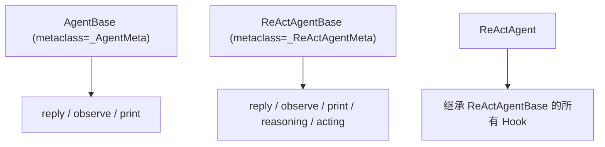

# 第 15 章：元类与 Hook——方法调用的拦截

> **难度**：进阶
>
> 你想在 Agent 每次 reply 前后自动执行一些逻辑（比如日志记录、参数校验），但不想修改 Agent 的源码。Hook 系统就是为这个设计的——它是怎么实现的？

## 知识补全：元类（Metaclass）

在 Python 中，**类也是对象**。元类是"创建类的类"。

```python
class MyClass:        # 普通类，创建实例
    pass

obj = MyClass()       # obj 是 MyClass 的实例
# MyClass 是 type 的实例！
```

当你写 `class MyClass:` 时，Python 实际上调用 `type.__new__()` 来创建这个类。元类允许你**拦截类的创建过程**，在类被创建之前修改它的属性和方法。

```python
class MyMeta(type):
    def __new__(mcs, name, bases, attrs):
        # 在类被创建前，修改 attrs（方法字典）
        attrs['extra_method'] = lambda self: "added by metaclass"
        return super().__new__(mcs, name, bases, attrs)

class MyClass(metaclass=MyMeta):
    pass

obj = MyClass()
obj.extra_method()  # "added by metaclass"
```

AgentScope 用这个机制在**类定义时**就自动给 `reply`、`observe`、`print` 方法包上 Hook 逻辑。

---

## _AgentMeta：元类的实现

打开 `src/agentscope/agent/_agent_meta.py`，找到第 159 行：

```python
# _agent_meta.py:159
class _AgentMeta(type):
    def __new__(mcs, name, bases, attrs):
        for func_name in ["reply", "print", "observe"]:
            if func_name in attrs:
                attrs[func_name] = _wrap_with_hooks(attrs[func_name])
        return super().__new__(mcs, name, bases, attrs)
```

只有 8 行代码。它做的事情：

1. 遍历 `["reply", "print", "observe"]` 三个方法名
2. 如果类定义了这个方法（`func_name in attrs`），用 `_wrap_with_hooks` 包装它
3. 用包装后的函数替换原来的方法

**关键点**：这个包装发生在**类被创建时**，不是在实例方法被调用时。所有 `AgentBase` 的子类自动获得 Hook 能力。

---

## _wrap_with_hooks：Hook 的执行逻辑

`_wrap_with_hooks`（第 55 行）是一个装饰器工厂。它返回的 `async_wrapper` 做这些事：

```python
async def async_wrapper(self, *args, **kwargs):
    # 1. 防重入保护（避免继承链中重复执行 Hook）
    if getattr(self, hook_guard_attr, False):
        return await original_func(self, *args, **kwargs)

    # 2. 归一化参数（把位置参数转成关键字参数）
    normalized_kwargs = _normalize_to_kwargs(original_func, self, *args, **kwargs)

    # 3. 执行 pre-hooks（先实例级，后类级别）
    pre_hooks = list(self._instance_pre_reply_hooks.values()) + \
                list(self.__class__._class_pre_reply_hooks.values())
    for pre_hook in pre_hooks:
        modified = await pre_hook(self, deepcopy(normalized_kwargs))
        if modified is not None:
            normalized_kwargs = modified

    # 4. 执行原始函数
    setattr(self, hook_guard_attr, True)
    try:
        output = await original_func(self, **normalized_kwargs)
    finally:
        setattr(self, hook_guard_attr, False)

    # 5. 执行 post-hooks
    post_hooks = list(self._instance_post_reply_hooks.values()) + \
                 list(self.__class__._class_post_reply_hooks.values())
    for post_hook in post_hooks:
        modified = await post_hook(self, deepcopy(normalized_kwargs), deepcopy(output))
        if modified is not None:
            output = modified

    return output
```

### 防重入保护

`hook_guard_attr`（如 `_hook_running_reply`）是一个标志位。当继承链中多个类都定义了 `reply` 时，每个都被 `_AgentMeta` 包装了，但 Hook 只执行一次——最外层设置标志，内层检测到标志就跳过。

### 执行顺序

```
pre_hook(实例级) → pre_hook(类级别) → 原始函数 → post_hook(实例级) → post_hook(类级别)
```

---

## _ReActAgentMeta：扩展 Hook 类型

`ReActAgentBase` 使用了 `_ReActAgentMeta` 元类（在 `_react_agent_base.py` 中），它扩展了 Hook 类型：

```python
# _react_agent_base.py:28-31
"pre_reasoning", "post_reasoning",
"pre_acting",   "post_acting",
```

所以 ReAct Agent 支持 6 个 Hook 点：reply、observe、print、reasoning、acting。



---

## Hook 的注册

Hook 分两种级别：

**类级别**：所有实例共享。在类上直接注册：

```python
@AgentBase.register_class_post_reply_hook("log")
def log_hook(self, kwargs, output):
    print(f"Agent {self.name} replied")
    return output
```

**实例级别**：只影响单个实例。在实例上注册：

```python
agent.register_instance_pre_reply_hook("validate", my_validator)
```

> **官方文档对照**：本文对应 [Building Blocks > Hooking Functions](https://docs.agentscope.io/building-blocks/hooking-functions)。官方文档展示了 Hook 的注册方式和支持的 Hook 类型表格（reply/observe/print/reasoning/acting 的 pre/post），本章解释了这些 Hook 是如何通过元类在类定义时自动注入的。
>
> **推荐阅读**：[AgentScope 1.0 论文](https://arxiv.org/pdf/2508.16279) 第 2.2 节讨论了 Agent 的 Hook 机制设计。

---

## 试一试：注册一个日志 Hook

**目标**：用 Hook 记录 Agent 每次调用 `reply` 的参数。

**步骤**：

1. 打开任意使用 ReActAgent 的脚本，在创建 Agent 之后加：

```python
import time

def log_reply(self, kwargs, output):
    print(f"[HOOK] {self.name} replied at {time.strftime('%H:%M:%S')}")
    return output

agent.register_instance_post_reply_hook("log", log_reply)
```

2. 如果没有 API key，可以在 `src/agentscope/agent/_agent_meta.py` 的 `_wrap_with_hooks` 中加 print 观察 Hook 执行顺序：

```python
# 在 pre-hooks 循环前加
print(f"[DEBUG] 执行 pre-hooks for {func_name}, 共 {len(pre_hooks)} 个")
```

**改完后恢复：**

```bash
git checkout src/agentscope/agent/
```

---

## 检查点

你现在理解了：

- **元类** `_AgentMeta` 在类定义时自动包装 `reply`/`observe`/`print` 方法
- `_wrap_with_hooks` 实现 pre-hook → 原始函数 → post-hook 的执行链
- 防重入保护确保继承链中 Hook 只执行一次
- Hook 分实例级和类级别，执行顺序是实例级先于类级别
- `_ReActAgentMeta` 扩展了 reasoning 和 acting 的 Hook

**自检练习**：

1. 如果你在 `AgentBase` 的子类中定义了 `reply` 方法但没有使用 `_AgentMeta` 元类，Hook 还会生效吗？
2. `_normalize_to_kwargs` 的作用是什么？为什么 pre-hook 接收的是 `kwargs` 字典而不是原始参数？

---

## 下一章预告

Hook 是在特定方法前后插入逻辑。还有一种更通用的模式——**策略模式**：同一个接口，根据不同的情况选择不同的实现。下一章我们看 Formatter 如何使用策略模式适配不同的模型 API。
