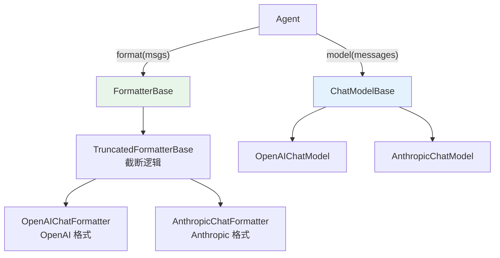

# 第 16 章 格式化策略

> 本章你将理解：Formatter 的策略模式设计、为什么 Formatter 独立于 Model、如何添加新的格式化策略。

---

## 16.1 策略模式是什么？

策略模式（Strategy Pattern）的核心思想：**定义一族算法，把它们封装成独立的类，让它们可以互相替换**。

在 AgentScope 中，不同的模型 API 需要不同的消息格式。Formatter 用策略模式解决这个问题：

```python
# 同样的消息，不同的格式化策略
formatter = OpenAIChatFormatter()   # → OpenAI API 格式
formatter = AnthropicFormatter()    # → Anthropic API 格式
formatter = GeminiFormatter()       # → Gemini API 格式
```

Agent 不需要知道底层 API 格式的差异——只需要调用 `formatter.format(msgs)`。

> **源码验证日期**: 2026-05-11, commit `f17cfd0a`

---

## 16.2 源码入口

| 文件 | 内容 |
|------|------|
| `src/agentscope/formatter/_formatter_base.py` | `FormatterBase` |
| `src/agentscope/formatter/_truncated_formatter_base.py` | `TruncatedFormatterBase` |
| `src/agentscope/formatter/_openai_formatter.py` | `OpenAIChatFormatter` |

---

## 16.3 逐行阅读

### FormatterBase：策略接口

```python
class FormatterBase:
    @abstractmethod
    async def format(self, *args, **kwargs) -> list[dict[str, Any]]:
        """Format the Msg objects to API format."""
```

一个方法定义了整个策略接口。

### TruncatedFormatterBase：通用策略

截断逻辑是所有格式化策略都需要的——不管 OpenAI 还是 Anthropic，消息太长都要截断。所以截断逻辑放在中间层：

```python
class TruncatedFormatterBase(FormatterBase, ABC):
    async def format(self, msgs: list[Msg]) -> list[dict]:
        while True:
            formatted = await self._format(msgs)
            tokens = await self._count(formatted)
            if tokens <= self.max_tokens:
                return formatted
            msgs = await self._truncate(msgs)

    @abstractmethod
    async def _format(self, msgs) -> list[dict]:
        """子类实现具体的格式化"""
```

这里用了**模板方法模式**（Template Method）：`format()` 定义了算法骨架（格式化 → 计数 → 截断），`_format()` 是子类要实现的具体步骤。

### OpenAIChatFormatter：具体策略

```python
class OpenAIChatFormatter(TruncatedFormatterBase):
    async def _format_tool_sequence(self, msgs) -> list[dict]:
        # OpenAI 的 tool_calls 格式
        ...

    async def _format_agent_message(self, msgs, is_first) -> list[dict]:
        # OpenAI 的 assistant/user 格式
        ...
```

### 策略如何组合



Agent 持有 Formatter 和 Model 两个独立对象。Formatter 把消息转为 API 格式，Model 发送请求。两者独立变化。

### 设计一瞥：为什么 Formatter 和 Model 分离？

如果把格式化写在 Model 里：

```python
class OpenAIChatModel:
    async def __call__(self, msgs):
        formatted = self._format_openai(msgs)  # 格式化写在 Model 里
        return await self._call_api(formatted)
```

问题：
1. **不能复用**：多个 Model 可能共享同一种格式（如 OpenAI 兼容 API）
2. **不能独立测试**：格式化逻辑和 API 调用混在一起
3. **不能独立配置**：想换截断策略需要改 Model

分离后：Formatter 可以独立配置（截断策略、Token 限制），Model 只负责 API 调用。

---

## 16.4 消息分组：tool_sequence vs agent_message

Formatter 的一个核心设计是消息分组。为什么需要分组？

因为 API 对工具调用的格式要求严格。OpenAI 要求：

```json
[
    {"role": "assistant", "tool_calls": [...]},   // 工具调用
    {"role": "tool", "tool_call_id": "..."}       // 工具结果
]
```

工具调用和结果必须相邻。但多 Agent 场景下，消息可能交错：

```
Agent A 说: "让我查一下"
Agent B 说: "我也帮你查"
Agent A 调用工具
Agent B 调用工具
Agent A 获得结果
Agent B 获得结果
```

`_group_messages()` 把交错的消息按类型重新分组，保证格式正确。

---

## 16.5 试一试

### 创建自定义 Formatter

```python
from agentscope.formatter import FormatterBase
from agentscope.message import Msg

class SimpleFormatter(FormatterBase):
    """最简单的格式化：把 Msg 转为 dict"""
    async def format(self, msgs, **kwargs):
        result = []
        for msg in msgs:
            result.append({"role": msg.role, "content": msg.content if isinstance(msg.content, str) else str(msg.content)})
        return result

formatter = SimpleFormatter()
formatted = await formatter.format([
    Msg("system", "你是助手", "system"),
    Msg("user", "你好", "user"),
])
print(formatted)
```

---

## 16.6 检查点

你现在已经理解了：

- **策略模式**：Formatter 定义接口，子类实现不同 API 格式
- **模板方法**：`TruncatedFormatterBase.format()` 定义截断流程骨架
- **Formatter 和 Model 分离**：格式化和 API 调用独立变化
- **消息分组**：`_group_messages()` 按类型分组，满足 API 格式要求

**自检练习**：
1. 如果要支持一个新的 API 格式，需要做什么？（提示：继承 `TruncatedFormatterBase`，实现 `_format_*` 方法）
2. 截断逻辑为什么放在中间层而不是子类？（提示：所有格式化策略都需要截断）

---

## 下一章预告

Formatter 用策略模式处理格式差异。下一章看 Schema 工厂——配置驱动的对象创建。
