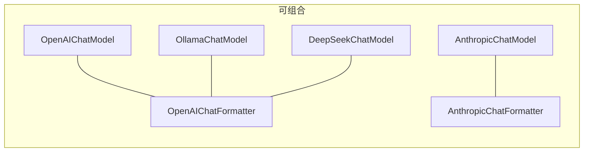

# 第 16 章：策略模式——Formatter 的多态分发

> **难度**：中等
>
> 你把 Formatter 从 `OpenAIChatFormatter` 换成 `AnthropicChatFormatter`，Agent 的行为完全不变——只是发送给 API 的 JSON 格式变了。这是怎么做到的？

## 知识补全：策略模式

**策略模式（Strategy Pattern）** 的核心思想：定义一个统一接口，不同的实现提供不同的策略，使用者在运行时选择策略。

```
              ┌──────────────┐
              │ FormatterBase │  ← 统一接口
              │  format()    │
              └──────┬───────┘
                     │
        ┌────────────┼────────────┐
        ▼            ▼            ▼
  OpenAI格式    Anthropic格式   Gemini格式
```

调用者只依赖 `FormatterBase`，不关心具体是哪种格式。

> **官方文档对照**：本文对应 [Building Blocks > Models](https://docs.agentscope.io/building-blocks/models)。官方文档展示了不同模型的使用方法，本章解释了为什么 Formatter 和 Model 是分开的——同一个 Model 可以搭配不同的 Formatter。

---

## 策略在 AgentScope 中的体现

Formatter 是最典型的策略模式：

| 类 | 策略（API 格式） |
|----|----------------|
| `OpenAIChatFormatter` | OpenAI Chat Completions API 格式 |
| `AnthropicChatFormatter` | Anthropic Messages API 格式 |
| `DashScopeChatFormatter` | 阿里云通义千问 API 格式 |
| `GeminiChatFormatter` | Google Gemini API 格式 |
| `OllamaChatFormatter` | Ollama 本地模型 API 格式 |

它们都继承自 `FormatterBase`（`_formatter_base.py:11`），实现了同一个 `format()` 方法。

### ReActAgent 如何使用 Formatter

```python
# _react_agent.py 中 _reasoning 方法
prompt = await self.formatter.format(msgs)  # 只调用接口，不关心具体格式
res = await self.model(prompt, tools=self.toolkit.get_json_schemas())
```

Agent 不写 `if isinstance(self.formatter, OpenAIChatFormatter)`——它只调用 `format()`，由具体子类决定输出格式。

### 另一个策略模式：Model

`ChatModelBase` 也是策略模式：

```python
# _model_base.py:13
class ChatModelBase:
    @abstractmethod
    async def __call__(self, messages, tools=None, ...) -> ChatResponse | AsyncGenerator:
```

不同的模型实现（OpenAI、Anthropic、DashScope……）提供不同的"调用策略"。

---

## 为什么要分离 Formatter 和 Model？

如果不用策略模式，每添加一个新模型 API，就要写一个新的 Model 类，里面包含格式转换逻辑。分离后：

- **添加新 API 格式**：只需写一个新的 Formatter
- **添加新模型提供者**：只需写一个新的 Model
- **组合自由**：Ollama 兼容 OpenAI API → `OllamaChatModel` + `OpenAIChatFormatter`



> **设计一瞥**：Formatter 和 Model 的分离是一种"正交分解"——把"格式转换"和"API 调用"作为两个独立的维度。每个维度独立变化，组合时不需要 1:1 绑定。
> 详见卷四第 35 章。

---

## TruncatedFormatterBase：模板方法模式

`TruncatedFormatterBase`（`_truncated_formatter_base.py:19`）使用了另一种设计模式——**模板方法**：

```python
class TruncatedFormatterBase(FormatterBase, ABC):
    async def format(self, msgs, **kwargs):
        while True:
            formatted = await self._format(msgs)     # 子类实现
            n_tokens = await self._count(formatted)
            if n_tokens <= self.max_tokens:
                return formatted
            msgs = self._truncate(msgs)               # 子类实现
```

`format()` 是**模板方法**——它定义了算法骨架（格式化 → 计数 → 截断），但把具体步骤留给子类。`_format()` 和 `_truncate()` 由 `OpenAIChatFormatter` 等具体类实现。

---

## 试一试：查看不同的格式化输出

**步骤**：

1. 搜索 Formatter 的所有实现：

```bash
grep -n "class.*Formatter.*TruncatedFormatterBase" src/agentscope/formatter/*.py
```

2. 对比 `OpenAIChatFormatter._format()` 和 `AnthropicChatFormatter._format()` 的不同——特别注意系统提示的处理方式（OpenAI 用 `{"role": "system"}` 消息，Anthropic 用单独的 `system` 参数）。

---

## 检查点

- **策略模式**：统一接口 + 多种实现，运行时选择
- Formatter 和 Model 的分离是正交分解，允许自由组合
- **模板方法**：`TruncatedFormatterBase.format()` 定义算法骨架，子类填充细节

---

## 下一章预告

Formatter 把 `Msg` 转成 API 需要的 JSON。但工具的 JSON Schema 是怎么从 Python 函数的 docstring 和类型标注自动生成的？下一章我们看工厂与 Schema。
