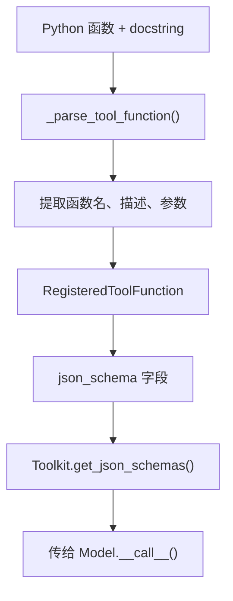

# 第 17 章：工厂与 Schema——从函数到 JSON Schema

> **难度**：中等
>
> 你写了一个 Python 函数 `get_weather(city: str)`，加了 docstring。AgentScope 怎么从这个函数自动生成 OpenAI 需要的 JSON Schema？这个过程涉及哪些文件？

## 知识补全：JSON Schema 与 Pydantic

**JSON Schema** 是一种描述 JSON 数据格式的规范。OpenAI 的工具调用 API 要求每个工具用 JSON Schema 描述参数：

```json
{
  "type": "function",
  "function": {
    "name": "get_weather",
    "description": "获取天气信息",
    "parameters": {
      "type": "object",
      "properties": {
        "city": {"type": "string", "description": "城市名称"}
      },
      "required": ["city"]
    }
  }
}
```

**Pydantic** 是 Python 的数据验证库。AgentScope 用 Pydantic 的 `BaseModel` 来动态扩展工具的 JSON Schema——在运行时给工具添加参数。

---

## Schema 生成的完整路径



### _parse_tool_function

打开 `src/agentscope/_utils/_common.py`：

```bash
grep -n "_parse_tool_function" src/agentscope/_utils/_common.py
```

这个函数做这些事：

1. **函数名**：从 `func.__name__` 获取（或用自定义 `func_name`）
2. **描述**：从 docstring 的第一行提取（或用自定义 `func_description`）
3. **参数**：从 `inspect.signature(func)` 获取参数列表和类型标注
4. **生成 Schema**：构造 `{"type": "function", "function": {"name": ..., "parameters": ...}}`

### register_tool_function 中的组装

回到 `_toolkit.py:274`：

```python
def register_tool_function(self, tool_func, ...):
    # 解析函数
    parsed = _parse_tool_function(tool_func, ...)

    # 创建 RegisteredToolFunction
    registered = RegisteredToolFunction(
        name=parsed.name,
        json_schema=parsed.schema,
        original_func=tool_func,
        ...
    )
    self.tools[parsed.name] = registered
```

---

## 动态 Schema 扩展

`RegisteredToolFunction` 有一个 `extended_model` 字段（`_types.py:45`）：

```python
extended_model: Type[BaseModel] | None = None
```

这允许运行时用 Pydantic 模型扩展工具的 JSON Schema。比如，结构化输出功能就在这里插入额外的参数。

`Toolkit.set_extended_model()` 方法把 Pydantic 模型合并到工具的 JSON Schema 中——这样模型在调用工具时必须按扩展后的格式返回数据。

> **官方文档对照**：本文对应 [Building Blocks > Tool Capabilities](https://docs.agentscope.io/building-blocks/tool-capabilities)。官方文档展示了"Extending JSON Schema Dynamically"的使用方法，本章解释了 `_parse_tool_function` 如何从 docstring 提取参数信息。
>
> **推荐阅读**：[MarkTechPost AgentScope 教程](https://www.marktechpost.com/2026/04/01/how-to-build-production-ready-agentscope-workflows/) Part 2 展示了自定义工具函数和自动 JSON Schema 生成的完整示例。

---

## 试一试：查看自动生成的 Schema

**步骤**：

1. 在 Python 中运行：

```python
from agentscope.tool import Toolkit, ToolResponse

def get_weather(city: str, unit: str = "celsius") -> ToolResponse:
    """获取天气信息。

    Args:
        city (str): 城市名称
        unit (str, optional): 温度单位，celsius 或 fahrenheit
    """
    return ToolResponse(content=[])

toolkit = Toolkit()
toolkit.register_tool_function(get_weather)

import json
for name, func in toolkit.tools.items():
    print(json.dumps(func.json_schema, ensure_ascii=False, indent=2))
```

2. 观察输出：`city` 是 required，`unit` 有默认值不是 required。docstring 中的描述被提取到了 schema 中。

---

## 检查点

- `_parse_tool_function()` 从函数签名和 docstring 自动生成 JSON Schema
- `RegisteredToolFunction` 存储工具的完整信息（名称、Schema、原始函数、分组）
- `extended_model` 允许用 Pydantic 模型动态扩展 Schema（用于结构化输出）

---

## 下一章预告

Schema 生成是静态的——定义时确定。但工具执行时可能需要插入额外逻辑（日志、权限检查、缓存）。下一章我们看**中间件的洋葱模型**。
