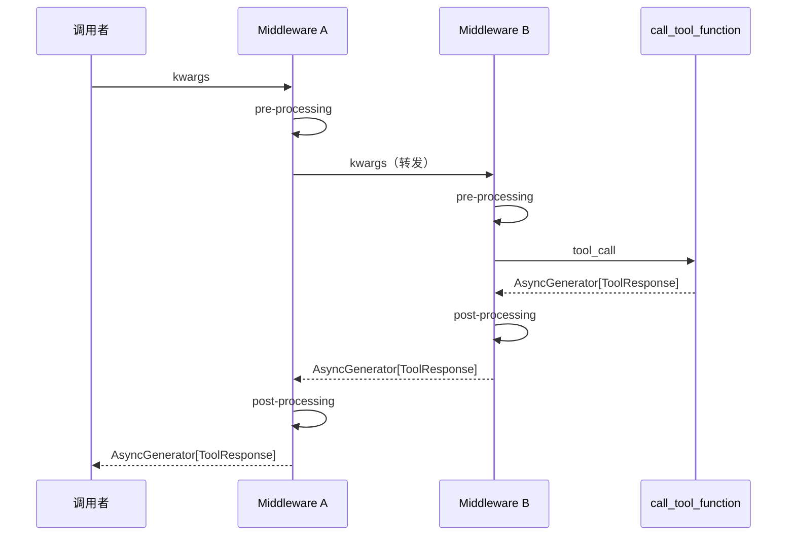

# 第 18 章：中间件与洋葱模型——工具执行的拦截链

> **难度**：中等
>
> 你想在每次工具调用前打印日志、调用后记录耗时，但不想修改工具函数本身。Toolkit 的中间件系统就是为这个设计的——它是怎么做到的？

## 知识补全：洋葱模型

**洋葱模型（Onion Model）** 是中间件的经典执行模式。每一层中间件像洋葱的一层皮，包裹住核心操作：

```
         请求 ──────────────────────▶
    ┌────────────────────────────┐
    │  Middleware A（外层）        │
    │  ┌────────────────────┐    │
    │  │  Middleware B（内层）│    │
    │  │  ┌────────────┐    │    │
    │  │  │  核心操作    │    │    │
    │  │  └────────────┘    │    │
    │  │       ▲            │    │
    │  └───────┼────────────┘    │
    │          ▲                 │
    └──────────┼─────────────────┘
               ▲
         ◀──── 响应 ──────────────
```

请求从外到内穿过每一层，响应从内到外返回。每一层可以在"进入"和"返回"时各执行一段逻辑。

这个模式在 Web 框架中很常见：Express.js 的 middleware、Django 的 middleware、Koa 的 onion model。

---

## Toolkit 的中间件实现

### 注册入口

打开 `src/agentscope/tool/_toolkit.py`：

```bash
grep -n "register_middleware" src/agentscope/tool/_toolkit.py
# 1441:    def register_middleware(
```

`register_middleware`（第 1441 行）非常简单：

```python
# _toolkit.py:1537-1539
def register_middleware(self, middleware):
    self._middlewares.append(middleware)
```

只是把中间件函数追加到列表。真正的组装发生在调用时。

### _apply_middlewares 装饰器

`_apply_middlewares`（第 57 行）是一个装饰器，作用在 `call_tool_function` 上：

```python
# _toolkit.py:851-853
@trace_toolkit
@_apply_middlewares
async def call_tool_function(self, tool_call: ToolUseBlock):
    ...
```

装饰器在每次调用时动态构建中间件链：

```python
# _toolkit.py:57-114
def _apply_middlewares(func):
    @wraps(func)
    async def wrapper(self, tool_call):
        middlewares = getattr(self, "_middlewares", [])

        if not middlewares:
            # 没有中间件，直接调用
            async for chunk in await func(self, tool_call):
                yield chunk
            return

        # 构建基础处理器
        async def base_handler(**kwargs):
            return await func(self, **kwargs)

        # 从内到外包装
        current_handler = base_handler
        for middleware in reversed(middlewares):
            def make_handler(mw, handler):
                async def wrapped(**kwargs):
                    return mw(kwargs, handler)
                return wrapped
            current_handler = make_handler(middleware, current_handler)

        # 执行中间件链
        async for chunk in await current_handler(tool_call=tool_call):
            yield chunk

    return wrapper
```

### 组装过程详解

假设注册了两个中间件 A 和 B（按注册顺序）：

```
_middlewares = [A, B]
```

`reversed` 后遍历顺序是 B → A，所以：

1. `current_handler = base_handler`（核心操作）
2. 包裹 B：`current_handler = B(kwargs, base_handler)`
3. 包裹 A：`current_handler = A(kwargs, B(kwargs, base_handler))`

执行时，调用链是：

```
A 进入 → B 进入 → 核心操作 → B 返回 → A 返回
```

这正好是洋葱模型——先注册的在最外层。



---

## 中间件的签名

中间件是一个 async generator 函数，接收两个参数：

```python
async def my_middleware(
    kwargs: dict,           # 包含 tool_call
    next_handler: Callable,  # 下一层处理器
) -> AsyncGenerator[ToolResponse, None]:
    # pre-processing
    print(f"Calling: {kwargs['tool_call']['name']}")

    # 调用下一层
    async for response in await next_handler(**kwargs):
        yield response      # 可以修改响应

    # post-processing
    print("Done")
```

关键点：
- `kwargs` 是字典，目前包含 `tool_call`
- `next_handler` 是下一个中间件（或核心操作）
- 通过 `async for` 消费下层返回的 `AsyncGenerator`
- 可以在 yield 前修改 `ToolResponse`
- 可以跳过 `next_handler`，直接 yield 自己的响应

> **设计一瞥**：为什么用 AsyncGenerator 而不是普通函数？因为 `call_tool_function` 支持**流式返回**——工具可以分多次返回 `ToolResponse`。中间件需要能拦截每一个 chunk。如果用普通函数，中间件只能看到最终结果，无法逐块处理。

---

## 三种中间件用法

### 1. 日志记录（观察者）

```python
import time

async def logging_middleware(kwargs, next_handler):
    tool_call = kwargs["tool_call"]
    start = time.time()
    print(f"[LOG] 调用工具: {tool_call['name']}")

    async for response in await next_handler(**kwargs):
        yield response

    elapsed = time.time() - start
    print(f"[LOG] 工具 {tool_call['name']} 完成，耗时 {elapsed:.2f}s")
```

不修改任何数据，只记录信息。

### 2. 权限检查（守卫）

```python
async def auth_middleware(kwargs, next_handler):
    tool_call = kwargs["tool_call"]

    if not is_allowed(tool_call["name"]):
        # 跳过工具执行，直接返回错误
        yield ToolResponse(
            content=[TextBlock(type="text", text="权限不足")]
        )
        return

    async for response in await next_handler(**kwargs):
        yield response
```

不调用 `next_handler`，直接返回——工具函数根本不会执行。

### 3. 缓存（拦截器）

```python
_cache = {}

async def cache_middleware(kwargs, next_handler):
    tool_call = kwargs["tool_call"]
    cache_key = f"{tool_call['name']}:{tool_call.get('input', '')}"

    if cache_key in _cache:
        yield _cache[cache_key]
        return

    result = None
    async for response in await next_handler(**kwargs):
        yield response
        result = response

    if result:
        _cache[cache_key] = result
```

命中缓存时跳过执行，未命中时正常执行并缓存结果。

> **官方文档对照**：本文对应 [Building Blocks > Tool Capabilities > Middleware](https://docs.agentscope.io/building-blocks/tool-capabilities)。官方文档展示了 `register_middleware` 的使用方法和中间件函数的签名，本章解释了 `_apply_middlewares` 如何在运行时动态构建洋葱链——这是官方文档没有展开的实现细节。
>
> **推荐阅读**：[MarkTechPost AgentScope 教程](https://www.marktechpost.com/2026/04/01/how-to-build-production-ready-agentscope-workflows/) Part 3 展示了日志中间件和缓存中间件的完整使用示例。

---

## 试一试：添加日志中间件

**目标**：观察洋葱模型的执行顺序。

**步骤**：

1. 创建测试脚本：

```python
import asyncio
from agentscope.tool import Toolkit, ToolResponse

toolkit = Toolkit()

@toolkit.register_tool_function
def add(a: int, b: int) -> ToolResponse:
    """加法运算"""
    return ToolResponse(content=[])

async def log_middleware(kwargs, next_handler):
    name = kwargs["tool_call"]["name"]
    print(f"  [A] 进入中间件 → {name}")
    async for resp in await next_handler(**kwargs):
        print(f"  [A] 收到响应")
        yield resp
    print(f"  [A] 退出中间件 ← {name}")

toolkit.register_middleware(log_middleware)
```

2. 如果没有 API key，可以直接在 `_toolkit.py:111` 处加 print 观察中间件链的构建：

```python
# 在 async for chunk in await current_handler(tool_call=tool_call) 之前
print(f"[DEBUG] 中间件链: {len(middlewares)} 层")
```

**改完后恢复：**

```bash
git checkout src/agentscope/tool/_toolkit.py
```

---

## 检查点

- **洋葱模型**：请求从外到内，响应从内到外，每层中间件可以 pre/post 处理
- `_apply_middlewares` 装饰器在每次调用时动态构建中间件链
- 注册顺序决定层级——先注册的在外层
- 中间件可以观察（日志）、守卫（权限）、拦截（缓存）
- 使用 AsyncGenerator 因为 `call_tool_function` 支持流式返回

**自检练习**：

1. 如果注册了三个中间件 A、B、C，它们的 pre-processing 执行顺序是什么？
2. 中间件不调用 `next_handler` 会发生什么？这个特性有什么用？

---

## 下一章预告

中间件是点对点的——一个工具调用穿过中间件链。但多个 Agent 之间怎么通信？Agent A 的输出怎么自动到达 Agent B？下一章我们看**发布-订阅模式**。
