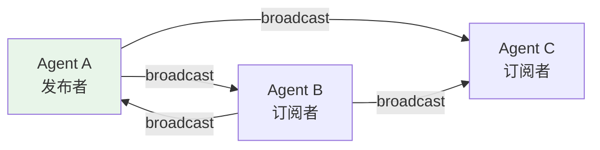

# 第 19 章 发布订阅

> 本章你将理解：Agent 之间的消息广播、订阅机制、`MsgHub` 发布-订阅模式。

---

## 19.1 发布-订阅模式

发布-订阅（Pub-Sub）模式让对象之间松耦合通信：发布者不直接调用订阅者，而是通过中间人传递消息。

> **源码验证日期**: 2026-05-11, commit `f17cfd0a`

---

## 19.2 Agent 间的广播机制

第 5 章我们看到了 `AgentBase._broadcast_to_subscribers()`：

```python
async def _broadcast_to_subscribers(self, msg):
    broadcast_msg = self._strip_thinking_blocks(msg)
    for subscribers in self._subscribers.values():
        for subscriber in subscribers:
            await subscriber.observe(broadcast_msg)
```

### 订阅关系

```python
# Agent B 订阅 Agent A
agent_a.subscribe(agent_b)

# Agent A 回复后，自动广播给 Agent B
# Agent B 的 observe() 被调用
```



### ThinkingBlock 的剥离

广播前自动剥离 `ThinkingBlock`——内部推理不应该暴露给其他 Agent。这就像你在会议上分享结论，但不需要分享思考过程。

---

## 19.3 MsgHub：多 Agent 通信

`MsgHub` 提供了更高级的发布-订阅机制，支持多 Agent 之间的复杂通信模式。

### 试一试

```python
from agentscope.agent import AgentBase
from agentscope.message import Msg

class EchoAgent(AgentBase):
    async def reply(self, msg=None):
        return Msg(self.name, f"收到: {msg.content}", "assistant")

    async def observe(self, msg):
        print(f"[{self.name}] 观察到: {msg.content}")

agent_a = EchoAgent(name="A")
agent_b = EchoAgent(name="B")

# B 订阅 A
agent_a.subscribe(agent_b)

# A 回复后，B 自动收到
result = await agent_a(Msg("user", "你好", "user"))
# 输出: [B] 观察到: 收到: 你好
```

---

## 19.4 检查点

你现在已经理解了：

- **发布-订阅模式**：Agent 通过 `subscribe()` 建立关系
- **广播机制**：`_broadcast_to_subscribers()` 在 `reply()` 完成后自动触发
- **ThinkingBlock 剥离**：保护内部推理不暴露
- **MsgHub**：多 Agent 通信的高级抽象

---

## 下一章预告
