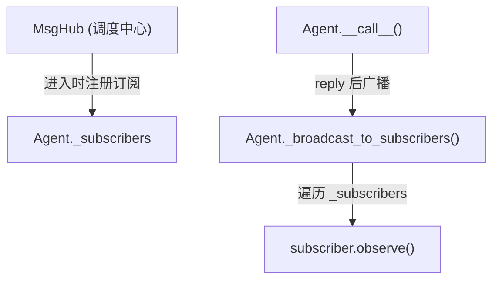
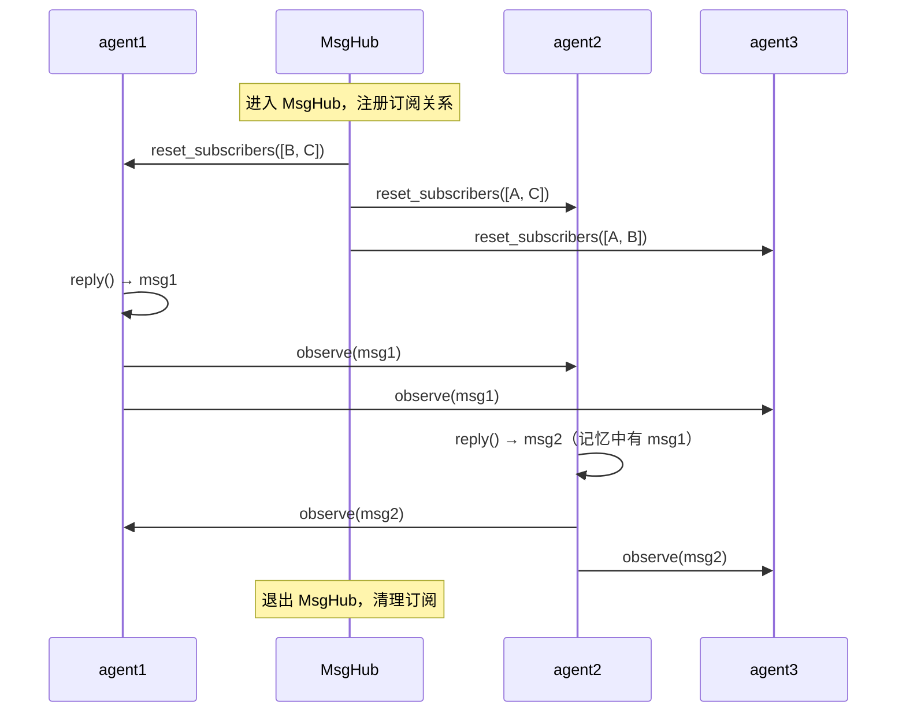

# 第 19 章：发布-订阅——多 Agent 通信的广播机制

> **难度**：中等
>
> 三个 Agent 在讨论中轮流发言，每个人说的话其他人都能看到。这不是轮询，而是自动广播——MsgHub 是怎么做到的？

## 知识补全：发布-订阅模式

**发布-订阅模式（Pub-Sub）** 的核心思想：发布者不直接发送消息给接收者，而是把消息广播出去，所有订阅者自动收到。

```
  发布者 (Agent A)
      │
      ▼ 发布消息
  ┌─────────┐
  │  MsgHub  │  ← 消息总线
  │ (调度中心)│
  └─────────┘
    │   │   │
    ▼   ▼   ▼
  订阅者  订阅者  订阅者
  (B)    (C)    (D)
```

关键优势：发布者不需要知道谁在监听。新增一个订阅者不需要修改发布者的代码。

---

## AgentScope 的实现：三层协作

发布-订阅在 AgentScope 中由三个部分协作完成：



### 第一层：AgentBase._subscribers

打开 `src/agentscope/agent/_agent_base.py`，第 168 行：

```python
# _agent_base.py:168
self._subscribers: dict[str, list[AgentBase]] = {}
```

字典的 key 是 MsgHub 的名称，value 是订阅者列表。一个 Agent 可以同时参与多个 MsgHub。

### 第二层：Agent.__call__() 中的广播

`__call__` 方法（第 448 行）在 reply 完成后自动广播：

```python
# _agent_base.py:448-467
async def __call__(self, *args, **kwargs) -> Msg:
    reply_msg = await self.reply(*args, **kwargs)
    try:
        ...
    finally:
        if reply_msg:
            await self._broadcast_to_subscribers(reply_msg)
    return reply_msg
```

`_broadcast_to_subscribers`（第 469 行）遍历所有订阅者：

```python
# _agent_base.py:469-485
async def _broadcast_to_subscribers(self, msg):
    broadcast_msg = self._strip_thinking_blocks(msg)

    for subscribers in self._subscribers.values():
        for subscriber in subscribers:
            await subscriber.observe(broadcast_msg)
```

注意 `_strip_thinking_blocks`——思考块（模型内部推理过程）在广播前被移除，因为它们不应该暴露给其他 Agent。

### 第三层：MsgHub 的订阅管理

`MsgHub`（`src/agentscope/pipeline/_msghub.py:14`）是一个异步上下文管理器：

```python
# _msghub.py:42-71
class MsgHub:
    def __init__(self, participants, announcement=None,
                 enable_auto_broadcast=True):
        self.name = name or shortuuid.uuid()
        self.participants = list(participants)
        self.enable_auto_broadcast = enable_auto_broadcast

    async def __aenter__(self):
        self._reset_subscriber()         # 注册订阅关系
        if self.announcement:
            await self.broadcast(self.announcement)  # 广播初始消息
        return self

    async def __aexit__(self, *args):
        if self.enable_auto_broadcast:
            for agent in self.participants:
                agent.remove_subscribers(self.name)   # 清理订阅
```

`_reset_subscriber`（第 89 行）把所有参与者注册为彼此的订阅者：

```python
# _msghub.py:89-93
def _reset_subscriber(self):
    if self.enable_auto_broadcast:
        for agent in self.participants:
            agent.reset_subscribers(self.name, self.participants)
```

---

## 完整的消息流转

假设三个 Agent 在 MsgHub 中：

```python
async with MsgHub(participants=[agent1, agent2, agent3]):
    msg1 = await agent1()
    msg2 = await agent2()
```

**进入 MsgHub 时**：

1. `_reset_subscriber()` 被调用
2. agent1 的 `_subscribers["hub_x"]` = [agent2, agent3]
3. agent2 的 `_subscribers["hub_x"]` = [agent1, agent3]
4. agent3 的 `_subscribers["hub_x"]` = [agent1, agent2]

**agent1() 被调用时**：

1. `agent1.reply()` 执行，返回 msg1
2. `_broadcast_to_subscribers(msg1)` 被调用
3. agent2.observe(msg1) → agent2 的记忆中加入了 msg1
4. agent3.observe(msg1) → agent3 的记忆中加入了 msg1

**agent2() 被调用时**：

1. `agent2.reply()` 执行，此时 agent2 的记忆中已有 msg1
2. 返回 msg2
3. agent1.observe(msg2) → agent1 的记忆中加入了 msg2
4. agent3.observe(msg2) → agent3 的记忆中加入了 msg2



---

## 为什么要移除思考块？

`_strip_thinking_blocks`（第 488 行）在广播前调用：

```python
# _agent_base.py:496-498
@staticmethod
def _strip_thinking_blocks_single(msg):
    if not isinstance(msg.content, list):
        return msg
    # 移除 type="thinking" 的 block
```

这是合理的——Agent 的内部推理过程不应该暴露给其他 Agent，就像你不会把内心独白说给同事听。

> **设计一瞥**：MsgHub 使用异步上下文管理器（`async with`）来管理订阅的生命周期。进入时注册，退出时清理——这确保了订阅关系不会泄漏到 MsgHub 之外。如果不使用上下文管理器，你需要手动管理订阅，容易忘记清理。
>
> 另一个设计选择是：为什么不直接让 Agent 之间互相引用？因为直接引用会产生紧耦合——Agent A 需要知道 Agent B 的存在。通过 MsgHub 解耦后，Agent 只需 reply，不关心谁在监听。

> **官方文档对照**：本文对应 [Building Blocks > Multi-Agent Collaboration > MsgHub](https://docs.agentscope.io/building-blocks/multi-agent-collaboration)。官方文档展示了 MsgHub 的使用方法和 `enable_auto_broadcast` 参数，本章解释了 `_broadcast_to_subscribers` 和 `_subscribers` 字典的内部机制。
>
> **推荐阅读**：[AgentScope 1.0 论文](https://arxiv.org/pdf/2508.16279) 第 2.3 节讨论了多 Agent 协作的消息分发设计。

---

## 试一试：观察广播过程

**目标**：看到 `observe` 被自动调用。

**步骤**：

1. 在 `src/agentscope/agent/_agent_base.py` 的 `_broadcast_to_subscribers` 方法（第 469 行）中加一行：

```python
async def _broadcast_to_subscribers(self, msg):
    if msg is None:
        return
    broadcast_msg = self._strip_thinking_blocks(msg)
    print(f"[DEBUG] {self.name} 广播给 {sum(len(s) for s in self._subscribers.values())} 个订阅者")
    for subscribers in self._subscribers.values():
        for subscriber in subscribers:
            await subscriber.observe(broadcast_msg)
```

2. 创建测试脚本，观察广播过程：

```python
import asyncio
from agentscope.agent import UserAgent
from agentscope.pipeline import MsgHub
from agentscope.message import Msg

async def main():
    a = UserAgent(name="Alice")
    b = UserAgent(name="Bob")
    c = UserAgent(name="Charlie")

    # 手动模拟订阅关系（不需要 API key）
    a.reset_subscribers("test_hub", [b, c])

    msg = Msg(name="Alice", content="Hello!", role="assistant")
    await a._broadcast_to_subscribers(msg)

    print(f"Bob 的记忆: {b.memory.get_memory()}")
    print(f"Charlie 的记忆: {c.memory.get_memory()}")

asyncio.run(main())
```

3. 观察：Bob 和 Charlie 的记忆中都收到了 Alice 的消息。

**改完后恢复：**

```bash
git checkout src/agentscope/agent/_agent_base.py
```

---

## 检查点

- **发布-订阅模式**：发布者不直接知道接收者，通过调度中心（MsgHub）广播
- `_subscribers` 字典按 MsgHub 名称分组，一个 Agent 可同时参与多个 MsgHub
- `__call__` 在 reply 后自动调用 `_broadcast_to_subscribers`
- MsgHub 是异步上下文管理器，进入时注册订阅，退出时清理
- 思考块在广播前被移除，保护 Agent 的内部推理

**自检练习**：

1. 如果两个 MsgHub 有重叠的参与者，`_subscribers` 字典会怎样？
2. `enable_auto_broadcast=False` 时，MsgHub 还能做什么？

---

## 下一章预告

到目前为止，我们看了继承、元类/Hook、策略、工厂/Schema、中间件、发布-订阅六种模式。最后一章我们把目光投向系统的"可观测性"——日志、追踪和持久化。
