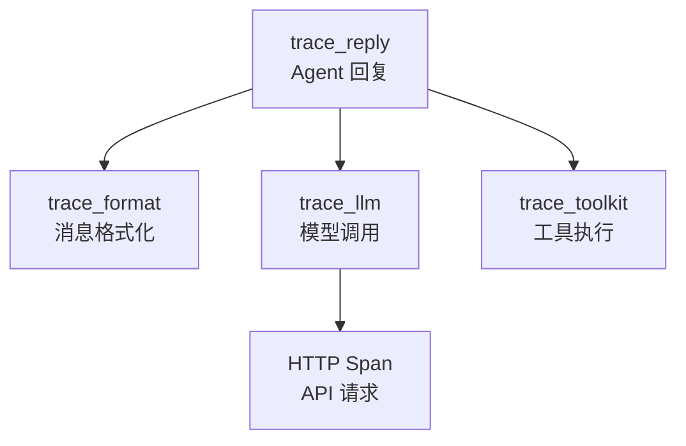

# 第 20 章：可观测性与持久化——追踪、序列化与状态管理

> **难度**：中等
>
> 生产环境中的 Agent 可能运行几十分钟，调用几十次工具。出了问题怎么排查？AgentScope 用 OpenTelemetry 追踪每次调用，用 StateModule 持久化状态。这两种机制是怎么工作的？

## 知识补全：OpenTelemetry

**OpenTelemetry** 是云原生领域的可观测性标准。它提供三个核心能力：

1. **Traces（追踪）**：记录一个请求从开始到结束的完整调用链
2. **Metrics（指标）**：记录系统性能数据（延迟、吞吐量等）
3. **Logs（日志）**：记录离散事件

AgentScope 使用的是 **Traces** 部分。每次 Agent 调用、模型请求、工具执行都会产生一个 **Span**（跨度），多个 Span 组成一个 Trace（追踪）。

```
Trace: agent1.reply()
├── Span: format()           # 消息格式化
├── Span: model.__call__()   # 模型调用
│   └── Span: http_request   # HTTP 请求
├── Span: tool.get_weather() # 工具执行
└── Span: model.__call__()   # 第二轮模型调用
```

---

## 追踪系统的架构

### 入口：setup_tracing

打开 `src/agentscope/tracing/_setup.py`：

```python
# _setup.py:11-38
def setup_tracing(endpoint: str) -> None:
    from opentelemetry import trace
    from opentelemetry.sdk.trace import TracerProvider
    from opentelemetry.sdk.trace.export import BatchSpanProcessor
    from opentelemetry.exporter.otlp.proto.http.trace_exporter import (
        OTLPSpanExporter,
    )

    exporter = OTLPSpanExporter(endpoint=endpoint)
    span_processor = BatchSpanProcessor(exporter)
    tracer_provider = TracerProvider()
    tracer_provider.add_span_processor(span_processor)
    trace.set_tracer_provider(tracer_provider)
```

三步走：
1. 创建 OTLP 导出器（发送到 Jaeger/Zipkin/Datadog 等后端）
2. 创建批处理器（异步批量发送 Span）
3. 设置全局 TracerProvider

### 开关：_check_tracing_enabled

```python
# _trace.py:69-77
def _check_tracing_enabled() -> bool:
    return _config.trace_enabled
```

如果没启用追踪，所有 trace 装饰器直接透传，零开销。

### 核心：trace 装饰器

`trace` 函数（第 192 行）是最通用的追踪装饰器。它的工作流程：

```python
# _trace.py:232-268 (简化)
async def wrapper(*args, **kwargs):
    if not _check_tracing_enabled():
        return await func(*args, **kwargs)      # 未启用，直接调用

    tracer = _get_tracer()
    span_name = ...
    with tracer.start_as_current_span(name=span_name) as span:
        try:
            res = await func(*args, **kwargs)
            span.set_attributes(response_attributes)
            return res
        except Exception as e:
            _set_span_error_status(span, e)      # 记录错误
            raise
```

关键点：即使函数抛异常，Span 也会被正确关闭并记录错误状态。

---

## 五种专用追踪装饰器

AgentScope 为不同操作提供了专用的追踪装饰器：

| 装饰器 | 用途 | 目标方法 |
|--------|------|----------|
| `trace_toolkit` | 工具调用 | `Toolkit.call_tool_function` |
| `trace_reply` | Agent 回复 | `Agent.reply` |
| `trace_llm` | 模型调用 | `Model.__call__` |
| `trace_format` | 消息格式化 | `Formatter.format` |
| `trace_embedding` | 向量嵌入 | `Embedding.__call__` |

每个装饰器记录不同的属性：

- `trace_toolkit`：工具名、参数、返回值
- `trace_llm`：模型名、token 用量、stream 模式
- `trace_reply`：Agent 名、输入消息、输出消息



### 装饰器的层级

注意 `call_tool_function` 上的装饰器顺序：

```python
# _toolkit.py:851-852
@trace_toolkit          # 最外层：追踪
@_apply_middlewares     # 中间层：中间件
async def call_tool_function(self, tool_call):
    ...
```

装饰器从下到上执行。所以中间件先执行，追踪包裹在中间件外面——即使中间件拦截了请求，追踪也能记录到。

> **设计一瞥**：为什么用 OpenTelemetry 而不是自己写日志？因为 OTel 是行业标准，可以对接 Jaeger、Zipkin、Datadog、Grafana Tempo 等可视化后端。用户不需要学新的工具，直接用已有的可观测性基础设施。

---

## 持久化：StateModule 回顾

追踪是"运行时观测"，持久化是"跨时间恢复"。在第 14 章我们看了 `StateModule` 的序列化机制。这里从可观测性的角度重新审视：

### 序列化的意义

```python
agent = ReActAgent(name="assistant", ...)
# ... 运行了一段时间 ...

# 保存状态
state = agent.state_dict()

# 之后可以恢复
agent2 = ReActAgent(name="assistant", ...)
agent2.load_state_dict(state)
```

这在生产中的用途：
- **断点续跑**：长时间运行的 Agent 中断后恢复
- **状态迁移**：把 Agent 从一台机器迁移到另一台
- **调试回放**：保存出错时的状态，事后分析
- **A/B 测试**：同一个初始状态，用不同的参数运行

### 序列化层级

```
ReActAgent.state_dict()
├── memory: InMemoryMemory.state_dict()
│   ├── content: [消息列表]
│   └── _compressed_summary: 压缩摘要
├── toolkit: Toolkit.state_dict()
│   └── tools: {工具名: 工具状态}
└── (其他 StateModule 子模块)
```

每一层只序列化自己的状态，通过 `_module_dict` 递归收集子模块。

AgentScope 官方文档的 Building Blocks > Observability 页面展示了 `setup_tracing` 的使用方法和配置参数，Building Blocks > Agent - State & Session Management 页面展示了序列化 API。本章解释了追踪装饰器的层级关系和 Span 的记录机制。

AgentScope 的追踪系统基于 OpenTelemetry 构建。OpenTelemetry 的核心概念包括：
- **Tracer**：创建和管理 Span 的工厂
- **Span**：代表一次操作的执行过程，包含名称、开始时间、持续时间、属性和事件
- **Span 上下文传播**：在异步调用链中自动传递追踪信息，确保父子 Span 正确关联

在 AgentScope 中，`@trace_llm`、`@trace_toolkit`、`@trace_agent` 等装饰器分别在不同层级创建 Span，形成完整的调用追踪链。

---

## 试一试：查看追踪装饰器的位置

**目标**：了解哪些方法被追踪了。

**步骤**：

1. 搜索所有使用追踪装饰器的地方：

```bash
grep -rn "@trace_" src/agentscope/ --include="*.py" | grep -v "__pycache__"
```

2. 观察输出——你应该能看到 `@trace_toolkit`、`@trace_llm` 等分布在哪些方法上。

3. 如果想看追踪的实际效果（需要 OTel 后端），可以在 `_trace.py:232` 的 `wrapper` 中加 print：

```python
async def wrapper(*args, **kwargs):
    if not _check_tracing_enabled():
        print(f"[TRACE] 未启用追踪，跳过 {func.__name__}")
        return await func(*args, **kwargs)
    print(f"[TRACE] 开始追踪 {func.__name__}")
    ...
```

**改完后恢复：**

```bash
git checkout src/agentscope/tracing/
```

---

## 检查点

- **OpenTelemetry** 是云原生可观测性标准，AgentScope 用它追踪调用链
- `setup_tracing` 创建 OTLP 导出器，对接可视化后端
- 五种专用追踪装饰器覆盖 Agent、Model、Tool、Formatter、Embedding
- 装饰器层级确保追踪在中间件外层，能捕获所有行为
- `_check_tracing_enabled` 提供零开销的开关
- `StateModule` 提供跨时间的状态持久化

**自检练习**：

1. 为什么 `@trace_toolkit` 在 `@_apply_middlewares` 的外层？
2. 如果追踪未启用，trace 装饰器会增加多少开销？

---

## 第二卷总结

第二卷我们看了七种设计模式在 AgentScope 中的体现：

| 章 | 模式 | 核心文件 |
|----|------|----------|
| 13 | 模块系统 | `__init__.py`, `_` 前缀文件 |
| 14 | 继承体系 | `StateModule` → `AgentBase` → `ReActAgent` |
| 15 | 元类/Hook | `_AgentMeta`, `_wrap_with_hooks` |
| 16 | 策略模式 | `Formatter` 多态, `TruncatedFormatterBase` 模板方法 |
| 17 | 工厂/Schema | `_parse_tool_function`, JSON Schema 生成 |
| 18 | 中间件/洋葱 | `_apply_middlewares`, Toolkit 中间件 |
| 19 | 发布-订阅 | `MsgHub`, `_broadcast_to_subscribers` |
| 20 | 可观测性 | OpenTelemetry trace 装饰器, StateModule 持久化 |

这些模式不是孤立存在的——`ReActAgent` 同时使用了继承（四层链）、元类（Hook）、中间件（工具调用）、发布-订阅（MsgHub）、策略（Formatter）。理解了这些模式，你就有了阅读和修改框架源码的基础。

---

## 第三卷预告

第二卷我们**读懂**了框架的设计模式。第三卷我们**动手**——构建新的 Memory 实现、新的 Formatter、新的中间件，把学到的模式付诸实践。
