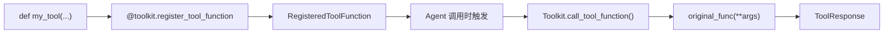

# 第 21 章：构建自定义工具——从零写一个 ToolFunction

> **难度**：入门
>
> 你想给 Agent 添加一个搜索工具。函数怎么写？怎么注册？返回什么类型？这一章我们从零构建一个完整的工具函数。

## 回顾：工具注册的全貌

在第 10 章我们追踪了工具的调用路径。这一章我们站在**工具开发者**的角度，从零构建。



---

## 第一步：编写工具函数

一个工具函数就是一个普通的 Python 函数，但需要满足几个要求：

### 必要条件

1. **类型标注**：所有参数必须有类型标注（用于生成 JSON Schema）
2. **返回值**：必须返回 `ToolResponse`
3. **Docstring**：描述函数功能和每个参数（用于生成 Schema 的 description）

```python
from agentscope.tool import ToolResponse
from agentscope.message import TextBlock

def search_web(query: str, max_results: int = 5) -> ToolResponse:
    """搜索互联网。

    Args:
        query (str): 搜索关键词
        max_results (int, optional): 最大结果数，默认 5
    """
    # 你的搜索逻辑
    results = f"搜索 '{query}' 的前 {max_results} 条结果..."

    return ToolResponse(
        content=[TextBlock(type="text", text=results)],
    )
```

### ToolResponse 的字段

打开 `src/agentscope/tool/_response.py`：

```python
# _response.py:12-31
@dataclass
class ToolResponse:
    content: List[TextBlock | ImageBlock | AudioBlock | VideoBlock]
    metadata: Optional[dict] = None   # 不传给模型的元数据
    stream: bool = False              # 是否流式
    is_last: bool = True              # 是否最后一个 chunk
    is_interrupted: bool = False      # 是否被中断
    id: str = ...                     # 自动生成的时间戳 ID
```

关键点：
- `content` 是一个 block 列表，可以是文本、图片、音频、视频
- `metadata` 不会传给模型，只在 Agent 内部使用
- `stream` 和 `is_last` 用于流式工具（分多次返回结果）

---

## 第二步：注册工具

### 方式一：装饰器注册

```python
from agentscope.tool import Toolkit

toolkit = Toolkit()

@toolkit.register_tool_function
def search_web(query: str) -> ToolResponse:
    """搜索互联网"""
    return ToolResponse(content=[TextBlock(type="text", text="...")])
```

### 方式二：方法调用注册

```python
toolkit = Toolkit()
toolkit.register_tool_function(
    tool_func=search_web,
    tool_name="web_search",          # 自定义名称
    tool_description="搜索互联网",     # 自定义描述
)
```

方式二允许你覆盖函数名和描述——在不修改原函数的情况下适配不同的使用场景。

---

## 第三步：高级特性

### 异步工具

如果你的工具需要网络请求或 IO 操作，用 async：

```python
async def fetch_url(url: str) -> ToolResponse:
    """获取 URL 内容"""
    import aiohttp
    async with aiohttp.ClientSession() as session:
        async with session.get(url) as resp:
            text = await resp.text()
    return ToolResponse(content=[TextBlock(type="text", text=text[:500])])
```

`call_tool_function` 自动处理同步和异步函数——你不需要做额外的适配。

### 流式工具

长时间运行的工具可以分多次返回结果：

```python
async def slow_analysis(data: str) -> ToolResponse:
    """逐步分析数据"""
    for i, chunk in enumerate(data.split("\n")):
        yield ToolResponse(
            content=[TextBlock(type="text", text=f"分析第 {i+1} 行: {chunk}\n")],
            is_last=(i == len(data.split("\n")) - 1),
        )
```

用 `yield` 替代 `return`，每次 yield 一个 `ToolResponse`，`is_last=False` 表示还有后续。

### 后处理函数

`RegisteredToolFunction` 有一个 `postprocess_func` 字段（`_types.py:41`）：

```python
def clean_output(tool_call: ToolUseBlock, response: ToolResponse) -> ToolResponse:
    """清理工具输出"""
    for block in response.content:
        if isinstance(block, TextBlock):
            block.text = block.text.strip()
    return response

toolkit.register_tool_function(
    tool_func=my_tool,
    postprocess_func=clean_output,
)
```

后处理函数在工具执行完成后被调用，可以修改或替换返回值。

> **官方文档对照**：本文对应 [Building Blocks > Tool Capabilities > Custom Tools](https://docs.agentscope.io/building-blocks/tool-capabilities)。官方文档展示了 `register_tool_function` 的基本用法和 `ToolResponse` 的字段说明，本章补充了流式工具、后处理函数和注册方式的选择依据。
>
> **推荐阅读**：[MarkTechPost AgentScope 教程](https://www.marktechpost.com/2026/04/01/how-to-build-production-ready-agentscope-workflows/) Part 2 展示了自定义搜索工具和文件处理工具的完整示例。

---

## 试一试：构建并测试一个计算器工具

**目标**：写一个工具函数，注册到 Toolkit，查看生成的 JSON Schema。

**步骤**：

1. 创建测试脚本 `test_tool.py`：

```python
from agentscope.tool import Toolkit, ToolResponse
from agentscope.message import TextBlock
import json

def calculate(expression: str, precision: int = 2) -> ToolResponse:
    """计算数学表达式。

    Args:
        expression (str): 数学表达式，如 "2 + 3 * 4"
        precision (int, optional): 小数位数，默认 2
    """
    try:
        result = eval(expression)  # 注意：生产环境不要用 eval！
        formatted = round(result, precision)
        return ToolResponse(
            content=[TextBlock(type="text", text=str(formatted))],
        )
    except Exception as e:
        return ToolResponse(
            content=[TextBlock(type="text", text=f"错误: {e}")],
        )

toolkit = Toolkit()
toolkit.register_tool_function(calculate)

# 查看生成的 JSON Schema
for name, func in toolkit.tools.items():
    print(f"工具名: {name}")
    print(json.dumps(func.json_schema, ensure_ascii=False, indent=2))

# 获取传给模型的 schema 列表
schemas = toolkit.get_json_schemas()
print(f"\n共 {len(schemas)} 个工具 schema")
```

2. 运行并观察：`expression` 是 required（没有默认值），`precision` 不是 required（有默认值）。docstring 中的描述被提取到 schema 中。

---

## 检查点

- 工具函数需要：类型标注、`ToolResponse` 返回值、docstring
- 两种注册方式：装饰器（简单）和方法调用（可自定义名称/描述）
- 异步工具用 `async def`，流式工具用 `yield`
- `postprocess_func` 可以后处理工具输出
- `metadata` 字段存储不传给模型的内部数据

---

## 下一章预告

工具是最简单的扩展点。接下来我们看更复杂的——构建自定义 Memory 实现。
