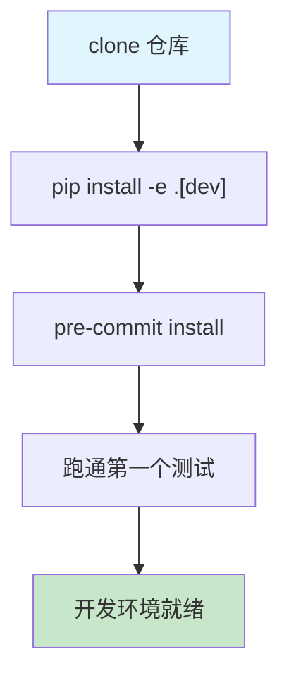

# 第 21 章：扩展准备——搭建开发环境与测试策略

> **难度**：入门
>
> 卷三的目标是"造新齿轮"——给 AgentScope 写自定义工具、Memory、Formatter、中间件乃至完整的 Agent。但在动手之前，必须先把工作台搭好：开发环境能装、测试能跑、代码质量工具能过。这一章就是那张工作台。

---

> **卷三章节结构模板**
>
> 从本章开始，卷三的每一章都遵循以下六步结构：
>
> 1. **任务目标** — 要造什么，为什么需要它
> 2. **设计方案** — 先画架构图，再写代码
> 3. **逐步实现** — 分步写代码，每步可运行可验证
> 4. **测试验证** — 写测试、跑测试
> 5. **试一试** — 在此基础上做扩展
> 6. **PR 检查清单** — 测试覆盖、`__init__.py` 导出、Docstring 规范、pre-commit 通过
>
> 本章本身就是一个完整的实例：我们以"验证开发环境"为任务目标，走完这六步。

---

## 21.1 任务目标

**造什么**：一套可用的 AgentScope 开发环境，能运行测试、能通过 pre-commit 检查、能确认代码改动不会破坏已有功能。

**为什么需要它**：卷三的每一章都会产出新代码——自定义工具、自定义 Memory、自定义 Agent。如果没有统一的开发环境，你写的代码在本机能跑但在 CI 挂掉，或者连不上测试数据库、缺少依赖包，调试成本会远高于开发成本。先把工作台搭好，后面每一章的代码才有可靠的验证手段。



---

## 21.2 设计方案：开发环境架构

在动手之前，先看一眼 AgentScope 项目的整体结构：

```
agentscope/                          # 仓库根目录
├── src/agentscope/                  # 源码（核心代码）
│   ├── __init__.py                  # 入口：agentscope.init()
│   ├── _version.py                  # 版本号
│   ├── agent/                       # Agent 实现
│   ├── model/                       # LLM 模型适配器
│   ├── formatter/                   # 消息格式转换器
│   ├── tool/                        # 工具系统（Toolkit）
│   ├── memory/                      # 记忆实现
│   ├── message/                     # 消息类型（Msg, TextBlock...）
│   ├── pipeline/                    # 多 Agent 编排（MsgHub）
│   ├── hooks/                       # Studio 钩子
│   ├── embedding/                   # 向量嵌入
│   ├── token/                       # Token 计数
│   ├── tracing/                     # OpenTelemetry 追踪
│   ├── session/                     # 会话管理
│   ├── rag/                         # RAG 组件
│   ├── a2a/                         # Agent-to-Agent 协议
│   ├── realtime/                    # 实时语音交互
│   ├── module/                      # StateModule 基类
│   └── exception/                   # 自定义异常
├── tests/                           # 测试文件
├── examples/                        # 示例代码
├── pyproject.toml                   # 项目配置
├── .pre-commit-config.yaml          # pre-commit 钩子
└── .github/                         # CI 工作流
    ├── copilot-instructions.md      # 代码规范
    └── workflows/
        ├── unittest.yml             # 测试 CI
        └── pre-commit.yml           # 代码检查 CI
```

关键设计决策：

1. **源码在 `src/` 下**：采用 `src` layout（`pyproject.toml:202` 配置了 `packages = { find = { where = ["src"] } }`），安装后包名是 `agentscope`，但代码物理位置在 `src/agentscope/`。
2. **开发模式安装**：`pip install -e .[dev]` 以可编辑模式安装，代码修改立即生效，无需重新安装。
3. **可选依赖分组**：`pyproject.toml` 把功能分成 `a2a`、`realtime`、`gemini`、`rag` 等可选组（`pyproject.toml:47-170`），`[dev]` 包含了开发工具（pytest、pre-commit）和测试依赖。

---

## 21.3 逐步实现

### 第一步：Clone 仓库并安装

```bash
# 1. 克隆仓库
git clone https://github.com/agentscope-ai/agentscope.git
cd agentscope

# 2. 创建虚拟环境（推荐 Python 3.10+）
python -m venv .venv
source .venv/bin/activate  # macOS/Linux
# .venv\Scripts\activate   # Windows

# 3. 以开发模式安装（包含全部依赖和开发工具）
pip install -e ".[dev]"
```

`pyproject.toml:173-194` 定义了 `[dev]` 可选依赖，其中包括：

| 依赖 | 用途 |
|------|------|
| `pytest` | 测试框架 |
| `pytest-asyncio` | 异步测试支持 |
| `pytest-forked` | 进程隔离测试 |
| `pre-commit` | Git 钩子管理 |
| `flake8`, `black`, `pylint`, `mypy` | 通过 pre-commit 运行 |
| `fakeredis` | 模拟 Redis（测试用） |
| `aiosqlite` | SQLite 异步支持（测试用） |

**验证安装**：

```python
import agentscope
print(agentscope.__version__)  # 应输出类似 "1.0.19.post1"
```

版本号定义在 `src/agentscope/_version.py:4`。

### 第二步：配置 pre-commit

pre-commit 在每次 `git commit` 前自动运行代码质量检查，防止不规范的代码进入仓库。

```bash
# 安装 Git 钩子
pre-commit install
```

`.pre-commit-config.yaml` 配置了以下检查（按执行顺序）：

| 钩子 | 来源 | 作用 |
|------|------|------|
| `check-ast` | pre-commit-hooks | 检查 Python 语法有效性 |
| `check-yaml` | pre-commit-hooks | YAML 格式校验 |
| `check-toml` | pre-commit-hooks | TOML 格式校验 |
| `check-docstring-first` | pre-commit-hooks | 确保 docstring 在函数顶部 |
| `detect-private-key` | pre-commit-hooks | 防止私钥泄露 |
| `trailing-whitespace` | pre-commit-hooks | 去除行尾空格 |
| `add-trailing-comma` | asottile | 多行参数末尾加逗号 |
| `mypy` | mirrors-mypy | 类型检查 |
| `black` | psf | 代码格式化（行宽 79） |
| `flake8` | PyCQA | 代码风格检查 |
| `pylint` | pylint-dev | 深度代码分析 |
| `pyroma` | regebro | 包配置检查 |

手动运行所有检查：

```bash
pre-commit run --all-files
```

> **注意**：首次运行可能较慢（需要安装各钩子的虚拟环境），后续运行会快很多。`.github/workflows/pre-commit.yml` 中的 CI 也运行相同的检查，本地通过即表示 CI 也能通过。

### 第三步：了解测试目录结构

打开 `tests/` 目录，可以看到测试文件按模块命名：

```
tests/
├── toolkit_basic_test.py            # Toolkit 基础功能
├── toolkit_async_execution_test.py  # Toolkit 异步执行
├── toolkit_middleware_test.py       # Toolkit 中间件
├── memory_test.py                   # Memory 基础测试
├── memory_compression_test.py       # Memory 压缩
├── config_test.py                   # 配置模块测试
├── hook_test.py                     # Hook 机制测试
├── model_openai_test.py             # OpenAI 模型测试
├── formatter_openai_test.py         # OpenAI 格式器测试
├── pipeline_test.py                 # Pipeline 测试
├── react_agent_test.py              # ReActAgent 测试
├── session_test.py                  # Session 测试
└── ...                              # 更多按模块组织的测试
```

命名规则：`<模块名>_<子功能>_test.py`。

### 第四步：测试文件的模式

AgentScope 的测试统一使用 `unittest.IsolatedAsyncioTestCase`（因为核心 API 都是 async 的）。以 `tests/config_test.py` 为例：

```python
# tests/config_test.py:1
"""Unittests for the config module."""
import asyncio
import threading
from unittest.async_case import IsolatedAsyncioTestCase

import agentscope
from agentscope import _config


class ConfigTest(IsolatedAsyncioTestCase):
    """Unittests for the config module."""

    async def test_config_attributes(self) -> None:
        """Test the config attributes."""
        agentscope.init(
            project="root_project",
            name="root_name",
            run_id="root_run_id",
        )
        for field in ["project", "name", "run_id"]:
            self.assertEqual(getattr(_config, field), f"root_{field}")
```

关键模式：

1. **类名**：`XxxTest(IsolatedAsyncioTestCase)` — 每个测试文件一个主测试类
2. **方法名**：`test_<功能描述>` — pytest 会自动发现以 `test_` 开头的方法
3. **setUp/tearDown**：`asyncSetUp`（`toolkit_basic_test.py:153`）和 `asyncTearDown`（`toolkit_basic_test.py:1223`）用于每个测试前后的初始化和清理
4. **断言**：使用 `self.assertEqual`、`self.assertListEqual`、`self.assertRaises` 等

再看 `tests/toolkit_basic_test.py` 中的一个典型测试方法：

```python
# tests/toolkit_basic_test.py:335
async def test_basic_functionalities(self) -> None:
    """Test sync function:
    1. register tool function
    2. set/cancel extended model
    3. get JSON schemas
    4. call tool function
    """
    self.toolkit.register_tool_function(
        tool_func=sync_func,
        preset_kwargs={"arg1": 55},
    )
    # ... 断言 JSON schema、调用结果等
```

测试按照"注册 → 断言状态 → 调用 → 断言结果"的模式组织。

### 第五步：运行测试

```bash
# 运行全部测试
pytest tests/

# 运行单个测试文件
pytest tests/config_test.py

# 按关键字筛选（运行所有包含 "toolkit" 的测试）
pytest tests/ -k "toolkit"

# 运行单个测试方法
pytest tests/config_test.py::ConfigTest::test_config_attributes

# 进程隔离模式（每个测试独立进程，避免状态泄漏）
pytest tests/ --forked

# 显示详细输出
pytest tests/config_test.py -v
```

CI 中的测试命令（`.github/workflows/unittest.yml:31`）使用 coverage：

```bash
coverage run -m pytest tests
coverage report -m
```

---

## 21.4 测试验证

### 验证一：运行一个无需 API Key 的测试

`tests/config_test.py` 只测试配置模块，不需要任何 API Key，是理想的首个验证目标：

```bash
pytest tests/config_test.py -v
```

预期输出：

```
tests/config_test.py::ConfigTest::test_config_attributes PASSED
============================== 1 passed ==============================
```

如果看到 `PASSED`，说明开发环境安装成功。

### 验证二：运行 Toolkit 基础测试

```bash
pytest tests/toolkit_basic_test.py -v
```

这个文件（`tests/toolkit_basic_test.py`）测试了 `Toolkit` 的注册、调用、重名策略、工具分组等核心功能，全部在本地完成，不依赖外部服务。预期有十几个测试通过。

### 验证三：运行 pre-commit

```bash
pre-commit run --all-files
```

如果你没有修改任何源码，所有检查应该通过。这个命令可能需要几分钟（首次运行更久）。

---

## 21.5 代码规范速查

在卷三后续章节中写代码时，需要遵守以下规范（定义在 `.github/copilot-instructions.md`）：

### 文件命名

- `src/agentscope/` 下的 Python 文件以 `_` 前缀命名（如 `_toolkit.py`、`_agent_base.py`）
- 公共 API 通过 `__init__.py` 暴露

### Docstring 格式

```python
def my_function(name: str, count: int | None = None) -> str:
    """One-line description.

    Args:
        name (`str`):
            The name parameter.
        count (`int | None`, optional):
            The count parameter.

    Returns:
        `str`:
            The result string.
    """
```

要点：参数类型用反引号包裹，`optional` 标记可选参数，返回值类型也用反引号。

### 懒加载

第三方库（不在 `pyproject.toml` 的 `dependencies` 中的库）在函数内部导入，而非文件顶部：

```python
# 正确：懒加载
def my_tool() -> ToolResponse:
    from redis import Redis  # 第三方依赖
    ...

# 错误：顶部导入
from redis import Redis  # 移到函数内部
```

### pre-commit 跳过规则

唯一允许跳过 pre-commit 检查的场景：Agent 系统提示词中的 `\n` 格式问题。其他情况都必须修复代码，而非跳过检查。

---

## 21.6 试一试

以下练习帮你确认环境已就绪，并为卷三后续章节做准备。

### 练习一：查看模块导出（无 API Key）

每个模块的 `__init__.py` 定义了公共 API。试回答以下问题：

1. `src/agentscope/memory/__init__.py` 导出了哪些类？
2. `src/agentscope/model/__init__.py` 导出了哪些模型类？
3. `src/agentscope/agent/__init__.py` 导出了哪些 Agent 类？

验证方式：直接读取文件确认你的答案。

<details>
<summary>参考答案</summary>

Memory 模块（`src/agentscope/memory/__init__.py:4-17`）导出：
- 工作记忆：`MemoryBase`、`InMemoryMemory`、`RedisMemory`、`AsyncSQLAlchemyMemory`、`TablestoreMemory`
- 长期记忆：`LongTermMemoryBase`、`Mem0LongTermMemory`、`ReMePersonalLongTermMemory`、`ReMeTaskLongTermMemory`、`ReMeToolLongTermMemory`

</details>

### 练习二：写一个最简单的测试（无 API Key）

在 `tests/` 下新建文件 `test_env_setup.py`，验证你能正确导入和初始化 agentscope：

```python
# tests/test_env_setup.py
"""Environment setup verification test."""
from unittest.async_case import IsolatedAsyncioTestCase

import agentscope
from agentscope import _config


class EnvSetupTest(IsolatedAsyncioTestCase):
    """Verify the development environment is correctly set up."""

    async def test_init_and_version(self) -> None:
        """Test that agentscope can be initialized and version is set."""
        self.assertIsNotNone(agentscope.__version__)

        agentscope.init(
            project="test_project",
            name="test_name",
            run_id="test_run_id",
        )

        self.assertEqual(_config.project, "test_project")
        self.assertEqual(_config.name, "test_name")
        self.assertEqual(_config.run_id, "test_run_id")
```

运行：

```bash
pytest tests/test_env_setup.py -v
```

### 练习三：理解测试模式（无 API Key）

阅读 `tests/toolkit_basic_test.py:192-261`（`test_duplicate_tool_registration` 方法），回答：

1. `namesake_strategy` 有哪几种取值？每种取值的行为是什么？
2. 测试如何验证"重名"场景下的注册行为？

---

## 21.7 PR 检查清单

在提交任何代码（包括本章练习）之前，确认以下事项：

- [ ] **测试通过**：`pytest tests/ -v` 全部 PASSED
- [ ] **pre-commit 通过**：`pre-commit run --all-files` 无 Failed
- [ ] **`__init__.py` 导出**：新增的公共类/函数已加入对应模块的 `__init__.py` 的 `__all__` 列表
- [ ] **Docstring 规范**：所有新增函数/类都有符合格式要求的 docstring（参考 `.github/copilot-instructions.md:46-61`）
- [ ] **文件命名**：新文件以 `_` 前缀命名，仅内部使用的函数以 `_` 开头
- [ ] **懒加载**：第三方依赖在函数内部导入
- [ ] **类型标注**：所有函数参数和返回值有完整类型标注（mypy 的 `--disallow-untyped-defs` 要求）

### CI 环境参考

项目 CI（`.github/workflows/unittest.yml:9-13`）在以下环境运行测试：

- **操作系统**：Ubuntu、Windows、macOS
- **Python 版本**：3.10、3.11、3.12

本地验证通过不代表所有平台都通过，但至少 `pytest tests/` 和 `pre-commit run --all-files` 两个命令必须通过。

---

## 检查点

完成本章后，你应该能够：

1. 在本地以开发模式安装 AgentScope 并确认版本号
2. 运行 `pytest tests/config_test.py -v` 并看到 PASSED
3. 运行 `pre-commit run --all-files` 并全部通过
4. 理解测试文件的命名规则和代码模式（`IsolatedAsyncioTestCase`、`test_` 方法、`asyncSetUp/asyncTearDown`）
5. 知道在哪里查看代码规范（`.github/copilot-instructions.md`）和 pre-commit 配置（`.pre-commit-config.yaml`）

---

> **下一站预告**：第 22 章，我们将基于这套开发环境，从零实现一个自定义 Memory——`FileMemory`，把消息持久化到文件系统。你会用到本章学到的测试模式和 pre-commit 规范来验证你的实现。
